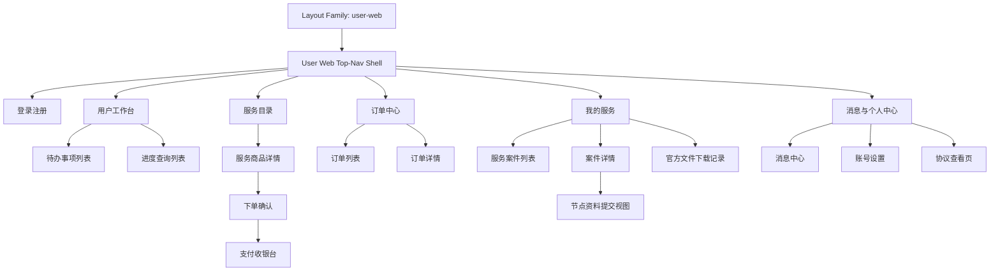

# Product Layout Draft

## 0. 文档状态

| 字段 | 内容 |
|---|---|
| 文档版本 | Draft |
| 生成日期 | 2026-05-13 |
| 来源文件 | `product/release/product-sitemap-release.md` |
| 来源章节 | `Sitemap 页面生成总表` |
| 当前输出文件 | `product/development/layout/product-layout-draft-user-web.md` |
| Layout Key | `user-web` |
| 适用 Surface | `用户端` |
| 适用端形态 | `desktop-web` |
| 覆盖页面ID / 页面级MD文件范围 | `U-100` 至 `U-630`；`product/development/pages/010-user-login.md` 至 `product/development/pages/200-agreements.md` |
| 适用范围 | 双域名同构 PC Web 用户站点布局 |
| Layout 假设 / 待确认编号规则 | `LA-001` 起为布局假设；`LQ-001` 起为布局待确认 |

## 1. 产品布局总览

| 项目 | 内容 | 来源 / LA / LQ |
|---|---|---|
| 产品类型 | 双域名同构 PC Web 用户站点 | 来源：release 文档 |
| 应用 Surface | 用户端 | 来源：release 文档 |
| 主 Layout 形态 | 顶部导航网站壳 + 居中内容容器 + 悬浮客服入口 | 来源：release 文档 |
| 全局导航模型 | 顶部一级导航切换 Root 页面，L2 页多为父页内部子路由或独立详情 push | 来源：release 文档 |
| 页面层级模型 | Root 页面作为导航目的地，L2 列表/详情在壳内切换，L3 优先抽屉 / Tab 呈现（布局假设 LA-001：用户端 L3 不单独新开独立页面） | LA-001 |
| 响应式 / 端形态策略 | 当前仅做 desktop-web，窄桌面以容器收缩、筛选折行、表格横向滚动适配（布局假设 LA-002） | LA-002 |
| 全局状态容器 | Shell 级 loading/error/permission；页面级 empty、timeout、refund-processing | 来源：release 文档 |

## 2. Layout 架构图



## 3. Surface 与 Shell 定义

| Surface ID | Surface 名称 | 适用角色 | Shell 类型 | 全局区域 | 根页面入口 | 子页面呈现 | 例外页面 | 来源 / LA / LQ |
|---|---|---|---|---|---|---|---|---|
| SF-001 | 用户端 PC Web（双域名同构） | 游客、客户用户 | top-nav | top-nav / content-header / main-scroll / floating-service-entry / toast-layer / legal-footer | 登录注册、用户工作台、服务目录、订单中心、我的服务、消息与个人中心 | nested-route / push / drawer | 登录注册、支付收银台、协议查看页 | 来源：release 文档；LA-001 |

## 4. 全局 Shell 区域规范

| Shell 区域ID | 区域名称 | 所属 Surface | 显示规则 | 内容槽位 | 尺寸 / 安全区 | 滚动关系 | 层级关系 | 状态变化 | 来源 / LA / LQ |
|---|---|---|---|---|---|---|---|---|---|
| SHELL-001 | Top Navigation | SF-001 | 未登录与登录后均显示，当前一级导航高亮 | logo / nav-items / message-entry / account-entry | 固定高 64px（布局假设 LA-003） | fixed | 高于主内容、低于弹层 | default / sticky / compact | LA-003 |
| SHELL-002 | Main Content Container | SF-001 | 所有业务页面显示 | page-title / filter-bar / body / side-summary | 最大宽 1280px（布局假设 LA-004） | main-scroll | 位于顶栏下方 | loading / empty / error / permission | LA-004 |
| SHELL-003 | Floating Service Entry | SF-001 | 登录后默认显示 | customer-service-button / unread-badge | 右下悬浮（布局假设 LA-005） | fixed | 高于内容区 | hidden / expanded / unread | LA-005 |
| SHELL-004 | Modal / Drawer Layer | SF-001 | L3 节点资料提交、确认弹窗显示 | drawer-header / body / fixed-actions | 抽屉宽 520px（布局假设 LA-006） | body-scroll-inside | 最高交互层 | open / dirty / submitting / success | LA-006 |
| SHELL-005 | Global Status Banner | SF-001 | 支付超时、退款处理中、全局通知时显示 | status-text / action-link | 顶栏下横幅（布局假设 LA-007） | fixed-with-shell | 高于内容区 | info / warning / success | LA-007 |

## 5. 页面模板库

| 模板ID | 模板名称 | 适用页面类型 | 必备区域 | 可选区域 | 默认父子层级 | 典型状态 | 响应式规则 | 来源 / LA / LQ |
|---|---|---|---|---|---|---|---|---|
| TPL-001 | 用户端列表页模板 | list / index | shell + page-header + filter + list | stats-summary / empty-state | Surface > Shell > Page > List | loading / empty / filter-empty | 宽桌面双列筛选，窄桌面折行 | 来源：release 文档 |
| TPL-002 | 用户端详情页模板 | detail | shell + title + detail-body + action-area | side-summary / history / related-files | list > detail | loading / not-found / permission | 双栏详情（布局假设 LA-008） | LA-008 |
| TPL-003 | 用户端交易表单模板 | create / payment / settings | shell + step/title + form/body + fixed-actions | fee-summary / protocol-check / result-panel | detail > flow | validation / submitting / timeout / success | 双栏降单栏 | 来源：release 文档 |
| TPL-004 | 用户端中心页模板 | dashboard / profile-home | shell + summary + local-nav + body | quick-links / counters | shell > center > child | loading / empty | 头部摘要固定，内容区滚动 | 来源：release 文档 |
| TPL-005 | 阅读内容模板 | legal / content | shell + article-header + article-body | toc / version-note | center > content | loading / no-content | 阅读容器收窄 | 来源：release 文档 |
| TPL-006 | 抽屉表单模板 | drawer / upload | drawer-header + form + fixed-actions | validation-summary / attachment-preview | detail > drawer | loading / reject / resubmit | 抽屉内滚动 | LA-001 |

## 6. Sitemap 到 Layout 映射总表

| 生成顺序 | 页面ID | 父页面ID | 层级 | 页面名称 | 页面级MD文件 | Surface ID | Shell 类型 | 页面模板ID | 导航位置 | 子页面呈现方式 | 全局区域继承 | 响应式规则 | 例外说明 | 来源 / LA / LQ |
|---:|---|---|---|---|---|---|---|---|---|---|---|---|---|---|
| 10 | U-100 | ROOT | L1 | 登录注册 | product/development/pages/010-user-login.md | SF-001 | auth-only | TPL-003 | hidden | new-page | SHELL-001 minimal / SHELL-002 none | centered auth | 不进入业务导航高亮 | 来源：release 文档 |
| 20 | U-200 | ROOT | L1 | 用户工作台 | product/development/pages/020-user-dashboard.md | SF-001 | top-nav | TPL-004 | top-nav:工作台 | nested-route | SHELL-001 / SHELL-002 / SHELL-003 | 宽屏摘要+入口卡片 | 登录后默认首页（布局假设 LA-009） | LA-009 |
| 30 | U-210 | U-200 | L2 | 待办事项列表 | product/development/pages/030-user-todo-list.md | SF-001 | top-nav | TPL-001 | top-nav:工作台 / local-tab:待办 | nested-route | SHELL-001 / SHELL-002 / SHELL-003 | 筛选折行 | 父页内部切换 | 来源：release 文档 |
| 40 | U-220 | U-200 | L2 | 进度查询列表 | product/development/pages/040-user-progress-list.md | SF-001 | top-nav | TPL-001 | top-nav:工作台 / local-tab:进度 | nested-route | SHELL-001 / SHELL-002 / SHELL-003 | 列表横向滚动 | 父页内部切换 | 来源：release 文档 |
| 50 | U-300 | ROOT | L1 | 服务目录 | product/development/pages/050-service-catalog.md | SF-001 | top-nav | TPL-001 | top-nav:服务目录 | nested-route | SHELL-001 / SHELL-002 / SHELL-003 | 类目网格 | 双域名仅品牌差异 | 来源：release 文档 |
| 60 | U-310 | U-300 | L2 | 服务商品详情 | product/development/pages/060-service-detail.md | SF-001 | top-nav | TPL-002 | top-nav:服务目录 | push | SHELL-001 / SHELL-002 / SHELL-003 | 双栏详情 | 独立详情路由 | 来源：release 文档；LA-008 |
| 70 | U-320 | U-310 | L2 | 下单确认 | product/development/pages/070-order-checkout.md | SF-001 | top-nav | TPL-003 | hidden-from-main-highlight | push | SHELL-001 / SHELL-002 / SHELL-003 / SHELL-005 | 双栏表单+费用摘要 | 交易链路弱化主导航 | 来源：release 文档 |
| 80 | U-330 | U-320 | L2 | 支付收银台 | product/development/pages/080-payment-checkout.md | SF-001 | top-nav | TPL-003 | hidden-from-main-highlight | push | SHELL-001 / SHELL-002 / SHELL-005 | 结果优先布局 | 含超时关闭状态 | 来源：release 文档 |
| 90 | U-400 | ROOT | L1 | 订单中心 | product/development/pages/090-order-center.md | SF-001 | top-nav | TPL-004 | top-nav:订单 | nested-route | SHELL-001 / SHELL-002 / SHELL-003 | 统计+子页入口 | Root 页面 | 来源：release 文档 |
| 100 | U-410 | U-400 | L2 | 订单列表 | product/development/pages/100-order-list.md | SF-001 | top-nav | TPL-001 | top-nav:订单 / local-tab:列表 | nested-route | SHELL-001 / SHELL-002 / SHELL-003 | 状态标签横向 | 父页内部切换 | 来源：release 文档 |
| 110 | U-420 | U-400 | L2 | 订单详情 | product/development/pages/110-order-detail.md | SF-001 | top-nav | TPL-002 | top-nav:订单 | push | SHELL-001 / SHELL-002 / SHELL-003 / SHELL-005 | 主副栏详情 | 客服为悬浮入口，不占正文 | 来源：release 文档 |
| 120 | U-500 | ROOT | L1 | 我的服务 | product/development/pages/120-service-center.md | SF-001 | top-nav | TPL-004 | top-nav:我的服务 | nested-route | SHELL-001 / SHELL-002 / SHELL-003 | 中心入口页 | Root 页面 | 来源：release 文档 |
| 130 | U-510 | U-500 | L2 | 服务案件列表 | product/development/pages/130-service-case-list.md | SF-001 | top-nav | TPL-001 | top-nav:我的服务 / local-tab:案件 | nested-route | SHELL-001 / SHELL-002 / SHELL-003 | 状态筛选强化 | 父页内部切换 | 来源：release 文档 |
| 140 | U-520 | U-500 | L2 | 案件详情 | product/development/pages/140-case-detail.md | SF-001 | top-nav | TPL-002 | top-nav:我的服务 | push | SHELL-001 / SHELL-002 / SHELL-003 | 时间轴+摘要双栏 | 内容深度较高 | 来源：release 文档；LA-008 |
| 150 | U-521 | U-520 | L3 | 节点资料提交视图 | product/development/pages/150-node-submit-view.md | SF-001 | top-nav | TPL-006 | hidden | drawer | SHELL-001 / SHELL-003 / SHELL-004 | 抽屉内滚动 | 从案件详情侧滑打开 | LA-001 |
| 160 | U-530 | U-500 | L2 | 官方文件下载记录 | product/development/pages/160-file-downloads.md | SF-001 | top-nav | TPL-001 | top-nav:我的服务 / local-tab:文件 | nested-route | SHELL-001 / SHELL-002 / SHELL-003 | 表格可横滑 | 父页内部切换 | 来源：release 文档 |
| 170 | U-600 | ROOT | L1 | 消息与个人中心 | product/development/pages/170-user-center.md | SF-001 | top-nav | TPL-004 | top-nav:个人中心 | nested-route | SHELL-001 / SHELL-002 / SHELL-003 | 摘要+子入口 | Root 页面 | 来源：release 文档 |
| 180 | U-610 | U-600 | L2 | 消息中心 | product/development/pages/180-message-center.md | SF-001 | top-nav | TPL-001 | top-nav:个人中心 / local-tab:消息 | nested-route | SHELL-001 / SHELL-002 / SHELL-003 | 渠道筛选 | 父页内部切换 | 来源：release 文档 |
| 190 | U-620 | U-600 | L2 | 账号设置 | product/development/pages/190-account-settings.md | SF-001 | top-nav | TPL-003 | top-nav:个人中心 / local-tab:设置 | nested-route | SHELL-001 / SHELL-002 / SHELL-003 | 单栏/双栏表单 | 父页内部切换 | 来源：release 文档 |
| 200 | U-630 | U-600 | L2 | 协议查看页 | product/development/pages/200-agreements.md | SF-001 | top-nav | TPL-005 | top-nav:个人中心 / local-tab:协议 | push | SHELL-001 / SHELL-002 | 阅读模式收窄 | 可从注册页进入 | 来源：release 文档 |

## 7. 导航与路由规则

| 规则ID | 适用范围 | 规则 | 返回 / 关闭行为 | 当前态展示 | 权限影响 | 来源 / LA / LQ |
|---|---|---|---|---|---|---|
| NAV-001 | 用户端 Root 页面 | 一级导航使用顶栏切换 `工作台 / 服务目录 / 订单 / 我的服务 / 个人中心` | 切换后保留登录态 | 顶栏高亮当前入口 | 游客仅可见服务目录与登录入口 | 来源：release 文档 |
| NAV-002 | 用户端详情/交易流 | 从列表进入详情、下单、支付采用 push 路由 | 返回回到来源页及滚动位置（布局假设 LA-010） | 顶栏保持父级入口高亮 | 未登录需先跳登录 | LA-010 |
| NAV-003 | 用户端 L3 提交流程 | 节点资料提交优先使用 drawer，不脱离案件详情上下文 | 关闭 drawer 返回案件详情当前位置 | 不改变一级导航高亮 | 无权限时显示 permission 容器 | LA-001 |

## 8. 全局状态与边界 Layout

| 状态ID | 适用 Surface / 模板 | 状态类型 | Layout 表现 | 文案/媒体槽位 | 可恢复入口 | 来源 / LA / LQ |
|---|---|---|---|---|---|---|
| GL-STATE-001 | SF-001 / 全模板 | loading | 保留顶栏，内容区骨架屏 | page-title / body-skeleton | 自动恢复 | 来源：release 文档 |
| GL-STATE-002 | TPL-001 / TPL-004 | empty | 空状态插图 + 主 CTA | title / desc / primary-action | 清空筛选 / 去浏览 | 来源：release 文档 |
| GL-STATE-003 | SF-001 / 全模板 | error | 内容区错误卡片，顶栏保留 | error-title / retry | retry / back | 来源：release 文档 |
| GL-STATE-004 | SF-001 / TPL-002 | permission | 详情主体替换为无权限容器 | permission-title / help-link | 返回列表 | 来源：release 文档 |
| GL-STATE-005 | TPL-003 | payment-timeout | 订单摘要保留，主区域显示超时关闭状态 | timeout-title / order-summary | 返回待支付订单列表 | 来源：release 文档 |
| GL-STATE-006 | TPL-002 | refund-processing | 详情页顶部状态带 + 时间线 | refund-status / audit-note | 返回订单列表 | 来源：release 文档 |
| GL-STATE-007 | SF-001 | offline | 顶栏下方弱提示 banner（布局假设 LA-011） | offline-banner | 重试 / 刷新 | LA-011 |

## 9. 角色与权限对 Layout 的影响

| 角色 | 影响区域 | 显示 / 隐藏 / 禁用规则 | 替代 Layout | 来源 / LA / LQ |
|---|---|---|---|---|
| 游客 | 顶栏、订单、我的服务、个人中心 | 隐藏业务入口；下单前登录拦截 | 登录注册页 | 来源：release 文档 |
| 客户用户 | 用户端全局 | 显示完整一级导航；退款按钮仅在符合条件订单显示 | 无 | 来源：release 文档 |

## 10. 下游 Skill 使用规则

| 下游 Skill | 必须读取 | 使用方式 | 必须引用的 Layout 信息 |
|---|---|---|---|
| product-page-draft | 匹配的 product-layout-release*.md + product-overview-release | 先按 `user-web` 匹配页面 shell/template，再生成元素/状态/action/API | Layout Key / Surface ID / Shell / 模板ID / 导航位置 / 响应式规则 |
| product-page-mock-draft | 匹配的 product-layout-release*.md + release page | 补齐顶栏、页面标题、状态容器文案与悬浮客服入口占位 | Layout Key / 全局区域 / 导航标签 / 页面标题 / 状态容器 |
| product-page-design-release | 匹配的 product-layout-release*.md + release mock + design system | 生成顶栏壳、内容容器、抽屉层、固定状态带与滚动关系 | Layout Key / Shell 区域 / 页面模板 / 父子层级 / scroll/fixed 关系 |

## 11. 布局假设与待确认统一清单

### 11.1 布局假设清单

| 假设ID | 假设内容 | 首次出现位置 | 影响范围 | 影响页面 / Surface / Shell | 置信度 | 用户确认状态 | Release 处理方式 |
|---|---|---|---|---|---|---|---|
| LA-001 | 用户端 L3 子流程优先使用 drawer / tab，而不是独立新页面。 | 1. 产品布局总览 | Shell / 模板 / 导航 | U-521、SF-001、SHELL-004 | 高 | 待用户确认 | 确认为正式内容 / 按用户修改替换 |
| LA-002 | 当前仅做 desktop-web，不单独产出 tablet 断点布局。 | 1. 产品布局总览 | 响应式 | SF-001 | 高 | 待用户确认 | 确认为正式内容 |
| LA-003 | 用户端顶栏统一采用 64px 高度。 | 4. 全局 Shell 区域规范 | Shell | SHELL-001 | 中 | 待用户确认 | 确认为正式内容 |
| LA-004 | 用户端主内容最大宽度为 1280px。 | 4. 全局 Shell 区域规范 | Shell / 响应式 | SHELL-002 | 中 | 待用户确认 | 确认为正式内容 |
| LA-005 | 悬浮客服入口固定在右下，不与主操作按钮重叠。 | 4. 全局 Shell 区域规范 | Shell | SHELL-003、U-420 | 中 | 待用户确认 | 确认为正式内容 |
| LA-006 | 用户端抽屉宽度统一为 520px。 | 4. 全局 Shell 区域规范 | Shell / 模板 | SHELL-004、U-521 | 中 | 待用户确认 | 确认为正式内容 / 按用户修改替换 |
| LA-007 | 顶栏下方状态横幅为统一承载支付超时、退款处理中等流程状态的容器。 | 4. 全局 Shell 区域规范 | Shell / 状态 | SHELL-005、U-330、U-420 | 中 | 待用户确认 | 确认为正式内容 |
| LA-008 | 用户端详情页采用主内容 + 辅助摘要双栏结构。 | 5. 页面模板库 | 模板 | TPL-002、U-310、U-420、U-520 | 中 | 待用户确认 | 确认为正式内容 / 按用户修改替换 |
| LA-009 | 用户工作台为登录后默认首页。 | 6. Sitemap 到 Layout 映射总表 | 导航 / 路由 | U-200 | 中 | 待用户确认 | 确认为正式内容 |
| LA-010 | 用户端详情/交易流返回时保留来源页滚动位置和筛选条件。 | 7. 导航与路由规则 | 导航 / 状态 | U-310、U-320、U-330、U-420、U-520 | 中 | 待用户确认 | 确认为正式内容 |
| LA-011 | 用户端离线提示使用弱提示 banner，而不是全屏阻断。 | 8. 全局状态与边界 Layout | 状态 | GL-STATE-007 | 低 | 待用户确认 | 确认为正式内容 / 按用户修改替换 |

### 11.2 布局待确认清单

| 待确认ID | 待确认问题 | 首次出现位置 | 影响范围 | 影响页面 / Surface / Shell | 优先级 | 用户确认结果 | Release 处理方式 |
|---|---|---|---|---|---|---|---|
| LQ-001 | 双域名用户端是否需要在顶栏中显式显示当前平台标识切换/徽标，还是仅通过品牌视觉区分，不额外显示平台标签？ | 1. 产品布局总览 | Shell / 导航 | SF-001、SHELL-001、U-100、U-300 | 中 | 待用户确认 | 写入正式内容 / 删除其一 |

## 12. 用户补充描述

> 本章节必须保留在 Layout Draft 文档末尾，供用户用自然语言补充或修改全局 Shell、导航、页面模板、响应式规则、全局状态、角色/权限布局、页面层级呈现或 Sitemap 到 Layout 映射。`product-layout-release` 生成 release 版本时必须读取、分析并应用这里的内容。
> 如果没有补充，请保留“无”。

```text
无
```
