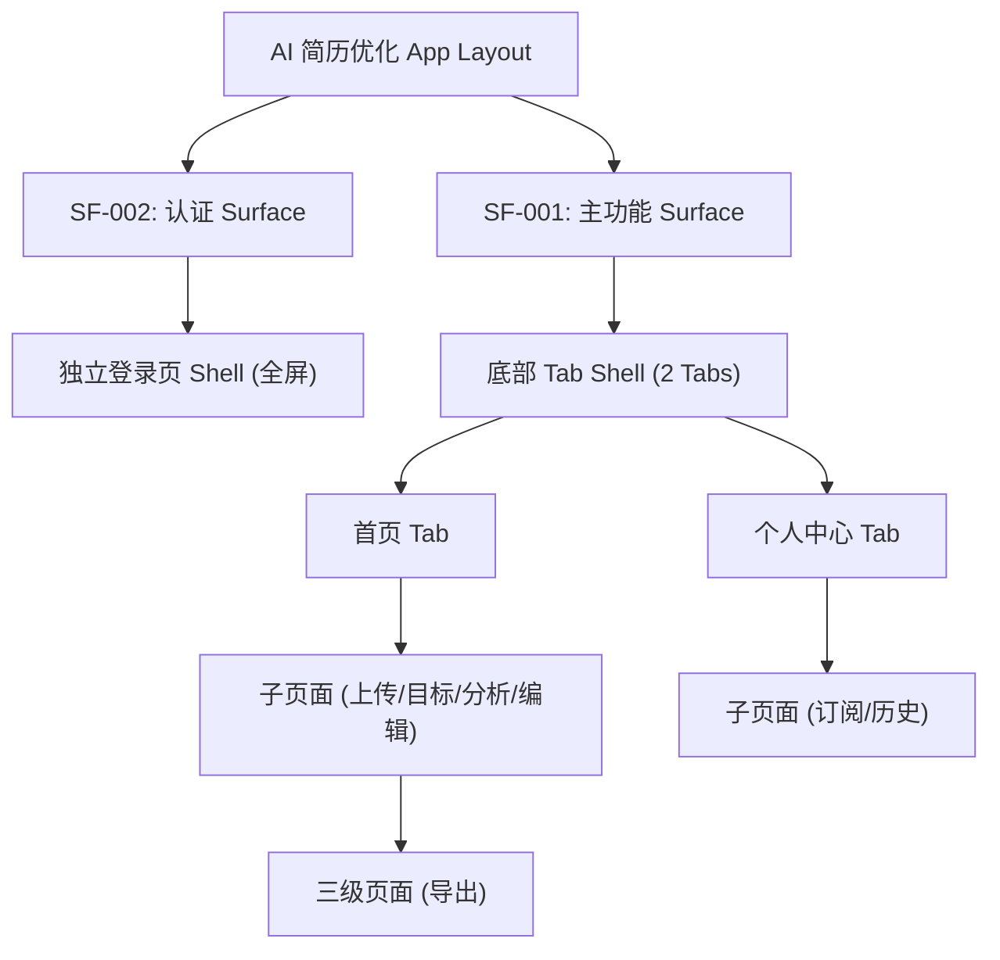

# Product Layout Draft

> 输出路径：`product/development/layout/product-layout-draft.md`。本文档是项目级布局草案，用于用户确认布局假设与待确认项；确认后由 `product-layout-release` 生成 `product/release/layout/product-layout-release.md`，作为后续页面需求、Mock 内容、Design Release 和 Figma 生成前的正式结构约束。

# Product Layout Draft

## 0. 文档状态

| 字段 | 内容 |
|---|---|
| 文档版本 | Draft |
| 生成日期 | 2026-05-12 |
| 来源文件 | `product/release/product-overview-release.md` |
| 来源章节 | `Sitemap 页面生成总表` |
| 当前输出文件 | `product/development/layout/product-layout-draft.md` |
| 适用范围 | APP (iOS/Android) |
| Layout 假设 / 待确认编号规则 | `LA-001` 起为布局假设；`LQ-001` 起为布局待确认 |

## 1. 产品布局总览

| 项目 | 内容 | 来源 / LA / LQ |
|---|---|---|
| 产品类型 | AI 简历优化移动端应用 | 综述 1.1 |
| 应用 Surface | 用户端 App | 综述 2.1 |
| 主 Layout 形态 | 底部 Tab 导航 + 栈式子页面导航 (Stack Navigation) | LA-001 |
| 全局导航模型 | 2 个核心 Tab (首页、个人中心) + 返回导航 | LA-002 |
| 页面层级模型 | 3 层深度 (L1: Tabs, L2: Functional, L3: Details) | Sitemap |
| 响应式 / 端形态策略 | 优先适配移动端竖屏，兼顾大屏居中展示策略 | LA-003 |
| 全局状态容器 | 顶部状态栏、底部 Home 指示器、全屏加载/错误层 | LA-004 |

## 2. Layout 架构图

## 3. Surface 与 Shell 定义

| Surface ID | Surface 名称 | 适用角色 | Shell 类型 | 全局区域 | 根页面入口 | 子页面呈现 | 例外页面 | 来源 / LA / LQ |
|---|---|---|---|---|---|---|---|---|
| SF-001 | 主功能区 | 普通用户 / VIP | bottom-tabs | Top Nav, Bottom Tab, Main Scroll | 首页, 个人中心 | push | 编辑器 (全屏) | LA-001 |
| SF-002 | 认证/引导区 | 游客 | auth-only | Main Scroll (Full) | 登录页 | modal / push | - | LA-005 |

## 4. 全局 Shell 区域规范

| Shell 区域ID | 区域名称 | 所属 Surface | 显示规则 | 内容槽位 | 尺寸 / 安全区 | 滚动关系 | 层级关系 | 状态变化 | 来源 / LA / LQ |
|---|---|---|---|---|---|---|---|---|---|
| SHELL-001 | Top Navigation | SF-001 | 根页面显示标题；子页面显示返回+标题 | title / back / actions | H: 44px + Status Bar | fixed | Level 10 | default / blur | LA-006 |
| SHELL-002 | Main Content | 全局 | 始终显示 | body / list / form | Fill Screen | scroll-container | Level 1 | loading / empty | - |
| SHELL-003 | Bottom Tab | SF-001 | 仅根页面显示 | Tab Items: Home, Profile | H: 49px + Home Ind. | fixed | Level 10 | selected | LA-001 |
| SHELL-004 | AI Floating Orb | SF-001 | 仅编辑器页面显示 | AI Assistant Icon | 64x64 | absolute | Level 15 | pulse / think | LA-007 |

## 5. 页面模板库

| 模板ID | 模板名称 | 适用页面类型 | 必备区域 | 可选区域 | 默认父子层级 | 典型状态 | 响应式规则 | 来源 / LA / LQ |
|---|---|---|---|---|---|---|---|---|
| TPL-001 | 工作台首页模板 | index | shell + header + cards + list | banner / notice | L1 | loading / empty | Mobile 竖屏 | LA-008 |
| TPL-002 | 沉浸式表单模板 | form | shell + top-nav + form-body + fixed-footer | progress-bar | L2 | submitting | Mobile 竖屏 | LA-009 |
| TPL-003 | 数据可视化报告模板 | report | shell + summary-score + charts + cards | detail-panel | L2 | loading-ai | Mobile 竖屏 | LA-010 |
| TPL-004 | 编辑器模板 | editor | custom-header + editor-body + floating-ai | tool-bar | L2 | saving | Mobile 竖屏 | LA-011 |
| TPL-005 | 列表/设置模板 | list | shell + menu-list | info-banner | L1 / L2 | empty | Mobile 竖屏 | LA-012 |

## 6. Sitemap 到 Layout 映射总表

| 生成顺序 | 页面ID | 父页面ID | 层级 | 页面名称 | 页面级MD文件 | Surface ID | Shell 类型 | 页面模板ID | 导航位置 | 子页面呈现方式 | 全局区域继承 | 响应式规则 | 例外说明 | 来源 / LA / LQ |
|---:|---|---|---|---|---|---|---|---|---|---|---|---|---|---|
| 10 | U-010 | ROOT | L1 | 登录注册页 | 010-login.md | SF-002 | auth-only | TPL-002 | hidden | modal | main-scroll | - | 全屏独立页 | LA-005 |
| 20 | U-020 | ROOT | L1 | 首页 | 020-home.md | SF-001 | bottom-tabs | TPL-001 | root-tab-1 | push | all | - | - | LA-001 |
| 30 | U-020-010 | U-020 | L2 | 简历上传页 | 030-upload.md | SF-001 | bottom-tabs | TPL-002 | hidden | push | top-nav | - | 隐藏底部Tab | LA-013 |
| 40 | U-020-020 | U-020 | L2 | 岗位目标设置页 | 040-target-job.md | SF-001 | bottom-tabs | TPL-002 | hidden | push | top-nav | - | 隐藏底部Tab | LA-013 |
| 50 | U-020-030 | U-020 | L2 | AI 分析报告页 | 050-ai-report.md | SF-001 | bottom-tabs | TPL-003 | hidden | push | top-nav | - | 隐藏底部Tab | LA-013 |
| 60 | U-020-040 | U-020 | L2 | 简历编辑器 | 060-editor.md | SF-001 | sidebar (fake) | TPL-004 | hidden | push | none (custom) | - | 自定义沉浸式Shell | LA-011 |
| 70 | U-020-040-010 | U-020-040 | L3 | 导出预览页 | 070-export.md | SF-001 | bottom-tabs | TPL-001 | hidden | push | top-nav | - | 隐藏底部Tab | LA-013 |
| 80 | U-030 | ROOT | L1 | 个人中心 | 080-profile.md | SF-001 | bottom-tabs | TPL-005 | root-tab-2 | push | all | - | - | LA-001 |
| 90 | U-030-010 | U-030 | L2 | 会员订阅页 | 090-vip-subscription.md | SF-001 | bottom-tabs | TPL-001 | hidden | push | top-nav | - | 隐藏底部Tab | LA-013 |
| 100 | U-030-020 | U-030 | L2 | 历史简历页 | 100-history.md | SF-001 | bottom-tabs | TPL-005 | hidden | push | top-nav | - | 隐藏底部Tab | LA-013 |

## 7. 导航与路由规则

| 规则ID | 适用范围 | 规则 | 返回 / 关闭行为 | 当前态展示 | 权限影响 | 来源 / LA / LQ |
|---|---|---|---|---|---|---|
| NAV-001 | 全局 | L1 页面切换不清除页面栈，子页面 Push 进入 | 返回上级页面 | 标题高亮/图标高亮 | 未登录拦截 | LA-002 |
| NAV-002 | L2 页面 | 进入 L2 页面时，默认隐藏全局底部 Tab 栏 (Bottom Tab) | 点击左上角返回图标 | - | - | LA-013 |
| NAV-003 | 编辑器 | 进入编辑器时，移除 Top Nav，改用自定义 Toolbar | 点击左上角“完成/关闭” | - | - | LA-011 |

## 8. 全局状态与边界 Layout

| 状态ID | 适用 Surface / 模板 | 状态类型 | Layout 表现 | 文案/媒体槽位 | 可恢复入口 | 来源 / LA / LQ |
|---|---|---|---|---|---|---|
| GL-STATE-001 | 全局 | loading | 全屏半透明黑色蒙层 + AI 旋转粒子 | “AI 正在计算中...” | - | LA-004 |
| GL-STATE-002 | 列表/历史 | empty | 居中展示灰度插画 + 引导文案 | “暂无记录” | “立即开启优化”按钮 | - |
| GL-STATE-003 | 编辑器 | saving | 顶部小条浮窗提示 | “自动保存中...” | - | LA-014 |

## 9. 角色与权限对 Layout 的影响

| 角色 | 影响区域 | 显示 / 隐藏 / 禁用规则 | 替代 Layout | 来源 / LA / LQ |
|---|---|---|---|---|
| 游客 | 全局 | 无法访问 L1 首页/个人中心以外的内容 | 自动跳转至 SF-002 (登录) | 综述 1.6 |
| 普通用户 | 分析报告 | 限制每日 AI 分析次数提示 | 弹出订阅引导卡片 | 综述 1.6 |
| VIP 会员 | 个人中心 | 展示黑金专属卡片，隐藏订阅入口或变更为续费入口 | 专属 VIP 视觉皮肤 | 综述 1.6 |

## 10. 下游 Skill 使用规则

| 下游 Skill | 必须读取 | 使用方式 | 必须引用的 Layout 信息 |
|---|---|---|---|
| product-page-draft | product-layout-release + product-overview-release | 先确定页面 shell/template，再生成元素/状态/action/API | Surface ID / Shell / 模板ID / 导航位置 / 响应式规则 |
| product-page-mock-draft | product-layout-release + release page | 生成可见文案与 mock 内容时补齐 shell/nav/状态容器文案 | 全局区域 / 导航标签 / 页面标题 / 状态容器 |
| product-page-design-release | product-layout-release + release mock + design system | 生成 App Shell、Frame 层级、响应式与布局完整性审核 | Shell 区域 / 页面模板 / 父子层级 / 安全区 / scroll/fixed 关系 |

## 11. 布局假设与待确认统一清单

### 11.1 布局假设清单

| 假设ID | 假设内容 | 首次出现位置 | 影响范围 | 影响页面 / Surface / Shell | 置信度 | 用户确认状态 | Release 处理方式 |
|---|---|---|---|---|---|---|---|
| LA-001 | 采用 iOS 风格的底部双 Tab 导航 (首页/个人中心)。 | 1.1 | 全局导航 | SF-001 | 高 | 确认 | 确认为正式内容 |
| LA-002 | 子页面导航采用原生 Push 动画，维持 L1-L2-L3 的线性栈结构。 | 1.1 | 导航路由 | 全局 | 高 | 确认 | 确认为正式内容 |
| LA-003 | 页面响应式策略为“居中约束”，即在大屏设备上将内容容器限制在最大 600px 宽度。 | 1.1 | 响应式 | 全局 | 中 | 确认 | 确认为正式内容 |
| LA-005 | 登录流程作为独立的认证 Surface，不包含在主 Tab 结构内。 | 3.0 | 页面关系 | SF-002 | 高 | 确认 | 确认为正式内容 |
| LA-011 | 简历编辑器采用沉浸式全屏布局，隐藏系统级导航，提供独立的关闭/保存操作。 | 5.0 | 编辑器 | U-020-040 | 高 | 确认 | 确认为正式内容 |
| LA-013 | 进入非根路径页面 (L2/L3) 时，默认隐藏底部 Tab 栏以释放操作空间。 | 6.0 | 导航规则 | 子页面 | 高 | 确认 | 确认为正式内容 |

### 11.2 布局待确认清单

| 待确认ID | 待确认问题 | 首次出现位置 | 影响范围 | 影响页面 / Surface / Shell | 优先级 | 用户确认结果 | Release 处理方式 |
|---|---|---|---|---|---|---|---|
| LQ-001 | 简历编辑器在编辑超长简历时，是否需要左侧目录导航 (Sidebar)？ | 6.0 | 编辑器布局 | U-020-040 | 中 | 确认 | 不需要 |
| LQ-002 | 导出预览页是否需要分屏展示 (左侧原件 vs 右侧导出预览)？ | 6.0 | 导出预览 | U-020-040-010 | 低 | 确认 | 不需要 |
| LQ-003 | 个人中心是否包含“深色模式”的手动切换开关？ | 9.0 | 用户中心 | U-030 | 低 | 确认 | 不需要 |
