# Product Layout Draft

## 0. 文档状态

| 字段 | 内容 |
|---|---|
| 文档版本 | Draft |
| 生成日期 | 2026-05-13 |
| 来源文件 | `product/release/product-sitemap-release.md` |
| 来源章节 | `Sitemap 页面生成总表` |
| 当前输出文件 | `product/development/layout/product-layout-draft.md` |
| 适用范围 | PC Web 用户端 / 管理后台 |
| Layout 假设 / 待确认编号规则 | `LA-001` 起为布局假设；`LQ-001` 起为布局待确认 |

## 1. 产品布局总览

| 项目 | 内容 | 来源 / LA / LQ |
|---|---|---|
| 产品类型 | 双域名 PC Web 用户站点 + 后台管理系统 | 来源：release 文档 |
| 应用 Surface | `SF-001` 用户端 PC Web；`SF-002` 管理后台 | 来源：release 文档 |
| 主 Layout 形态 | 用户端采用顶部导航 + 内容容器 + 全站悬浮客服入口；后台采用左侧导航 + 顶栏 + 主内容工作区 | 来源：release 文档 |
| 全局导航模型 | 用户端为顶栏一级导航 + 页面内筛选/次级入口；后台为侧边栏一级导航 + 内容区局部二级导航/Tab | 来源：release 文档 |
| 页面层级模型 | Root 页面作为全局导航目的地，L2 页面默认在父级 shell 内切换，L3 页面优先抽屉 / Tab / Modal 呈现（布局假设 LA-001：未显式说明的新建/审核子流程优先不跳出当前 shell） | 来源：release 文档；LA-001 |
| 响应式 / 端形态策略 | 当前仅做 PC Web；桌面宽屏优先，窄桌面以容器收缩和表格横向滚动适配（布局假设 LA-002：不单独产出 tablet 断点布局） | 来源：release 文档；LA-002 |
| 全局状态容器 | Shell 级 loading、permission、error；页面级 empty、filter-empty、not-found、offline 提示；支付与退款保留流程态容器 | 来源：release 文档 |

## 2. Layout 架构图

```mermaid
flowchart TD
  ROOT["产品 Layout"]
  ROOT --> SF001["Surface: 用户端 PC Web"]
  ROOT --> SF002["Surface: 管理后台"]

  SF001 --> S001["Shell: 顶部导航站点壳"]
  S001 --> U100["登录注册"]
  S001 --> U200["用户工作台"]
  S001 --> U300["服务目录"]
  S001 --> U400["订单中心"]
  S001 --> U500["我的服务"]
  S001 --> U600["消息与个人中心"]
  U200 --> U210["待办事项列表"]
  U200 --> U220["进度查询列表"]
  U300 --> U310["服务商品详情"]
  U310 --> U320["下单确认"]
  U320 --> U330["支付收银台"]
  U400 --> U410["订单列表"]
  U400 --> U420["订单详情"]
  U500 --> U510["服务案件列表"]
  U500 --> U520["案件详情"]
  U520 --> U521["节点资料提交视图"]
  U500 --> U530["官方文件下载记录"]
  U600 --> U610["消息中心"]
  U600 --> U620["账号设置"]
  U600 --> U630["协议查看页"]

  SF002 --> S002["Shell: 后台侧栏控制台壳"]
  S002 --> M100["后台登录"]
  S002 --> M200["后台工作台与规则配置"]
  S002 --> M300["账号管理"]
  S002 --> M400["服务与商品中心"]
  S002 --> M500["订单管理"]
  S002 --> M600["案件管理"]
  S002 --> M700["消息与协议管理"]
  S002 --> M800["数据统计"]
  M200 --> M210["待办/风险规则配置"]
  M200 --> M220["进度字段配置"]
  M300 --> M310["服务人员账号分配"]
  M300 --> M320["用户账号管理"]
  M400 --> M410["服务目录配置"]
  M400 --> M420["服务模板编辑器"]
  M400 --> M430["商品与SKU编辑"]
  M500 --> M510["订单列表"]
  M500 --> M520["订单详情/转线上"]
  M520 --> M521["退款审核视图"]
  M600 --> M610["案件总览"]
  M600 --> M620["案件详情维护"]
  M620 --> M621["材料审核视图"]
  M620 --> M622["官方文件管理视图"]
  M700 --> M710["消息模板与发送配置"]
  M700 --> M720["协议管理"]
  M800 --> M810["销售与服务统计"]
```



## 3. Surface 与 Shell 定义

| Surface ID | Surface 名称 | 适用角色 | Shell 类型 | 全局区域 | 根页面入口 | 子页面呈现 | 例外页面 | 来源 / LA / LQ |
|---|---|---|---|---|---|---|---|---|
| SF-001 | 用户端 PC Web（双域名同构） | 游客、客户用户 | top-nav | top-nav / announcement-slot / content-header / main-scroll / floating-service-entry / modal-layer / global-message-toast | 登录注册、用户工作台、服务目录、订单中心、我的服务、消息与个人中心 | L2 默认 nested-route；支付、下单为独立内容页；L3 优先 drawer / tab-panel | 登录注册、支付收银台、协议查看页 | 来源：release 文档；LA-001 |
| SF-002 | 管理后台 | 超级管理员、录入专员 | admin-console | side-nav / top-bar / breadcrumb / content-header / main-scroll / fixed-action-bar / modal-drawer-layer / toast-notice | 后台登录、工作台、账号管理、服务与商品中心、订单管理、案件管理、消息与协议管理、数据统计 | L2 默认 nested-route；审核/文件/退款等 L3 优先 drawer / side-panel；编辑器型页面独立工作区 | 后台登录、服务模板编辑器 | 来源：release 文档；LA-001 |

## 4. 全局 Shell 区域规范

| Shell 区域ID | 区域名称 | 所属 Surface | 显示规则 | 内容槽位 | 尺寸 / 安全区 | 滚动关系 | 层级关系 | 状态变化 | 来源 / LA / LQ |
|---|---|---|---|---|---|---|---|---|---|
| SHELL-001 | 用户端 Top Navigation | SF-001 | 登录后与未登录均显示，当前页高亮 | logo / 一级导航 / 用户入口 / 消息入口 / 登录态 CTA | PC 顶栏固定高度 64px（布局假设 LA-003：统一头部高度） | fixed | 高于内容区，低于全局弹层 | default / sticky / compact | LA-003 |
| SHELL-002 | 用户端 Main Content | SF-001 | 所有用户端页面显示 | breadcrumb-optional / page-header / filter-bar / body / footer-note | 居中容器，最大宽度 1280px（布局假设 LA-004） | main-scroll | 位于顶栏下方 | loading / empty / error / permission | LA-004 |
| SHELL-003 | 悬浮客服与消息提示层 | SF-001 | 登录后默认显示客服入口，消息 toast 按事件触发 | floating-service-entry / toast / confirm-modal | 右下悬浮；不遮挡主 CTA（布局假设 LA-005） | fixed | 高于内容区 | hidden / unread-badge / expanded | LA-005 |
| SHELL-004 | 后台 Side Navigation | SF-002 | 后台登录后始终显示，按角色隐藏不可见项 | 一级菜单 / 菜单分组 / 当前态 / 收起控制 | 展开宽 240px，收起宽 72px（布局假设 LA-006） | fixed | 与顶栏并列，低于抽屉 | expanded / collapsed / permission-hidden | LA-006 |
| SHELL-005 | 后台 Top Bar / Breadcrumb | SF-002 | 后台业务页面显示 | page-title / breadcrumb / quick-actions / account-menu | 顶栏 56px（布局假设 LA-007） | sticky | 高于主内容区 | default / loading / readonly | LA-007 |
| SHELL-006 | 后台 Main Work Area | SF-002 | 后台业务页面显示 | content-header / filter / table / form / editor / analytics-canvas | 内容区自适应；表格允许横向滚动 | main-scroll | 位于侧栏与顶栏之下 | loading / empty / error / permission / readonly | 来源：release 文档 |
| SHELL-007 | 后台 Drawer / Modal Layer | SF-002 | L3 审核、文件、退款、辅助编辑场景显示 | drawer-header / body / fixed-actions | 抽屉宽度按任务类型 480-720px（布局假设 LA-008） | body-scroll-inside | 最高交互层 | open / dirty / submitting / success | LA-008 |
| SHELL-008 | 固定操作条 | SF-002 | 表单编辑器、详情维护页在需要保存/提交时显示 | primary-action / secondary-action / status-hint | 固定底部 56px（布局假设 LA-009） | fixed | 位于主内容上方 | hidden / active / disabled / submitting | LA-009 |

## 5. 页面模板库

| 模板ID | 模板名称 | 适用页面类型 | 必备区域 | 可选区域 | 默认父子层级 | 典型状态 | 响应式规则 | 来源 / LA / LQ |
|---|---|---|---|---|---|---|---|---|
| TPL-001 | 用户端列表页模板 | list / index | shell + page-header + filter-bar + list | stats-summary / quick-links / empty-state | Surface > Shell > Page > List | loading / empty / filter-empty / error | 1280 容器，窄屏压缩筛选区 | 来源：release 文档；LA-004 |
| TPL-002 | 用户端详情页模板 | detail | shell + title + detail-content + action-area | related-files / history / side-summary | parent list > detail | loading / not-found / permission | 主列内容 + 辅助摘要双栏（布局假设 LA-010） | LA-010 |
| TPL-003 | 用户端表单/支付页模板 | create / edit / payment | shell + step/title + form/body + fixed-action | fee-summary / protocol-check / result-panel | list/detail > form/payment | validation / submitting / success / timeout | 桌面下两栏，窄屏降为单栏 | 来源：release 文档 |
| TPL-004 | 后台表格工作台模板 | dashboard / list / management | admin shell + content-header + filter + table + batch-action | export-slot / status-tabs / metrics-cards | shell > page > list/table | loading / empty / permission / readonly | 表格横向滚动，筛选区折叠 | 来源：release 文档 |
| TPL-005 | 后台详情维护模板 | detail / maintenance | admin shell + breadcrumb + detail-header + body + fixed-action | history / side-inspector / relation-panel | list > detail | loading / readonly / dirty / save-success | 双栏内容；关键操作固定底栏 | LA-009 |
| TPL-006 | 后台编辑器模板 | form / builder / editor | admin shell + editor-header + canvas + config-panel + fixed-action | preview / node-outline / validation-summary | center > editor | loading / invalid / unsaved / publish-success | 三栏可伸缩（布局假设 LA-011） | LA-011 |
| TPL-007 | 抽屉审核模板 | review / audit / upload | shell + drawer-header + scroll-body + fixed-actions | compare-panel / audit-log | detail > drawer | loading / empty / submit-success / reject | 抽屉内滚动，主页面保持上下文 | 来源：release 文档；LA-008 |
| TPL-008 | 分析统计模板 | analytics / report | admin shell + metric-row + chart-area + filter-bar | table-breakdown / export-slot | root > analytics | loading / empty / no-permission | 宽屏优先网格布局 | 来源：release 文档 |
| TPL-009 | 认证模板 | auth | brand-header + auth-card + helper-panel | QR-login / agreement-hint | surface > auth | loading / error / locked | 内容居中，去掉业务导航 | 来源：release 文档 |
| TPL-010 | 协议/内容阅读模板 | content / legal | shell + article-header + article-body | toc / version-note | center > content | loading / no-content | 容器收窄阅读模式 | 来源：release 文档 |

## 6. Sitemap 到 Layout 映射总表

| 生成顺序 | 页面ID | 父页面ID | 层级 | 页面名称 | 页面级MD文件 | Surface ID | Shell 类型 | 页面模板ID | 导航位置 | 子页面呈现方式 | 全局区域继承 | 响应式规则 | 例外说明 | 来源 / LA / LQ |
|---:|---|---|---|---|---|---|---|---|---|---|---|---|---|---|
| 10 | U-100 | ROOT | L1 | 登录注册 | product/development/pages/010-user-login.md | SF-001 | auth-only | TPL-009 | hidden | new-page | SHELL-001 none / SHELL-002 none / modal-layer limited | PC centered auth card | 游客入口，不继承业务导航高亮 | 来源：release 文档 |
| 20 | U-200 | ROOT | L1 | 用户工作台 | product/development/pages/020-user-dashboard.md | SF-001 | top-nav | TPL-001 | top-nav:工作台 | nested-route | SHELL-001 / SHELL-002 / SHELL-003 | 桌面宽屏卡片+列表 | 作为登录后默认首页（布局假设 LA-012） | LA-012 |
| 30 | U-210 | U-200 | L2 | 待办事项列表 | product/development/pages/030-user-todo-list.md | SF-001 | top-nav | TPL-001 | top-nav:工作台 / local-tab:待办 | nested-route | SHELL-001 / SHELL-002 / SHELL-003 | 保留筛选栏固定 | 父页内二级切换 | 来源：release 文档 |
| 40 | U-220 | U-200 | L2 | 进度查询列表 | product/development/pages/040-user-progress-list.md | SF-001 | top-nav | TPL-001 | top-nav:工作台 / local-tab:进度 | nested-route | SHELL-001 / SHELL-002 / SHELL-003 | 表格/卡片混合列表 | 父页内二级切换 | 来源：release 文档 |
| 50 | U-300 | ROOT | L1 | 服务目录 | product/development/pages/050-service-catalog.md | SF-001 | top-nav | TPL-001 | top-nav:服务目录 | nested-route | SHELL-001 / SHELL-002 / SHELL-003 | 类目网格 + 列表 | 双域名仅品牌头图差异 | 来源：release 文档 |
| 60 | U-310 | U-300 | L2 | 服务商品详情 | product/development/pages/060-service-detail.md | SF-001 | top-nav | TPL-002 | top-nav:服务目录 | push | SHELL-001 / SHELL-002 / SHELL-003 | 详情主副栏 | 从目录进入详情独立路由 | 来源：release 文档 |
| 70 | U-320 | U-310 | L2 | 下单确认 | product/development/pages/070-order-checkout.md | SF-001 | top-nav | TPL-003 | hidden-from-main-highlight | push | SHELL-001 / SHELL-002 / SHELL-003 | 双栏表单 + 费用摘要 | 进入交易流程后保持顶栏但弱化导航 | LA-001 |
| 80 | U-330 | U-320 | L2 | 支付收银台 | product/development/pages/080-payment-checkout.md | SF-001 | top-nav | TPL-003 | hidden-from-main-highlight | push | SHELL-001 / SHELL-002 / SHELL-003 | 结果态优先，保留订单摘要 | 支付过程需要超时态容器 | 来源：release 文档 |
| 90 | U-400 | ROOT | L1 | 订单中心 | product/development/pages/090-order-center.md | SF-001 | top-nav | TPL-001 | top-nav:订单 | nested-route | SHELL-001 / SHELL-002 / SHELL-003 | 状态统计 + 列表入口 | Root 入口 | 来源：release 文档 |
| 100 | U-410 | U-400 | L2 | 订单列表 | product/development/pages/100-order-list.md | SF-001 | top-nav | TPL-001 | top-nav:订单 / local-tab:列表 | nested-route | SHELL-001 / SHELL-002 / SHELL-003 | 状态标签横向排列 | 父页内容切换 | 来源：release 文档 |
| 110 | U-420 | U-400 | L2 | 订单详情 | product/development/pages/110-order-detail.md | SF-001 | top-nav | TPL-002 | top-nav:订单 | push | SHELL-001 / SHELL-002 / SHELL-003 | 详情 + 退款动作区 | 客服为悬浮入口，不占正文位 | 来源：release 文档 |
| 120 | U-500 | ROOT | L1 | 我的服务 | product/development/pages/120-service-center.md | SF-001 | top-nav | TPL-001 | top-nav:我的服务 | nested-route | SHELL-001 / SHELL-002 / SHELL-003 | 服务计数 + 列表入口 | Root 入口 | 来源：release 文档 |
| 130 | U-510 | U-500 | L2 | 服务案件列表 | product/development/pages/130-service-case-list.md | SF-001 | top-nav | TPL-001 | top-nav:我的服务 / local-tab:案件 | nested-route | SHELL-001 / SHELL-002 / SHELL-003 | 强化状态筛选栏 | 父页切换 | 来源：release 文档 |
| 140 | U-520 | U-500 | L2 | 案件详情 | product/development/pages/140-case-detail.md | SF-001 | top-nav | TPL-002 | top-nav:我的服务 | push | SHELL-001 / SHELL-002 / SHELL-003 | 时间轴 + 详情双栏 | 内容纵深较高，保留侧摘要（布局假设 LA-010） | LA-010 |
| 150 | U-521 | U-520 | L3 | 节点资料提交视图 | product/development/pages/150-node-submit-view.md | SF-001 | top-nav | TPL-003 | hidden | drawer | SHELL-001 / SHELL-003 / modal-layer | 抽屉内单列表单 | 从案件详情侧滑打开 | 来源：release 文档 |
| 160 | U-530 | U-500 | L2 | 官方文件下载记录 | product/development/pages/160-file-downloads.md | SF-001 | top-nav | TPL-001 | top-nav:我的服务 / local-tab:文件 | nested-route | SHELL-001 / SHELL-002 / SHELL-003 | 记录表格 | 父页切换 | 来源：release 文档 |
| 170 | U-600 | ROOT | L1 | 消息与个人中心 | product/development/pages/170-user-center.md | SF-001 | top-nav | TPL-001 | top-nav:个人中心 | nested-route | SHELL-001 / SHELL-002 / SHELL-003 | 账号摘要 + 二级入口 | Root 入口 | 来源：release 文档 |
| 180 | U-610 | U-600 | L2 | 消息中心 | product/development/pages/180-message-center.md | SF-001 | top-nav | TPL-001 | top-nav:个人中心 / local-tab:消息 | nested-route | SHELL-001 / SHELL-002 / SHELL-003 | 通知渠道筛选 | 父页切换 | 来源：release 文档 |
| 190 | U-620 | U-600 | L2 | 账号设置 | product/development/pages/190-account-settings.md | SF-001 | top-nav | TPL-003 | top-nav:个人中心 / local-tab:设置 | nested-route | SHELL-001 / SHELL-002 / SHELL-003 | 表单为主 | 父页切换 | 来源：release 文档 |
| 200 | U-630 | U-600 | L2 | 协议查看页 | product/development/pages/200-agreements.md | SF-001 | top-nav | TPL-010 | top-nav:个人中心 / local-tab:协议 | push | SHELL-001 / SHELL-002 | 阅读模式收窄 | 可从注册与个人中心进入 | 来源：release 文档 |
| 210 | M-100 | ROOT | L1 | 后台登录 | product/development/pages/210-admin-login.md | SF-002 | auth-only | TPL-009 | hidden | new-page | no-side-nav / auth-card-only | centered auth | 与后台壳分离 | 来源：release 文档 |
| 220 | M-200 | ROOT | L1 | 后台工作台与规则配置 | product/development/pages/220-admin-dashboard.md | SF-002 | admin-console | TPL-004 | sidebar:工作台 | nested-route | SHELL-004 / SHELL-005 / SHELL-006 / SHELL-007 | 宽屏卡片仪表盘 | 后台默认首页（布局假设 LA-013） | LA-013 |
| 230 | M-210 | M-200 | L2 | 待办/风险规则配置 | product/development/pages/230-risk-rule-config.md | SF-002 | admin-console | TPL-004 | sidebar:工作台 / local-tab:风险规则 | nested-route | SHELL-004 / SHELL-005 / SHELL-006 / SHELL-007 | 表格 + 配置抽屉 | 父页内切换 | 来源：release 文档 |
| 240 | M-220 | M-200 | L2 | 进度字段配置 | product/development/pages/240-progress-field-config.md | SF-002 | admin-console | TPL-004 | sidebar:工作台 / local-tab:字段配置 | nested-route | SHELL-004 / SHELL-005 / SHELL-006 / SHELL-007 | 列表配置 | 父页内切换 | 来源：release 文档 |
| 250 | M-300 | ROOT | L1 | 账号管理 | product/development/pages/250-admin-account-center.md | SF-002 | admin-console | TPL-004 | sidebar:账号管理 | nested-route | SHELL-004 / SHELL-005 / SHELL-006 / SHELL-007 | 指标 + 两类账号入口 | Root 入口 | 来源：release 文档 |
| 260 | M-310 | M-300 | L2 | 服务人员账号分配 | product/development/pages/260-staff-account-admin.md | SF-002 | admin-console | TPL-004 | sidebar:账号管理 / local-tab:服务人员 | nested-route | SHELL-004 / SHELL-005 / SHELL-006 / SHELL-007 | 列表 + 新建弹窗 | 父页内切换 | 来源：release 文档 |
| 270 | M-320 | M-300 | L2 | 用户账号管理 | product/development/pages/270-user-account-admin.md | SF-002 | admin-console | TPL-004 | sidebar:账号管理 / local-tab:用户账号 | nested-route | SHELL-004 / SHELL-005 / SHELL-006 / SHELL-007 | 列表详情混合 | 父页内切换 | 来源：release 文档 |
| 280 | M-400 | ROOT | L1 | 服务与商品中心 | product/development/pages/280-service-product-center.md | SF-002 | admin-console | TPL-004 | sidebar:服务 | nested-route | SHELL-004 / SHELL-005 / SHELL-006 / SHELL-007 | 模块入口页 | Root 入口 | 来源：release 文档 |
| 290 | M-410 | M-400 | L2 | 服务目录配置 | product/development/pages/290-service-catalog-admin.md | SF-002 | admin-console | TPL-004 | sidebar:服务 / local-tab:目录 | nested-route | SHELL-004 / SHELL-005 / SHELL-006 / SHELL-007 | 分类列表 + 排序 | 父页内切换 | 来源：release 文档 |
| 300 | M-420 | M-400 | L2 | 服务模板编辑器 | product/development/pages/300-service-template-editor.md | SF-002 | admin-console | TPL-006 | sidebar:服务 / local-tab:模板 | push | SHELL-004 / SHELL-005 / SHELL-006 / SHELL-008 | 三栏编辑器 | 独立工作区，弱化列表上下文 | LA-011 |
| 310 | M-430 | M-400 | L2 | 商品与SKU编辑 | product/development/pages/310-product-sku-editor.md | SF-002 | admin-console | TPL-006 | sidebar:服务 / local-tab:商品 | push | SHELL-004 / SHELL-005 / SHELL-006 / SHELL-008 | 表单 + SKU 列表 + 模板关联面板 | 独立工作区 | LA-011 |
| 320 | M-500 | ROOT | L1 | 订单管理 | product/development/pages/320-order-admin-center.md | SF-002 | admin-console | TPL-004 | sidebar:订单 | nested-route | SHELL-004 / SHELL-005 / SHELL-006 / SHELL-007 | 状态统计 + 列表入口 | Root 入口 | 来源：release 文档 |
| 330 | M-510 | M-500 | L2 | 订单列表 | product/development/pages/330-order-admin-list.md | SF-002 | admin-console | TPL-004 | sidebar:订单 / local-tab:列表 | nested-route | SHELL-004 / SHELL-005 / SHELL-006 / SHELL-007 | 多维筛选表格 | 父页内切换 | 来源：release 文档 |
| 340 | M-520 | M-500 | L2 | 订单详情/转线上 | product/development/pages/340-order-admin-detail.md | SF-002 | admin-console | TPL-005 | sidebar:订单 | push | SHELL-004 / SHELL-005 / SHELL-006 / SHELL-008 | 详情 + 操作底栏 | 详情页可打开退款抽屉 | 来源：release 文档 |
| 345 | M-521 | M-520 | L3 | 退款审核视图 | product/development/pages/345-refund-review-view.md | SF-002 | admin-console | TPL-007 | hidden | drawer | SHELL-004 / SHELL-005 / SHELL-007 | 抽屉审核 | 从订单详情侧滑打开 | 来源：release 文档 |
| 350 | M-600 | ROOT | L1 | 案件管理 | product/development/pages/350-case-admin-center.md | SF-002 | admin-console | TPL-004 | sidebar:案件 | nested-route | SHELL-004 / SHELL-005 / SHELL-006 / SHELL-007 | 统计 + 列表入口 | Root 入口 | 来源：release 文档 |
| 360 | M-610 | M-600 | L2 | 案件总览 | product/development/pages/360-case-admin-list.md | SF-002 | admin-console | TPL-004 | sidebar:案件 / local-tab:总览 | nested-route | SHELL-004 / SHELL-005 / SHELL-006 / SHELL-007 | 大表格 + 多维筛选 | 父页内切换 | 来源：release 文档 |
| 370 | M-620 | M-600 | L2 | 案件详情维护 | product/development/pages/370-case-admin-detail.md | SF-002 | admin-console | TPL-005 | sidebar:案件 | push | SHELL-004 / SHELL-005 / SHELL-006 / SHELL-008 | 详情主区 + 时间轴/资料区 | 需要固定底部操作条 | 来源：release 文档 |
| 380 | M-621 | M-620 | L3 | 材料审核视图 | product/development/pages/380-material-review-view.md | SF-002 | admin-console | TPL-007 | hidden | drawer | SHELL-004 / SHELL-005 / SHELL-007 | 抽屉审核 | 从案件详情侧滑打开 | 来源：release 文档 |
| 390 | M-622 | M-620 | L3 | 官方文件管理视图 | product/development/pages/390-official-file-view.md | SF-002 | admin-console | TPL-007 | hidden | drawer | SHELL-004 / SHELL-005 / SHELL-007 | 抽屉文件管理 | 从案件详情侧滑打开 | 来源：release 文档 |
| 400 | M-700 | ROOT | L1 | 消息与协议管理 | product/development/pages/400-ops-center.md | SF-002 | admin-console | TPL-004 | sidebar:消息 | nested-route | SHELL-004 / SHELL-005 / SHELL-006 / SHELL-007 | 配置入口 | Root 入口 | 来源：release 文档 |
| 410 | M-710 | M-700 | L2 | 消息模板与发送配置 | product/development/pages/410-message-template-config.md | SF-002 | admin-console | TPL-004 | sidebar:消息 / local-tab:消息模板 | nested-route | SHELL-004 / SHELL-005 / SHELL-006 / SHELL-007 | 列表 + 模板编辑抽屉 | 父页内切换 | 来源：release 文档 |
| 420 | M-720 | M-700 | L2 | 协议管理 | product/development/pages/420-agreement-admin.md | SF-002 | admin-console | TPL-005 | sidebar:消息 / local-tab:协议 | nested-route | SHELL-004 / SHELL-005 / SHELL-006 / SHELL-008 | 内容编辑 + 发布动作 | 父页内切换 | 来源：release 文档 |
| 430 | M-800 | ROOT | L1 | 数据统计 | product/development/pages/430-analytics-center.md | SF-002 | admin-console | TPL-008 | sidebar:统计 | nested-route | SHELL-004 / SHELL-005 / SHELL-006 | 指标总览入口 | Root 入口 | 来源：release 文档 |
| 440 | M-810 | M-800 | L2 | 销售与服务统计 | product/development/pages/440-sales-analytics.md | SF-002 | admin-console | TPL-008 | sidebar:统计 / local-tab:销售与服务 | nested-route | SHELL-004 / SHELL-005 / SHELL-006 | 图表 + 明细表 | 父页内切换 | 来源：release 文档 |

## 7. 导航与路由规则

| 规则ID | 适用范围 | 规则 | 返回 / 关闭行为 | 当前态展示 | 权限影响 | 来源 / LA / LQ |
|---|---|---|---|---|---|---|
| NAV-001 | SF-001 用户端 Root 页面 | 一级导航使用顶栏切换 `工作台 / 服务目录 / 订单 / 我的服务 / 个人中心` | 切换导航保持当前登录态，不弹确认 | 顶栏高亮当前一级入口 | 游客仅可见服务目录和登录入口 | 来源：release 文档 |
| NAV-002 | SF-001 用户端详情/交易流程 | 从列表进入详情、下单、支付采用 push 路由，不切换一级导航结构 | 返回上一级列表或详情页 | 一级导航保持父级高亮 | 未登录访问需先跳登录 | 来源：release 文档 |
| NAV-003 | SF-001 L3 资料提交 | 节点资料提交优先 drawer 打开，保留案件详情上下文 | 关闭 drawer 回到案件详情当前位置 | 不改变一级导航高亮 | 无权限时显示 permission 容器 | LA-001 |
| NAV-004 | SF-002 后台 Root 页面 | 一级导航使用侧栏切换 `工作台 / 账号 / 服务 / 订单 / 案件 / 消息 / 统计` | 切换菜单保留筛选查询参数按模块独立缓存（布局假设 LA-014） | 侧栏当前态高亮 | 录入专员隐藏超级管理员专属菜单项（如账号分配、协议配置） | LA-014 |
| NAV-005 | SF-002 后台列表到详情 | 列表进入详情采用 push 路由；Breadcrumb 显示父级模块 | 返回回到原筛选结果 | 侧栏保持父模块高亮 | 只读角色禁用编辑动作 | 来源：release 文档 |
| NAV-006 | SF-002 后台 L3 审核/文件/退款 | L3 优先 drawer / side-panel 呈现，不离开当前详情上下文 | 关闭后回到详情当前滚动位置 | 不改变侧栏与 breadcrumb 层级 | 超级管理员独占退款审核入口 | 来源：release 文档 |

## 8. 全局状态与边界 Layout

| 状态ID | 适用 Surface / 模板 | 状态类型 | Layout 表现 | 文案/媒体槽位 | 可恢复入口 | 来源 / LA / LQ |
|---|---|---|---|---|---|---|
| GL-STATE-001 | 全 Surface / 全模板 | loading | 保留 shell，内容区显示骨架屏；表格使用行骨架 | page-header / body skeleton | 自动恢复 | 来源：release 文档 |
| GL-STATE-002 | TPL-001 / TPL-004 / TPL-008 | empty | 内容区显示空状态插图 + 主 CTA | title / desc / primary-action | 清空筛选、去创建、去浏览 | 来源：release 文档 |
| GL-STATE-003 | 全 Surface / 全模板 | error | shell 保留，内容区显示错误卡片 | error-title / desc / retry | retry / back | 来源：release 文档 |
| GL-STATE-004 | SF-001 / SF-002 | permission | 保留 shell，隐藏受限区域，主区域显示无权限提示 | permission-title / desc | 返回首页 / 联系管理员 | 来源：release 文档 |
| GL-STATE-005 | SF-001 支付相关 | payment-timeout | 订单摘要保留，主区域展示超时关闭状态 | timeout-title / order-summary | 返回待支付订单列表 | 来源：release 文档 |
| GL-STATE-006 | SF-001 / TPL-002 | refund-processing | 订单详情顶部显示状态带 + 时间线 | refund-status / audit-note | 返回订单列表 | 来源：release 文档 |
| GL-STATE-007 | SF-002 / TPL-005 / TPL-006 / TPL-007 | readonly | 固定操作条禁用主按钮，显示只读提示 | readonly-banner | 返回列表 | 来源：release 文档 |
| GL-STATE-008 | SF-002 / TPL-008 | no-data-after-filter | 图表区收起，展示筛选无结果说明 | empty-chart / desc | 重置筛选 | 来源：release 文档 |
| GL-STATE-009 | 全 Surface | offline | 顶栏/顶条显示网络异常提示（布局假设 LA-015：需要全局弱提示而非全屏阻断） | offline-banner | 重试 / 刷新 | LA-015 |

## 9. 角色与权限对 Layout 的影响

| 角色 | 影响区域 | 显示 / 隐藏 / 禁用规则 | 替代 Layout | 来源 / LA / LQ |
|---|---|---|---|---|
| 游客 | 用户端顶栏、服务详情、订单/我的服务 | 隐藏订单、我的服务、个人中心业务入口；下单前触发登录拦截 | 登录注册页 | 来源：release 文档 |
| 客户用户 | 用户端全局 | 显示完整顶栏；退款仅在符合条件订单详情展示 | 无 | 来源：release 文档 |
| 超级管理员 | 后台侧栏、顶栏、详情操作区 | 显示全部后台菜单、账号分配、退款审核、协议管理、消息模板与统计入口 | 无 | 来源：release 文档 |
| 录入专员 | 后台侧栏、详情操作区 | 隐藏账号分配、协议管理、退款审核等超级管理员专属入口；保留案件详情的推进、跳步、回退、材料审核操作 | 在受限页面显示无权限提示或不暴露入口（布局待确认 LQ-001：录入专员是否可见但禁用 `消息与协议管理` 一级入口） | LQ-001 |

## 10. 下游 Skill 使用规则

| 下游 Skill | 必须读取 | 使用方式 | 必须引用的 Layout 信息 |
|---|---|---|---|
| product-page-draft | product-layout-release + product-sitemap-release | 先确定页面所属 Surface、Shell、模板，再定义页面元素、状态与操作块 | Surface ID / Shell 类型 / 模板ID / 导航位置 / 子页面呈现方式 / 响应式规则 |
| product-page-mock-draft | product-layout-release + 页面 release 文档 | 生成可见文案与 mock 内容时补齐 shell/nav/状态容器文案 | Top Nav / Side Nav / Breadcrumb / Page Header / Empty/Error/Permission 容器 |
| product-page-design-release | product-layout-release + 页面 mock/release + design system | 生成 App Shell、Frame 层级、滚动容器、固定条、抽屉层与响应式变体 | Shell 区域 / 页面模板 / 父子层级 / fixed/scroll 关系 / 宽屏容器规则 |

## 11. 布局假设与待确认统一清单

### 11.1 布局假设清单

| 假设ID | 假设内容 | 首次出现位置 | 影响范围 | 影响页面 / Surface / Shell | 置信度 | 用户确认状态 | Release 处理方式 |
|---|---|---|---|---|---|---|---|
| LA-001 | 未显式说明的新建/审核类 L3 子流程优先在父页面上下文中以 drawer / tab 方式呈现，而不是跳转独立新页面。 | 1. 产品布局总览 | Shell / 模板 / 导航 | SF-001、SF-002、U-521、M-521、M-621、M-622 | 高 | 待用户确认 | 确认为正式内容 / 按用户修改替换 |
| LA-002 | 当前仅做 PC Web，不单独产出 tablet 断点布局；窄桌面以容器收缩和横向滚动适配。 | 1. 产品布局总览 | 响应式 | SF-001、SF-002 | 高 | 待用户确认 | 确认为正式内容 |
| LA-003 | 用户端顶栏统一采用 64px 固定高度。 | 4. 全局 Shell 区域规范 | Shell | SHELL-001 | 中 | 待用户确认 | 确认为正式内容 / 按用户修改替换 |
| LA-004 | 用户端主内容容器最大宽度为 1280px。 | 4. 全局 Shell 区域规范 | Shell / 响应式 | SHELL-002、SF-001 | 中 | 待用户确认 | 确认为正式内容 / 按用户修改替换 |
| LA-005 | 全站悬浮客服入口固定在右下，不与主 CTA 重叠。 | 4. 全局 Shell 区域规范 | Shell | SHELL-003、U-420 | 中 | 待用户确认 | 确认为正式内容 |
| LA-006 | 后台侧栏展开宽度 240px、收起宽度 72px。 | 4. 全局 Shell 区域规范 | Shell | SHELL-004、SF-002 | 中 | 待用户确认 | 确认为正式内容 / 按用户修改替换 |
| LA-007 | 后台顶栏统一采用 56px 高度。 | 4. 全局 Shell 区域规范 | Shell | SHELL-005 | 中 | 待用户确认 | 确认为正式内容 |
| LA-008 | 后台审核/文件/退款抽屉宽度按任务类型使用 480-720px。 | 4. 全局 Shell 区域规范 | Shell / 模板 | SHELL-007、TPL-007 | 中 | 待用户确认 | 确认为正式内容 |
| LA-009 | 后台表单与详情页存在固定底部操作条用于保存、发布、审核。 | 4. 全局 Shell 区域规范 | Shell / 模板 | SHELL-008、M-420、M-430、M-620、M-720 | 高 | 待用户确认 | 确认为正式内容 |
| LA-010 | 用户端详情页采用主内容 + 辅助摘要双栏结构，时间轴与侧摘要并存。 | 5. 页面模板库 | 模板 | TPL-002、U-310、U-420、U-520 | 中 | 待用户确认 | 确认为正式内容 / 按用户修改替换 |
| LA-011 | 后台编辑器页采用三栏工作区：节点/列表、编辑画布、配置面板。 | 5. 页面模板库 | 模板 | TPL-006、M-420、M-430 | 高 | 待用户确认 | 确认为正式内容 |
| LA-012 | 用户工作台为登录后默认首页。 | 6. Sitemap 到 Layout 映射总表 | 导航 / 路由 | U-200 | 中 | 待用户确认 | 确认为正式内容 |
| LA-013 | 后台工作台为后台登录后默认首页。 | 6. Sitemap 到 Layout 映射总表 | 导航 / 路由 | M-200 | 中 | 待用户确认 | 确认为正式内容 |
| LA-014 | 后台切换一级菜单时保留各模块独立筛选缓存。 | 7. 导航与路由规则 | 导航 / 状态 | SF-002、NAV-004 | 中 | 待用户确认 | 确认为正式内容 |
| LA-015 | 全局离线提示采用弱提示 banner，而不是全屏阻断。 | 8. 全局状态与边界 Layout | 全局状态 | GL-STATE-009 | 低 | 待用户确认 | 确认为正式内容 / 按用户修改替换 |

### 11.2 布局待确认清单

| 待确认ID | 待确认问题 | 首次出现位置 | 影响范围 | 影响页面 / Surface / Shell | 优先级 | 用户确认结果 | Release 处理方式 |
|---|---|---|---|---|---|---|---|
| LQ-001 | 录入专员是否需要看到 `消息与协议管理` 一级导航但以禁用态展示，还是直接隐藏整个入口？ | 9. 角色与权限对 Layout 的影响 | 导航 / 权限 | SF-002、M-700、M-710、M-720 | 高 | 待用户确认 | 写入正式内容 / 删除其一 |

## 12. 用户补充描述

> 本章节必须保留在 Layout Draft 文档末尾，供用户用自然语言补充或修改全局 Shell、导航、页面模板、响应式规则、全局状态、角色/权限布局、页面层级呈现或 Sitemap 到 Layout 映射。`product-layout-release` 生成 release 版本时必须读取、分析并应用这里的内容。
> 如果没有补充，请保留“无”。

```text
无
```
