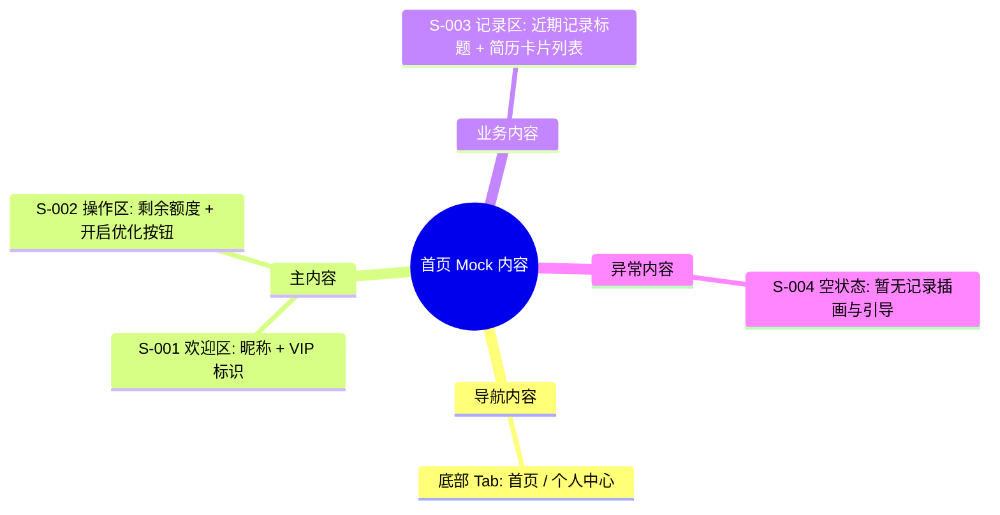

# 首页 Mock Draft

> 输出路径：`product/development/mock/020-home.md`。本文档只描述页面展示内容与 mock 数据，不描述交互执行、埋点、接口调用或业务执行逻辑。

# 首页

## 0. Mock 文档状态

- 文档版本：Draft
- 生成日期：2026-05-12
- 来源页面文件：`product/release/pages/020-home.md`
- 当前输出文件：`product/development/mock/020-home.md`
- 页面名称：首页
- 内容范围：页面展示内容 / mock 数据 / 多状态文案 / 静态或动态来源标注
- 不包含范围：交互动作执行、埋点逻辑、接口定义、业务处理逻辑
- 必须对照的来源表：
  - `页面布局与内容区块`
  - `页面元素清单`
  - `元素状态矩阵`
  - `交互 Action 与执行效果`
- Mock 假设 / 待确认编号规则：
  - Mock 假设：`MA-001` 起，按首次出现顺序递增。
  - Mock 待确认：`MQ-001` 起，按首次出现顺序递增。
  - 正文和表格中出现的每个 `MA-*` / `MQ-*` 必须在文档末尾统一清单中出现。

## 1. 页面内容概览

| 项目 | 内容 |
|---|---|
| 页面定位 | App 核心工作台，提供快速优化入口及近期历史查看。 |
| 主要用户 | 已登录用户、VIP 会员。 |
| 核心展示目标 | 突出“开启优化”动作，清晰展示剩余额度及近期记录。 |
| 内容语气 | 鼓励、专业。 |
| 主要动态数据来源 | 接口返回 / 用户资料 |

## 2. 来源对照矩阵

| 来源表 | 来源行ID | 来源名称 / 状态 / Action | 是否已映射 | 映射到 Mock 章节 | 映射对象ID | 未映射原因 | 相关 MA/MQ |
|---|---|---|---|---|---|---|---|
| 页面布局与内容区块 | S-001 | 头部欢迎区 | 是 | 4. 区块级内容描述 | S-001 | | |
| 页面布局与内容区块 | S-002 | 额度与入口区 | 是 | 4. 区块级内容描述 | S-002 | | |
| 页面布局与内容区块 | S-003 | 历史记录区 | 是 | 4. 区块级内容描述 | S-003 | | |
| 页面布局与内容区块 | S-004 | 空状态区 | 是 | 4. 区块级内容描述 | S-004 | | |
| 页面布局与内容区块 | S-005 | 全局导航区 | 是 | 4. 区块级内容描述 | S-005 | | |
| 页面元素清单 | E-001 | 用户昵称 | 是 | 5. 元素内容清单 | E-001 | | |
| 页面元素清单 | E-002 | VIP 勋章 | 是 | 5. 元素内容清单 | E-002 | | |
| 页面元素清单 | E-003 | 剩余额度文案 | 是 | 5. 元素内容清单 | E-003 | | |
| 页面元素清单 | E-004 | 开启优化主按钮 | 是 | 5. 元素内容清单 | E-004 | | |
| 页面元素清单 | E-005 | 近期记录标题 | 是 | 5. 元素内容清单 | E-005 | | |
| 页面元素清单 | E-006 | 简历历史列表 | 是 | 5. 元素内容清单 | E-006 | | |
| 页面元素清单 | E-007 | 空状态组件 | 是 | 5. 元素内容清单 | E-007 | | |
| 页面元素清单 | E-008 | 底部导航 Tab | 是 | 5. 元素内容清单 | E-008 | | |
| 元素状态矩阵 | E-003 / 额度告急 | 额度已用完 | 是 | 8. 状态文案与内容差异 | STATE-001 | | |
| 交互 Action 与执行效果 | ACT-004 | 下拉刷新 | 是 | 9. Action 可见内容映射 | AM-001 | | MA-001 |

## 3. 页面内容结构图

## 4. 区块级内容描述

| 区块ID | 来源区块ID | 区块名称 | 展示目的 | 主要内容 | 内容来源类型 | 动态来源说明 | 状态差异 | 相关 MA/MQ |
|---|---|---|---|---|---|---|---|---|
| S-001 | S-001 | 头部欢迎区 | 身份认同与状态展示 | 用户昵称、VIP 会员状态图标 | 动态 | 用户资料 | 会员/普通用户差异 | |
| S-002 | S-002 | 额度与入口区 | 引导核心转化动作 | 剩余免费次数提示、开启优化大按钮 | 动态 | 接口返回 | 额度耗尽态 | |
| S-003 | S-003 | 历史记录区 | 快速回顾以往成果 | “近期优化记录”标题及简版列表卡片 | 动态 | 接口返回 | 只有有数据时展示 | |
| S-004 | S-004 | 空状态区 | 引导首笔业务 | 暂无记录插画及鼓励文案 | 静态 | | 只有无数据时展示 | |
| S-005 | S-005 | 全局导航区 | 页面间跳转 | 底部 Tab 切换文案与图标 | 静态 | | | |

## 5. 元素内容清单

| 元素ID | 来源元素ID | 元素名称 | 元素类型 | 所属区块 | 展示内容 | 内容来源类型 | 动态来源说明 | 默认状态内容 | 空状态内容 | 加载状态内容 | 错误状态内容 | 禁用 / 无权限内容 | 相关 MA/MQ |
|---|---|---|---|---|---|---|---|---|---|---|---|---|---|
| E-001 | E-001 | 用户昵称 | text | S-001 | 你好，[用户昵称] | 动态 | 用户资料 | 你好，求职者 | | | | | |
| E-002 | E-002 | VIP 勋章 | icon | S-001 | 金色皇冠图标 | 动态 | 会员状态 | 不显示 | | | | | |
| E-003 | E-003 | 剩余额度文案 | text | S-002 | 今日剩余免费分析次数：[N] | 动态 | 接口返回 | 今日剩余免费分析次数：3 | | | | 额度已用完... | |
| E-004 | E-004 | 开启优化主按钮 | button | S-002 | 开启 AI 简历优化 | 静态 | | 开启 AI 简历优化 | | | | | |
| E-005 | E-005 | 近期记录标题 | text | S-003 | 近期优化记录 | 静态 | | 近期优化记录 | | | | | |
| E-006 | E-006 | 简历历史列表 | list | S-003 | 简历卡片 (标题、时间、分数) | 动态 | 接口返回 | 展示列表 | 隐藏该区块 | 骨架屏 | | | |
| E-007 | E-007 | 空状态组件 | other | S-004 | 插画 + “暂无记录，快去优化你的简历吧” | 静态 | | 暂无记录... | 正常展示 | | | | |
| E-008 | E-008 | 底部导航 Tab | nav | S-005 | 首页 / 个人中心 | 静态 | | 首页 (Active) | | | | | |

## 6. 表单与选项 Mock 内容

> 本页面主要为展示与跳转，无输入表单。

## 7. 列表 / 卡片 / 表格 Mock 数据

| 数据组ID | 展示组件ID | 数据项名称 | Mock 数据条目 | 字段展示文案 | 内容来源类型 | 动态来源说明 | 空状态替代内容 | 相关 MA/MQ |
|---|---|---|---|---|---|---|---|---|
| DATA-001 | E-006 | 近期简历记录 | 1. 互联网产品经理 | 匹配度：92% | 动态 | 接口返回 | 展示 S-004 | |
| DATA-001 | E-006 | | 2026-05-10 14:30 | | | | | |
| DATA-001 | E-006 | | 2. 资深前端开发工程师 | 匹配度：88% | 动态 | 接口返回 | | |
| DATA-001 | E-006 | | 2026-05-09 09:15 | | | | | |

## 8. 图片 / 音视频 / 多媒体内容

| 资源ID | 资源类型 | 使用位置 | 展示内容描述 | 替代文本 / 标题 | Caption / 说明文案 | 缩略图 / 封面描述 | 不同状态展示 | 内容来源类型 | 动态来源说明 | 相关 MA/MQ |
|---|---|---|---|---|---|---|---|---|---|---|
| M-001 | image | S-004 | 极简风格的空白文件夹插画 | 暂无记录 | 快去开启你的首次 AI 简历优化 | | | 静态 | | |
| M-002 | icon | E-002 | 金色皇冠 icon | VIP | | | | 静态 | | |

## 9. 状态文案与内容差异

| 状态ID | 来源元素ID | 来源状态 | 状态类型 | 触发场景说明 | 页面展示文本 | 主要元素内容变化 | 图片 / 多媒体变化 | 用户可见提示 | 内容来源类型 | 动态来源说明 | 相关 MA/MQ |
|---|---|---|---|---|---|---|---|---|---|---|---|
| STATE-001 | E-003 | 额度告急 | 额度不足 | 剩余次数为 0 | 免费额度已用完，开通 VIP 获取无限次 | 文字颜色变为红色 | 无 | Toast: 免费额度已用完 | 静态 | | |
| STATE-002 | E-006 | 加载中 | 加载 | 页面载入或刷新中 | | 列表项显示灰色条状骨架 | 无 | | 静态 | | |

## 10. Action 可见内容映射

| 映射ID | 来源ActionID | 触发元素ID | Action 名称 | 用户可见内容变化 | 成功可见文案 | 失败可见文案 | 跳转 / 弹窗 / Toast 展示内容 | 内容来源类型 | 动态来源说明 | 相关 MA/MQ |
|---|---|---|---|---|---|---|---|---|---|---|
| AM-001 | ACT-004 | 页面 | 下拉刷新 | 顶部出现刷新加载圈 | 刷新成功 | 刷新失败，请检查网络 | Toast: 数据已更新 | 静态 | | MA-001 |

## 11. 内容来源汇总

| 内容对象 | 静态内容 | 动态内容 | 动态来源说明 | 是否需要用户确认 |
|---|---|---|---|---|
| 欢迎文案 | 你好， | [昵称] | 用户资料 | 否 |
| 额度提醒 | 今日剩余免费分析次数： | [次数] | 接口返回 | 否 |
| 历史记录 | 近期优化记录 | 简历名、时间、评分 | 接口返回 | 否 |
| 引导文案 | 开启 AI 简历优化 | | | 否 |

## 12. Mock 假设与待确认统一清单

### 12.1 Mock 假设清单

| 假设ID | 假设内容 | 首次出现位置 | 影响范围 | 影响区块 / 元素 / 内容对象 | 置信度 | 用户确认状态 | Release 处理方式 |
|---|---|---|---|---|---|---|---|
| MA-001 | 假设下拉刷新成功后的 Toast 文案为“数据已更新”。 | 10. Action 可见内容映射 | 文案 | AM-001 | 高 | 确认 | 确认为正式内容 |

### 12.2 Mock 待确认清单

| 待确认ID | 待确认问题 | 首次出现位置 | 影响范围 | 影响区块 / 元素 / 内容对象 | 优先级 | 用户确认结果 | Release 处理方式 |
|---|---|---|---|---|---|---|---|
| MQ-001 | 是否需要在首页展示会员到期时间提醒？ | 5. 元素内容清单 | 文案 | E-001 | 低 | 确认 | 暂不加入 |
