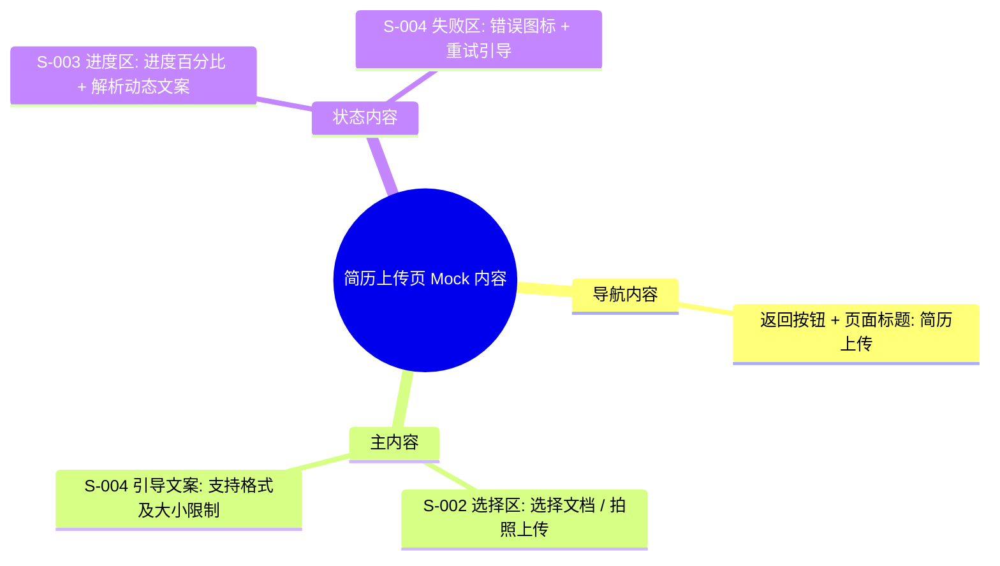

# 简历上传页 Mock Draft

> 输出路径：`product/development/mock/030-upload.md`。本文档只描述页面展示内容与 mock 数据，不描述交互执行、埋点、接口调用或业务执行逻辑。

# 简历上传页

## 0. Mock 文档状态

- 文档版本：Draft
- 生成日期：2026-05-12
- 来源页面文件：`product/release/pages/030-upload.md`
- 当前输出文件：`product/development/mock/030-upload.md`
- 页面名称：简历上传页
- 内容范围：页面展示内容 / mock 数据 / 多状态文案 / 静态或动态来源标注
- 不包含范围：交互动作执行、埋点逻辑、接口定义、业务处理逻辑
- 必须对照的来源表：
  - `页面布局与内容区块`
  - `页面元素清单`
  - `元素状态矩阵`
  - `交互 Action 与执行效果`
- Mock 假设 / 待确认编号规则：
  - Mock 假设：`MA-001` 起，按首次出现顺序递增。
  - Mock 待确认：`MQ-001` 起，按首次出现顺序递增。
  - 正文和表格中出现的每个 `MA-*` / `MQ-*` 必须在文档末尾统一清单中出现。

## 1. 页面内容概览

| 项目 | 内容 |
|---|---|
| 页面定位 | 简历优化的第一步，负责接收并解析用户的原始简历文件。 |
| 主要用户 | 准备优化简历的所有求职者。 |
| 核心展示目标 | 简单直观的上传引导，清晰的解析状态反馈。 |
| 内容语气 | 鼓励、简洁。 |
| 主要动态数据来源 | 状态切换 / 接口反馈 |

## 2. 来源对照矩阵

| 来源表 | 来源行ID | 来源名称 / 状态 / Action | 是否已映射 | 映射到 Mock 章节 | 映射对象ID | 未映射原因 | 相关 MA/MQ |
|---|---|---|---|---|---|---|---|
| 页面布局与内容区块 | S-001 | 导航栏 | 是 | 4. 区块级内容描述 | S-001 | | |
| 页面布局与内容区块 | S-002 | 上传选择区 | 是 | 4. 区块级内容描述 | S-002 | | |
| 页面布局与内容区块 | S-003 | 进度展示区 | 是 | 4. 区块级内容描述 | S-003 | | |
| 页面布局与内容区块 | S-004 | 失败反馈区 | 是 | 4. 区块级内容描述 | S-004 | | |
| 页面元素清单 | E-001 | 返回按钮 | 是 | 5. 元素内容清单 | E-001 | | |
| 页面元素清单 | E-002 | 文件上传卡片 | 是 | 5. 元素内容清单 | E-002 | | |
| 页面元素清单 | E-003 | 拍照上传卡片 | 是 | 5. 元素内容清单 | E-003 | | |
| 页面元素清单 | E-004 | 格式说明文案 | 是 | 5. 元素内容清单 | E-004 | | |
| 页面元素清单 | E-005 | 进度环/条 | 是 | 5. 元素内容清单 | E-005 | | |
| 页面元素清单 | E-006 | 解析状态文案 | 是 | 5. 元素内容清单 | E-006 | | |
| 页面元素清单 | E-007 | 错误提示图标 | 是 | 5. 元素内容清单 | E-007 | | |
| 页面元素清单 | E-008 | 重新上传按钮 | 是 | 5. 元素内容清单 | E-008 | | |
| 元素状态矩阵 | E-002 / 禁用 | 上传中禁用 | 是 | 8. 状态文案与内容差异 | STATE-001 | | MA-001 |
| 交互 Action 与执行效果 | ACT-003 | 文件上传中 | 是 | 9. Action 可见内容映射 | AM-001 | | |
| 交互 Action 与执行效果 | ACT-004 | 解析简历 | 是 | 9. Action 可见内容映射 | AM-002 | | |

## 3. 页面内容结构图

## 4. 区块级内容描述

| 区块ID | 来源区块ID | 区块名称 | 展示目的 | 主要内容 | 内容来源类型 | 动态来源说明 | 状态差异 | 相关 MA/MQ |
|---|---|---|---|---|---|---|---|---|
| S-001 | S-001 | 导航栏 | 页面标识与退出 | “简历上传”标题及返回图标 | 静态 | | | |
| S-002 | S-002 | 上传选择区 | 引导用户提供文件 | 文档上传卡片、拍照/相册上传卡片及说明文案 | 静态 | | 上传中隐藏 | |
| S-003 | S-003 | 进度展示区 | 缓解用户等待焦虑 | 动态进度数值、解析状态引导文案 | 动态 | 接口返回 / 状态 | 仅上传/解析中展示 | |
| S-004 | S-004 | 失败反馈区 | 引导用户错误处理 | 失败图标、报错信息及重新上传按钮 | 静态 | | 仅失败时展示 | |

## 5. 元素内容清单

| 元素ID | 来源元素ID | 元素名称 | 元素类型 | 所属区块 | 展示内容 | 内容来源类型 | 动态来源说明 | 默认状态内容 | 空状态内容 | 加载状态内容 | 错误状态内容 | 禁用 / 无权限内容 | 相关 MA/MQ |
|---|---|---|---|---|---|---|---|---|---|---|---|---|---|
| E-001 | E-001 | 返回按钮 | button | S-001 | < (左箭头图标) | 静态 | | 正常展示 | | | | | |
| E-002 | E-002 | 文件上传卡片 | button | S-002 | 选择文档 (PDF/DOCX) | 静态 | | 展示文档图标 + 引导语 | | | | 灰度显示 | |
| E-003 | E-003 | 拍照上传卡片 | button | S-002 | 拍照/相册上传 (OCR) | 静态 | | 展示相机图标 + 引导语 | | | | 灰度显示 | |
| E-004 | E-004 | 格式说明文案 | text | S-002 | 支持 PDF, DOCX, JPG, PNG (最大 20MB) | 静态 | | 支持格式说明 | | | | | |
| E-005 | E-005 | 进度环/条 | other | S-003 | [N]% | 动态 | 系统状态 | 不显示 | | 0% - 100% | | | |
| E-006 | E-006 | 解析状态文案 | text | S-003 | 正在通过 AI 深度解析您的简历... | 静态 | | 不显示 | | 正在解析... | | | |
| E-007 | E-007 | 错误提示图标 | image | S-004 | 红色叹号/报错插画 | 静态 | | 不显示 | | | 报错图标 | | |
| E-008 | E-008 | 重新上传按钮 | button | S-004 | 重新上传 | 静态 | | 不显示 | | | 重新上传按钮 | | |

## 6. 表单与选项 Mock 内容

> 本页面为文件选择模式，无字段表单。

## 7. 列表 / 卡片 / 表格 Mock 数据

> 本页面无列表/数据表内容。

## 8. 图片 / 音视频 / 多媒体内容

| 资源ID | 资源类型 | 使用位置 | 展示内容描述 | 替代文本 / 标题 | Caption / 说明文案 | 缩略图 / 封面描述 | 不同状态展示 | 内容来源类型 | 动态来源说明 | 相关 MA/MQ |
|---|---|---|---|---|---|---|---|---|---|---|
| M-001 | animation | S-003 | AI 神经网络扫描简历的动态波纹动画 | 正在解析 | 您的简历正由 AI 进行结构化提取 | | | 静态 | | |
| M-002 | icon | E-002 | Word/PDF 文件图标 | 文件上传 | | | | 静态 | | |
| M-003 | icon | E-003 | 相机图标 | 拍照/相册 | | | | 静态 | | |

## 9. 状态文案与内容差异

| 状态ID | 来源元素ID | 来源状态 | 状态类型 | 触发场景说明 | 页面展示文本 | 主要元素内容变化 | 图片 / 多媒体变化 | 用户可见提示 | 内容来源类型 | 动态来源说明 | 相关 MA/MQ |
|---|---|---|---|---|---|---|---|---|---|---|---|
| STATE-001 | E-002 | 禁用 | 禁用 | 正在上传或解析另一份文件时 | 正在处理中 | 按钮变灰，文字透明度降低 | 无 | Toast: 请等待当前文件处理完成 | 静态 | | MA-001 |
| STATE-002 | E-005 | 活跃 | 加载 | 文件传输过程中 | 已上传 [N]% | 进度环颜色填充 | 无 | | 动态 | 系统状态 | |
| STATE-003 | S-004 | 默认 | 错误 | 解析超时或文件损坏 | 简历解析失败，请确保文件内容清晰可见 | 出现 S-004 区块 | 出现 M-001 错误态 | Toast: 解析失败 | 静态 | | MA-002 |

## 10. Action 可见内容映射

| 映射ID | 来源ActionID | 触发元素ID | Action 名称 | 用户可见内容变化 | 成功可见文案 | 失败可见文案 | 跳转 / 弹窗 / Toast 展示内容 | 内容来源类型 | 动态来源说明 | 相关 MA/MQ |
|---|---|---|---|---|---|---|---|---|---|---|
| AM-001 | ACT-003 | API-001 | 文件上传中 | 出现进度条 | 上传成功 | 上传失败 | Toast: 上传成功，即将开始解析 | 静态 | | |
| AM-002 | ACT-004 | API-002 | 解析简历 | 出现 AI 解析动画 | 解析成功 | 解析失败 | 页面跳转至岗位设置页 | 静态 | | |

## 11. 内容来源汇总

| 内容对象 | 静态内容 | 动态内容 | 动态来源说明 | 是否需要用户确认 |
|---|---|---|---|---|
| 页面标题 | 简历上传 | | | 否 |
| 上传按钮文案 | 选择文档 (PDF/DOCX)、拍照/相册上传 (OCR) | | | 否 |
| 解析引导语 | 正在通过 AI 深度解析您的简历... | | | 否 |
| 进度文字 | | [N]% | 系统状态 | 否 |
| 失败文案 | 简历解析失败，请确保文件内容清晰可见 | | | 否 |

## 12. Mock 假设与待确认统一清单

### 12.1 Mock 假设清单

| 假设ID | 假设内容 | 首次出现位置 | 影响范围 | 影响区块 / 元素 / 内容对象 | 置信度 | 用户确认状态 | Release 处理方式 |
|---|---|---|---|---|---|---|---|
| MA-001 | 假设解析中再次点击上传按钮的提示为“请等待当前文件处理完成”。 | 9. 状态文案与内容差异 | 文案 | STATE-001 | 中 | 确认 | 确认为正式内容 |
| MA-002 | 假设解析失败的兜底提示文案为“简历解析失败，请确保文件内容清晰可见”。 | 9. 状态文案与内容差异 | 文案 | STATE-003 | 高 | 确认 | 确认为正式内容 |

### 12.2 Mock 待确认清单

| 待确认ID | 待确认问题 | 首次出现位置 | 影响范围 | 影响区块 / 元素 / 内容对象 | 优先级 | 用户确认结果 | Release 处理方式 |
|---|---|---|---|---|---|---|---|
| MQ-001 | 在解析中状态下，是否需要展示已提取的部分关键信息（如姓名、联系方式）作为预览？ | 4. 区块级内容描述 | 内容 | S-003 | 中 | 确认 | 暂不展示，保持简洁 |
