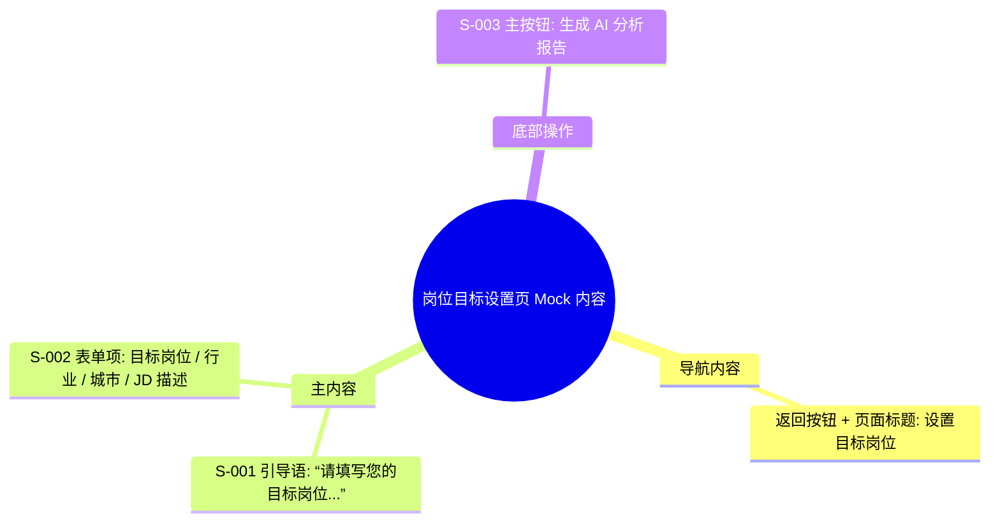

# 岗位目标设置页 Mock Draft

> 输出路径：`product/development/mock/040-target-job.md`。本文档只描述页面展示内容与 mock 数据，不描述交互执行、埋点、接口调用或业务执行逻辑。

# 岗位目标设置页

## 0. Mock 文档状态

- 文档版本：Draft
- 生成日期：2026-05-12
- 来源页面文件：`product/release/pages/040-target-job.md`
- 当前输出文件：`product/development/mock/040-target-job.md`
- 页面名称：岗位目标设置页
- 内容范围：页面展示内容 / mock 数据 / 多状态文案 / 静态或动态来源标注
- 不包含范围：交互动作执行、埋点逻辑、接口定义、业务处理逻辑
- 必须对照的来源表：
  - `页面布局与内容区块`
  - `页面元素清单`
  - `元素状态矩阵`
  - `交互 Action 与执行效果`
- Mock 假设 / 待确认编号规则：
  - Mock 假设：`MA-001` 起，按首次出现顺序递增。
  - Mock 待确认：`MQ-001` 起，按首次出现顺序递增。
  - 正文和表格中出现的每个 `MA-*` / `MQ-*` 必须在文档末尾统一清单中出现。

## 1. 页面内容概览

| 项目 | 内容 |
|---|---|
| 页面定位 | 收集用户的求职意向，为 AI 分析提供对比标准。 |
| 主要用户 | 已上传简历并准备进行 AI 优化的用户。 |
| 核心展示目标 | 简洁、清晰的表单输入，引导用户输入准确的岗位信息。 |
| 内容语气 | 专业、中性。 |
| 主要动态数据来源 | 接口返回 / 用户输入 |

## 2. 来源对照矩阵

| 来源表 | 来源行ID | 来源名称 / 状态 / Action | 是否已映射 | 映射到 Mock 章节 | 映射对象ID | 未映射原因 | 相关 MA/MQ |
|---|---|---|---|---|---|---|---|
| 页面布局与内容区块 | S-001 | 引导说明区 | 是 | 4. 区块级内容描述 | S-001 | | |
| 页面布局与内容区块 | S-002 | 核心意向表单 | 是 | 4. 区块级内容描述 | S-002 | | |
| 页面布局与内容区块 | S-003 | 底部操作区 | 是 | 4. 区块级内容描述 | S-003 | | |
| 页面元素清单 | E-001 | 说明文案 | 是 | 5. 元素内容清单 | E-001 | | |
| 页面元素清单 | E-002 | 目标岗位输入 | 是 | 5. 元素内容清单 | E-002 | | |
| 页面元素清单 | E-003 | 行业选择器 | 是 | 5. 元素内容清单 | E-003 | | |
| 页面元素清单 | E-004 | 期望城市 | 是 | 5. 元素内容清单 | E-004 | | |
| 页面元素清单 | E-005 | JD 职位描述 | 是 | 5. 元素内容清单 | E-005 | | |
| 页面元素清单 | E-006 | 生成分析按钮 | 是 | 5. 元素内容清单 | E-006 | | |
| 元素状态矩阵 | E-006 / 禁用 | 未填必填项 | 是 | 8. 状态文案与内容差异 | STATE-001 | | MA-001 |
| 交互 Action 与执行效果 | ACT-002 | 选择行业 | 是 | 6. 表单与选项 Mock 内容 | FORM-001 | | MA-002 |

## 3. 页面内容结构图

## 4. 区块级内容描述

| 区块ID | 来源区块ID | 区块名称 | 展示目的 | 主要内容 | 内容来源类型 | 动态来源说明 | 状态差异 | 相关 MA/MQ |
|---|---|---|---|---|---|---|---|---|
| S-001 | S-001 | 引导说明区 | 告知用户操作目的 | “请填写您的目标岗位...”引导语 | 静态 | | | |
| S-002 | S-002 | 核心意向表单 | 收集岗位参数 | 目标岗位、所属行业、期望城市、JD/要求文本域 | 动态 | 用户输入 / 接口返回 | 必填项缺失提示 | |
| S-003 | S-003 | 底部操作区 | 触发 AI 计算 | “生成 AI 分析报告”按钮 | 静态 | | 禁用态 / 加载态 | |

## 5. 元素内容清单

| 元素ID | 来源元素ID | 元素名称 | 元素类型 | 所属区块 | 展示内容 | 内容来源类型 | 动态来源说明 | 默认状态内容 | 空状态内容 | 加载状态内容 | 错误状态内容 | 禁用 / 无权限内容 | 相关 MA/MQ |
|---|---|---|---|---|---|---|---|---|---|---|---|---|---|
| E-001 | E-001 | 说明文案 | text | S-001 | 请填写您的目标岗位，AI 将为您进行精准匹配分析 | 静态 | | 正常展示 | | | | | |
| E-002 | E-002 | 目标岗位输入 | input | S-002 | 文本输入 | 动态 | 用户输入 | 占位符: 如：产品经理 | | | 边框红色 | | |
| E-003 | E-003 | 行业选择器 | select | S-002 | 行业名称 | 动态 | 接口返回 | 占位符: 请选择行业 | | | | | |
| E-004 | E-004 | 期望城市 | input | S-002 | 城市名称 | 动态 | 接口返回 | 占位符: 请选择城市 | | | | | |
| E-005 | E-005 | JD 职位描述 | textarea | S-002 | 长文本 | 动态 | 用户输入 | 占位符: 粘贴目标岗位的 JD 信息或补充特殊要求 | | | | | |
| E-006 | E-006 | 生成分析按钮 | button | S-003 | 生成 AI 分析报告 | 静态 | | 正常按钮 | | 正在生成中，请稍候 | | 灰色按钮 | |

## 6. 表单与选项 Mock 内容

| 表单ID | 字段 / 控件ID | 字段名称 | 控件类型 | Label 文案 | Placeholder / 默认值 | 选项内容 | 帮助说明 | 校验提示展示文案 | 内容来源类型 | 动态来源说明 | 相关 MA/MQ |
|---|---|---|---|---|---|---|---|---|---|---|---|
| FORM-001 | E-002 | 目标岗位 | input | 目标岗位 | 如：产品经理 | | 必填 | 请输入目标岗位 | 动态 | 用户输入 | |
| FORM-001 | E-003 | 行业 | select | 所属行业 | 请选择行业 | 互联网 / 移动互联网, 金融, 电子商务, 教育, 医疗健康, 其他 | 必填 | 请选择所属行业 | 动态 | 接口返回 | MA-002 |
| FORM-001 | E-004 | 城市 | input | 期望城市 | 请选择城市 | 北京, 上海, 广州, 深圳, 杭州, 成都, 西安 | | | 动态 | 接口返回 | |
| FORM-001 | E-005 | JD 描述 | textarea | 职位描述 (选填) | 粘贴目标岗位的 JD 信息... | | 选填，提供 JD 分析更精准 | | 动态 | 用户输入 | |

## 7. 列表 / 卡片 / 表格 Mock 数据

> 本页面无列表展示。

## 8. 图片 / 音视频 / 多媒体内容

| 资源ID | 资源类型 | 使用位置 | 展示内容描述 | 替代文本 / 标题 | Caption / 说明文案 | 缩略图 / 封面描述 | 不同状态展示 | 内容来源类型 | 动态来源说明 | 相关 MA/MQ |
|---|---|---|---|---|---|---|---|---|---|---|
| M-001 | icon | E-002 | 搜索放大镜图标 | 搜索 | | | | 静态 | | |

## 9. 状态文案与内容差异

| 状态ID | 来源元素ID | 来源状态 | 状态类型 | 触发场景说明 | 页面展示文本 | 主要元素内容变化 | 图片 / 多媒体变化 | 用户可见提示 | 内容来源类型 | 动态来源说明 | 相关 MA/MQ |
|---|---|---|---|---|---|---|---|---|---|---|---|
| STATE-001 | E-006 | 禁用 | 禁用 | 目标岗位或行业为空时 | 生成 AI 分析报告 | 按钮变灰，不可点击 | 无 | 请填写目标岗位和行业 | 静态 | | MA-001 |
| STATE-002 | E-006 | 加载中 | 加载 | 点击提交后正在计算 | 正在生成中，请稍候 | 按钮文字变化 + 菊花转动 | 无 | | 静态 | | |

## 10. Action 可见内容映射

| 映射ID | 来源ActionID | 触发元素ID | Action 名称 | 用户可见内容变化 | 成功可见文案 | 失败可见文案 | 跳转 / 弹窗 / Toast 展示内容 | 内容来源类型 | 动态来源说明 | 相关 MA/MQ |
|---|---|---|---|---|---|---|---|---|---|---|
| AM-001 | ACT-001 | E-006 | 提交岗位目标 | 进入加载态 | | 提交失败 | Toast: 提交失败，请重试 | 静态 | | |
| AM-002 | ACT-002 | E-003 | 选择行业 | 弹出行业选择列表 | 已选择：[行业名] | | 底部弹出层 | 动态 | 接口返回 | |

## 11. 内容来源汇总

| 内容对象 | 静态内容 | 动态内容 | 动态来源说明 | 是否需要用户确认 |
|---|---|---|---|---|
| 引导文案 | 请填写您的目标岗位，AI 将为您进行精准匹配分析 | | | 否 |
| 表单 Label | 目标岗位、所属行业、期望城市、职位描述 (选填) | | | 否 |
| 行业选项 | | [互联网, 金融, ...] | 接口返回 | 是 |
| 城市选项 | | [北京, 上海, ...] | 接口返回 | 是 |
| 提交按钮 | 生成 AI 分析报告 | | | 否 |

## 12. Mock 假设与待确认统一清单

### 12.1 Mock 假设清单

| 假设ID | 假设内容 | 首次出现位置 | 影响范围 | 影响区块 / 元素 / 内容对象 | 置信度 | 用户确认状态 | Release 处理方式 |
|---|---|---|---|---|---|---|---|
| MA-001 | 假设表单未填满时点击按钮的 Toast 提示为“请填写目标岗位和行业”。 | 9. 状态文案与内容差异 | 文案 | STATE-001 | 高 | 确认 | 确认为正式内容 |
| MA-002 | 假设行业选择器的 mock 选项包含互联网、金融、电商、教育、医疗等主流行业。 | 6. 表单与选项 Mock 内容 | 选项 | FORM-001 | 高 | 确认 | 确认为正式内容 |

### 12.2 Mock 待确认清单

| 待确认ID | 待确认问题 | 首次出现位置 | 影响范围 | 影响区块 / 元素 / 内容对象 | 优先级 | 用户确认结果 | Release 处理方式 |
|---|---|---|---|---|---|---|---|
| MQ-001 | 是否需要支持“智能识别粘贴的整段 JD”并自动提取岗位名称和行业？ | 4. 区块级内容描述 | 功能内容 | S-002 | 中 | 确认 | 暂不支持，仅作为文本参考 |
