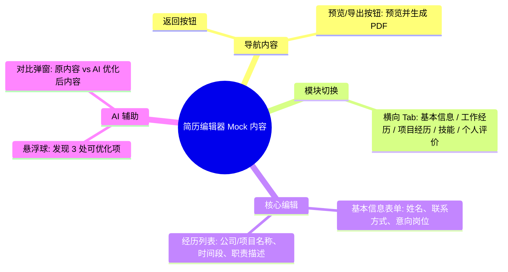

# 简历编辑器 Mock Draft

> 输出路径：`product/development/mock/060-editor.md`。本文档只描述页面展示内容与 mock 数据，不描述交互执行、埋点、接口调用或业务执行逻辑。

# 简历编辑器

## 0. Mock 文档状态

- 文档版本：Draft
- 生成日期：2026-05-12
- 来源页面文件：`product/release/pages/060-editor.md`
- 当前输出文件：`product/development/mock/060-editor.md`
- 页面名称：简历编辑器
- 内容范围：页面展示内容 / mock 数据 / 多状态文案 / 静态或动态来源标注
- 不包含范围：交互动作执行、埋点逻辑、接口定义、业务处理逻辑
- 必须对照的来源表：
  - `页面布局与内容区块`
  - `页面元素清单`
  - `元素状态矩阵`
  - `交互 Action 与执行效果`
- Mock 假设 / 待确认编号规则：
  - Mock 假设：`MA-001` 起，按首次出现顺序递增。
  - Mock 待确认：`MQ-001` 起，按首次出现顺序递增。
  - 正文和表格中出现的每个 `MA-*` / `MQ-*` 必须在文档末尾统一清单中出现。

## 1. 页面内容概览

| 项目 | 内容 |
|---|---|
| 页面定位 | 核心简历编辑工具，集成 AI 建议对比与实时保存功能。 |
| 主要用户 | 需要根据 AI 建议或手动修改简历内容的用户。 |
| 核心展示目标 | 结构化展示简历模块，提供便捷的 AI 建议对比与采纳入口。 |
| 内容语气 | 专业、辅助、高效。 |
| 主要动态数据来源 | 接口返回 (简历详情、AI 建议) |

## 2. 来源对照矩阵

| 来源表 | 来源行ID | 来源名称 / 状态 / Action | 是否已映射 | 映射到 Mock 章节 | 映射对象ID | 未映射原因 | 相关 MA/MQ |
|---|---|---|---|---|---|---|---|
| 页面布局与内容区块 | S-001 | 顶部操作区 | 是 | 4. 区块级内容描述 | S-001 | | |
| 页面布局与内容区块 | S-002 | 模块切换区 | 是 | 4. 区块级内容描述 | S-002 | | |
| 页面布局与内容区块 | S-003 | 动态表单区 | 是 | 4. 区块级内容描述 | S-003 | | |
| 页面布局与内容区块 | S-004 | AI 建议浮窗 | 是 | 4. 区块级内容描述 | S-004 | | |
| 页面布局与内容区块 | S-005 | 底部操作区 | 是 | 4. 区块级内容描述 | S-005 | | |
| 页面元素清单 | E-001 | 返回按钮 | 是 | 5. 元素内容清单 | E-001 | | |
| 页面元素清单 | E-002 | 导出预览按钮 | 是 | 5. 元素内容清单 | E-002 | | |
| 页面元素清单 | E-003 | 模块切换 Tab | 是 | 5. 元素内容清单 | E-003 | | |
| 页面元素清单 | E-004 | 表单容器 | 是 | 5. 元素内容清单 | E-004 | | |
| 页面元素清单 | E-005 | AI 优化悬浮球 | 是 | 5. 元素内容清单 | E-005 | | |
| 页面元素清单 | E-006 | 建议对比弹窗 | 是 | 5. 元素内容清单 | E-006 | | |
| 页面元素清单 | E-007 | 保存状态文案 | 是 | 5. 元素内容清单 | E-007 | | |
| 元素状态矩阵 | E-005 / 呼吸态 | 发现优化项 | 是 | 8. 状态文案与内容差异 | STATE-001 | | |
| 交互 Action 与执行效果 | ACT-002 | 打开 AI 对比 | 是 | 10. Action 可见内容映射 | AM-001 | | |

## 3. 页面内容结构图

## 4. 区块级内容描述

| 区块ID | 来源区块ID | 区块名称 | 展示目的 | 主要内容 | 内容来源类型 | 动态来源说明 | 状态差异 | 相关 MA/MQ |
|---|---|---|---|---|---|---|---|---|
| S-001 | S-001 | 顶部操作区 | 退出与提交 | “预览/导出”按钮及返回图标 | 静态 | | | |
| S-002 | S-002 | 模块切换区 | 快速定位编辑模块 | 简历各版块 Tab 导航 | 静态 | | 活跃态高亮 | |
| S-003 | S-003 | 动态表单区 | 输入/修改简历内容 | 包含姓名、电话、邮箱、经历列表等动态表单 | 动态 | 接口返回 / 用户输入 | | |
| S-004 | S-004 | AI 建议浮窗 | 辅助优化内容 | 悬浮球提示及对比弹窗 | 动态 | 接口返回 (建议数据) | 仅在有建议时展示 | |
| S-005 | S-005 | 底部操作区 | 状态反馈 | “已自动保存”或“保存中”文案 | 动态 | 系统状态 | | |

## 5. 元素内容清单

| 元素ID | 来源元素ID | 元素名称 | 元素类型 | 所属区块 | 展示内容 | 内容来源类型 | 动态来源说明 | 默认状态内容 | 空状态内容 | 加载状态内容 | 错误状态内容 | 禁用 / 无权限内容 | 相关 MA/MQ |
|---|---|---|---|---|---|---|---|---|---|---|---|---|---|
| E-001 | E-001 | 返回按钮 | button | S-001 | < (左箭头) | 静态 | | 正常展示 | | | | | |
| E-002 | E-002 | 导出预览按钮 | button | S-001 | 预览/导出 | 静态 | | 品牌色按钮 | | | | | |
| E-003 | E-003 | 模块切换 Tab | nav | S-002 | 基本信息 / 工作经历 / 项目经历 / 教育经历 / 技能特长 | 静态 | | 基本信息 (选中) | | | | | |
| E-004 | E-004 | 表单容器 | group | S-003 | 动态生成的表单项 (见章节 6) | 动态 | 接口返回 | 渲染各模块表单 | | | 校验失败红框 | | |
| E-005 | E-005 | AI 优化悬浮球 | button | S-004 | AI 机器人图标 + “发现 3 处可优化项” | 动态 | 接口返回 | 不显示 (无建议) | | | | | |
| E-006 | E-006 | 建议对比弹窗 | modal | S-004 | “AI 建议对比”标题 + 左右分栏内容 | 动态 | 接口返回 | 展示对比详情 | | | | | |
| E-007 | E-007 | 保存状态文案 | text | S-005 | 已自动保存 | 动态 | 系统状态 | 已自动保存 | | 正在保存... | 保存失败 | | |

## 6. 表单与选项 Mock 内容

| 表单ID | 字段 / 控件ID | 字段名称 | 控件类型 | Label 文案 | Placeholder / 默认值 | 选项内容 | 帮助说明 | 校验提示展示文案 | 内容来源类型 | 动态来源说明 | 相关 MA/MQ |
|---|---|---|---|---|---|---|---|---|---|---|---|
| FORM-001 | BASIC-001 | 姓名 | input | 姓名 | 张三 | | 必填 | 请输入真实姓名 | 动态 | 接口返回 | |
| FORM-001 | BASIC-002 | 邮箱 | input | 邮箱 | zhangsan@example.com | | 必填 | 邮箱格式不正确 | 动态 | 接口返回 | |
| FORM-002 | WORK-001 | 公司名称 | input | 公司名称 | 某某互联网科技有限公司 | | 必填 | | 动态 | 接口返回 | |
| FORM-002 | WORK-002 | 工作职责 | textarea | 工作职责 | 负责 XX 产品的核心模块开发... | | 建议包含量化指标 | 请输入工作职责 | 动态 | 接口返回 | |

## 7. 列表 / 卡片 / 表格 Mock 数据

| 数据组ID | 展示组件ID | 数据项名称 | Mock 数据条目 | 字段展示文案 | 内容来源类型 | 动态来源说明 | 空状态替代内容 | 相关 MA/MQ |
|---|---|---|---|---|---|---|---|---|
| DATA-001 | E-004 | 工作经历列表 | 1. 2022.03 - 至今 | [公司名] - [职位名] | 动态 | 接口返回 | 点击“添加经历” | |
| DATA-001 | E-004 | | 2. 2020.07 - 2022.02 | [公司名] - [职位名] | 动态 | 接口返回 | | |

## 8. 图片 / 音视频 / 多媒体内容

| 资源ID | 资源类型 | 使用位置 | 展示内容描述 | 替代文本 / 标题 | Caption / 说明文案 | 缩略图 / 封面描述 | 不同状态展示 | 内容来源类型 | 动态来源说明 | 相关 MA/MQ |
|---|---|---|---|---|---|---|---|---|---|---|
| M-001 | icon | E-005 | 蓝紫色渐变 AI 机器人头图标 | AI 助手 | 发现优化建议 | | 呼吸动画 | 静态 | | |
| M-002 | icon | S-001 | 分享/预览图标 | 预览 | | | | 静态 | | |

## 9. 状态文案与内容差异

| 状态ID | 来源元素ID | 来源状态 | 状态类型 | 触发场景说明 | 页面展示文本 | 主要元素内容变化 | 图片 / 多媒体变化 | 用户可见提示 | 内容来源类型 | 动态来源说明 | 相关 MA/MQ |
|---|---|---|---|---|---|---|---|---|---|---|---|
| STATE-001 | E-005 | 呼吸态 | 加载 | 检测到内容可优化时 | 发现 [N] 处可优化项 | 悬浮球带有微光边缘 | 缩放动画 | 浮窗提示 | 静态 | | MA-001 |
| STATE-002 | E-007 | 保存中 | 加载 | 正在同步数据到云端 | 正在保存... | 文字变色 | 无 | | 静态 | | |
| STATE-003 | E-004 | 校验失败 | 错误 | 输入项不符合格式且失焦 | 请检查输入格式是否正确 | 输入框边框变红 | 无 | 红字气泡 | 静态 | | |

## 10. Action 可见内容映射

| 映射ID | 来源ActionID | 触发元素ID | Action 名称 | 用户可见内容变化 | 成功可见文案 | 失败可见文案 | 跳转 / 弹窗 / Toast 展示内容 | 内容来源类型 | 动态来源说明 | 相关 MA/MQ |
|---|---|---|---|---|---|---|---|---|---|---|
| AM-001 | ACT-002 | E-005 | 打开 AI 对比 | 弹出对比弹窗 | | | 弹窗展示 Suggestion | 动态 | 接口返回 | |
| AM-002 | ACT-003 | E-006 | 采纳 AI 建议 | 原文案被新文案替换 | 已采纳 | 采纳失败 | Toast: 内容已更新 | 静态 | | MA-002 |
| AM-003 | ACT-004 | E-002 | 进入导出预览 | 无 | | 校验未通过 | Toast: 请完善简历必填项 | 静态 | | |

## 11. 内容来源汇总

| 内容对象 | 静态内容 | 动态内容 | 动态来源说明 | 是否需要用户确认 |
|---|---|---|---|---|
| Tab 导航 | 基本信息、工作经历、项目经历... | | | 否 |
| 表单 Label | 姓名、电话、邮箱、公司名、职责描述 | | | 否 |
| 简历详情 | | [张三, 138..., 工作描述] | 接口返回 | 是 |
| AI 建议 | | [原文, 优化建议文案] | 接口返回 | 是 |
| 保存状态 | 已自动保存 | 正在保存... | 系统状态 | 否 |

## 12. Mock 假设与待确认统一清单

### 12.1 Mock 假设清单

| 假设ID | 假设内容 | 首次出现位置 | 影响范围 | 影响区块 / 元素 / 内容对象 | 置信度 | 用户确认状态 | Release 处理方式 |
|---|---|---|---|---|---|---|---|
| MA-001 | 假设悬浮球在有建议时的提示语为“发现 [N] 处可优化项”。 | 9. 状态文案与内容差异 | 文案 | STATE-001 | 高 | 确认 | 确认为正式内容 |
| MA-002 | 假设采纳 AI 建议成功后的 Toast 反馈为“内容已更新”。 | 10. Action 可见内容映射 | 文案 | AM-002 | 中 | 确认 | 确认为正式内容 |

### 12.2 Mock 待确认清单

| 待确认ID | 待确认问题 | 首次出现位置 | 影响范围 | 影响区块 / 元素 / 内容对象 | 优先级 | 用户确认结果 | Release 处理方式 |
|---|---|---|---|---|---|---|---|
| MQ-001 | 编辑器是否需要支持“撤销/重做 (Undo/Redo)”功能及其对应的可见文案？ | 2. 页面结构思维导图 | 功能内容 | 顶部操作区 | 低 | 确认 | 暂不支持 |
