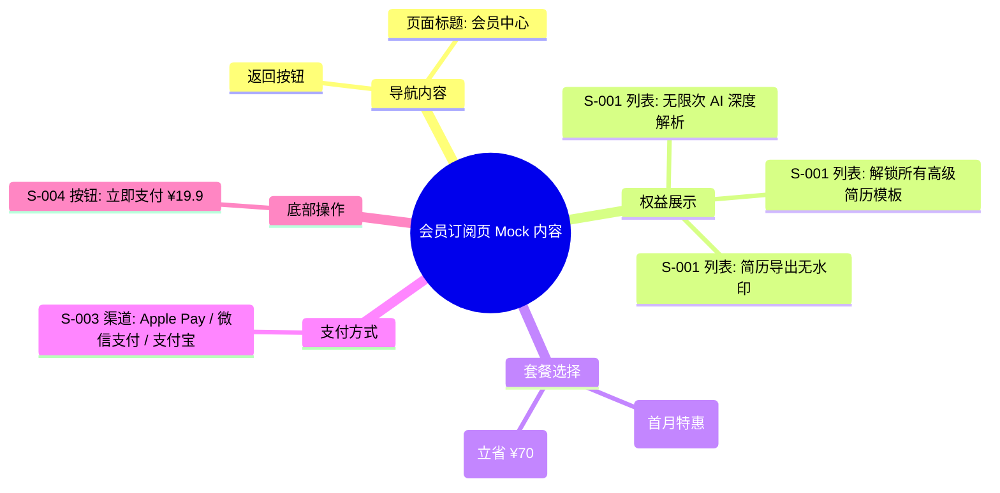

# 会员订阅页 Mock Draft

> 输出路径：`product/development/mock/090-vip-subscription.md`。本文档只描述页面展示内容与 mock 数据，不描述交互执行、埋点、接口调用或业务执行逻辑。

# 会员订阅页

## 0. Mock 文档状态

- 文档版本：Draft
- 生成日期：2026-05-12
- 来源页面文件：`product/release/pages/090-vip-subscription.md`
- 当前输出文件：`product/development/mock/090-vip-subscription.md`
- 页面名称：会员订阅页
- 内容范围：页面展示内容 / mock 数据 / 多状态文案 / 静态或动态来源标注
- 不包含范围：交互动作执行、埋点逻辑、接口定义、业务处理逻辑
- 必须对照的来源表：
  - `页面布局与内容区块`
  - `页面元素清单`
  - `元素状态矩阵`
  - `交互 Action 与执行效果`
- Mock 假设 / 待确认编号规则：
  - Mock 假设：`MA-001` 起，按首次出现顺序递增。
  - Mock 待确认：`MQ-001` 起，按首次出现顺序递增。
  - 正文和表格中出现的每个 `MA-*` / `MQ-*` 必须在文档末尾统一清单中出现。

## 1. 页面内容概览

| 项目 | 内容 |
|---|---|
| 页面定位 | 核心商业化页面，展示 VIP 权益并提供购买入口。 |
| 主要用户 | 需要解锁高级功能（无限分析、高级模板）的用户。 |
| 核心展示目标 | 极具吸引力的权益展示，清晰的计费模式，便捷的支付流程。 |
| 内容语气 | 尊贵、诱人、可靠。 |
| 主要动态数据来源 | 接口返回 (套餐价格、用户当前状态) |

## 2. 来源对照矩阵

| 来源表 | 来源行ID | 来源名称 / 状态 / Action | 是否已映射 | 映射到 Mock 章节 | 映射对象ID | 未映射原因 | 相关 MA/MQ |
|---|---|---|---|---|---|---|---|
| 页面布局与内容区块 | S-001 | 权益展示区 | 是 | 4. 区块级内容描述 | S-001 | | |
| 页面布局与内容区块 | S-002 | 套餐选择区 | 是 | 4. 区块级内容描述 | S-002 | | |
| 页面布局与内容区块 | S-003 | 支付方式区 | 是 | 4. 区块级内容描述 | S-003 | | |
| 页面布局与内容区块 | S-004 | 底部操作区 | 是 | 4. 区块级内容描述 | S-004 | | |
| 页面元素清单 | E-001 | 权益列表 | 是 | 5. 元素内容清单 | E-001 | | |
| 页面元素清单 | E-002 | 月度套餐卡片 | 是 | 5. 元素内容清单 | E-002 | | |
| 页面元素清单 | E-003 | 年度套餐卡片 | 是 | 5. 元素内容清单 | E-003 | | |
| 页面元素清单 | E-004 | 支付方式选择 | 是 | 5. 元素内容清单 | E-004 | | |
| 页面元素清单 | E-005 | 立即支付按钮 | 是 | 5. 元素内容清单 | E-005 | | |
| 元素状态矩阵 | E-005 / 支付中 | 支付 Loading | 是 | 9. 状态文案与内容差异 | STATE-001 | | MA-001 |
| 交互 Action 与执行效果 | ACT-003 | 支付完成 | 是 | 10. Action 可见内容映射 | AM-001 | | MA-002 |

## 3. 页面内容结构图

## 4. 区块级内容描述

| 区块ID | 来源区块ID | 区块名称 | 展示目的 | 主要内容 | 内容来源类型 | 动态来源说明 | 状态差异 | 相关 MA/MQ |
|---|---|---|---|---|---|---|---|---|
| S-001 | S-001 | 权益展示区 | 建立产品价值感知 | VIP 核心特权图标与文案说明 | 静态 | | | |
| S-002 | S-002 | 套餐选择区 | 供用户选择付费方案 | 不同周期的会员套餐卡片，包含原价/现价 | 动态 | 接口返回 | 选中态高亮 | |
| S-003 | S-003 | 支付方式区 | 选择支付工具 | 支付渠道列表及单选状态 | 静态 | | | |
| S-004 | S-004 | 底部操作区 | 触发支付流程 | 支付总金额显示及“立即支付”按钮 | 动态 | 套餐关联 | 支付中状态 | |

## 5. 元素内容清单

| 元素ID | 来源元素ID | 元素名称 | 元素类型 | 所属区块 | 展示内容 | 内容来源类型 | 动态来源说明 | 默认状态内容 | 空状态内容 | 加载状态内容 | 错误状态内容 | 禁用 / 无权限内容 | 相关 MA/MQ |
|---|---|---|---|---|---|---|---|---|---|---|---|---|---|
| E-001 | E-001 | 权益列表 | list | S-001 | 图标 + 特权文案 | 静态 | | 包含“无限分析”等三项 | | | | | |
| E-002 | E-002 | 月度套餐卡片 | button | S-002 | 连续包月 ¥19.9 | 动态 | 接口返回 | 展示“月”标及价格 | | | | | |
| E-003 | E-003 | 年度套餐卡片 | button | S-002 | 年度会员 ¥168 | 动态 | 接口返回 | 展示“年”标及价格 | | | | | |
| E-004 | E-004 | 支付方式选择 | radio | S-003 | 渠道图标 + 名称 | 静态 | | Apple Pay (默认) | | | | | |
| E-005 | E-005 | 立即支付按钮 | button | S-004 | 立即支付 ¥[Price] | 动态 | 套餐关联 | 品牌色长按钮 | | 支付处理中... | | | |

## 6. 表单与选项 Mock 内容

| 表单ID | 字段 / 控件ID | 字段名称 | 控件类型 | Label 文案 | Placeholder / 默认值 | 选项内容 | 帮助说明 | 校验提示展示文案 | 内容来源类型 | 动态来源说明 | 相关 MA/MQ |
|---|---|---|---|---|---|---|---|---|---|---|---|
| FORM-001 | PAY-001 | 支付方式 | radio | 支付方式 | Apple Pay | Apple Pay, 微信支付, 支付宝 | iOS 端优先 Apple Pay | 请选择支付方式 | 静态 | | |

## 7. 列表 / 卡片 / 表格 Mock 数据

| 数据组ID | 展示组件ID | 数据项名称 | Mock 数据条目 | 字段展示文案 | 内容来源类型 | 动态来源说明 | 空状态替代内容 | 相关 MA/MQ |
|---|---|---|---|---|---|---|---|---|
| DATA-001 | E-001 | 核心权益 | 1. 无限次 AI 分析 | 每天不限次数生成分析报告 | 静态 | | | |
| DATA-001 | E-001 | | 2. 高级模板库 | 免费使用所有黑金/商务模板 | 静态 | | | |
| DATA-001 | E-001 | | 3. 专属导出 | 导出高清 PDF，无任何水印 | 静态 | | | |

## 8. 图片 / 音视频 / 多媒体内容

| 资源ID | 资源类型 | 使用位置 | 展示内容描述 | 替代文本 / 标题 | Caption / 说明文案 | 缩略图 / 封面描述 | 不同状态展示 | 内容来源类型 | 动态来源说明 | 相关 MA/MQ |
|---|---|---|---|---|---|---|---|---|---|---|
| M-001 | image | S-001 | 黑金质感的会员卡片背景图 | VIP 会员 | 尊享 AI 优化全功能 | | | 静态 | | |
| M-002 | icon | S-003 | 支付渠道图标 (Apple/WeChat/Ali) | 支付方式 | | | | 静态 | | |

## 9. 状态文案与内容差异

| 状态ID | 来源元素ID | 来源状态 | 状态类型 | 触发场景说明 | 页面展示文本 | 主要元素内容变化 | 图片 / 多媒体变化 | 用户可见提示 | 内容来源类型 | 动态来源说明 | 相关 MA/MQ |
|---|---|---|---|---|---|---|---|---|---|---|---|
| STATE-001 | E-005 | 支付中 | 加载 | 调起支付 SDK 后 | 支付处理中... | 按钮禁用，文案改变 | 无 | 系统支付弹窗已弹出 | 静态 | | MA-001 |
| STATE-002 | E-002 | 选中态 | 活跃 | 默认或点击月度套餐 | 连续包月 ¥19.9 | 卡片边框加粗/变色 | 无 | | 静态 | | |

## 10. Action 可见内容映射

| 映射ID | 来源ActionID | 触发元素ID | Action 名称 | 用户可见内容变化 | 成功可见文案 | 失败可见文案 | 跳转 / 弹窗 / Toast 展示内容 | 内容来源类型 | 动态来源说明 | 相关 MA/MQ |
|---|---|---|---|---|---|---|---|---|---|---|
| AM-001 | ACT-003 | SDK | 支付完成 | 回跳个人中心 | 支付成功 | 支付失败 | Toast: 恭喜，您已成为 VIP 会员 | 静态 | | MA-002 |
| AM-002 | ACT-001 | E-003 | 切换至年度 | 底部按钮价格更新 | | | 底部价格变为 ¥168 | 静态 | | |

## 11. 内容来源汇总

| 内容对象 | 静态内容 | 动态内容 | 动态来源说明 | 是否需要用户确认 |
|---|---|---|---|---|
| 权益标题 | 无限次 AI 分析、高级模板库、专属导出 | | | 否 |
| 月度价格 | | ¥19.9 | 接口返回 | 否 |
| 年度价格 | | ¥168 | 接口返回 | 否 |
| 按钮文案 | 立即支付 | | | 否 |
| 失败提示 | 支付已取消 / 支付遇到问题 | | | 否 |

## 12. Mock 假设 with 待确认统一清单

### 12.1 Mock 假设清单

| 假设ID | 假设内容 | 首次出现位置 | 影响范围 | 影响区块 / 元素 / 内容对象 | 置信度 | 用户确认状态 | Release 处理方式 |
|---|---|---|---|---|---|---|---|
| MA-001 | 假设支付中的 Loading 文案展示在支付按钮上，内容为“支付处理中...”。 | 9. 状态文案与内容差异 | 文案 | STATE-001 | 高 | 确认 | 确认为正式内容 |
| MA-002 | 假设支付成功后的全局反馈 Toast 为“恭喜，您已成为 VIP 会员”。 | 10. Action 可见内容映射 | 文案 | AM-001 | 高 | 确认 | 确认为正式内容 |

### 12.2 Mock 待确认清单

| 待确认ID | 待确认问题 | 首次出现位置 | 影响范围 | 影响区块 / 元素 / 内容对象 | 优先级 | 用户确认结果 | Release 处理方式 |
|---|---|---|---|---|---|---|---|
| MQ-001 | 是否需要展示“会员连续包月协议”及“隐私政策”勾选框？ | 4. 区块级内容描述 | 内容合规 | S-004 | 高 | 确认 | 必须展示，默认勾选 |
