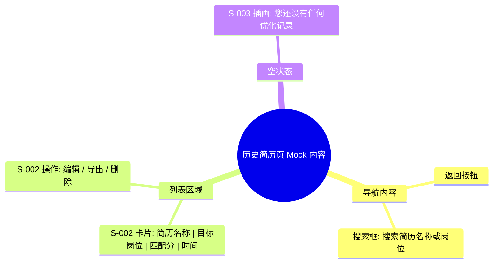

# 历史简历页 Mock Draft

> 输出路径：`product/development/mock/100-history.md`。本文档只描述页面展示内容与 mock 数据，不描述交互执行、埋点、接口调用或业务执行逻辑。

# 历史简历页

## 0. Mock 文档状态

- 文档版本：Draft
- 生成日期：2026-05-12
- 来源页面文件：`product/release/pages/100-history.md`
- 当前输出文件：`product/development/mock/100-history.md`
- 页面名称：历史简历页
- 内容范围：页面展示内容 / mock 数据 / 多状态文案 / 静态或动态来源标注
- 不包含范围：交互动作执行、埋点逻辑、接口定义、业务处理逻辑
- 必须对照的来源表：
  - `页面布局与内容区块`
  - `页面元素清单`
  - `元素状态矩阵`
  - `交互 Action 与执行效果`
- Mock 假设 / 待确认编号规则：
  - Mock 假设：`MA-001` 起，按首次出现顺序递增。
  - Mock 待确认：`MQ-001` 起，按首次出现顺序递增。
  - 正文和表格中出现的每个 `MA-*` / `MQ-*` 必须在文档末尾统一清单中出现。

## 1. 页面内容概览

| 项目 | 内容 |
|---|---|
| 页面定位 | 管理所有已保存的历史简历记录。 |
| 主要用户 | 需要找回、复用或管理历史简历的用户。 |
| 核心展示目标 | 清晰的列表展示，便捷的搜索与操作（编辑/导出/删除）。 |
| 内容语气 | 实用、条理。 |
| 主要动态数据来源 | 接口返回 (历史记录列表) |

## 2. 来源对照矩阵

| 来源表 | 来源行ID | 来源名称 / 状态 / Action | 是否已映射 | 映射到 Mock 章节 | 映射对象ID | 未映射原因 | 相关 MA/MQ |
|---|---|---|---|---|---|---|---|
| 页面布局与内容区块 | S-001 | 搜索导航区 | 是 | 4. 区块级内容描述 | S-001 | | |
| 页面布局与内容区块 | S-002 | 历史列表区 | 是 | 4. 区块级内容描述 | S-002 | | |
| 页面布局与内容区块 | S-003 | 空状态区 | 是 | 4. 区块级内容描述 | S-003 | | |
| 页面元素清单 | E-001 | 返回按钮 | 是 | 5. 元素内容清单 | E-001 | | |
| 页面元素清单 | E-002 | 搜索输入框 | 是 | 5. 元素内容清单 | E-002 | | |
| 页面元素清单 | E-003 | 简历卡片列表 | 是 | 5. 元素内容清单 | E-003 | | |
| 页面元素清单 | E-004 | 空状态占位 | 是 | 5. 元素内容清单 | E-004 | | |
| 页面元素清单 | E-005 | 编辑按钮 | 是 | 5. 元素内容清单 | E-005 | | |
| 页面元素清单 | E-006 | 导出按钮 | 是 | 5. 元素内容清单 | E-006 | | |
| 页面元素清单 | E-007 | 删除按钮 | 是 | 5. 元素内容清单 | E-007 | | |
| 交互 Action 与执行效果 | ACT-001 | 搜索过滤 | 是 | 10. Action 可见内容映射 | AM-001 | | |
| 交互 Action 与执行效果 | ACT-004 | 确认删除 | 是 | 10. Action 可见内容映射 | AM-002 | | MA-001 |

## 3. 页面内容结构图

## 4. 区块级内容描述

| 区块ID | 来源区块ID | 区块名称 | 展示目的 | 主要内容 | 内容来源类型 | 动态来源说明 | 状态差异 | 相关 MA/MQ |
|---|---|---|---|---|---|---|---|---|
| S-001 | S-001 | 搜索导航区 | 退出与搜索 | “历史简历”标题、返回键及关键词搜索框 | 静态 | | | |
| S-002 | S-002 | 历史列表区 | 展示历史数据项 | 包含简历基本信息与核心操作按钮的卡片列表 | 动态 | 接口返回 | 翻页加载状态 | |
| S-003 | S-003 | 空状态区 | 兜底引导 | 提示暂无数据，可点击去优化新简历 | 静态 | | 搜索无结果时差异 | MA-002 |

## 5. 元素内容清单

| 元素ID | 来源元素ID | 元素名称 | 元素类型 | 所属区块 | 展示内容 | 内容来源类型 | 动态来源说明 | 默认状态内容 | 空状态内容 | 加载状态内容 | 错误状态内容 | 禁用 / 无权限内容 | 相关 MA/MQ |
|---|---|---|---|---|---|---|---|---|---|---|---|---|---|
| E-001 | E-001 | 返回按钮 | button | S-001 | < (左箭头图标) | 静态 | | 正常展示 | | | | | |
| E-002 | E-002 | 搜索输入框 | input | S-001 | 占位符: 搜索简历名称或岗位 | 静态 | | 默认文本输入 | | | | | |
| E-003 | E-003 | 简历卡片列表 | list | S-002 | 渲染后的卡片项 | 动态 | 接口返回 | 展示 20 条/页 | | 骨架屏 | 刷新重试 | | |
| E-004 | E-004 | 空状态占位 | other | S-003 | 您还没有任何优化记录 | 静态 | | 默认插画 + 文字 | “未找到相关简历” | | | | MA-002 |
| E-005 | E-005 | 编辑按钮 | button | S-002/项 | 编辑 | 静态 | | 文字按钮 | | | | | |
| E-006 | E-006 | 导出按钮 | button | S-002/项 | 导出 | 静态 | | 文字按钮 | | | | | |
| E-007 | E-007 | 删除按钮 | button | S-002/项 | 删除图标 | 静态 | | 红色垃圾桶图标 | | | | | |

## 6. 表单与选项 Mock 内容

> 本页面主要为列表操作，无复杂表单。

## 7. 列表 / 卡片 / 表格 Mock 数据

| 数据组ID | 展示组件ID | 数据项名称 | Mock 数据条目 | 字段展示文案 | 内容来源类型 | 动态来源说明 | 空状态替代内容 | 相关 MA/MQ |
|---|---|---|---|---|---|---|---|---|
| DATA-001 | E-003 | 简历记录 | 1. 互联网大厂产品经理 | 匹配分：85 | 时间：2026.05.10 | 动态 | 接口返回 | | |
| DATA-001 | E-003 | | 2. 资深研发工程师简历 | 匹配分：92 | 时间：2026.05.08 | 动态 | 接口返回 | | |
| DATA-001 | E-003 | | 3. 运营管培生求职版 | 匹配分：78 | 时间：2026.04.20 | 动态 | 接口返回 | | |

## 8. 图片 / 音视频 / 多媒体内容

| 资源ID | 资源类型 | 使用位置 | 展示内容描述 | 替代文本 / 标题 | Caption / 说明文案 | 缩略图 / 封面描述 | 不同状态展示 | 内容来源类型 | 动态来源说明 | 相关 MA/MQ |
|---|---|---|---|---|---|---|---|---|---|---|
| M-001 | image | S-003 | 戴放大镜的小机器人(搜索无果) 或 文件夹空空如也(无数据) | 暂无记录 | | | | 静态 | | |
| M-002 | icon | E-007 | 红色微型垃圾桶图标 | 删除 | | | | 静态 | | |

## 9. 状态文案与内容差异

| 状态ID | 来源元素ID | 来源状态 | 状态类型 | 触发场景说明 | 页面展示文本 | 主要元素内容变化 | 图片 / 多媒体变化 | 用户可见提示 | 内容来源类型 | 动态来源说明 | 相关 MA/MQ |
|---|---|---|---|---|---|---|---|---|---|---|---|
| STATE-001 | S-003 | 无数据 | 空 | 用户未创建过简历时 | 您还没有任何优化记录，快去首页上传吧！ | 显示全屏插画 | M-001 | | 静态 | | |
| STATE-002 | S-003 | 搜索无果 | 空 | 搜索关键词无匹配项时 | 未找到相关简历，换个关键词试试吧 | 显示全屏插画 | M-001 (放大镜形态) | | 静态 | | MA-002 |
| STATE-003 | E-003 | 加载中 | 加载 | 下拉刷新或首次进入 | 加载中... | 列表项变为灰色骨架 | 无 | | 静态 | | |

## 10. Action 可见内容映射

| 映射ID | 来源ActionID | 触发元素ID | Action 名称 | 用户可见内容变化 | 成功可见文案 | 失败可见文案 | 跳转 / 弹窗 / Toast 展示内容 | 内容来源类型 | 动态来源说明 | 相关 MA/MQ |
|---|---|---|---|---|---|---|---|---|---|---|
| AM-001 | ACT-001 | E-002 | 搜索过滤 | 列表内容动态刷新 | | | | 动态 | 接口返回 | |
| AM-002 | ACT-004 | E-007 | 确认删除 | 弹出删除确认框 | | | 弹窗: 确定要删除该记录吗？删除后不可恢复。 | 静态 | | MA-001 |

## 11. 内容来源汇总

| 内容对象 | 静态内容 | 动态内容 | 动态来源说明 | 是否需要用户确认 |
|---|---|---|---|---|
| 搜索占位符 | 搜索简历名称或岗位 | | | 否 |
| 空状态文案 | 您还没有任何优化记录、未找到相关简历 | | | 否 |
| 操作按钮 | 编辑、导出 | | | 否 |
| 简历详情 | | [简历名, 匹配分, 时间] | 接口返回 | 是 |
| 删除弹窗 | 确定要删除该记录吗？ | | | 否 |

## 12. Mock 假设 with 待确认统一清单

### 12.1 Mock 假设清单

| 假设ID | 假设内容 | 首次出现位置 | 影响范围 | 影响区块 / 元素 / 内容对象 | 置信度 | 用户确认状态 | Release 处理方式 |
|---|---|---|---|---|---|---|---|
| MA-001 | 假设删除简历的二次确认弹窗包含文案“确定要删除该记录吗？删除后不可恢复。”。 | 10. Action 可见内容映射 | 文案 | AM-002 | 高 | 确认 | 确认为正式内容 |
| MA-002 | 假设搜索无结果时的反馈文案为“未找到相关简历，换个关键词试试吧”。 | 9. 状态文案与内容差异 | 文案 | STATE-002 | 高 | 确认 | 确认为正式内容 |

### 12.2 Mock 待确认清单

| 待确认ID | 待确认问题 | 首次出现位置 | 影响范围 | 影响区块 / 元素 / 内容对象 | 优先级 | 用户确认结果 | Release 处理方式 |
|---|---|---|---|---|---|---|---|
| MQ-001 | 历史列表是否需要支持按“修改时间”或“匹配分数”进行排序切换？ | 4. 区块级内容描述 | 功能内容 | S-001 | 中 | 确认 | 暂不展示排序切换，默认按时间倒序 |
