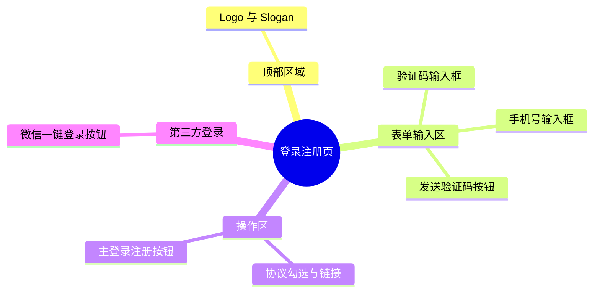

# 登录注册页

## 0. 页面文档状态

- 文档版本：Draft
- 生成日期：2026-05-11
- 来源文件：`product/release/product-overview-release.md`
- 来源 Sitemap 行：
  - 生成顺序：10
  - 页面ID：U-010
  - 父页面ID：ROOT
  - 层级：L1
  - Surface：用户端App
  - Layout 区域：独立页
  - 页面名称：登录注册页
  - 页面类型：登录注册
  - Sitemap 页面级MD文件：`product/development/pages/010-login.md`
- 当前输出文件：`product/development/pages/010-login.md`
- 页面级假设 / 待确认编号规则：
  - 页面假设：`PA-001` 起，按首次出现顺序递增。
  - 页面待确认：`PQ-001` 起，按首次出现顺序递增。

## 1. 页面目标与上下文

### 1.1 页面目标

- 页面目的：提供用户身份认证的唯一官方途径，将游客转化为普通用户。
- 用户目标：通过手机号或微信快捷登录并进入 App，以使用 AI 简历优化等核心功能。
- 业务目标：最大化注册转化率，降低登录门槛；获取真实手机号码以供后续触达；获取微信 OpenID 实现快捷登录体系。
- 页面成功标准：用户成功登录并跳转至“首页”。

### 1.2 页面入口与出口

| 类型 | 来源 / 去向 | 触发条件 | 传入 / 传出数据 | 备注 |
|---|---|---|---|---|
| 入口 | App 启动页 | 检查到本地无有效登录态 token | 无 | |
| 入口 | 个人中心 | 用户主动点击“退出登录” | 触发清除本地 token | |
| 入口 | 拦截器 (Interceptor) | Token 过期或未登录用户触发任何需登录功能时 | redirect_url (拦截前页面) | （页面假设 PA-001：存在统一的登录拦截器机制） |
| 出口 | 首页 (U-020) | 正常启动后首次登录成功 | 登录 token 及用户信息 | |
| 出口 | 任意被拦截的原页面 | 登录拦截后登录成功 | 登录 token 及用户信息 | 根据 redirect_url 自动跳转回来源页 |

### 1.3 角色与权限

| 角色 | 是否可访问 | 权限条件 | 不满足时页面表现 | 相关 PA/PQ |
|---|---|---|---|---|
| 游客 | 是 | 无 | 正常显示登录表单 | |
| 普通用户/VIP | 否 | 若已登录 | 自动闪退或重定向至首页 | |

### 1.4 全局页面属性

| 属性 | 类型 | 来源 | 默认值 | 影响元素 / 状态 | 说明 |
|---|---|---|---|---|---|
| isAgreed | boolean | local state | false | E-006 (登录按钮)、E-008 (微信登录) | 是否已勾选同意服务协议与隐私政策 |

## 2. 页面结构思维导图



## 3. 页面布局与内容区块

| 区块ID | 区块名称 | 区块类型 | 展示条件 | 包含元素ID | 布局 / 样式定义 | 数据来源 | 相关 PA/PQ |
|---|---|---|---|---|---|---|---|
| S-001 | 品牌展示区 | header | 常驻 | E-001, E-002 | 居中，大图标+副标题 | 客户端内置图片 | |
| S-002 | 手机验证码表单区 | content | 常驻 | E-003, E-004, E-005 | 垂直排列，下划线输入框风格 | | |
| S-003 | 协议及主操作区 | content | 常驻 | E-006, E-007, E-010, E-011 | 垂直排列，按钮居中满宽 | | |
| S-004 | 第三方登录区 | footer | 设备已安装微信 | E-008, E-009 | 页面底部，小字“其他方式登录”+微信Icon | 设备能力API | （页面假设 PA-002：需判断微信客户端是否安装） |

## 4. 页面元素清单

| 元素ID | 元素名称 | 元素类型 | 所属区块 | 是否必需 | 展示条件 | 默认文案 / 内容 | 样式定义 | 数据绑定 | 相关 PA/PQ |
|---|---|---|---|---|---|---|---|---|---|
| E-001 | App Logo | image | S-001 | 是 | 常驻 | 官方 Logo | 80x80px，居中 | 本地静态资源 | |
| E-002 | 欢迎文案 | text | S-001 | 是 | 常驻 | "欢迎使用 AI 简历优化" | 字体放大，加粗 | | |
| E-003 | 手机号输入框 | input | S-002 | 是 | 常驻 | "请输入手机号码" (placeholder) | 仅数字键盘，限制11位 | `phone` | |
| E-004 | 验证码输入框 | input | S-002 | 是 | 常驻 | "请输入验证码" (placeholder) | 仅数字键盘，限制4位/6位 | `verifyCode` | （页面待确认 PQ-001：验证码是4位还是6位？） |
| E-005 | 发送验证码按钮 | button | S-002 | 是 | 常驻 | "获取验证码" | 在验证码输入框右侧内联，字号较小 | | |
| E-006 | 主登录按钮 | button | S-003 | 是 | 常驻 | "登录 / 注册" | 全宽大按钮，主色块 | | |
| E-007 | 协议勾选框 | checkbox | S-003 | 是 | 常驻 | 未勾选 | 小尺寸圆形单选框 | `isAgreed` | |
| E-010 | 用户协议链接 | link | S-003 | 是 | 常驻 | "《用户服务协议》" | 蓝色可点击文本 | | |
| E-011 | 隐私政策链接 | link | S-003 | 是 | 常驻 | "《隐私政策》" | 蓝色可点击文本 | | |
| E-008 | 微信快捷登录按钮 | button | S-004 | 否 | 微信已安装 | 微信图标 | 圆形图标按钮或胶囊按钮 | | PA-002 |
| E-009 | "其他登录方式"提示 | text | S-004 | 否 | 微信已安装 | "或使用以下方式登录" | 灰色小字，带左右线条装饰 | | |

## 5. 元素状态矩阵

| 元素ID | 状态 | 触发条件 | 状态来源 | 样式定义 | 可执行动作 | 禁止动作 | 提示文案 / 反馈 | 恢复条件 | 相关 PA/PQ |
|---|---|---|---|---|---|---|---|---|---|
| E-003 | 错误 | 输入非 11 位手机号触发失焦校验 | 表单校验 | 输入框底部标红 | | | "请输入正确的手机号" | 重新输入正确号码 | |
| E-005 | 禁用 | 手机号非法时，或处于倒计时期间 | 表单校验/本地倒计时 | 文字置灰，不可点击 | | 点击 | 倒计时中显示 "60s" | 倒计时结束恢复为"重新获取" | |
| E-006 | 禁用 | `phone` 和 `verifyCode` 为空时 | 表单校验 | 按钮置灰降低透明度 | | 点击 | | 表单填满且有效 | （页面假设 PA-003：未填满输入框时按钮禁用） |
| E-006 | 加载 | 接口请求中 | 接口请求 | 按钮显示 Loading 图标 | | 重复点击 | | 请求返回结果 | |
| E-007 | 提示 | 点击登录/微信但未勾选时 | `!isAgreed` | 触发勾选框抖动动画 | | | Toast: "请先阅读并同意用户协议" | 用户主动勾选 | |

## 6. 交互 Action 与执行效果

| ActionID | 触发元素ID | 交互名称 | 用户动作 | 前置条件 | 校验规则 | 执行动作 | 成功结果 | 失败结果 | 页面跳转 / 状态变化 | 埋点事件 | 相关 PA/PQ |
|---|---|---|---|---|---|---|---|---|---|---|---|
| ACT-001 | E-005 | 获取验证码 | 点击 | 无 | 手机号满足 11 位 | API 调用 (API-001) | Toast "发送成功" | Toast 接口报错原因 | 按钮进入 60s 倒计时 | `click_get_sms_code` | |
| ACT-002 | E-006 | 手机号登录 | 点击 | 手机号+验证码非空 | 必须勾选 E-007 | API 调用 (API-002) | 保存 Token | Toast 验证码错误等 | 成功跳首页/来源页 | `click_login_phone` | |
| ACT-003 | E-008 | 微信登录 | 点击 | 微信已安装 | 必须勾选 E-007 | 调用微信 SDK + API (API-003) | 保存 Token | Toast 授权取消/失败 | 成功跳首页/来源页 | `click_login_wechat` | |
| ACT-004 | E-010 | 查看用户协议 | 点击 | 无 | 无 | 打开 WebView | 渲染协议页面 | 加载失败 | 协议页遮罩或跳转新页 | `view_user_agreement` | |
| ACT-005 | E-011 | 查看隐私政策 | 点击 | 无 | 无 | 打开 WebView | 渲染协议页面 | 加载失败 | 协议页遮罩或跳转新页 | `view_privacy_policy` | |

## 7. 数据结构与接口定义

### 7.1 页面数据模型

| 数据对象 | 字段 | 类型 | 必填 | 来源 | 默认值 | 使用位置 | 说明 |
|---|---|---|---|---|---|---|---|
| UserAuth | phone | string | 是 | local input | | E-003 | |
| UserAuth | verifyCode | string | 是 | local input | | E-004 | |
| UserAuth | wechatCode | string | 否 | 微信 SDK | | ACT-003 | 用于服务器换取 OpenID 和登录 |

### 7.2 接口清单

| API ID | 接口名称 | 方法 | 路径 | 触发 ActionID | 请求数据结构 | 返回数据结构 | 成功处理 | 失败处理 | 相关 PA/PQ |
|---|---|---|---|---|---|---|---|---|---|
| API-001 | 发送验证码 | POST | `/api/v1/auth/sms/send` | ACT-001 | `{ "phone": "string" }` | `{ "success": true }` | 开启 60s 倒计时 | Toast 提示异常 | |
| API-002 | 手机验证码登录 | POST | `/api/v1/auth/login/phone` | ACT-002 | `{ "phone": "string", "code": "string" }` | `{ "token": "string", "user_info": {} }` | 写入本地缓存，页面跳转 | 清空验证码输入框，Toast | |
| API-003 | 微信授权登录 | POST | `/api/v1/auth/login/wechat` | ACT-003 | `{ "wechat_code": "string" }` | `{ "token": "string", "user_info": {}, "is_new_user": boolean }` | 写入本地缓存，页面跳转 | Toast 授权失败 | （页面假设 PA-004：首次微信登录自动注册无需绑定手机号） |

### 7.3 请求 / 返回 JSON 示例

#### API-002 请求

```json
{
  "phone": "13800138000",
  "code": "123456"
}
```

#### API-002 成功返回

```json
{
  "code": 0,
  "message": "success",
  "data": {
    "token": "jwt_token_string",
    "user_info": {
      "user_id": "U12345",
      "nickname": "用户_1234",
      "avatar": "",
      "is_vip": false
    }
  }
}
```

#### API-002 失败返回

```json
{
  "code": 40001,
  "message": "验证码不正确或已过期",
  "data": null
}
```

## 8. 边界状态与错误处理

| 场景ID | 场景类型 | 触发条件 | 页面表现 | 元素表现 | 用户可执行操作 | 系统处理 | 兜底文案 | 相关 PA/PQ |
|---|---|---|---|---|---|---|---|---|
| EDGE-001 | 未勾选协议 | 用户未勾选协议点击登录按钮 | 阻断登录请求 | E-007 区域抖动并高亮 | 去勾选 | | "请先阅读并勾选页面下方的服务协议与隐私政策" | |
| EDGE-002 | 验证码频繁获取 | 1分钟内多次触发 API-001 失败或绕过前端倒计时 | Toast 提示操作频繁 | E-005 恢复倒计时锁定状态 | 等待 | 服务器拦截请求 | "验证码发送过于频繁，请稍后再试" | |
| EDGE-003 | 网络离线 | 处于无网络环境点击登录 | Toast 提示网络异常 | E-006 停止 Loading | 检查网络设置 | 客户端不发起 API | "网络似乎断开了，请检查您的网络设置" | |
| EDGE-004 | 微信客户端未安装 | 拉起微信授权失败 | 隐藏或提示无法拉起 | E-008 置灰或隐藏 | 使用手机号登录 | 取消微信调用 | "未检测到微信客户端，请使用手机号登录" | PA-002 |

## 9. 多媒体与资源

| 资源ID | 资源类型 | 使用位置 | 来源 | 格式 / 尺寸 | 加载状态 | 失败降级 | 可访问性说明 | 相关 PA/PQ |
|---|---|---|---|---|---|---|---|---|
| M-001 | image | E-001 App Logo | 本地预置资源 | PNG/SVG, 80x80px | 无需加载 | 显示默认应用 Icon | 纯视觉展示 | |
| M-002 | icon | E-008 微信登录按钮 | 本地预置资源 | SVG, 40x40px | 无需加载 | 文字“微信” | | |

## 10. 页面假设与待确认统一清单

### 10.1 页面假设清单

| 假设ID | 假设内容 | 首次出现位置 | 影响范围 | 影响元素 / Action / API | 置信度 | 用户确认状态 | Release 处理方式 |
|---|---|---|---|---|---|---|---|
| PA-001 | 存在统一的登录拦截器机制，成功后可跳回原页面 | 1.2 页面入口与出口 | 跳转逻辑 | 所有需要登录权限的前置页面拦截 | 高 | 确认 | 确认为正式内容 |
| PA-002 | 本地需调用系统 API 判断微信客户端是否安装以控制展示 | 3 页面布局与内容区块 | 元素可见性 | E-008, EDGE-004 | 高 | 不需要，直接在登录页面展示微信登录按钮 | 确认为正式内容 |
| PA-003 | 未填满输入框内容时，登录主按钮展示禁用态降低透明度以提供视觉反馈 | 5 元素状态矩阵 | 交互/样式 | E-006 | 中 | 确认 | 确认为正式内容 |
| PA-004 | 首次微信登录会自动静默注册，后续可在个人中心再绑定手机号，不需要在此强制打断绑定 | 7.2 接口清单 (API-003) | 登录链路流转 | API-003 返回及跳转结果 | 低 | 确认 | 根据微信API返回的用户手机号自动注册用户 |

### 10.2 页面待确认清单

| 待确认ID | 待确认问题 | 首次出现位置 | 影响范围 | 影响元素 / Action / API | 优先级 | 用户确认结果 | Release 处理方式 |
|---|---|---|---|---|---|---|---|
| PQ-001 | 验证码长度是4位还是6位？ | 4 页面元素清单 (E-004) | 表单验证长度限制 | E-004 前端校验及短信通道模板 | 高 | 确认 | 验证码长度为6位 |
