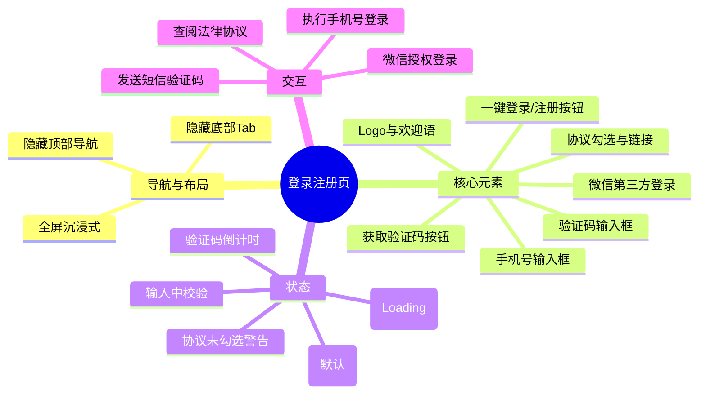

# 登录注册页

## 0. 页面文档状态

- 文档版本：Draft
- 生成日期：2026-05-12
- 来源文件：`product/release/product-overview-release.md`
- 来源 Sitemap 行：
  - 生成顺序：10
  - 页面ID：U-010
  - 父页面ID：ROOT
  - 层级：L1
  - Surface：用户端App
  - Layout 区域：独立页
  - 页面名称：登录注册页
  - 页面类型：登录注册
  - Sitemap 页面级MD文件：product/development/pages/010-login.md
- 当前输出文件：product/development/pages/010-login.md
- 页面级假设 / 待确认编号规则：
  - 页面假设：`PA-001` 起，按首次出现顺序递增。
  - 页面待确认：`PQ-001` 起，按首次出现顺序递增。
  - 正文、表格、接口、状态、元素中出现的每个 `PA-*` / `PQ-*` 必须在 `页面假设与待确认统一清单` 中出现。

## 1. 页面目标与上下文

### 1.1 页面目标

- 页面目的：通过手机号验证码或微信授权完成用户身份识别与注册登录。
- 用户目标：快速安全地进入应用，开始优化简历。
- 业务目标：降低用户准入门槛，提升游客到普通用户的转化率。
- 页面成功标准：成功登录/注册转化率 > 80%（页面假设 PA-001：基于行业平均水平设定的转化目标）。

### 1.2 页面入口与出口

| 类型 | 来源 / 去向 | 触发条件 | 传入 / 传出数据 | 备注 |
|---|---|---|---|---|
| 入口 | 启动应用 | 应用启动且未检测到有效 Token | 无 | 强制登录策略 |
| 入口 | 个人中心 | 未登录用户点击个人中心相关功能 | 无 | 拦截逻辑触发 |
| 出口 | 首页 (U-020) | 手机号或微信登录成功 | 用户 Token、基本信息 | 自动跳转 |
| 出口 | 隐私政策/服务协议 | 点击协议链接 | 无 | push 方式打开 |

### 1.3 角色与权限

| 角色 | 是否可访问 | 权限条件 | 不满足时页面表现 | 相关 PA/PQ |
|---|---|---|---|---|
| 游客 | 是 | 无 | 正常显示 | - |
| 普通用户 | 否 | 已登录 | 自动重定向至首页 | - |
| VIP 会员 | 否 | 已登录 | 自动重定向至首页 | - |

### 1.4 全局页面属性

| 属性 | 类型 | 来源 | 默认值 | 影响元素 / 状态 | 说明 |
|---|---|---|---|---|---|
| loginType | enum | local state | sms | E-001, E-002 | 标识当前登录方式（手机号/第三方） |
| agreementChecked | boolean | local state | false | E-004, E-005 | 协议勾选状态，控制登录按钮禁用 |
| countdown | number | local state | 0 | E-003 | 验证码倒计时 |

## 2. 页面结构思维导图



## 3. 页面布局与内容区块

| 区块ID | 区块名称 | 区块类型 | 展示条件 | 包含元素ID | 布局 / 样式定义 | 数据来源 | 相关 PA/PQ |
|---|---|---|---|---|---|---|---|
| S-001 | 品牌展示区 | content | 始终显示 | Logo, E-000 | 页面顶部，居中对齐 | 本地资源 | - |
| S-002 | 手机号登录表单 | content | 始终显示 | E-001, E-002, E-003, E-004 | 页面中部，垂直排列 | 用户输入 | - |
| S-003 | 第三方登录区 | footer | 始终显示 | E-005 | 页面下部，社交登录入口 | 第三方SDK | - |
| S-004 | 合规协议区 | footer | 始终显示 | E-006, E-007, E-008 | 页面底部，小字居中 | 法律规约 | - |

## 4. 页面元素清单

| 元素ID | 元素名称 | 元素类型 | 所属区块 | 是否必需 | 展示条件 | 默认文案 / 内容 | 样式定义 | 数据绑定 | 相关 PA/PQ |
|---|---|---|---|---|---|---|---|---|---|
| E-000 | 欢迎标题 | text | S-001 | 是 | 始终显示 | 欢迎使用 AI 简历优化 | 字体 24px, 粗体, 居中 | 无 | - |
| E-001 | 手机号输入框 | input | S-002 | 是 | 始终显示 | 请输入手机号 | 11位限制, 数字键盘 | formData.phone | - |
| E-002 | 验证码输入框 | input | S-002 | 是 | 始终显示 | 请输入验证码 | 6位限制, 数字键盘 | formData.code | - |
| E-003 | 发送验证码按钮 | button | S-002 | 是 | 始终显示 | 获取验证码 | 嵌入输入框右侧或紧随其后 | countdown | - |
| E-004 | 登录/注册主按钮 | button | S-002 | 是 | 始终显示 | 立即登录/注册 | 宽度撑满, 品牌主色 | agreementChecked | - |
| E-005 | 微信登录按钮 | button | S-003 | 是 | 始终显示 | 微信图标 | 圆形图标, 位于底部 | 无 | - |
| E-006 | 协议勾选框 | checkbox | S-004 | 是 | 始终显示 | 空 | 尺寸 16x16 | agreementChecked | - |
| E-007 | 服务协议链接 | link | S-004 | 是 | 始终显示 | 《服务协议》 | 品牌蓝色, 12px | 无 | - |
| E-008 | 隐私政策链接 | link | S-004 | 是 | 始终显示 | 《隐私政策》 | 品牌蓝色, 12px | 无 | - |

## 5. 元素状态矩阵

| 元素ID | 状态 | 触发条件 | 状态来源 | 样式定义 | 可执行动作 | 禁止动作 | 提示文案 / 反馈 | 恢复条件 | 相关 PA/PQ |
|---|---|---|---|---|---|---|---|---|---|
| E-003 | 默认 | 页面加载 | - | 蓝色文字 | 点击发送 | - | - | - | - |
| E-003 | 禁用 | 手机号为空或格式不正确 | E-001 校验 | 灰色文字 | - | 点击 | 请输入正确的手机号 | 输入合法手机号 | - |
| E-003 | 倒计时 | 点击发送且接口成功 | countdown > 0 | 灰色文字, 显示秒数 | - | 点击 | 重发(60s) | countdown == 0 | - |
| E-004 | 禁用 | 协议未勾选或表单不完整 | agreementChecked == false | 半透明主色 | - | 点击登录 | 请先同意协议 | 勾选协议且填完表单 | - |
| E-004 | 加载中 | 登录请求已发出 | 接口状态 | 显示转圈动画 | - | 重复点击 | 登录中... | 接口返回结果 | - |
| E-006 | 未选中 | 默认状态 | agreementChecked | 边框显示 | 点击勾选 | - | - | - | - |
| E-006 | 选中 | 用户点击 | agreementChecked | 内部填充勾选符号 | 点击取消 | - | - | - | - |

## 6. 交互 Action 与执行效果

| ActionID | 触发元素ID | 交互名称 | 用户动作 | 前置条件 | 校验规则 | 执行动作 | 成功结果 | 失败结果 | 页面跳转 / 状态变化 | 埋点事件ID | 埋点事件名称 | 不埋点原因 | 相关 PA/PQ |
|---|---|---|---|---|---|---|---|---|---|---|---|---|---|
| ACT-001 | E-003 | 发送验证码 | 点击 | 手机号不为空 | 11位数字格式 | 调用 API-001 | 进入倒计时 | Toast 提示错误 | E-003 状态变为“倒计时” | EVT-002 | 发送验证码点击 | - | - |
| ACT-002 | E-004 | 手机号登录 | 点击 | 协议已勾选且表单完整 | 验证码6位数字 | 调用 API-002 | 保存 Token 并登录 | Toast 提示“验证码错误”等 | 跳转至首页 (U-020) | EVT-003 | 登录按钮点击 | - | - |
| ACT-003 | E-005 | 微信登录 | 点击 | 协议已勾选 | 无 | 调用第三方 SDK | 获取微信授权码并调用 API-003 | Toast 提示“授权失败” | 跳转至首页 (U-020) | EVT-004 | 微信登录点击 | - | - |
| ACT-004 | E-007 | 查看协议 | 点击 | 无 | 无 | 路由跳转 | 打开协议详情 | - | 页面推入 (L2 视图) | EVT-005 | 协议查看点击 | - | - |
| ACT-005 | E-006 | 勾选协议 | 点击 | 无 | 无 | 更新本地状态 | agreementChecked 取反 | - | E-006 样式切换 | - | - | 属于纯本地 UI 交互 | - |

## 7. 埋点事件统计设计

### 7.1 埋点事件总表

| 埋点事件ID | 事件名称 | 事件类型 | 关联元素ID / ActionID | 触发时机 | 统计次数口径 | 去重规则 | 上报时机 | 关键属性 | 成功 / 失败归因 | 漏斗阶段 | 相关 PA/PQ |
|---|---|---|---|---|---|---|---|---|---|---|---|
| EVT-001 | 登录页曝光 | page_view | - | 页面进入 | 每页面会话 1 次 | sessionId | 实时 | page_id, source | - | 注册漏斗-1 | - |
| EVT-002 | 发送验证码点击 | click | ACT-001 | 点击发送按钮 | 每次点击计 1 次 | 无 | 实时 | phone_filled | - | 注册漏斗-2 | - |
| EVT-003 | 登录按钮点击 | click | ACT-002 | 点击登录按钮 | 每次点击计 1 次 | 无 | 实时 | login_type (sms) | - | 注册漏斗-3 | - |
| EVT-004 | 微信登录点击 | click | ACT-003 | 点击微信图标 | 每次点击计 1 次 | 无 | 实时 | login_type (wechat) | - | 注册漏斗-3 | - |
| EVT-006 | 登录接口结果 | api_result | API-002/003 | 接口返回 | 每次返回计 1 次 | requestId | 接口返回后 | result, error_code, login_type | - | 注册漏斗-4 | - |
| EVT-007 | 协议勾选提醒 | validation_error | ACT-002/003 | 未勾选协议时点击登录 | 每次触发计 1 次 | 无 | 实时 | - | - | 阻断环节 | - |

### 7.2 埋点事件属性定义

| 属性名 | 类型 | 必填 | 来源 | 示例值 | 使用事件ID | 说明 |
|---|---|---|---|---|---|---|
| page_id | string | 是 | Sitemap | U-010 | EVT-001 | 页面唯一标识 |
| login_type | enum | 是 | 业务逻辑 | sms / wechat | EVT-003, EVT-004, EVT-006 | 登录渠道 |
| result | enum | 是 | 接口返回 | success / failure | EVT-006 | 接口调用结果 |
| error_code | string | 否 | 接口返回 | 4001 (验证码错误) | EVT-006 | 失败时的错误代码 |

### 7.3 关键统计次数说明

- 页面曝光次数：EVT-001，用于计算注册转化漏斗的起始基数。
- 手机号登录成功率：(EVT-006(success) where login_type=sms) / EVT-003。
- 微信登录占比：EVT-004 / (EVT-003 + EVT-004)。
- 协议未勾选导致的阻断率：EVT-007 / (EVT-003 + EVT-004)。

## 8. 数据结构与接口定义

### 8.1 页面数据模型

| 数据对象 | 字段 | 类型 | 必填 | 来源 | 默认值 | 使用位置 | 说明 |
|---|---|---|---|---|---|---|---|
| formData | phone | string | 是 | local | "" | E-001 | 手机号 |
| formData | code | string | 是 | local | "" | E-002 | 验证码 |
| authData | token | string | 是 | API | - | 全局 | 鉴权凭证 |

### 8.2 接口清单

| API ID | 接口名称 | 方法 | 路径 | 触发 ActionID | 请求数据结构 | 返回数据结构 | 成功处理 | 失败处理 | 相关 PA/PQ |
|---|---|---|---|---|---|---|---|---|---|
| API-001 | 发送验证码 | POST | /auth/send-code | ACT-001 | {phone: string} | {code: 0} | 开启倒计时 | Toast 报错 | - |
| API-002 | 手机号登录 | POST | /auth/login-phone | ACT-002 | {phone: string, code: string} | {token: string, user: object} | 存储 Token 并跳转 | Toast 报错 | - |
| API-003 | 微信登录 | POST | /auth/login-wechat | ACT-003 | {authCode: string} | {token: string, user: object} | 存储 Token 并跳转 | Toast 报错 | - |

## 8.3 请求 / 返回 JSON 示例

#### API-002 请求
```json
{
  "phone": "13800138000",
  "code": "123456"
}
```

#### API-002 成功返回
```json
{
  "code": 0,
  "message": "ok",
  "data": {
    "token": "eyJhbGciOiJIUzI1NiIsInR5...",
    "user": {
      "userId": "1001",
      "nickname": "用户1001",
      "avatar": "https://example.com/avatar.png",
      "role": "normal"
    }
  }
}
```

## 9. 边界状态与错误处理

| 场景ID | 场景类型 | 触发条件 | 页面表现 | 元素表现 | 用户可执行操作 | 系统处理 | 兜底文案 | 相关 PA/PQ |
|---|---|---|---|---|---|---|---|---|
| EDGE-001 | 验证码错误 | 接口返回 code != 0 | 保持当前页 | E-002 抖动并标红 | 重新输入验证码 | 清空验证码输入框 | 验证码错误，请重新输入 | - |
| EDGE-002 | 网络错误 | API 调用失败且无返回 | 弹出 Toast | - | 检查网络后重试 | 停止 Loading 状态 | 网络连接不稳定，请稍后重试 | - |
| EDGE-003 | 微信未安装 | 第三方 SDK 检测失败 | 隐藏微信图标 | E-005 隐藏 | 手机号登录 | 自动适配 | 无 | - |
| EDGE-004 | 协议未勾选 | 点击登录按钮时状态为 false | 弹出居中 Alert 或 Toast | E-006 闪烁提醒 | 点击勾选协议 | 阻断后续 Action | 请阅读并勾选服务协议与隐私政策 | - |

## 10. 多媒体与资源

| 资源ID | 资源类型 | 使用位置 | 来源 | 格式 / 尺寸 | 加载状态 | 失败降级 | 可访问性说明 | 相关 PA/PQ |
|---|---|---|---|---|---|---|---|---|
| M-001 | icon | E-005 | 微信官方资源 | PNG/SVG | 静态 | 文本显示“微信登录” | 微信授权入口 | - |
| M-002 | image | S-001 | 本地资源 | WEBP/PNG | 静态 | 占位符 | 产品 Logo | - |

## 11. 页面假设与待确认统一清单

### 11.1 页面假设清单

| 假设ID | 假设内容 | 首次出现位置 | 影响范围 | 影响元素 / Action / API / 埋点事件 | 置信度 | 用户确认状态 | Release 处理方式 |
|---|---|---|---|---|---|---|---|
| PA-001 | 转化率目标设为 80% | 1.1 页面目标 | 业务衡量指标 | 埋点分析 | 中 | 确认 | 不需要 |
| PA-002 | 微信登录是必选项 | S-003 | 登录渠道 | E-005 | 高 | 确认 | 确认为正式内容 |

### 11.2 页面待确认清单

| 待确认ID | 待确认问题 | 首次出现位置 | 影响范围 | 影响元素 / Action / API / 埋点事件 | 优先级 | 用户确认结果 | Release 处理方式 |
|---|---|---|---|---|---|---|---|
| PQ-001 | 是否需要支持一键登录 (如天翼/联通一键授权)？ | 4. 元素清单 | 登录方式 | E-001, E-002 | 中 | 确认 | 暂不添加 |
| PQ-002 | 验证码有效期是 1 分钟还是 5 分钟？ | 8.2 接口清单 | 业务规则 | API-001, API-002 | 低 | 确认 | 默认 5 分钟 |

## 12. 用户补充描述

> 本章节必须保留在页面 Draft 文档末尾，供用户用自然语言补充或修改当前页面需求。`product-page-release` 生成 release 版本时必须读取、分析并应用这里的内容。
> 如果没有补充，请保留“无”。

```text
无
```
