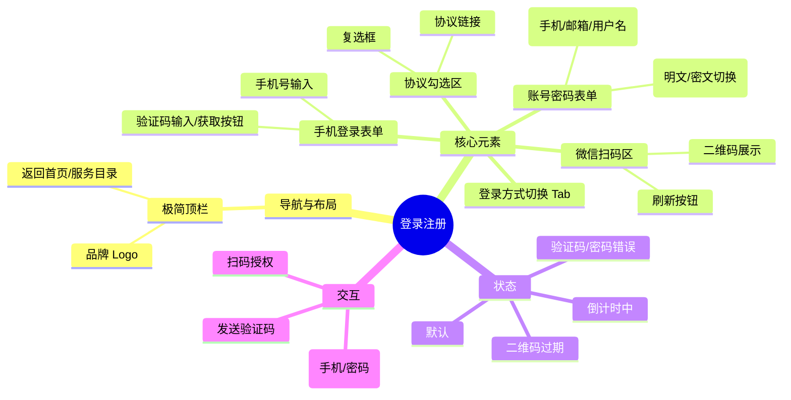

# 登录注册

## 0. 页面文档状态

- 文档版本：Draft v2
- 生成日期：2026-05-13
- 来源文件：`product/release/product-sitemap-release.md`
- 来源主稿：`product/development/pages/010-user-login/index.md`
- 来源 Sitemap 行：
  - 生成顺序：10
  - 页面ID：U-100
  - 父页面ID：ROOT
  - 层级：L1
  - Surface：用户端
  - Layout 区域：独立页
  - 页面名称：登录注册
  - 页面类型：登录
  - Sitemap 页面级MD文件：product/development/pages/010-user-login.md
- 当前输出文件：product/development/pages/010-user-login/index-v2.md
- 页面级假设 / 待确认编号规则：
  - 页面假设：`PA-001` 起，按首次出现顺序递增。
  - 页面待确认：`PQ-001` 起，按首次出现顺序递增。

## 1. 页面目标与上下文

### 1.1 页面目标

- 页面目的：提供用户端统一的身份校验入口。
- 用户目标：通过手机号、微信或账号密码快速登录/注册并进入系统。
- 业务目标：识别用户身份，绑定所属平台（域名），保障账号体系隔离。
- 页面成功标准：登录流程顺畅，验证码下发率高，微信扫码识别准确。

### 1.2 页面入口与出口

| 类型 | 来源 / 去向 | 触发条件 | 传入 / 传出数据 | 备注 |
|---|---|---|---|---|
| 入口 | 浏览器地址栏 / 业务页拦截 | 直接访问 / 未登录拦截 | 无 / 来源 URL (redirect_url) | 拦截时需携带 returnUrl |
| 出口 | 用户工作台 (U-200) | 登录成功 | Token、用户信息 | 默认跳转工作台 |
| 出口 | 协议查看页 (U-630) | 点击协议链接 | 协议类型 |  |

### 1.3 角色与权限

| 角色 | 是否可访问 | 权限条件 | 不满足时页面表现 | 相关 PA/PQ |
|---|---|---|---|---|
| 游客 | 是 | 无 | 正常显示 |  |
| 客户用户 | 是 | 已登录状态访问 | 自动跳转至工作台 |  |

### 1.4 全局页面属性

| 属性 | 类型 | 来源 | 默认值 | 影响元素 / 状态 | 说明 |
|---|---|---|---|---|---|
| platform_id | string | domain / route | derived from domain | Logo、品牌色、协议内容 | 基于当前域名识别所属平台，动态加载对应资源 |
| login_method | enum | local state | "phone" | 登录表单展示内容 | 手机号登录 / 微信登录 / 账号密码登录 |

## 2. 页面结构思维导图



## 3. 页面布局与内容区块

| 区块ID | 区块名称 | 区块类型 | 展示条件 | 包含元素ID | 布局 / 样式定义 | 数据来源 | 相关 PA/PQ |
|---|---|---|---|---|---|---|---|
| S-001 | 极简顶栏 | header | 总是显示 | E-001, E-002 | 居中容器，两端对齐 | 平台配置 |  |
| S-002 | 登录卡片 | content | 总是显示 | E-003 至 E-016 | 居中垂直布局，圆角投影 | 本地状态 |  |
| S-003 | 法律声明 | footer | 总是显示 | E-013, E-014 | 底部居中，弱文字 | 本地状态 |  |

## 4. 页面元素清单

| 元素ID | 元素名称 | 元素类型 | 所属区块 | 是否必需 | 展示条件 | 默认文案 / 内容 | 样式定义 | 数据绑定 | 相关 PA/PQ |
|---|---|---|---|---|---|---|---|---|---|
| E-001 | 品牌 Logo | image | S-001 | 是 | 总是显示 | 平台对应 Logo | 左对齐 | platform_id |  |
| E-002 | 服务目录链接 | nav | S-001 | 是 | 总是显示 | 服务目录 | 右对齐 | - |  |
| E-003 | 登录方式切换 | tab | S-002 | 是 | 总是显示 | 手机号登录 / 账号登录 / 微信登录 | 居中等分 | login_method |  |
| E-004 | 手机号输入框 | input | S-002 | 是 | login_method="phone" | 请输入手机号 | 100% 宽 | phone_number |  |
| E-005 | 验证码输入框 | input | S-002 | 是 | login_method="phone" | 请输入 6 位验证码 | 60% 宽 | verify_code |  |
| E-006 | 获取验证码按钮 | button | S-002 | 是 | login_method="phone" | 获取验证码 | 40% 宽，描边样式 | - |  |
| E-007 | 登录按钮 | button | S-002 | 是 | login_method != "wechat" | 登录 / 注册 | 100% 宽，品牌实色 | - |  |
| E-008 | 微信二维码 | image | S-002 | 是 | login_method="wechat" | 动态二维码 | 200x200 | qr_code_url |  |
| E-009 | 二维码状态层 | overlay | S-002 | 否 | 二维码过期 | 已过期，点击刷新 | 覆盖二维码，半透明 | - |  |
| E-010 | 协议勾选框 | checkbox | S-002 | 是 | 总是显示 | - | 紧凑 | agree_protocol |  |
| E-011 | 用户协议链接 | nav | S-002 | 是 | 总是显示 | 《用户协议》 | 链接样式 | - |  |
| E-012 | 隐私政策链接 | nav | S-002 | 是 | 总是显示 | 《隐私政策》 | 链接样式 | - |  |
| E-013 | 备案信息 | other | S-003 | 是 | 总是显示 | 平台版权与备案号 | 灰小字 | platform_id |  |
| E-015 | 账号输入框 | input | S-002 | 是 | login_method="password" | 手机号/邮箱/用户名 | 100% 宽 | login_account |  |
| E-016 | 密码输入框 | input | S-002 | 是 | login_method="password" | 请输入密码 | 100% 宽，password 类型 | login_password |  |

## 5. 元素状态矩阵

| 元素ID | 状态 | 触发条件 | 状态来源 | 样式定义 | 可执行动作 | 禁止动作 | 提示文案 / 反馈 | 恢复条件 | 相关 PA/PQ |
|---|---|---|---|---|---|---|---|---|---|
| E-006 | 默认 | 页面加载 | - | - | 发送验证码 | - | - | - |  |
| E-006 | 禁用 | 手机号格式错误 | 正则校验 | 置灰 | - | 点击 | 请输入正确的手机号 | 输入正确手机号 |  |
| E-006 | 倒计时 | 点击发送后 | 本地计时器 | 置灰 + 倒计时 | - | 点击 | {s}s 后重新获取 | 倒计时结束 |  |
| E-007 | 禁用 | 未勾选协议或表单未填满 | agree_protocol=false | 置灰 | - | 点击 | 请先阅读并同意协议 | 勾选协议且表单填满 |  |
| E-008 | 加载中 | 切换到微信登录 | API 请求中 | 骨架屏 | - | - | 二维码生成中 | 获取成功 |  |
| E-009 | 显示 | 二维码失效 | 计时器 / API | 遮罩 | 刷新二维码 | - | 二维码已失效，请刷新 | 点击刷新 |  |

## 6. 交互 Action 与执行效果

| ActionID | 触发元素ID | 交互名称 | 用户动作 | 前置条件 | 校验规则 | 执行动作 | 成功结果 | 失败结果 | 页面跳转 / 状态变化 | 埋点事件ID | 埋点事件名称 | 不埋点原因 | 相关 PA/PQ |
|---|---|---|---|---|---|---|---|---|---|---|---|---|---|
| ACT-001 | E-006 | 发送验证码 | 点击 | 手机号输入正确 | 正则: 1[3-9]\d{9} | 调用发送接口 (API-001) | 进入倒计时 | 错误提示 | - | EVT-002 | 发送验证码点击 | - |  |
| ACT-002 | E-007 | 手机登录 | 点击 | 方式=phone, 填满且勾协议 | - | 调用登录接口 (API-002) | 存储 Token，跳转工作台 | 验证码错误提示 | 跳转 U-200 | EVT-003 | 登录按钮点击 | - |  |
| ACT-003 | E-008 | 微信扫码 | 手机端确认 | 二维码有效 | - | 轮询/推送 (API-003) | 存储 Token，跳转工作台 | 授权失败提示 | 跳转 U-200 | EVT-004 | 微信扫码成功 | - |  |
| ACT-004 | E-011 | 查看协议 | 点击 | - | - | 路由跳转 | 打开新页面 | - | 跳转 U-630 | - | - | 基础导航不埋点 |  |
| ACT-005 | E-007 | 账号密码登录 | 点击 | 方式=password, 填满且勾协议 | - | 调用登录接口 (API-004) | 存储 Token，跳转工作台 | 账号/密码错误 | 跳转 U-200 | EVT-003 | 登录按钮点击 | - |  |

## 7. 埋点事件统计设计

### 7.1 埋点事件总表

| 埋点事件ID | 事件名称 | 事件类型 | 关联元素ID / ActionID | 触发时机 | 统计次数口径 | 去重规则 | 上报时机 | 关键属性 | 成功 / 失败归因 | 漏斗阶段 | 相关 PA/PQ |
|---|---|---|---|---|---|---|---|---|---|---|---|
| EVT-001 | 登录页曝光 | page_view | - | 页面加载完成 | 每页面会话 1 次 | sessionId | 实时 | platform_id, source_page | - | 登录起点 |  |
| EVT-002 | 获取验证码点击 | click | E-006 | 点击按钮 | 每次触发 1 次 | actionId | 实时 | phone_number (hash) | - | 转化中 |  |
| EVT-003 | 登录尝试 | submit | E-007 | 点击登录 | 每次触发 1 次 | actionId | 实时 | login_method | result | 转化中 |  |
| EVT-004 | 微信授权成功 | api_success | ACT-003 | 接口确认授权成功 | 每次触发 1 次 | token | 实时 | platform_id | - | 转化完成 |  |
| EVT-005 | 登录错误 | api_failure | API-002/004 | 接口返回错误 | 每次触发 1 次 | requestId | 实时 | error_code, error_msg | - | 异常 |  |

### 7.2 埋点事件属性定义

| 属性名 | 类型 | 必填 | 来源 | 示例值 | 使用事件ID | 说明 |
|---|---|---|---|---|---|---|
| platform_id | string | 是 | 页面属性 | platform-1 | EVT-001, EVT-004 | 区分所属域名平台 |
| login_method | enum | 是 | 页面状态 | phone / wechat / password | EVT-003 | 登录方式 |
| error_code | string | 否 | API 返回 | 10001 | EVT-005 | 错误码 |

### 7.3 关键统计次数说明

- 页面曝光次数：EVT-001，统计登录入口流量。
- 手机登录转化率：EVT-003 (method=phone, result=success) / EVT-001。
- 账号密码登录转化率：EVT-003 (method=password, result=success) / EVT-001。
- 微信登录占比：EVT-004 / (EVT-003 success + EVT-004)。

## 8. 数据结构与接口定义

### 8.1 页面数据模型

| 数据对象 | 字段 | 类型 | 必填 | 来源 | 默认值 | 使用位置 | 说明 |
|---|---|---|---|---|---|---|---|
| LoginState | phone_number | string | 否 | local | "" | E-004 |  |
| LoginState | verify_code | string | 否 | local | "" | E-005 |  |
| LoginState | login_account | string | 否 | local | "" | E-015 |  |
| LoginState | login_password | string | 否 | local | "" | E-016 |  |
| LoginState | agree_protocol | boolean | 是 | local | false | E-010 |  |
| WeChatQR | qr_code_url | string | 是 | API | "" | E-008 |  |
| UserSession | token | string | 是 | API | "" | Global | 存储于 LocalStorage |

### 8.2 接口清单

| API ID | 接口名称 | 方法 | 路径 | 触发 ActionID | 请求数据结构 | 返回数据结构 | 成功处理 | 失败处理 | 相关 PA/PQ |
|---|---|---|---|---|---|---|---|---|---|
| API-001 | 发送验证码 | POST | /api/auth/send-sms | ACT-001 | {phone, type: "login"} | {success: true} | 提示已发送，开始倒计时 | 提示发送失败原因 |  |
| API-002 | 手机号登录 | POST | /api/auth/login-phone | ACT-002 | {phone, code, platform_id} | {token, user_info} | 存储 Token，跳转 | 提示验证码错误等 |  |
| API-003 | 微信扫码状态查询 | GET | /api/auth/wechat-status | ACT-003 | {ticket} | {status, token, user_info} | status="success" 时跳转 | 持续轮询或报错 |  |
| API-004 | 账号密码登录 | POST | /api/auth/login-password | ACT-005 | {account, password, platform_id} | {token, user_info} | 存储 Token，跳转 | 提示账号或密码错误 |  |

### 8.3 请求 / 返回 JSON 示例

#### API-004 请求
```json
{
  "account": "user@example.com",
  "password": "hashed_password",
  "platform_id": "com.platform.a"
}
```

#### API-004 成功返回
```json
{
  "code": 0,
  "message": "ok",
  "data": {
    "token": "ey...",
    "user_info": {
      "id": "123",
      "nickname": "张三"
    }
  }
}
```

## 9. 边界状态与错误处理

| 场景ID | 场景类型 | 触发条件 | 页面表现 | 元素表现 | 用户可执行操作 | 系统处理 | 兜底文案 | 相关 PA/PQ |
|---|---|---|---|---|---|---|---|---|
| EDGE-001 | 验证码/密码错误 | 接口返回错误码 | 红色 Toast | 输入框红色边框 | 重新输入 | 清空验证位/密码位 | 凭据错误，请重新输入 |  |
| EDGE-002 | 二维码过期 | 轮询超时或失效 | 遮罩层显示 | 刷新按钮显示 | 点击刷新 | 重新调用 QR 接口 | 二维码已过期 |  |
| EDGE-003 | 网络异常 | 请求超时 | 全局 Toast | - | 重试 | 停止当前请求 | 网络连接不稳定，请检查网络 |  |

## 10. 多媒体与资源

| 资源ID | 资源类型 | 使用位置 | 来源 | 格式 / 尺寸 | 加载状态 | 失败降级 | 可访问性说明 | 相关 PA/PQ |
|---|---|---|---|---|---|---|---|---|
| M-001 | icon | E-003 | 本地 | SVG | 总是可见 | 文本替代 | 手机/微信图标 |  |
| M-002 | image | E-001 | 远程 | PNG/SVG | 骨架屏 | 默认文字 Logo | 平台 Logo |  |

## 11. 页面假设与待确认统一清单

### 11.1 页面假设清单

| 假设ID | 假设内容 | 首次出现位置 | 影响范围 | 影响元素 / Action / API / 埋点事件 | 置信度 | 用户确认状态 | Release 处理方式 |
|---|---|---|---|---|---|---|---|
| - | - | - | - | - | - | - | - |

### 11.2 页面待确认清单

| 待确认ID | 待确认问题 | 首次出现位置 | 影响范围 | 影响元素 / Action / API / 埋点事件 | 优先级 | 用户确认结果 | Release 处理方式 |
|---|---|---|---|---|---|---|---|
| - | - | - | - | - | - | - | - |

## 12. 用户补充描述

> 本章节必须保留在页面 Draft 文档末尾，供用户用自然语言补充或修改当前页面需求。`product-page-release` 生成 release 版本时必须读取、分析并应用这里的内容。
> 如果没有补充，请保留“无”。

```text
无
```
