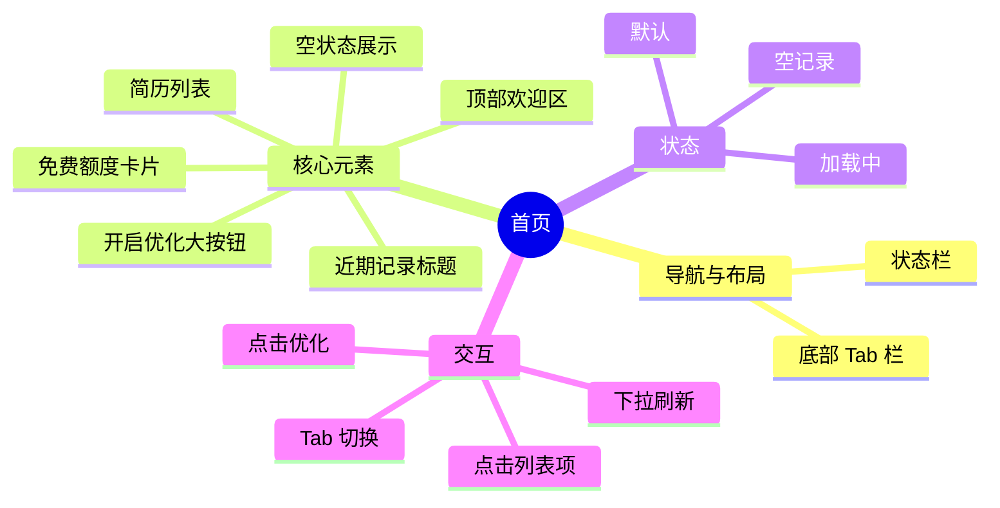

# 首页

## 0. 页面文档状态

- 文档版本：Draft
- 生成日期：2026-05-11
- 来源文件：`product/release/product-overview-release.md`
- 来源 Sitemap 行：
  - 生成顺序：20
  - 页面ID：U-020
  - 父页面ID：ROOT
  - 层级：L1
  - Surface：用户端App
  - Layout 区域：底部Tab 1
  - 页面名称：首页
  - 页面类型：工作台
  - Sitemap 页面级MD文件：product/development/pages/020-home.md
- 当前输出文件：product/development/pages/020-home.md
- 页面级假设 / 待确认编号规则：
  - 页面假设：`PA-001` 起，按首次出现顺序递增。
  - 页面待确认：`PQ-001` 起，按首次出现顺序递增。

## 1. 页面目标与上下文

### 1.1 页面目标

- 页面目的：展示核心业务入口，展示用户近期处理的简历。
- 用户目标：快速发起新的简历优化，或查看/继续编辑之前的简历。
- 业务目标：引导用户进入核心业务漏斗，提升简历分析转化率。
- 页面成功标准：用户点击“开启优化”或点击历史记录进入详情。

### 1.2 页面入口与出口

| 类型 | 来源 / 去向 | 触发条件 | 传入 / 传出数据 | 备注 |
|---|---|---|---|---|
| 入口 | 登录注册页 | 登录成功 | 用户 Token | |
| 出口 | 简历上传页 | 点击“开启优化” | 无 | 跳转至 U-020-010 (U-030) |
| 出口 | 简历编辑器 | 点击历史记录 | 简历 ID | 跳转至 U-020-040 (U-060) |
| 出口 | 个人中心 | 点击底部 Tab | 无 | 跳转至 U-030 (U-080) |

### 1.3 角色与权限

| 角色 | 是否可访问 | 权限条件 | 不满足时页面表现 | 相关 PA/PQ |
|---|---|---|---|---|
| 用户 | 是 | 已登录 | 正常展示 | |
| VIP 会员 | 是 | 已登录且会员有效 | 增加 VIP 标识展示 | |

### 1.4 全局页面属性

| 属性 | 类型 | 来源 | 默认值 | 影响元素 / 状态 | 说明 |
|---|---|---|---|---|---|
| has_history | boolean | API | false | 列表显示状态 | 是否有历史简历 |
| remaining_quota | number | API | 3 | 额度展示 | 剩余免费分析次数 |

## 2. 页面结构思维导图

## 3. 页面布局与内容区块

| 区块ID | 区块名称 | 区块类型 | 展示条件 | 包含元素ID | 布局 / 样式定义 | 数据来源 | 相关 PA/PQ |
|---|---|---|---|---|---|---|---|
| S-001 | 头部欢迎区 | header | 总是展示 | E-001, E-002 | 品牌背景，白色文字 | 用户信息 | |
| S-002 | 额度与入口区 | content | 总是展示 | E-003, E-004 | 悬浮卡片感 | API | |
| S-003 | 历史记录区 | content | has_history == true | E-005, E-006 | 垂直列表 | API | |
| S-004 | 空状态区 | content | has_history == false | E-007 | 居中展示插画 | 本地 | |
| S-005 | 全局导航区 | footer | 总是展示 | E-008 | 底部固定 Tab | 本地 | |

## 4. 页面元素清单

| 元素ID | 元素名称 | 元素类型 | 所属区块 | 是否必需 | 展示条件 | 默认文案 / 内容 | 样式定义 | 数据绑定 | 相关 PA/PQ |
|---|---|---|---|---|---|---|---|---|---|
| E-001 | 用户昵称 | text | S-001 | 是 | 总是展示 | 你好，求职者 | 20px, 白色 | user.nickname | |
| E-002 | VIP 勋章 | icon | S-001 | 否 | user.is_vip == true | VIP 图标 | 金色小图标 | user.is_vip | |
| E-003 | 剩余额度文案 | text | S-002 | 是 | user.is_vip == false | 今日剩余免费分析次数：${quota} | 14px, 灰色 | remaining_quota | |
| E-004 | 开启优化主按钮 | button | S-002 | 是 | 总是展示 | 开启 AI 简历优化 | 品牌色，大尺寸 | 无 | |
| E-005 | 近期记录标题 | text | S-003 | 是 | has_history == true | 近期优化记录 | 16px, 加粗 | 无 | |
| E-006 | 简历历史列表 | list | S-003 | 是 | has_history == true | 列表项 (名称, 时间, 匹配度) | 卡片流布局 | history_list | |
| E-007 | 空状态组件 | other | S-004 | 是 | has_history == false | 暂无记录，快去优化你的简历吧 | 插画 + 文案 | 无 | |
| E-008 | 底部导航 Tab | nav | S-005 | 是 | 总是展示 | 首页 / 个人中心 | 底部固定，两项 | current_tab | |

## 5. 元素状态矩阵

| 元素ID | 状态 | 触发条件 | 状态来源 | 样式定义 | 可执行动作 | 禁止动作 | 提示文案 / 反馈 | 恢复条件 | 相关 PA/PQ |
|---|---|---|---|---|---|---|---|---|---|
| E-004 | 默认 | 总是 | 本地 | 品牌色 | 点击跳转 | 无 | | | |
| E-006 | 加载中 | API 请求中 | API | 骨架屏 | 无 | 点击 | | API 返回 | |
| E-003 | 额度告急 | remaining_quota == 0 | API | 红色文字 | 无 | 无 | 免费额度已用完，开通 VIP 获取无限次 | 购买会员 | |

## 6. 交互 Action 与执行效果

| ActionID | 触发元素ID | 交互名称 | 用户动作 | 前置条件 | 校验规则 | 执行动作 | 成功结果 | 失败结果 | 页面跳转 / 状态变化 | 埋点事件ID | 埋点事件名称 | 不埋点原因 | 相关 PA/PQ |
|---|---|---|---|---|---|---|---|---|---|---|---|---|---|
| ACT-001 | E-004 | 点击开启优化 | 点击 | 无 | 无 | 导航跳转 | 进入上传页 | 无 | 跳转 U-030 | EVT-002 | 首页开启优化点击 | | |
| ACT-002 | E-006 | 点击历史记录 | 点击 | 列表项存在 | 无 | 导航跳转 | 进入编辑器 | 无 | 跳转 U-060 | EVT-003 | 首页历史记录点击 | | |
| ACT-003 | E-008 | 切换 Tab | 点击 | 非当前 Tab | 无 | 状态更新 | 切换视图 | 无 | 跳转 U-080 | EVT-004 | 首页底部Tab切换 | | |
| ACT-004 | 页面 | 下拉刷新 | 下拉 | 无 | 无 | 调 API-001 | 更新列表 | Toast 提示 | 数据更新 | EVT-005 | 首页下拉刷新 | | |

## 7. 埋点事件统计设计

### 7.1 埋点事件总表

| 埋点事件ID | 事件名称 | 事件类型 | 关联元素ID / ActionID | 触发时机 | 统计次数口径 | 去重规则 | 上报时机 | 关键属性 | 成功 / 失败归因 | 漏斗阶段 | 相关 PA/PQ |
|---|---|---|---|---|---|---|---|---|---|---|---|
| EVT-001 | 首页曝光 | page_view | 无 | 进入页面 | 每页面会话计 1 次 | sessionId | 实时 | page_id, page_name, is_vip | | | |
| EVT-002 | 开启优化点击 | click | ACT-001 | 点击主按钮 | 每次触发计 1 次 | actionId | 实时 | remaining_quota | | 优化漏斗起点 | |
| EVT-003 | 历史记录点击 | click | ACT-002 | 点击列表项 | 每次触发计 1 次 | actionId | 实时 | resume_id, match_score | | | |
| EVT-004 | 底部Tab切换 | click | ACT-003 | 点击 Tab 项 | 每次触发计 1 次 | actionId | 实时 | target_tab | | | |
| EVT-005 | 下拉刷新触发 | action | ACT-004 | 用户执行下拉 | 每次触发计 1 次 | actionId | 实时 | 无 | | | |

### 7.2 埋点事件属性定义

| 属性名 | 类型 | 必填 | 来源 | 示例值 | 使用事件ID | 说明 |
|---|---|---|---|---|---|---|
| page_id | string | 是 | Sitemap 页面ID | U-020 | EVT-001 | |
| is_vip | boolean | 是 | 用户状态 | true / false | EVT-001 | 是否为会员 |
| target_tab | string | 否 | Action 参数 | home / profile | EVT-004 | 目标 Tab |

## 8. 数据结构与接口定义

### 8.1 页面数据模型

| 数据对象 | 字段 | 类型 | 必填 | 来源 | 默认值 | 使用位置 | 说明 |
|---|---|---|---|---|---|---|---|
| HistoryItem | id | string | 是 | API | | E-006 | 简历唯一标识 |
| HistoryItem | title | string | 是 | API | | E-006 | 简历标题(通常是岗位名) |
| HistoryItem | update_time | string | 是 | API | | E-006 | 更新时间 |
| HistoryItem | match_score | number | 否 | API | | E-006 | 匹配得分 |

### 8.2 接口清单

| API ID | 接口名称 | 方法 | 路径 | 触发 ActionID | 请求数据结构 | 返回数据结构 | 成功处理 | 失败处理 | 相关 PA/PQ |
|---|---|---|---|---|---|---|---|---|---|
| API-001 | 获取首页数据 | GET | /api/home/overview | 页面载入 / ACT-004 | 无 | {quota, history_list[]} | 更新页面状态 | 错误提示 | |

## 9. 边界状态与错误处理

| 场景ID | 场景类型 | 触发条件 | 页面表现 | 元素表现 | 用户可执行操作 | 系统处理 | 兜底文案 | 相关 PA/PQ |
|---|---|---|---|---|---|---|---|---|
| EDGE-001 | 空历史 | history_list 为空 | 展示空状态区块 | S-004 展示 | 点击开启优化 | 隐藏 S-003 | 暂无记录，快去优化你的简历吧 | |

## 10. 多媒体与资源

| 资源ID | 资源类型 | 使用位置 | 来源 | 格式 / 尺寸 | 加载状态 | 失败降级 | 可访问性说明 | 相关 PA/PQ |
|---|---|---|---|---|---|---|---|---|
| M-001 | image | S-004 | 本地 | SVG | 总是加载 | 不展示 | 空状态插画 | |

## 11. 页面假设与待确认统一清单

### 11.1 页面假设清单

| 假设ID | 假设内容 | 首次出现位置 | 影响范围 | 影响元素 / Action / API / 埋点事件 | 置信度 | 用户确认状态 | Release 处理方式 |
|---|---|---|---|---|---|---|---|
| PA-001 | 首页仅展示最近的 5 条记录 | 4. 页面元素清单 | 列表长度 | E-006 | 中 | 待用户确认 | 确认为正式内容 |

### 11.2 页面待确认清单

| 待确认ID | 待确认问题 | 首次出现位置 | 影响范围 | 影响元素 / Action / API / 埋点事件 | 优先级 | 用户确认结果 | Release 处理方式 |
|---|---|---|---|---|---|---|---|
| PQ-001 | 是否需要在首页展示广告或 Banner 位？ | 3. 页面布局 | 布局扩展 | S-001 | 低 | 待用户确认 | 暂不添加 |
