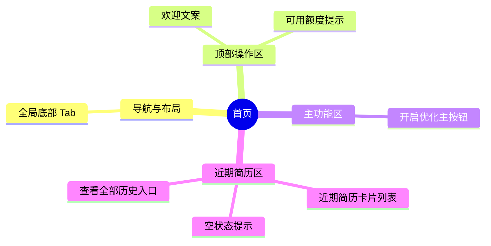

# 首页

## 0. 页面文档状态

- 文档版本：Draft
- 生成日期：2026-05-11
- 来源文件：`product/release/product-overview-release.md`
- 来源 Sitemap 行：
  - 生成顺序：20
  - 页面ID：U-020
  - 父页面ID：ROOT
  - 层级：L1
  - Surface：用户端App
  - Layout 区域：底部Tab 1
  - 页面名称：首页
  - 页面类型：工作台
  - Sitemap 页面级MD文件：`product/development/pages/020-home.md`
- 当前输出文件：`product/development/pages/020-home.md`
- 页面级假设 / 待确认编号规则：
  - 页面假设：`PA-001` 起，按首次出现顺序递增。
  - 页面待确认：`PQ-001` 起，按首次出现顺序递增。

## 1. 页面目标与上下文

### 1.1 页面目标

- 页面目的：App 的核心入口，承载“开启优化”主流程以及用户近期生成简历的快捷入口。
- 用户目标：快速启动一次新的 AI 简历优化流程，或者查看、继续编辑最近生成的简历。
- 业务目标：引导用户进行简历上传，提升核心业务转化率。
- 页面成功标准：用户点击“新建优化”进入上传页，或点击近期简历卡片进入编辑器。

### 1.2 页面入口与出口

| 类型 | 来源 / 去向 | 触发条件 | 传入 / 传出数据 | 备注 |
|---|---|---|---|---|
| 入口 | 登录注册页 (U-010) | 登录成功自动跳转 | 无 | |
| 入口 | App 启动页 | 检查到有效 Token 自动进入 | 无 | |
| 出口 | 简历上传页 (U-020-010) | 点击“开启优化”按钮 | 无 | |
| 出口 | 简历编辑器 (U-020-040) | 点击近期简历卡片 | 简历 ID | |
| 出口 | 个人中心 (U-030) | 点击底部 Tab | 无 | 切换底部导航 |

### 1.3 角色与权限

| 角色 | 是否可访问 | 权限条件 | 不满足时页面表现 | 相关 PA/PQ |
|---|---|---|---|---|
| 游客 | 否 | 需有效登录态 Token | 拦截并跳转到登录注册页 (U-010) | |
| 普通用户 | 是 | | 正常访问 | |
| VIP 会员 | 是 | | 正常访问 | |

### 1.4 全局页面属性

| 属性 | 类型 | 来源 | 默认值 | 影响元素 / 状态 | 说明 |
|---|---|---|---|---|---|
| recentResumes | array | API | `[]` | S-003, E-004, E-005 | 当前用户最近优化的简历列表 |

## 2. 页面结构思维导图



## 3. 页面布局与内容区块

| 区块ID | 区块名称 | 区块类型 | 展示条件 | 包含元素ID | 布局 / 样式定义 | 数据来源 | 相关 PA/PQ |
|---|---|---|---|---|---|---|---|
| S-001 | 顶部欢迎区 | header | 常驻 | E-001, E-002 | 靠上，大字号问候，副标题展示免费额度 | 本地计算 + 用户信息 API | （页面待确认 PQ-001：是否在首页展示今日免费剩余额度？） |
| S-002 | 新建入口区 | content | 常驻 | E-003 | 页面中央偏上，显眼的引导卡片或巨大按钮 | | |
| S-003 | 近期简历区 | content | 常驻 | E-004, E-005, E-006 | 卡片横向或竖向排列，最多展示 3-5 个 | recentResumes API | |
| S-004 | 底部导航 | footer | 常驻 | E-007, E-008 | 固定底部 Tab | | |

## 4. 页面元素清单

| 元素ID | 元素名称 | 元素类型 | 所属区块 | 是否必需 | 展示条件 | 默认文案 / 内容 | 样式定义 | 数据绑定 | 相关 PA/PQ |
|---|---|---|---|---|---|---|---|---|---|
| E-001 | 欢迎标题 | text | S-001 | 是 | 常驻 | "上午好，User" | 粗体，主色 | `user_info.nickname` | |
| E-002 | 额度提示 | text | S-001 | 否 | 普通用户且 PQ-001 成立 | "今日还可免费分析 3 次" | 灰色小字 | 额度 API | PQ-001 |
| E-003 | 开启优化主按钮 | button/card | S-002 | 是 | 常驻 | "上传简历，开启 AI 优化" | 强视觉引导大卡片/按钮，主色块 | | |
| E-004 | 近期简历卡片 | card | S-003 | 是 | `recentResumes.length > 0` | 显示岗位、时间、匹配度评分 | 包含小图标、白底阴影卡片 | `recentResumes` 项 | |
| E-005 | 近期简历空状态 | empty | S-003 | 是 | `recentResumes.length == 0` | "暂无近期简历，快去开启优化吧" | 居中灰色插图及文字 | | |
| E-006 | 查看全部链接 | link | S-003 | 否 | `recentResumes.length > 3` | "查看全部 >" | 标题右侧小字按钮 | | （页面假设 PA-001：首页只显示最新 3 个） |
| E-007 | 首页 Tab | tab | S-004 | 是 | 常驻 | 首页 Icon (激活态) | 主色图标 | | |
| E-008 | 个人中心 Tab | tab | S-004 | 是 | 常驻 | 个人中心 Icon | 灰色图标 | | |

## 5. 元素状态矩阵

| 元素ID | 状态 | 触发条件 | 状态来源 | 样式定义 | 可执行动作 | 禁止动作 | 提示文案 / 反馈 | 恢复条件 | 相关 PA/PQ |
|---|---|---|---|---|---|---|---|---|---|
| S-003 | 加载 | 列表接口请求中 | 接口请求 | 显示骨架屏 (Skeleton) | | 点击卡片 | | 接口返回数据 | |
| E-002 | 警告 | 今日免费额度为 0 | 额度校验 | 文字标红 | | | "今日免费次数已用完，开通 VIP 享无限次" | 开通 VIP / 次日刷新 | |
| S-003 | 错误 | 列表接口报错 | 接口请求 | 显示加载失败区域 | 点击重试 | | "加载失败，点击重试" | 重试成功 | |

## 6. 交互 Action 与执行效果

| ActionID | 触发元素ID | 交互名称 | 用户动作 | 前置条件 | 校验规则 | 执行动作 | 成功结果 | 失败结果 | 页面跳转 / 状态变化 | 埋点事件 | 相关 PA/PQ |
|---|---|---|---|---|---|---|---|---|---|---|---|
| ACT-001 | E-003 | 点击新建优化 | 点击 | 无 | 无 | 导航跳转 | | | 跳转至 U-020-010 简历上传页 | `click_new_resume` | |
| ACT-002 | E-004 | 点击近期简历 | 点击 | 选中目标简历 | 无 | 导航跳转并传参 | | | 携带 `resume_id` 跳转至 U-020-040 | `click_recent_resume` | |
| ACT-003 | E-006 | 点击查看全部 | 点击 | 无 | 无 | 导航跳转 | | | 跳转至 U-030-020 历史简历页 | `click_view_all_history` | |
| ACT-004 | E-008 | 切换底部 Tab | 点击 | 无 | 无 | 导航跳转 | | | 切换到 U-030 个人中心 | `switch_tab_profile` | |

## 7. 数据结构与接口定义

### 7.1 页面数据模型

| 数据对象 | 字段 | 类型 | 必填 | 来源 | 默认值 | 使用位置 | 说明 |
|---|---|---|---|---|---|---|---|
| ResumeList | resume_id | string | 是 | API | | ACT-002 | |
| ResumeList | target_job | string | 否 | API | "未设置" | E-004 | 优化目标岗位名称 |
| ResumeList | update_time | string | 是 | API | | E-004 | 最近更新时间 |
| ResumeList | ai_score | number | 否 | API | | E-004 | 简历健康度/匹配度分数 |

### 7.2 接口清单

| API ID | 接口名称 | 方法 | 路径 | 触发 ActionID | 请求数据结构 | 返回数据结构 | 成功处理 | 失败处理 | 相关 PA/PQ |
|---|---|---|---|---|---|---|---|---|---|
| API-001 | 获取近期简历列表 | GET | `/api/v1/resume/recent` | 页面初始化 | `{ "limit": 3 }` | `{ "list": [ResumeList] }` | 渲染 S-003 区域 | 显示错误空状态 | |
| API-002 | 获取用户基础信息 | GET | `/api/v1/user/info` | 页面初始化 | 无 | `{ "nickname": "", "remain_free_count": 3, "is_vip": false }` | 渲染顶部欢迎及额度 | 隐藏额度提示 | |

### 7.3 请求 / 返回 JSON 示例

#### API-001 成功返回

```json
{
  "code": 0,
  "message": "success",
  "data": {
    "list": [
      {
        "resume_id": "R_1001",
        "target_job": "产品经理",
        "update_time": "2026-05-11 10:00:00",
        "ai_score": 85
      }
    ]
  }
}
```

## 8. 边界状态与错误处理

| 场景ID | 场景类型 | 触发条件 | 页面表现 | 元素表现 | 用户可执行操作 | 系统处理 | 兜底文案 | 相关 PA/PQ |
|---|---|---|---|---|---|---|---|---|
| EDGE-001 | 未登录回退 | 本地 token 失效或被服务端踢出 | 强制弹出提示并跳走 | | 重新登录 | 重定向到 U-010 | "登录状态已失效，请重新登录" | |

## 9. 多媒体与资源

| 资源ID | 资源类型 | 使用位置 | 来源 | 格式 / 尺寸 | 加载状态 | 失败降级 | 可访问性说明 | 相关 PA/PQ |
|---|---|---|---|---|---|---|---|---|
| M-001 | image | E-003 开启优化按钮插画 | 本地预置 | SVG / PNG | | 纯色背景+文字 | 装饰性插画 | |
| M-002 | image | E-005 近期简历空状态插画 | 本地预置 | SVG | | 文字占位 | 装饰性插画 | |

## 10. 页面假设与待确认统一清单

### 10.1 页面假设清单

| 假设ID | 假设内容 | 首次出现位置 | 影响范围 | 影响元素 / Action / API | 置信度 | 用户确认状态 | Release 处理方式 |
|---|---|---|---|---|---|---|---|
| PA-001 | 首页“近期简历”区块为了节省屏幕空间，最多只显示最新的 3 个，超出显示“查看全部”跳转到历史列表 | 4 页面元素清单 (E-006) | UI 布局及接口传参 | E-006, API-001 | 高 | 待确认 | 确认为正式内容 |

### 10.2 页面待确认清单

| 待确认ID | 待确认问题 | 首次出现位置 | 影响范围 | 影响元素 / Action / API | 优先级 | 用户确认结果 | Release 处理方式 |
|---|---|---|---|---|---|---|---|
| PQ-001 | 首页顶部是否需要展示今日剩余的免费 AI 分析额度以刺激用户消费/开通VIP？ | 3 页面布局与内容区块 (S-001) | UI 内容与接口字段 | S-001, E-002, API-002 | 中 | 待确认 | 根据产品运营策略确认是否显示 |
