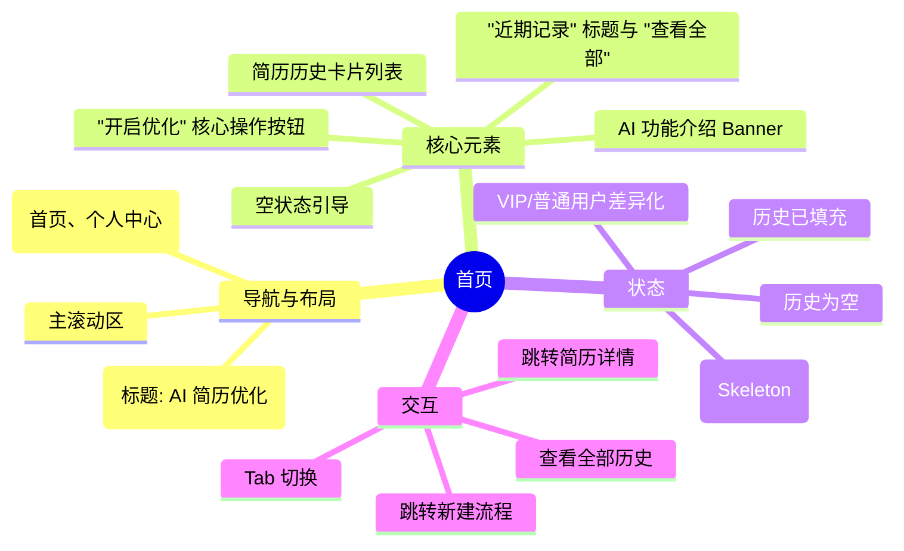

# 首页

## 0. 页面文档状态

- 文档版本：Draft
- 生成日期：2026-05-12
- 来源文件：`product/release/product-overview-release.md`
- 来源 Sitemap 行：
  - 生成顺序：20
  - 页面ID：U-020
  - 父页面ID：ROOT
  - 层级：L1
  - Surface：用户端App
  - Layout 区域：底部Tab 1
  - 页面名称：首页
  - 页面类型：工作台
  - Sitemap 页面级MD文件：product/development/pages/020-home.md
- 当前输出文件：product/development/pages/020-home.md
- 页面级假设 / 待确认编号规则：
  - 页面假设：`PA-001` 起，按首次出现顺序递增。
  - 页面待确认：`PQ-001` 起，按首次出现顺序递增。
  - 正文、表格、接口、状态、元素中出现的每个 `PA-*` / `PQ-*` 必须在 `页面假设与待确认统一清单` 中出现。

## 1. 页面目标与上下文

### 1.1 页面目标

- 页面目的：作为应用的核心工作台，提供简历优化的快速入口并展示近期处理记录。
- 用户目标：一键开启 AI 简历优化，或者快速查看/继续编辑之前的简历。
- 业务目标：通过直观的 AI 功能展示吸引用户尝试，并通过历史记录沉淀提升用户留存。
- 页面成功标准：首页“开启优化”按钮点击率 > 40%（页面假设 PA-001：首页核心转化目标）。

### 1.2 页面入口与出口

| 类型 | 来源 / 去向 | 触发条件 | 传入 / 传出数据 | 备注 |
|---|---|---|---|---|
| 入口 | 登录注册页 (U-010) | 登录成功后跳转 | 无 | - |
| 入口 | 个人中心 (U-030) | 点击底部 Tab 1 | 无 | 切换 Tab |
| 出口 | 简历上传页 (U-020-010) | 点击“开启优化”按钮 | 无 | 进入核心路径 |
| 出口 | 历史简历页 (U-030-020) | 点击“查看全部”历史 | 无 | - |
| 出口 | 简历编辑器 (U-020-040) | 点击近期简历卡片 | 简历 ID | 继续编辑/查看 |
| 出口 | 会员订阅页 (U-030-010) | 点击 Banner 或 VIP 引导 | 无 | - |

### 1.3 角色与权限

| 角色 | 是否可访问 | 权限条件 | 不满足时页面表现 | 相关 PA/PQ |
|---|---|---|---|---|
| 游客 | 否 | 需登录 | 自动拦截并跳转至登录页 (U-010) | - |
| 普通用户 | 是 | 已登录 | 正常显示，含 VIP 升级引导 | - |
| VIP 会员 | 是 | 已登录 | 正常显示，展示 VIP 专属标识 | - |

### 1.4 全局页面属性

| 属性 | 类型 | 来源 | 默认值 | 影响元素 / 状态 | 说明 |
|---|---|---|---|---|---|
| vipStatus | boolean | global store | false | E-002, E-006 | 影响 Banner 文案及卡片标识 |
| hasHistory | boolean | API | false | S-002 | 控制历史记录区与空状态的切换 |

## 2. 页面结构思维导图



## 3. 页面布局与内容区块

| 区块ID | 区块名称 | 区块类型 | 展示条件 | 包含元素ID | 布局 / 样式定义 | 数据来源 | 相关 PA/PQ |
|---|---|---|---|---|---|---|---|
| S-001 | 核心操作区 | content | 始终显示 | E-002, E-003 | 页面顶部，含 Banner 与高亮按钮 | 本地/配置 | - |
| S-002 | 近期记录区 | content | hasHistory == true | E-004, E-005, E-006 | 页面中部，列表形式 | API-001 | - |
| S-003 | 空状态引导区 | content | hasHistory == false | E-007 | 居中展示，引导上传 | 本地资源 | - |
| S-004 | 全局导航区 | footer | 始终显示 | E-008 | 底部固定 Tab 栏 | 本地配置 | - |

## 4. 页面元素清单

| 元素ID | 元素名称 | 元素类型 | 所属区块 | 是否必需 | 展示条件 | 默认文案 / 内容 | 样式定义 | 数据绑定 | 相关 PA/PQ |
|---|---|---|---|---|---|---|---|---|---|
| E-001 | 页面标题 | nav | Top Nav | 是 | 始终显示 | AI 简历优化 | 居中，粗体 18px | 无 | - |
| E-002 | AI 升级 Banner | banner | S-001 | 是 | 始终显示 | VIP 享无限次 AI 分析 | 渐变背景，圆角 12px | vipStatus | - |
| E-003 | 开启优化按钮 | button | S-001 | 是 | 始终显示 | 开启 AI 优化 | 大尺寸，品牌主色，阴影 | 无 | - |
| E-004 | 近期记录标题 | text | S-002 | 是 | 历史不为空 | 近期记录 | 16px, 粗体 | 无 | - |
| E-005 | 查看全部链接 | link | S-002 | 是 | 历史不为空 | 查看全部 > | 14px, 灰色 | 无 | - |
| E-006 | 简历记录卡片 | card | S-002 | 否 | 按数据循环 | 简历名称, 时间, 匹配度 | 左右结构，含状态标签 | historyList | - |
| E-007 | 空状态组件 | other | S-003 | 否 | 历史为空 | 暂无记录，立即开始 | 插画 + 文字引导 | 无 | - |
| E-008 | 底部 Tab 栏 | nav | S-004 | 是 | 始终显示 | 首页, 个人中心 | 图标+文字, H: 49px | activeTab | - |

## 5. 元素状态矩阵

| 元素ID | 状态 | 触发条件 | 状态来源 | 样式定义 | 可执行动作 | 禁止动作 | 提示文案 / 反馈 | 恢复条件 | 相关 PA/PQ |
|---|---|---|---|---|---|---|---|---|---|
| E-002 | 普通状态 | vipStatus == false | global | 升级 VIP 引导文案 | 点击跳转订阅 | - | - | - | - |
| E-002 | VIP 状态 | vipStatus == true | global | VIP 专属特权介绍 | 点击查看权益 | - | - | - | - |
| E-003 | 默认 | 始终 | - | 呼吸灯微动效 | 点击跳转 | - | - | - | - |
| E-006 | 解析中 | status == 'processing' | API | 文字置灰，显示 Loading | 查看进度 | 编辑 | 正在分析中... | 轮询完成 | - |
| E-006 | 已完成 | status == 'done' | API | 显示匹配度分数 | 点击进入编辑 | - | 匹配度: 85% | - | - |
| E-008 | 首页选中 | activeTab == 'home' | local | 首页图标高亮 | - | 点击首页 | - | 切换 Tab | - |

## 6. 交互 Action 与执行效果

| ActionID | 触发元素ID | 交互名称 | 用户动作 | 前置条件 | 校验规则 | 执行动作 | 成功结果 | 失败结果 | 页面跳转 / 状态变化 | 埋点事件ID | 埋点事件名称 | 不埋点原因 | 相关 PA/PQ |
|---|---|---|---|---|---|---|---|---|---|---|---|---|---|
| ACT-001 | E-003 | 开启新建优化 | 点击 | 登录态 | 无 | 路由导航 | 进入上传页 | - | 跳转至 U-020-010 | EVT-002 | 开启优化点击 | - | - |
| ACT-002 | E-006 | 查看简历详情 | 点击 | 登录态 | 无 | 路由导航 | 进入编辑器 | - | 跳转至 U-020-040 | EVT-003 | 简历卡片点击 | - | - |
| ACT-003 | E-005 | 查看全部历史 | 点击 | 登录态 | 无 | 路由导航 | 进入历史列表 | - | 跳转至 U-030-020 | EVT-004 | 查看全部点击 | - | - |
| ACT-004 | E-002 | 点击 Banner | 点击 | 无 | 无 | 路由导航 | 进入订阅页 | - | 跳转至 U-030-010 | EVT-005 | 首页Banner点击 | - | - |
| ACT-005 | E-008 | 切换个人中心 | 点击 | 无 | 无 | Tab 切换 | 显示个人中心 | - | 切换至 U-030 | EVT-006 | 个人中心Tab点击 | - | - |

## 7. 埋点事件统计设计

### 7.1 埋点事件总表

| 埋点事件ID | 事件名称 | 事件类型 | 关联元素ID / ActionID | 触发时机 | 统计次数口径 | 去重规则 | 上报时机 | 关键属性 | 成功 / 失败归因 | 漏斗阶段 | 相关 PA/PQ |
|---|---|---|---|---|---|---|---|---|---|---|---|
| EVT-001 | 首页曝光 | page_view | - | 页面进入 | 每会话 1 次 | sessionId | 实时 | page_id, user_role, vip_status | - | 首页活跃 | - |
| EVT-002 | 开启优化点击 | click | ACT-001 | 点击核心按钮 | 每次计 1 次 | 无 | 实时 | source | - | 优化漏斗-1 | - |
| EVT-003 | 简历卡片点击 | click | ACT-002 | 点击历史卡片 | 每次计 1 次 | 无 | 实时 | resume_id, status | - | 历史复访 | - |
| EVT-004 | 查看全部点击 | click | ACT-003 | 点击查看全部 | 每次计 1 次 | 无 | 实时 | - | - | 深度浏览 | - |
| EVT-008 | 历史数据加载结果 | api_result | API-001 | 接口返回 | 每次计 1 次 | requestId | 接口返回 | result, resume_count | - | 技术指标 | - |

### 7.2 埋点事件属性定义

| 属性名 | 类型 | 必填 | 来源 | 示例值 | 使用事件ID | 说明 |
|---|---|---|---|---|---|---|
| page_id | string | 是 | Sitemap | U-020 | EVT-001 | 页面标识 |
| vip_status | boolean | 是 | Global | true | EVT-001 | 是否为 VIP |
| resume_id | string | 否 | API | res_667 | EVT-003 | 简历唯一标识 |
| resume_count | number | 否 | API | 5 | EVT-008 | 返回的历史记录条数 |

### 7.3 关键统计次数说明

- 首页核心转化率：EVT-002 / EVT-001。
- 历史记录留存贡献：EVT-003 / EVT-001。
- 首页 Banner 转化率：EVT-005 / EVT-001。

## 8. 数据结构与接口定义

### 8.1 页面数据模型

| 数据对象 | 字段 | 类型 | 必填 | 来源 | 默认值 | 使用位置 | 说明 |
|---|---|---|---|---|---|---|---|
| historyList | id | string | 是 | API | - | E-006 | 简历 ID |
| historyList | name | string | 是 | API | "未命名简历" | E-006 | 简历标题 |
| historyList | time | string | 是 | API | - | E-006 | 更新时间 |
| historyList | score | number | 否 | API | 0 | E-006 | 匹配度评分 |
| historyList | status | enum | 是 | API | 'done' | E-006 | 状态：processing/done/failed |

### 8.2 接口清单

| API ID | 接口名称 | 方法 | 路径 | 触发 ActionID | 请求数据结构 | 返回数据结构 | 成功处理 | 失败处理 | 相关 PA/PQ |
|---|---|---|---|---|---|---|---|---|---|
| API-001 | 获取近期简历 | GET | /resume/recent | 页面进入自动触发 | { limit: 3 } | { list: array } | 更新 historyList | 显示空状态或错误 | - |

## 8.3 请求 / 返回 JSON 示例

#### API-001 成功返回
```json
{
  "code": 0,
  "message": "ok",
  "data": {
    "list": [
      {
        "id": "res_001",
        "name": "产品经理简历-王小明",
        "time": "2026-05-12 10:00",
        "score": 88,
        "status": "done"
      },
      {
        "id": "res_002",
        "name": "运营专家简历",
        "time": "2026-05-11 15:30",
        "score": 0,
        "status": "processing"
      }
    ]
  }
}
```

## 9. 边界状态与错误处理

| 场景ID | 场景类型 | 触发条件 | 页面表现 | 元素表现 | 用户可执行操作 | 系统处理 | 兜底文案 | 相关 PA/PQ |
|---|---|---|---|---|---|---|---|---|
| EDGE-001 | 历史为空 | API 返回 list 为空 | 展示 S-003 | E-007 居中显示 | 点击“开启优化” | 引导新建流程 | 开启你的第一份 AI 简历优化吧 | - |
| EDGE-002 | 列表加载失败 | 接口 500 或超时 | 展示 S-002 占位 | 显示重试按钮 | 点击重试 | 再次调用 API-001 | 记录加载失败，请检查网络 | - |
| EDGE-003 | VIP 权益过期 | token 校验 vip 为 false | Banner 切换 | E-002 变为升级引导 | 点击升级 | 更新本地状态 | 立即开通 VIP，解锁更多特权 | - |

## 10. 多媒体与资源

| 资源ID | 资源类型 | 使用位置 | 来源 | 格式 / 尺寸 | 加载状态 | 失败降级 | 可访问性说明 | 相关 PA/PQ |
|---|---|---|---|---|---|---|---|---|
| M-001 | image | E-007 | 本地插画 | SVG | 静态 | 文本占位 | 空状态引导图 | - |
| M-002 | icon | E-008 | 矢量图标库 | SVG/IconFont | 静态 | 文本显示 | 导航图标 | - |

## 11. 页面假设与待确认统一清单

### 11.1 页面假设清单

| 假设ID | 假设内容 | 首次出现位置 | 影响范围 | 影响元素 / Action / API / 埋点事件 | 置信度 | 用户确认状态 | Release 处理方式 |
|---|---|---|---|---|---|---|---|
| PA-001 | 首页核心转化目标定为 40% | 1.1 页面目标 | 业务衡量指标 | 埋点分析 | 中 | 待确认 | 确认为正式内容 |
| PA-002 | 近期记录仅展示最近 3 条 | 8.2 接口清单 | 数据量 | API-001 | 高 | 待确认 | 确认为正式内容 |

### 11.2 页面待确认清单

| 待确认ID | 待确认问题 | 首次出现位置 | 影响范围 | 影响元素 / Action / API / 埋点事件 | 优先级 | 用户确认结果 | Release 处理方式 |
|---|---|---|---|---|---|---|---|
| PQ-001 | 首页是否需要展示个性化的简历优化小贴士？ | 4. 元素清单 | 内容布局 | S-001 | 低 | 待确认 | 暂不添加 |
| PQ-002 | 底部 Tab 栏是否需要红点提醒 (如历史简历有更新)？ | 4. 元素清单 | 提醒机制 | E-008 | 低 | 待确认 | 暂不添加 |

## 12. 用户补充描述

> 本章节必须保留在页面 Draft 文档末尾，供用户用自然语言补充或修改当前页面需求。`product-page-release` 生成 release 版本时必须读取、分析并应用这里的内容。
> 如果没有补充，请保留“无”。

```text
无
```
