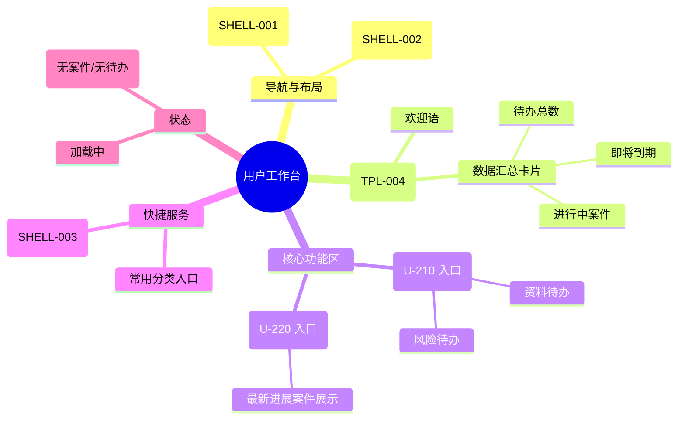

# 用户工作台

## 0. 页面文档状态

- 文档版本：Draft v2
- 生成日期：2026-05-13
- 来源文件：`product/release/product-sitemap-release.md`
- 来源主稿：`product/development/pages/020-user-dashboard/index.md`
- 来源 Sitemap 行：
  - 生成顺序：20
  - 页面ID：U-200
  - 父页面ID：ROOT
  - 层级：L1
  - Surface：用户端
  - Layout 区域：主导航
  - 页面名称：用户工作台
  - 页面类型：工作台
  - Sitemap 页面级MD文件：product/development/pages/020-user-dashboard.md
- 当前输出文件：product/development/pages/020-user-dashboard/index-v2.md
- 页面级假设 / 待确认编号规则：
  - 页面假设：`PA-001` 起，按首次出现顺序递增。
  - 页面待确认：`PQ-001` 起，按首次出现顺序递增。

## 1. 页面目标与上下文

### 1.1 页面目标

- 页面目的：作为登录后的默认首页，汇总用户最关注的待办事项与案件进度概览。
- 用户目标：快速了解“我有哪些活要干”以及“我的案件到哪了”。
- 业务目标：引导用户及时提交材料，降低案件停滞率。
- 页面成功标准：首页点击待办/进度卡片的转化率。

### 1.2 页面入口与出口

| 类型 | 来源 / 去向 | 触发条件 | 传入 / 传出数据 | 备注 |
|---|---|---|---|---|
| 入口 | 登录页 (U-100) | 登录成功 | 无 | 默认首页 |
| 入口 | 顶栏导航 | 点击“工作台” | 无 |  |
| 出口 | 待办事项列表 (U-210) | 点击“待办事项”卡片/更多 | 筛选条件 |  |
| 出口 | 进度查询列表 (U-220) | 点击“进度查询”卡片/更多 | 筛选条件 |  |
| 出口 | 案件详情 (U-520) | 点击概览中的具体案件 | 案件 ID |  |

### 1.3 角色与权限

| 角色 | 是否可访问 | 权限条件 | 不满足时页面表现 | 相关 PA/PQ |
|---|---|---|---|---|
| 客户用户 | 是 | 已登录 | 拦截并跳转登录页 |  |

### 1.4 全局页面属性

| 属性 | 类型 | 来源 | 默认值 | 影响元素 / 状态 | 说明 |
|---|---|---|---|---|---|
| current_company_id | string | global store | first company | 数据统计范围 | 当前选中的公司 ID（数据仅作展示，不支持切换） |

## 2. 页面结构思维导图



## 3. 页面布局与内容区块

| 区块ID | 区块名称 | 区块类型 | 展示条件 | 包含元素ID | 布局 / 样式定义 | 数据来源 | 相关 PA/PQ |
|---|---|---|---|---|---|---|---|
| S-001 | 欢迎与数据概览 | header | 总是显示 | E-001, E-002 | 1280px 居中，通栏背景 | API-001 |  |
| S-002 | 核心功能卡片组 | content | 总是显示 | E-003, E-004 | 左右/上下排列卡片 | API-002 |  |
| S-003 | 常用服务入口 | content | 总是显示 | E-005 | 宫格布局 | 本地配置 |  |

## 4. 页面元素清单

| 元素ID | 元素名称 | 元素类型 | 所属区块 | 是否必需 | 展示条件 | 默认文案 / 内容 | 样式定义 | 数据绑定 | 相关 PA/PQ |
|---|---|---|---|---|---|---|---|---|---|
| E-001 | 欢迎语 | other | S-001 | 是 | 总是显示 | 您好，{nickname} | 标题 H2 | nickname |  |
| E-002 | 统计指标卡片 | list | S-001 | 是 | 总是显示 | 待办 / 进度 / 到期 | 横向分布 | statistics |  |
| E-003 | 待办提醒区块 | card | S-002 | 是 | 总是显示 | 待办事项 (数量) | 带阴影卡片，高风险项带红色徽标 | todo_count |  |
| E-004 | 进度概览区块 | card | S-002 | 是 | 总是显示 | 进度查询 (数量) | 带阴影卡片 | progress_count |  |
| E-005 | 常用分类 Grid | grid | S-003 | 是 | 总是显示 | 商标 / 专利 / VAT | 图标+文字 | - |  |
| E-006 | 悬浮客服 | button | Global | 是 | 登录后 | 客服图标 | SHELL-003 固定位置 | - |  |

## 5. 元素状态矩阵

| 元素ID | 状态 | 触发条件 | 状态来源 | 样式定义 | 可执行动作 | 禁止动作 | 提示文案 / 反馈 | 恢复条件 | 相关 PA/PQ |
|---|---|---|---|---|---|---|---|---|---|
| E-003 | 告警状态 | 存在高风险待办 | todo_level="high" | 红色徽标/描边 | 点击查看 | - | 存在 {n} 项紧急待办 | 待办处理完成 |  |
| E-004 | 空状态 | 无进行中案件 | progress_count=0 | 显示插画 | 点击去浏览服务 | - | 暂无进行中的服务 | 下单成功 |  |

## 6. 交互 Action 与执行效果

| ActionID | 触发元素ID | 交互名称 | 用户动作 | 前置条件 | 校验规则 | 执行动作 | 成功结果 | 失败结果 | 页面跳转 / 状态变化 | 埋点事件ID | 埋点事件名称 | 不埋点原因 | 相关 PA/PQ |
|---|---|---|---|---|---|---|---|---|---|---|---|---|---|
| ACT-001 | E-003 | 跳转待办列表 | 点击卡片 | - | - | 导航 | - | - | 跳转 U-210 | EVT-002 | 待办卡片点击 | - |  |
| ACT-002 | E-004 | 跳转进度列表 | 点击卡片 | - | - | 导航 | - | - | 跳转 U-220 | EVT-003 | 进度卡片点击 | - |  |
| ACT-003 | E-005 | 跳转服务目录 | 点击分类 | - | - | 导航 | - | - | 跳转 U-300 (带分类) | EVT-004 | 快捷入口点击 | - |  |

## 7. 埋点事件统计设计

### 7.1 埋点事件总表

| 埋点事件ID | 事件名称 | 事件类型 | 关联元素ID / ActionID | 触发时机 | 统计次数口径 | 去重规则 | 上报时机 | 关键属性 | 成功 / 失败归因 | 漏斗阶段 | 相关 PA/PQ |
|---|---|---|---|---|---|---|---|---|---|---|---|
| EVT-001 | 工作台曝光 | page_view | - | 页面进入 | 每会话 1 次 | sessionId | 实时 | user_id, todo_count | - | 首页 |  |
| EVT-002 | 待办卡片点击 | click | E-003 | 点击 | 每次触发 1 次 | - | 实时 | todo_count | - | 分流 |  |
| EVT-003 | 进度卡片点击 | click | E-004 | 点击 | 每次触发 1 次 | - | 实时 | progress_count | - | 分流 |  |

## 8. 数据结构与接口定义

### 8.1 页面数据模型

| 数据对象 | 字段 | 类型 | 必填 | 来源 | 默认值 | 使用位置 | 说明 |
|---|---|---|---|---|---|---|---|
| DashboardData | nickname | string | 是 | API | "用户" | E-001 |  |
| DashboardData | statistics | object | 是 | API | {todo:0, progress:0, expiring:0} | E-002 |  |
| DashboardData | urgent_todos | array | 否 | API | [] | E-003 | 前 3 条紧急待办 |

### 8.2 接口清单

| API ID | 接口名称 | 方法 | 路径 | 触发 ActionID | 请求数据结构 | 返回数据结构 | 成功处理 | 失败处理 | 相关 PA/PQ |
|---|---|---|---|---|---|---|---|---|---|
| API-001 | 获取工作台概览 | GET | /api/dashboard/overview | 页面加载 | - | {nickname, statistics, urgent_todos} | 渲染页面 | 显示错误占位 |  |

## 9. 边界状态与错误处理

| 场景ID | 场景类型 | 触发条件 | 页面表现 | 元素表现 | 用户可执行操作 | 系统处理 | 兜底文案 | 相关 PA/PQ |
|---|---|---|---|---|---|---|---|---|
| EDGE-001 | 暂无数据 | 接口返回统计为 0 | 概览区显示 0 | 功能区显示空状态插画 | 去浏览服务 | - | 开启您的首个合规服务 |  |

## 10. 多媒体与资源

|  resourceID | 资源类型 | 使用位置 | 来源 | 格式 | 说明 |
|---|---|---|---|---|---|
| M-001 | image | E-004 | 本地 | SVG/PNG | 空状态插画 |

## 11. 页面假设与待确认统一清单

### 11.1 页面假设清单

| 假设ID | 假设内容 | 首次出现位置 | 影响范围 | 影响元素 / Action / API / 埋点事件 | 置信度 | 用户确认状态 | Release 处理方式 |
|---|---|---|---|---|---|---|---|
| - | - | - | - | - | - | - | - |

### 11.2 页面待确认清单

| 待确认ID | 待确认问题 | 首次出现位置 | 影响范围 | 影响元素 / Action / API / 埋点事件 | 优先级 | 用户确认结果 | Release 处理方式 |
|---|---|---|---|---|---|---|---|
| - | - | - | - | - | - | - | - |

## 12. 用户补充描述

> 本章节必须保留在页面 Draft 文档末尾，供用户用自然语言补充或修改当前页面需求。`product-page-release` 生成 release 版本时必须读取、分析并应用这里的内容。
> 如果没有补充，请保留“无”。

```text
无
```
