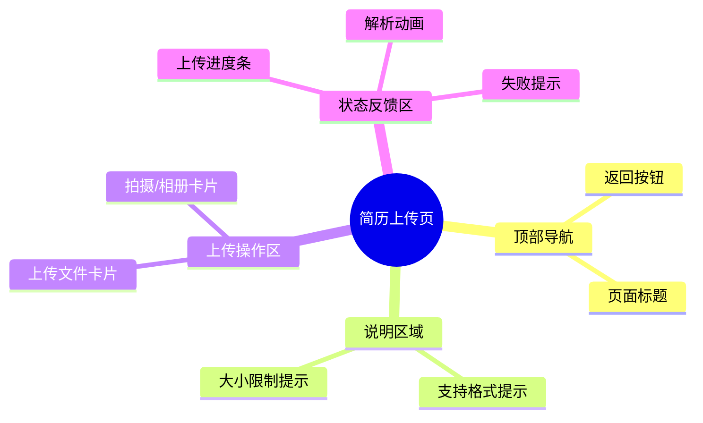

# 简历上传页

## 0. 页面文档状态

- 文档版本：Draft
- 生成日期：2026-05-11
- 来源文件：`product/release/product-overview-release.md`
- 来源 Sitemap 行：
  - 生成顺序：30
  - 页面ID：U-020-010
  - 父页面ID：U-020
  - 层级：L2
  - Surface：用户端App
  - Layout 区域：独立层级
  - 页面名称：简历上传页
  - 页面类型：表单/上传
  - Sitemap 页面级MD文件：`product/development/pages/030-upload.md`
- 当前输出文件：`product/development/pages/030-upload.md`
- 页面级假设 / 待确认编号规则：
  - 页面假设：`PA-001` 起，按首次出现顺序递增。
  - 页面待确认：`PQ-001` 起，按首次出现顺序递增。

## 1. 页面目标与上下文

### 1.1 页面目标

- 页面目的：接收用户的原始简历内容，作为 AI 优化的最初始输入。
- 用户目标：通过最便捷的方式（本地文件、照片）上传自己现有的旧简历。
- 业务目标：确保高成功率的文件上传与 OCR 解析，降低用户在此步的流失。
- 页面成功标准：简历文件成功上传，解析完成，并跳转至岗位目标设置页。

### 1.2 页面入口与出口

| 类型 | 来源 / 去向 | 触发条件 | 传入 / 传出数据 | 备注 |
|---|---|---|---|---|
| 入口 | 首页 (U-020) | 点击“上传简历，开启 AI 优化”主按钮 | 无 | |
| 出口 | 岗位目标设置页 (U-020-020) | 文件上传成功且解析完毕 | 简历内容文本/ID | |

### 1.3 角色与权限

| 角色 | 是否可访问 | 权限条件 | 不满足时页面表现 | 相关 PA/PQ |
|---|---|---|---|---|
| 普通用户/VIP | 是 | 需登录态 | 若未登录则拦截至 U-010 | |

### 1.4 全局页面属性

| 属性 | 类型 | 来源 | 默认值 | 影响元素 / 状态 | 说明 |
|---|---|---|---|---|---|
| uploadStatus | enum | local state | `IDLE` | S-002 | `IDLE`, `UPLOADING`, `PARSING`, `SUCCESS`, `ERROR` |
| uploadProgress | number | API | 0 | E-006 | 0-100 上传/解析进度 |

## 2. 页面结构思维导图



## 3. 页面布局与内容区块

| 区块ID | 区块名称 | 区块类型 | 展示条件 | 包含元素ID | 布局 / 样式定义 | 数据来源 | 相关 PA/PQ |
|---|---|---|---|---|---|---|---|
| S-001 | 页面头部 | header | 常驻 | E-001, E-002 | 标准顶部 Navigation Bar | | |
| S-002 | 核心上传区 | content | 常驻 | E-003, E-004, E-005, E-006 | 屏幕中央大面积卡片或分块按钮，展示上传方式或进度 | `uploadStatus` | |
| S-003 | 帮助提示区 | footer | 常驻 | E-007 | 底部小字提示支持的格式及限制 | | |

## 4. 页面元素清单

| 元素ID | 元素名称 | 元素类型 | 所属区块 | 是否必需 | 展示条件 | 默认文案 / 内容 | 样式定义 | 数据绑定 | 相关 PA/PQ |
|---|---|---|---|---|---|---|---|---|---|
| E-001 | 返回按钮 | icon | S-001 | 是 | 常驻 | 返回箭头 | | | |
| E-002 | 页面标题 | text | S-001 | 是 | 常驻 | "上传简历" | 居中标题 | | |
| E-003 | 文件上传入口 | button/card | S-002 | 是 | `uploadStatus === IDLE` | "选择本地文档" | 带图标的大面积按钮 | | |
| E-004 | 照片上传入口 | button/card | S-002 | 是 | `uploadStatus === IDLE` | "拍照 / 选择相册" | 带图标的大面积按钮 | | （页面假设 PA-001：同时支持拍照和相册） |
| E-005 | 解析状态提示 | text | S-002 | 否 | `uploadStatus === PARSING` | "AI 正在努力阅读您的简历..." | 居中状态文案 | | |
| E-006 | 进度条 | progress | S-002 | 否 | `uploadStatus === UPLOADING || PARSING` | | 水平进度条或圆形进度圈 | `uploadProgress` | |
| E-007 | 格式提示说明 | text | S-003 | 是 | 常驻 | "支持 PDF, DOC, DOCX 及图片格式，最大 20MB" | 灰色说明文本 | | |

## 5. 元素状态矩阵

| 元素ID | 状态 | 触发条件 | 状态来源 | 样式定义 | 可执行动作 | 禁止动作 | 提示文案 / 反馈 | 恢复条件 | 相关 PA/PQ |
|---|---|---|---|---|---|---|---|---|---|
| S-002 | 解析中 | 文件成功读取正在传输或解析时 | `uploadStatus` | 隐藏 E-003/E-004，展示骨架图及 E-005 | 取消 | 其他操作 | "正在解析" | 解析完成/失败或取消 | |
| S-002 | 错误 | 文件过大或格式不支持 | 本地校验 | | 重新选择 | | Toast: "文件大小不能超过 20MB" / "不支持的文件格式" | 重新选择正确文件 | |
| S-002 | 网络错误 | 上传或解析接口报错 | 接口返回 | 恢复为上传入口卡片 | 重新选择 | | Toast: "网络错误或解析失败，请重试" | | |

## 6. 交互 Action 与执行效果

| ActionID | 触发元素ID | 交互名称 | 用户动作 | 前置条件 | 校验规则 | 执行动作 | 成功结果 | 失败结果 | 页面跳转 / 状态变化 | 埋点事件 | 相关 PA/PQ |
|---|---|---|---|---|---|---|---|---|---|---|---|
| ACT-001 | E-001 | 返回 | 点击 | 无 | 无 | 触发路由返回 | | | 返回首页 | `click_back_home` | |
| ACT-002 | E-003 | 选择文档 | 点击 | 无 | 无 | 拉起系统文件管理器 | 获取到文件 | 未选择/文件读取失败 | 触发 ACT-004 | `click_upload_doc` | |
| ACT-003 | E-004 | 选择相册/拍照 | 点击 | 拥有相机/相册权限 | 无 | 拉起系统相机/相册 | 获取到图片 | 未选择/无权限 | 触发 ACT-004 | `click_upload_image` | |
| ACT-004 | none | 执行上传解析 | 自动 | 获取到本地文件 | 大小 < 20MB，格式符合 | API 调用 (API-001) | `uploadStatus = SUCCESS` | `uploadStatus = ERROR` | 成功则带 `resume_id` 自动跳 U-020-020 | | |

## 7. 数据结构与接口定义

### 7.1 页面数据模型

无复杂本地数据结构，仅维护上传进度和状态。

### 7.2 接口清单

| API ID | 接口名称 | 方法 | 路径 | 触发 ActionID | 请求数据结构 | 返回数据结构 | 成功处理 | 失败处理 | 相关 PA/PQ |
|---|---|---|---|---|---|---|---|---|---|
| API-001 | 简历文件上传与解析 | POST | `/api/v1/resume/upload` | ACT-004 | `multipart/form-data` | `{ "resume_id": "string", "parsed_content": "string" }` | 缓存 resume_id 并跳转下一页 | 更新失败状态并 Toast 提示 | （页面假设 PA-002：上传和解析是同一个同步或短异步接口） |

### 7.3 请求 / 返回 JSON 示例

#### API-001 成功返回

```json
{
  "code": 0,
  "message": "success",
  "data": {
    "resume_id": "R_1001",
    "parsed_content": "提取到的纯文本内容..."
  }
}
```

## 8. 边界状态与错误处理

| 场景ID | 场景类型 | 触发条件 | 页面表现 | 元素表现 | 用户可执行操作 | 系统处理 | 兜底文案 | 相关 PA/PQ |
|---|---|---|---|---|---|---|---|---|
| EDGE-001 | 图片 OCR 失败 | 用户上传了模糊图片导致解析不出文字 | Toast 提示解析失败 | 恢复 E-003/E-004 | 重新拍摄 | 抛出解析异常 | "图片过于模糊无法识别文字，请重新拍摄或上传高清文件" | |
| EDGE-002 | 文件权限拒绝 | App 未获取到读取本地文件或相册的权限 | 弹窗提示需要权限 | | 去设置 | 引导跳转系统设置 | "需要文件或相册权限才能上传简历哦" | |

## 9. 多媒体与资源

| 资源ID | 资源类型 | 使用位置 | 来源 | 格式 / 尺寸 | 加载状态 | 失败降级 | 可访问性说明 | 相关 PA/PQ |
|---|---|---|---|---|---|---|---|---|
| M-001 | icon | E-003, E-004 上传入口卡片 | 本地预置 | SVG | | | 纯视觉指示 | |

## 10. 页面假设与待确认统一清单

### 10.1 页面假设清单

| 假设ID | 假设内容 | 首次出现位置 | 影响范围 | 影响元素 / Action / API | 置信度 | 用户确认状态 | Release 处理方式 |
|---|---|---|---|---|---|---|---|
| PA-001 | 支持同时拍照和从相册选择图片 | 4 页面元素清单 (E-004) | 系统原生组件调用 | E-004, ACT-003 | 高 | 确认 | 确认为正式内容 |
| PA-002 | 上传文件和 AI 解析提取文字过程为同一个同步接口（或内部轮询掩盖的假同步），用户无需多次点击 | 7.2 接口清单 (API-001) | 交互流转 | API-001, S-002 | 中 | 确认 | 确认为正式内容 |

### 10.2 页面待确认清单

暂无强业务阻塞确认点。
