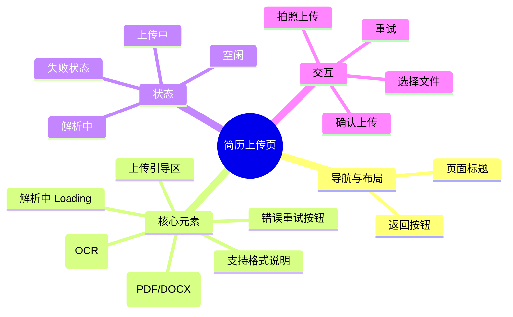

# 简历上传页

## 0. 页面文档状态

- 文档版本：Draft
- 生成日期：2026-05-11
- 来源文件：`product/release/product-overview-release.md`
- 来源 Sitemap 行：
  - 生成顺序：30
  - 页面ID：U-020-010
  - 父页面ID：U-020
  - 层级：L2
  - Surface：用户端App
  - Layout 区域：独立层级
  - 页面名称：简历上传页
  - 页面类型：表单/上传
  - Sitemap 页面级MD文件：product/development/pages/030-upload.md
- 当前输出文件：product/development/pages/030-upload.md
- 页面级假设 / 待确认编号规则：
  - 页面假设：`PA-001` 起，按首次出现顺序递增。
  - 页面待确认：`PQ-001` 起，按首次出现顺序递增。

## 1. 页面目标与上下文

### 1.1 页面目标

- 页面目的：接收用户提供的简历原始文件（文档或图片）。
- 用户目标：快速上传自己的简历，准备开始 AI 分析。
- 业务目标：通过 OCR 或解析提取简历文本，为后续 AI 优化提供数据基础。
- 页面成功标准：文件成功上传并解析，跳转至岗位设置页。

### 1.2 页面入口与出口

| 类型 | 来源 / 去向 | 触发条件 | 传入 / 传出数据 | 备注 |
|---|---|---|---|---|
| 入口 | 首页 | 点击“开启优化” | 无 | |
| 出口 | 岗位目标设置页 | 上传并解析成功 | 简历 ID、初步解析内容 | 跳转至 U-020-020 (U-040) |
| 出口 | 首页 | 点击左上角返回 | 无 | 返回 U-020 |

### 1.3 角色与权限

| 角色 | 是否可访问 | 权限条件 | 不满足时页面表现 | 相关 PA/PQ |
|---|---|---|---|---|
| 用户 | 是 | 已登录 | 正常展示 | |

### 1.4 全局页面属性

| 属性 | 类型 | 来源 | 默认值 | 影响元素 / 状态 | 说明 |
|---|---|---|---|---|---|
| upload_status | enum | local state | idle | 页面整体展示 | idle, uploading, parsing, success, failure |
| upload_progress | number | local state | 0 | 进度条 | 0-100 |

## 2. 页面结构思维导图

## 3. 页面布局与内容区块

| 区块ID | 区块名称 | 区块类型 | 展示条件 | 包含元素ID | 布局 / 样式定义 | 数据来源 | 相关 PA/PQ |
|---|---|---|---|---|---|---|---|
| S-001 | 导航栏 | header | 总是展示 | E-001 | 顶部固定 | 本地 | |
| S-002 | 上传选择区 | content | upload_status == idle | E-002, E-003, E-004 | 垂直排列，间距 24px | 本地 | |
| S-003 | 进度展示区 | content | uploading/parsing | E-005, E-006 | 居中覆盖 | 状态 | |
| S-004 | 失败反馈区 | content | upload_status == failure | E-007, E-008 | 居中，提示感强 | 本地 | |

## 4. 页面元素清单

| 元素ID | 元素名称 | 元素类型 | 所属区块 | 是否必需 | 展示条件 | 默认文案 / 内容 | 样式定义 | 数据绑定 | 相关 PA/PQ |
|---|---|---|---|---|---|---|---|---|---|
| E-001 | 返回按钮 | button | S-001 | 是 | 总是展示 | <图标 | 顶部左侧 | 无 | |
| E-002 | 文件上传卡片 | button | S-002 | 是 | upload_status == idle | 选择文档 (PDF/DOCX) | 虚线边框，大面积点击 | 无 | |
| E-003 | 拍照上传卡片 | button | S-002 | 是 | upload_status == idle | 拍照/相册上传 (OCR) | 虚线边框，大面积点击 | 无 | |
| E-004 | 格式说明文案 | text | S-002 | 是 | 总是展示 | 支持 PDF, DOCX, JPG, PNG (最大 20MB) | 12px, 辅助色 | 无 | |
| E-005 | 进度环/条 | other | S-003 | 是 | uploading | 0% | 品牌色进度 | upload_progress | |
| E-006 | 解析状态文案 | text | S-003 | 是 | parsing | 正在通过 AI 深度解析您的简历... | 14px | 无 | |
| E-007 | 错误提示图标 | image | S-004 | 是 | upload_status == failure | 报错图标 | 红色 | 无 | |
| E-008 | 重新上传按钮 | button | S-004 | 是 | upload_status == failure | 重新上传 | 品牌色 | 无 | |

## 5. 元素状态矩阵

| 元素ID | 状态 | 触发条件 | 状态来源 | 样式定义 | 可执行动作 | 禁止动作 | 提示文案 / 反馈 | 恢复条件 | 相关 PA/PQ |
|---|---|---|---|---|---|---|---|---|---|
| E-002 | 默认 | upload_status == idle | local | 正常 | 点击选文件 | 无 | | | |
| E-002 | 禁用 | uploading | local | 灰度 | 无 | 点击 | 正在上传中 | 完成或失败 | |
| E-005 | 活跃 | uploading | local | 动画 | 无 | 无 | 已上传 ${progress}% | | |

## 6. 交互 Action 与执行效果

| ActionID | 触发元素ID | 交互名称 | 用户动作 | 前置条件 | 校验规则 | 执行动作 | 成功结果 | 失败结果 | 页面跳转 / 状态变化 | 埋点事件ID | 埋点事件名称 | 不埋点原因 | 相关 PA/PQ |
|---|---|---|---|---|---|---|---|---|---|---|---|---|---|
| ACT-001 | E-002 | 选择本地文档 | 点击 | 无 | 文件类型, 大小 | 调系统文件选择器 | 选中后自动调 API-001 | 提示格式不支持 | status = uploading | EVT-002 | 上传页文档选择点击 | | |
| ACT-002 | E-003 | 拍照或选图 | 点击 | 无 | 大小 | 调系统相机/相册 | 选中后自动调 API-001 | 提示文件过大 | status = uploading | EVT-003 | 上传页拍照选择点击 | | |
| ACT-003 | API-001 | 文件上传中 | 自动 | 文件已选 | 无 | 上传文件流 | 上传成功调 API-002 | 提示上传失败 | status = parsing | EVT-004 | 上传页文件上传成功 | | |
| ACT-004 | API-002 | 解析简历 | 自动 | 上传成功 | 无 | 调 AI 解析接口 | 解析成功跳转 | 提示解析失败 | 跳转 U-040 | EVT-005 | 上传页解析完成 | | |

## 7. 埋点事件统计设计

### 7.1 埋点事件总表

| 埋点事件ID | 事件名称 | 事件类型 | 关联元素ID / ActionID | 触发时机 | 统计次数口径 | 去重规则 | 上报时机 | 关键属性 | 成功 / 失败归因 | 漏斗阶段 | 相关 PA/PQ |
|---|---|---|---|---|---|---|---|---|---|---|---|
| EVT-001 | 上传页曝光 | page_view | 无 | 进入页面 | 每页面会话计 1 次 | sessionId | 实时 | page_id, page_name | | | |
| EVT-002 | 文档选择点击 | click | ACT-001 | 点击文件卡片 | 每次触发计 1 次 | actionId | 实时 | 无 | | | |
| EVT-003 | 拍照选择点击 | click | ACT-002 | 点击拍照卡片 | 每次触发计 1 次 | actionId | 实时 | 无 | | | |
| EVT-004 | 文件上传成功 | api_success | ACT-003 | 接口返回成功 | 每次触发计 1 次 | requestId | 实时 | file_type, file_size | | 转化漏斗 | |
| EVT-005 | 解析完成 | api_success | ACT-004 | 解析接口返回 | 每次触发计 1 次 | requestId | 实时 | parse_time | | 核心转化 | |

### 7.2 埋点事件属性定义

| 属性名 | 类型 | 必填 | 来源 | 示例值 | 使用事件ID | 说明 |
|---|---|---|---|---|---|---|
| file_type | string | 是 | 文件属性 | pdf / docx / img | EVT-004 | |
| file_size | number | 是 | 文件属性 | 102400 (bytes) | EVT-004 | |

## 8. 数据结构与接口定义

### 8.1 页面数据模型

| 数据对象 | 字段 | 类型 | 必填 | 来源 | 默认值 | 使用位置 | 说明 |
|---|---|---|---|---|---|---|---|
| FileObject | name | string | 是 | device | | - | |
| FileObject | uri | string | 是 | device | | - | |

### 8.2 接口清单

| API ID | 接口名称 | 方法 | 路径 | 触发 ActionID | 请求数据结构 | 返回数据结构 | 成功处理 | 失败处理 | 相关 PA/PQ |
|---|---|---|---|---|---|---|---|---|---|
| API-001 | 上传简历文件 | POST | /api/resume/upload | ACT-001/002 | multipart/form-data | {file_id} | 触发解析 | Toast 报错 | |
| API-002 | 触发解析/轮询结果 | POST | /api/resume/parse | ACT-004 | {file_id} | {resume_id, status, data} | 跳转页面 | 提示解析失败 | (页面假设 PA-001：解析可能需要 5-10 秒，需轮询) |

## 9. 边界状态与错误处理

| 场景ID | 场景类型 | 触发条件 | 页面表现 | 元素表现 | 用户可执行操作 | 系统处理 | 兜底文案 | 相关 PA/PQ |
|---|---|---|---|---|---|---|---|---|
| EDGE-001 | 解析失败 | OCR 无法识别或格式损坏 | 错误提示区块 | 展示 S-004 | 重新上传 | 清理暂存文件 | 简历解析失败，请确保文件内容清晰可见 | |
| EDGE-002 | 文件超大 | 文件 > 20MB | Toast 拦截 | 无 | 无 | 阻止上传 | 文件大小不能超过 20MB | |

## 10. 多媒体与资源

| 资源ID | 资源类型 | 使用位置 | 来源 | 格式 / 尺寸 | 加载状态 | 失败降级 | 可访问性说明 | 相关 PA/PQ |
|---|---|---|---|---|---|---|---|---|
| M-001 | animation | S-003 | 本地 | Lottie/JSON | 循环播放 | 静态图 | 解析中动画 | |

## 11. 页面假设与待确认统一清单

### 11.1 页面假设清单

| 假设ID | 假设内容 | 首次出现位置 | 影响范围 | 影响元素 / Action / API / 埋点事件 | 置信度 | 用户确认状态 | Release 处理方式 |
|---|---|---|---|---|---|---|---|
| PA-001 | 解析可能需要 5-10 秒，后端解析是异步的，前端需轮询或长连接 | 8.2 接口清单 | 交互流程 | status, API-002 | 中 | 确认 | 确认为正式内容 |

### 11.2 页面待确认清单

| 待确认ID | 待确认问题 | 首次出现位置 | 影响范围 | 影响元素 / Action / API / 埋点事件 | 优先级 | 用户确认结果 | Release 处理方式 |
|---|---|---|---|---|---|---|---|
| PQ-001 | 是否需要支持从第三方云盘（如微信文件、百度云）直接导入？ | 3. 页面布局 | 功能范围 | S-002 | 中 | 确认 | 不需要 |
