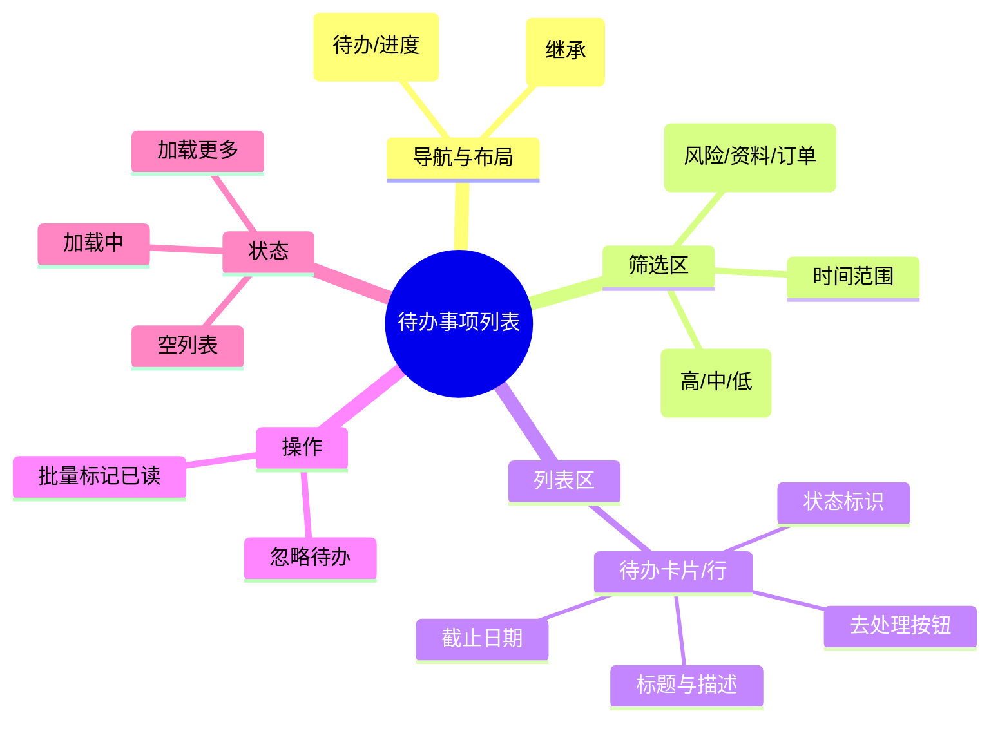

# 待办事项列表

## 0. 页面文档状态

- 文档版本：Draft v2
- 生成日期：2026-05-13
- 来源文件：`product/release/product-sitemap-release.md`
- 来源主稿：`product/development/pages/030-user-todo-list/index.md`
- 来源 Sitemap 行：
  - 生成顺序：30
  - 页面ID：U-210
  - 父页面ID：U-200
  - 层级：L2
  - Surface：用户端
  - Layout 区域：内容区
  - 页面名称：待办事项列表
  - 页面类型：列表
  - Sitemap 页面级MD文件：product/development/pages/030-user-todo-list.md
- 当前输出文件：product/development/pages/030-user-todo-list/index-v2.md
- 页面级假设 / 待确认编号规则：
  - 页面假设：`PA-001` 起，按首次出现顺序递增。
  - 页面待确认：`PQ-001` 起，按首次出现顺序递增。

## 1. 页面目标与上下文

### 1.1 页面目标

- 页面目的：展示所有需要用户干预的风险提醒、资料待补充、到期预警等事项。
- 用户目标：清晰查看每个待办的紧迫程度，并快速进入对应的处理页面。
- 业务目标：闭环管理待办状态，提升资料回填的响应速度。
- 页面成功标准：列表项的“去处理”按钮点击率。

### 1.2 页面入口与出口

| 类型 | 来源 / 去向 | 触发条件 | 传入 / 传出数据 | 备注 |
|---|---|---|---|---|
| 入口 | 用户工作台 (U-200) | 点击“待办事项”卡片 | 初始筛选条件 |  |
| 出口 | 案件详情 (U-520) | 点击资料待补充项 | 案件 ID |  |
| 出口 | 支付收银台 (U-330) | 点击待支付订单项 | 订单 ID |  |

### 1.3 角色与权限

| 角色 | 是否可访问 | 权限条件 | 不满足时页面表现 | 相关 PA/PQ |
|---|---|---|---|---|
| 客户用户 | 是 | 已登录 | 跳转登录页 |  |

### 1.4 全局页面属性

| 属性 | 类型 | 来源 | 默认值 | 影响元素 / 状态 | 说明 |
|---|---|---|---|---|---|
| filter_status | enum | local / route | "pending" | 列表数据内容 | 待处理 / 已忽略 / 已完成 |

## 2. 页面结构思维导图



## 3. 页面布局与内容区块

| 区块ID | 区块名称 | 区块类型 | 展示条件 | 包含元素ID | 布局 / 样式定义 | 数据来源 | 相关 PA/PQ |
|---|---|---|---|---|---|---|---|
| S-001 | 页面头部与 Tab | header | 总是显示 | E-001, E-002 | 居中，含 local-tab | - |  |
| S-002 | 筛选工具栏 | content | 总是显示 | E-003 至 E-005 | 水平排列，支持折行 | 后台配置 |  |
| S-003 | 待办列表主体 | content | 总是显示 | E-006, E-007 | 垂直列表 / 表格 | API-001 |  |

## 4. 页面元素清单

| 元素ID | 元素名称 | 元素类型 | 所属区块 | 是否必需 | 展示条件 | 默认文案 / 内容 | 样式定义 | 数据绑定 | 相关 PA/PQ |
|---|---|---|---|---|---|---|---|---|---|
| E-001 | 页面标题 | text | S-001 | 是 | 总是显示 | 工作台 / 待办事项 | H1 | - |  |
| E-002 | 业务 Tab | tab | S-001 | 是 | 总是显示 | 待办事项 / 进度查询 | - | current_tab |  |
| E-003 | 分类下拉 | select | S-002 | 是 | 总是显示 | 全部类型 | - | category |  |
| E-004 | 风险等级切换 | radio-group | S-002 | 是 | 总是显示 | 全部 / 紧急 / 普通 | 按钮样式 | risk_level |  |
| E-005 | 搜索框 | input | S-002 | 是 | 总是显示 | 搜索待办标题 | 带搜索图标 | search_key |  |
| E-006 | 待办卡片列表 | list | S-003 | 是 | 有数据 | - | - | todo_list |  |
| E-007 | 去处理按钮 | button | S-003 | 是 | 列表项内 | 去处理 | 品牌色，不可处理时禁用 | - |  |
| E-008 | 忽略按钮 | button | S-003 | 否 | 列表项内 | 忽略 | 弱化链接样式 | - |  |

## 5. 元素状态矩阵

| 元素ID | 状态 | 触发条件 | 状态来源 | 样式定义 | 可执行动作 | 禁止动作 | 提示文案 / 反馈 | 恢复条件 | 相关 PA/PQ |
|---|---|---|---|---|---|---|---|---|---|
| E-006 | 紧急状态 | 风险等级="紧急" | item.risk="high" | 红色标签 | - | - | 紧急 | - |  |
| E-006 | 已过期 | 当前时间 > 截止时间 | item.deadline_passed | 置灰背景，禁用处理按钮 | 查看详情 | 处理跳转 | 已过期 | - |  |
| E-007 | 禁用 | 待办已过期 | item.deadline_passed | 置灰 | - | 点击 | 该待办已过期，无法处理 | - |  |
| E-007 | 启用 | 待办未处理且未过期 | item.status="pending" | - | 跳转处理页 | - | - | - |  |

## 6. 交互 Action 与执行效果

| ActionID | 触发元素ID | 交互名称 | 用户动作 | 前置条件 | 校验规则 | 执行动作 | 成功结果 | 失败结果 | 页面跳转 / 状态变化 | 埋点事件ID | 埋点事件名称 | 不埋点原因 | 相关 PA/PQ |
|---|---|---|---|---|---|---|---|---|---|---|---|---|---|
| ACT-001 | E-003/004/005 | 触发筛选 | 选择/输入 | - | - | 刷新列表数据 | 列表更新 | - | - | EVT-002 | 筛选操作 | - |  |
| ACT-002 | E-007 | 点击处理 | 点击 | 未过期 | - | 页面跳转 | - | - | 根据类型跳转 (U-520/U-330/U-620) | EVT-003 | 去处理点击 | - |  |
| ACT-003 | E-008 | 忽略待办 | 点击 | - | - | 弹窗确认后更新状态 | 列表移除该项 | 错误提示 | - | EVT-004 | 忽略待办点击 | - |  |

## 7. 埋点事件统计设计

### 7.1 埋点事件总表

| 埋点事件ID | 事件名称 | 事件类型 | 关联元素ID / ActionID | 触发时机 | 统计次数口径 | 去重规则 | 上报时机 | 关键属性 | 成功 / 失败归因 | 漏斗阶段 | 相关 PA/PQ |
|---|---|---|---|---|---|---|---|---|---|---|---|
| EVT-001 | 待办列表曝光 | page_view | - | 页面加载完成 | 每会话 1 次 | sessionId | 实时 | total_count | - | 待办查看 |  |
| EVT-002 | 筛选操作 | click | E-003 | 筛选条件变更 | 每次触发 1 次 | - | 实时 | filter_type, filter_value | - | 效率工具 |  |
| EVT-003 | 去处理点击 | click | E-007 | 点击 | 每次触发 1 次 | - | 实时 | todo_type, todo_id | - | 转化中 |  |

## 8. 数据结构与接口定义

### 8.1 页面数据模型

| 数据对象 | 字段 | 类型 | 必填 | 来源 | 默认值 | 使用位置 | 说明 |
|---|---|---|---|---|---|---|---|
| TodoItem | id | string | 是 | API | - | - |  |
| TodoItem | title | string | 是 | API | - | E-006 |  |
| TodoItem | type | enum | 是 | API | - | - | risk / data / order |
| TodoItem | risk_level | enum | 是 | API | "normal" | E-006 | low / normal / high |
| TodoItem | deadline | string | 否 | API | - | E-006 |  |
| TodoItem | deadline_passed | boolean | 是 | API | false | E-007 | 是否已过期 |
| TodoItem | target_url | string | 是 | API | - | ACT-002 | 处理跳转目标 |

### 8.2 接口清单

| API ID | 接口名称 | 方法 | 路径 | 触发 ActionID | 请求数据结构 | 返回数据结构 | 成功处理 | 失败处理 | 相关 PA/PQ |
|---|---|---|---|---|---|---|---|---|---|
| API-001 | 获取待办列表 | GET | /api/todo/list | 页面加载 / 筛选 | {page, limit, category, risk, search} | {list, total} | 渲染列表 | 错误提示 |  |
| API-002 | 忽略待办 | POST | /api/todo/ignore | ACT-003 | {todo_id} | {success} | 刷新列表 | 提示忽略失败 |  |

## 9. 边界状态与错误处理

| 场景ID | 场景类型 | 触发条件 | 页面表现 | 元素表现 | 用户可执行操作 | 系统处理 | 兜底文案 | 相关 PA/PQ |
|---|---|---|---|---|---|---|---|---|
| EDGE-001 | 空列表 | 接口返回 list=[] | 显示空插画 | - | 去看看进行中服务 | - | 暂无待办事项，轻松一下吧 |  |

## 10. 多媒体与资源

| 资源ID | 资源类型 | 使用位置 | 来源 | 格式 | 说明 |
|---|---|---|---|---|---|
| M-001 | icon | E-004 | 本地 | SVG | 风险等级图标 |

## 11. 页面假设与待确认统一清单

### 11.1 页面假设清单

| 假设ID | 假设内容 | 首次出现位置 | 影响范围 | 影响元素 / Action / API / 埋点事件 | 置信度 | 用户确认状态 | Release 处理方式 |
|---|---|---|---|---|---|---|---|
| - | - | - | - | - | - | - | - |

### 11.2 页面待确认清单

| 待确认ID | 待确认问题 | 首次出现位置 | 影响范围 | 影响元素 / Action / API / 埋点事件 | 优先级 | 用户确认结果 | Release 处理方式 |
|---|---|---|---|---|---|---|---|
| - | - | - | - | - | - | - | - |

## 12. 用户补充描述

> 本章节必须保留在页面 Draft 文档末尾，供用户用自然语言补充或修改当前页面需求。`product-page-release` 生成 release 版本时必须读取、分析并应用这里的内容。
> 如果没有补充，请保留“无”。

```text
无
```
