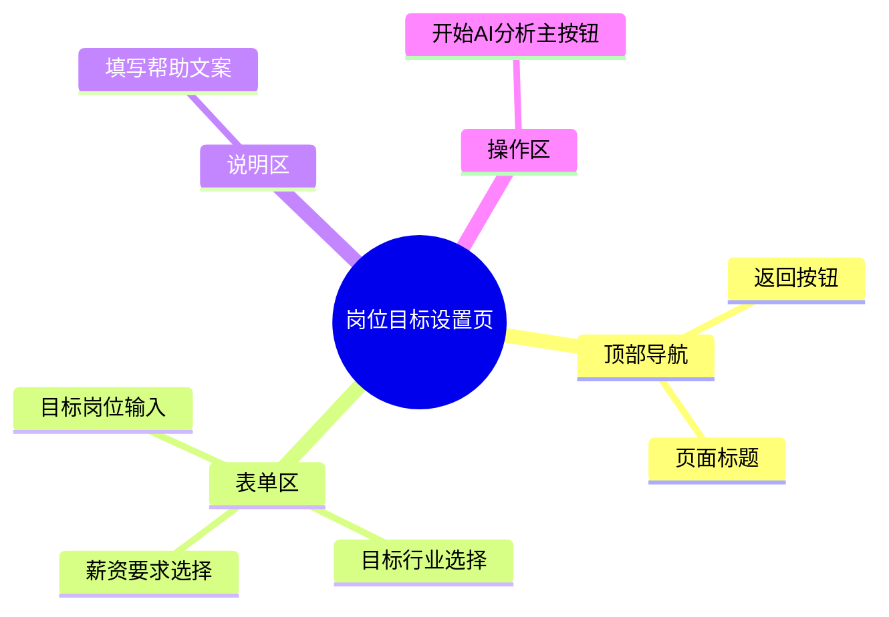

# 岗位目标设置页

## 0. 页面文档状态

- 文档版本：Draft
- 生成日期：2026-05-11
- 来源文件：`product/release/product-overview-release.md`
- 来源 Sitemap 行：
  - 生成顺序：40
  - 页面ID：U-020-020
  - 父页面ID：U-020
  - 层级：L2
  - Surface：用户端App
  - Layout 区域：独立层级
  - 页面名称：岗位目标设置页
  - 页面类型：表单
  - Sitemap 页面级MD文件：`product/development/pages/040-target-job.md`
- 当前输出文件：`product/development/pages/040-target-job.md`
- 页面级假设 / 待确认编号规则：
  - 页面假设：`PA-001` 起，按首次出现顺序递增。
  - 页面待确认：`PQ-001` 起，按首次出现顺序递增。

## 1. 页面目标与上下文

### 1.1 页面目标

- 页面目的：收集用户的求职意向参数，为后续 AI 进行简历匹配度打分和给出针对性建议提供判断基准。
- 用户目标：告诉 AI 自己想找什么样的工作（例如：产品经理、互联网行业、10k-20k）。
- 业务目标：结构化获取目标岗位数据，提升 AI Prompt 准确度。
- 页面成功标准：用户填写完毕并点击“开始 AI 分析”。

### 1.2 页面入口与出口

| 类型 | 来源 / 去向 | 触发条件 | 传入 / 传出数据 | 备注 |
|---|---|---|---|---|
| 入口 | 简历上传页 (U-020-010) | 简历解析成功后自动跳入 | 传入解析好的 `resume_id` | |
| 出口 | AI 分析报告页 (U-020-030) | 点击“开始 AI 分析”并请求成功 | 传入 `resume_id` | |

### 1.3 角色与权限

| 角色 | 是否可访问 | 权限条件 | 不满足时页面表现 | 相关 PA/PQ |
|---|---|---|---|---|
| 普通用户/VIP | 是 | 需携带合法的 `resume_id` 路由参数 | 提示参数错误并返回首页 | |

### 1.4 全局页面属性

| 属性 | 类型 | 来源 | 默认值 | 影响元素 / 状态 | 说明 |
|---|---|---|---|---|---|
| resumeId | string | route | | 必须 | 当前操作的简历 ID |
| isSubmitting | boolean | local state | false | E-006 | 防止重复提交 |

## 2. 页面结构思维导图



## 3. 页面布局与内容区块

| 区块ID | 区块名称 | 区块类型 | 展示条件 | 包含元素ID | 布局 / 样式定义 | 数据来源 | 相关 PA/PQ |
|---|---|---|---|---|---|---|---|
| S-001 | 页面头部 | header | 常驻 | E-001, E-002 | 标准顶部 Navigation Bar | | |
| S-002 | 核心表单区 | content | 常驻 | E-003, E-004, E-005, E-007 | 垂直表单结构，包含标题、输入框、下拉框 | | |
| S-003 | 底部操作区 | footer | 常驻 | E-006 | 固定在底部或表单下方的主按钮 | | |

## 4. 页面元素清单

| 元素ID | 元素名称 | 元素类型 | 所属区块 | 是否必需 | 展示条件 | 默认文案 / 内容 | 样式定义 | 数据绑定 | 相关 PA/PQ |
|---|---|---|---|---|---|---|---|---|---|
| E-001 | 返回按钮 | icon | S-001 | 是 | 常驻 | 返回箭头 | | | |
| E-002 | 页面标题 | text | S-001 | 是 | 常驻 | "设置求职目标" | 居中标题 | | |
| E-003 | 目标岗位输入框 | input | S-002 | 是 | 常驻 | "如：产品经理" (placeholder) | 标准输入框 | `jobTitle` | |
| E-004 | 目标行业选择器 | select/picker | S-002 | 是 | 常驻 | "请选择目标行业" | 底部弹出的滑动选择器 | `industry` | |
| E-005 | 薪资期望选择器 | select/picker | S-002 | 否 | 常驻 | "请选择薪资要求(选填)" | 底部弹出的滑动选择器 | `salary` | （页面待确认 PQ-001：薪资是必填还是选填？） |
| E-007 | 表单说明文本 | text | S-002 | 是 | 常驻 | "准确的目标岗位有助于 AI 给出更精准的建议" | 灰色提示小字 | | |
| E-006 | 开始分析主按钮 | button | S-003 | 是 | 常驻 | "开始 AI 分析" | 全宽大按钮，主色块 | | |

## 5. 元素状态矩阵

| 元素ID | 状态 | 触发条件 | 状态来源 | 样式定义 | 可执行动作 | 禁止动作 | 提示文案 / 反馈 | 恢复条件 | 相关 PA/PQ |
|---|---|---|---|---|---|---|---|---|---|
| E-006 | 禁用 | 必填项 `jobTitle` 或 `industry` 为空 | 表单校验 | 按钮置灰，降低透明度 | | 点击 | | 表单填写完毕 | |
| E-006 | 加载 | `isSubmitting` 为真时 | 接口请求 | 显示 Loading 状态 | | 点击 | | 接口返回结果 | |

## 6. 交互 Action 与执行效果

| ActionID | 触发元素ID | 交互名称 | 用户动作 | 前置条件 | 校验规则 | 执行动作 | 成功结果 | 失败结果 | 页面跳转 / 状态变化 | 埋点事件 | 相关 PA/PQ |
|---|---|---|---|---|---|---|---|---|---|---|---|
| ACT-001 | E-001 | 返回 | 点击 | 无 | 无 | 触发路由返回 | | | 返回简历上传页 | | |
| ACT-002 | E-004 | 选择行业 | 点击 | 无 | 无 | 弹出行业列表 Picker | 选中某个行业并赋值 | | 隐藏 Picker，输入框更新 | `click_select_industry` | |
| ACT-003 | E-005 | 选择薪资 | 点击 | 无 | 无 | 弹出薪资范围 Picker | 选中范围并赋值 | | 隐藏 Picker，输入框更新 | | |
| ACT-004 | E-006 | 提交分析 | 点击 | 必填项非空 | 无 | API 调用 (API-001) | `isSubmitting=false` | `isSubmitting=false`，Toast | 成功带参数跳 U-020-030 | `submit_ai_analysis` | |

## 7. 数据结构与接口定义

### 7.1 页面数据模型

| 数据对象 | 字段 | 类型 | 必填 | 来源 | 默认值 | 使用位置 | 说明 |
|---|---|---|---|---|---|---|---|
| TargetJob | jobTitle | string | 是 | local input | | E-003 | |
| TargetJob | industry | string | 是 | local input | | E-004 | |
| TargetJob | salary | string | 否 | local input | | E-005 | |

### 7.2 接口清单

| API ID | 接口名称 | 方法 | 路径 | 触发 ActionID | 请求数据结构 | 返回数据结构 | 成功处理 | 失败处理 | 相关 PA/PQ |
|---|---|---|---|---|---|---|---|---|---|
| API-001 | 保存目标岗位并触发AI分析 | POST | `/api/v1/resume/target-job` | ACT-004 | `{ "resume_id": "string", "target": TargetJob }` | `{ "success": true }` | 跳转到分析报告页面 | Toast 报错 | （页面假设 PA-001：触发分析的逻辑挂在这个提交接口上） |
| API-002 | 获取行业枚举配置 | GET | `/api/v1/config/industries` | 页面初始化 | 无 | `{ "list": ["互联网", "金融", "..."] }` | 缓存到本地供 Picker 使用 | | |

### 7.3 请求 / 返回 JSON 示例

#### API-001 请求

```json
{
  "resume_id": "R_1001",
  "target": {
    "jobTitle": "高级产品经理",
    "industry": "互联网/电子商务",
    "salary": "20k-30k"
  }
}
```

## 8. 边界状态与错误处理

| 场景ID | 场景类型 | 触发条件 | 页面表现 | 元素表现 | 用户可执行操作 | 系统处理 | 兜底文案 | 相关 PA/PQ |
|---|---|---|---|---|---|---|---|---|
| EDGE-001 | 参数缺失 | 路由没有携带 `resume_id` | 空白页或提示错误 | | 返回 | | "参数丢失，请重新上传简历" | |
| EDGE-002 | 网络超时 | 提交给 AI 服务时接口响应超时 | Toast 提示超时 | E-006 恢复可点击 | 重试提交 | | "网络响应超时，请重试" | |

## 9. 多媒体与资源

无特殊多媒体资源，主要由原生或组件库的 UI Picker 构成。

## 10. 页面假设与待确认统一清单

### 10.1 页面假设清单

| 假设ID | 假设内容 | 首次出现位置 | 影响范围 | 影响元素 / Action / API | 置信度 | 用户确认状态 | Release 处理方式 |
|---|---|---|---|---|---|---|---|
| PA-001 | 点击提交时，后台不但保存了目标岗位信息，同时也会触发真正的耗时 AI 分析任务（或将其推入队列），下个页面是查询或等待此分析结果。 | 7.2 接口清单 (API-001) | 接口及架构设计 | API-001, ACT-004 | 高 | 确认 | 确认为正式内容 |

### 10.2 页面待确认清单

| 待确认ID | 待确认问题 | 首次出现位置 | 影响范围 | 影响元素 / Action / API | 优先级 | 用户确认结果 | Release 处理方式 |
|---|---|---|---|---|---|---|---|
| PQ-001 | “薪资要求”是必填项还是选填项？这对 AI 简历分析的权重影响大吗？ | 4 页面元素清单 (E-005) | 表单验证逻辑 | E-005 | 低 | 确认 | 按选填处理 |
