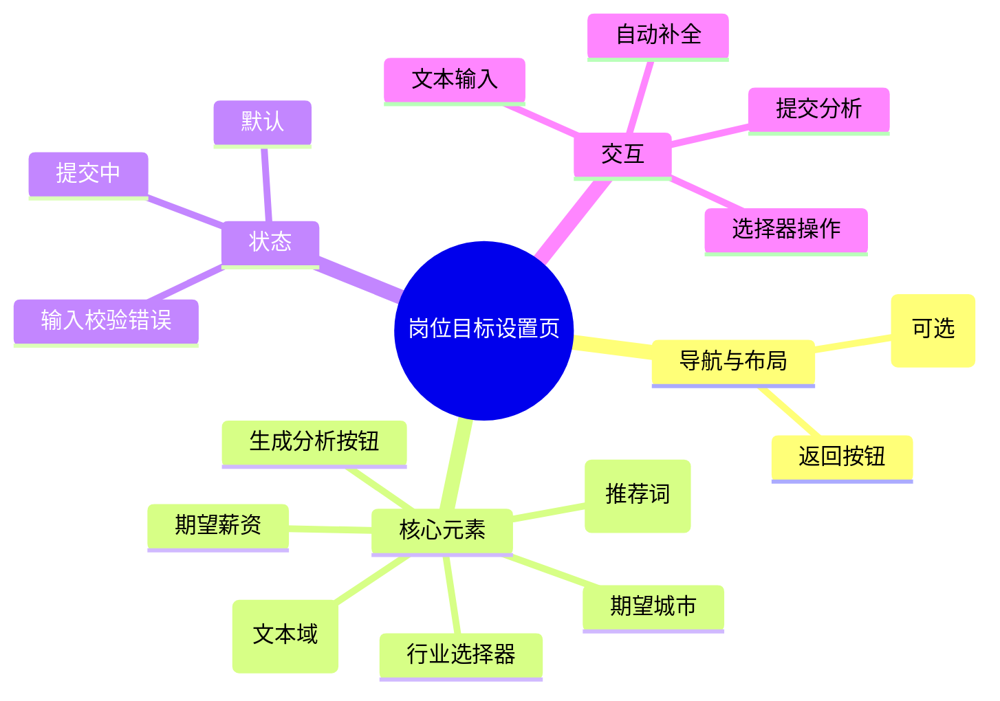

# 岗位目标设置页

## 0. 页面文档状态

- 文档版本：Draft
- 生成日期：2026-05-11
- 来源文件：`product/release/product-overview-release.md`
- 来源 Sitemap 行：
  - 生成顺序：40
  - 页面ID：U-020-020
  - 父页面ID：U-020
  - 层级：L2
  - Surface：用户端App
  - Layout 区域：独立层级
  - 页面名称：岗位目标设置页
  - 页面类型：表单
  - Sitemap 页面级MD文件：product/development/pages/040-target-job.md
- 当前输出文件：product/development/pages/040-target-job.md
- 页面级假设 / 待确认编号规则：
  - 页面假设：`PA-001` 起，按首次出现顺序递增。
  - 页面待确认：`PQ-001` 起，按首次出现顺序递增。

## 1. 页面目标与上下文

### 1.1 页面目标

- 页面目的：收集用户的目标求职意向。
- 用户目标：告诉 AI 自己想要申请什么样的职位，以便 AI 提供针对性的修改建议。
- 业务目标：建立简历与岗位的匹配模型，为 AI 分析报告提供参数。
- 页面成功标准：用户填写完整意向并点击“生成 AI 分析”。

### 1.2 页面入口与出口

| 类型 | 来源 / 去向 | 触发条件 | 传入 / 传出数据 | 备注 |
|---|---|---|---|---|
| 入口 | 简历上传页 | 上传并解析成功 | 简历 ID | |
| 出口 | AI 分析报告页 | 提交表单成功 | 简历 ID、岗位目标参数 | 跳转至 U-020-030 (U-050) |
| 出口 | 简历上传页 | 点击返回 | 无 | 返回 U-020-010 |

### 1.3 角色与权限

| 角色 | 是否可访问 | 权限条件 | 不满足时页面表现 | 相关 PA/PQ |
|---|---|---|---|---|
| 用户 | 是 | 已登录且有对应简历记录 | 正常展示 | |

### 1.4 全局页面属性

| 属性 | 类型 | 来源 | 默认值 | 影响元素 / 状态 | 说明 |
|---|---|---|---|---|---|
| is_form_valid | boolean | local state | false | 提交按钮状态 | 表单是否填写完整 |

## 2. 页面结构思维导图

## 3. 页面布局与内容区块

| 区块ID | 区块名称 | 区块类型 | 展示条件 | 包含元素ID | 布局 / 样式定义 | 数据来源 | 相关 PA/PQ |
|---|---|---|---|---|---|---|---|
| S-001 | 引导说明区 | content | 总是展示 | E-001 | 顶部居左 | 本地 | |
| S-002 | 核心意向表单 | content | 总是展示 | E-002, E-003, E-004, E-005 | 垂直表单，间距 20px | 用户输入 | |
| S-003 | 底部操作区 | footer | 总是展示 | E-006 | 底部固定按钮 | 本地 | |

## 4. 页面元素清单

| 元素ID | 元素名称 | 元素类型 | 所属区块 | 是否必需 | 展示条件 | 默认文案 / 内容 | 样式定义 | 数据绑定 | 相关 PA/PQ |
|---|---|---|---|---|---|---|---|---|---|
| E-001 | 说明文案 | text | S-001 | 是 | 总是展示 | 请填写您的目标岗位，AI 将为您进行精准匹配分析 | 14px, 灰色 | 无 | |
| E-002 | 目标岗位输入 | input | S-002 | 是 | 总是展示 | 如：产品经理 | 带自动补全推荐 | target_job_title | (页面假设 PA-001：后端应根据输入实时返回热门岗位词) |
| E-003 | 行业选择器 | select | S-002 | 是 | 总是展示 | 请选择行业 | 底部弹出层/新页面 | target_industry | |
| E-004 | 期望城市 | input | S-002 | 是 | 总是展示 | 请选择城市 | 选择器 | target_city | |
| E-005 | 补充要求 | textarea | S-002 | 否 | 总是展示 | 补充 JD 信息或特殊要求 (可选) | 高度 120px | extra_info | |
| E-006 | 生成分析按钮 | button | S-003 | 是 | 总是展示 | 生成 AI 分析报告 | 品牌色，全宽 | 无 | |

## 5. 元素状态矩阵

| 元素ID | 状态 | 触发条件 | 状态来源 | 样式定义 | 可执行动作 | 禁止动作 | 提示文案 / 反馈 | 恢复条件 | 相关 PA/PQ |
|---|---|---|---|---|---|---|---|---|---|
| E-002 | 聚焦 | 用户点击 | 本地 | 蓝色边框 | 输入 | 无 | | 失去焦点 | |
| E-006 | 禁用 | target_job_title 为空 OR target_industry 为空 | local | 灰色 | 无 | 点击 | 请填写目标岗位和行业 | 条件满足 | |
| E-006 | 加载中 | 点击后请求 API | local | 加载动画 | 无 | 点击 | 正在生成中，请稍候 | API 响应 | |

## 6. 交互 Action 与执行效果

| ActionID | 触发元素ID | 交互名称 | 用户动作 | 前置条件 | 校验规则 | 执行动作 | 成功结果 | 失败结果 | 页面跳转 / 状态变化 | 埋点事件ID | 埋点事件名称 | 不埋点原因 | 相关 PA/PQ |
|---|---|---|---|---|---|---|---|---|---|---|---|---|---|
| ACT-001 | E-002 | 搜索推荐词 | 输入 | 输入字符长度 > 1 | 无 | 调 API-001 | 展示推荐列表 | 不展示 | 下拉弹层展示 | EVT-002 | 岗位推荐展示 | | |
| ACT-002 | E-006 | 提交岗位目标 | 点击 | 表单校验通过 | 必填项不为空 | 调 API-002 | 进入分析页 | 提示提交失败 | 跳转 U-050 | EVT-003 | 生成分析点击 | | |
| ACT-003 | E-003 | 选择行业 | 点击 | 无 | 无 | 打开选择器 | 选中并回填 | 无 | 状态更新 | EVT-004 | 行业选择点击 | | |

## 7. 埋点事件统计设计

### 7.1 埋点事件总表

| 埋点事件ID | 事件名称 | 事件类型 | 关联元素ID / ActionID | 触发时机 | 统计次数口径 | 去重规则 | 上报时机 | 关键属性 | 成功 / 失败归因 | 漏斗阶段 | 相关 PA/PQ |
|---|---|---|---|---|---|---|---|---|---|---|---|
| EVT-001 | 岗位设置页曝光 | page_view | 无 | 进入页面 | 每页面会话计 1 次 | sessionId | 实时 | page_id, resume_id | | | |
| EVT-002 | 岗位推荐展示 | impression | ACT-001 | 推荐列表弹出 | 每次触发计 1 次 | 无 | 实时 | keywords | | | |
| EVT-003 | 生成分析点击 | click | ACT-002 | 点击主按钮 | 每次触发计 1 次 | actionId | 实时 | target_job, target_industry | | 核心转化点 | |
| EVT-004 | 行业选择点击 | click | ACT-003 | 点击行业选择 | 每次触发计 1 次 | actionId | 实时 | selected_industry | | | |

### 7.2 埋点事件属性定义

| 属性名 | 类型 | 必填 | 来源 | 示例值 | 使用事件ID | 说明 |
|---|---|---|---|---|---|---|
| target_job | string | 是 | 用户输入 | 产品经理 | EVT-003 | |
| target_industry | string | 是 | 用户选择 | 互联网 / 金融 | EVT-003 | |

## 8. 数据结构与接口 definition

### 8.1 页面数据模型

| 数据对象 | 字段 | 类型 | 必填 | 来源 | 默认值 | 使用位置 | 说明 |
|---|---|---|---|---|---|---|---|
| TargetJob | title | string | 是 | input | | E-002 | |
| TargetJob | industry | string | 是 | select | | E-003 | |
| TargetJob | city | string | 否 | select | | E-004 | |
| TargetJob | extra | string | 否 | textarea | | E-005 | |

### 8.2 接口清单

| API ID | 接口名称 | 方法 | 路径 | 触发 ActionID | 请求数据结构 | 返回数据结构 | 成功处理 | 失败处理 | 相关 PA/PQ |
|---|---|---|---|---|---|---|---|---|---|
| API-001 | 获取岗位推荐 | GET | /api/dict/jobs | ACT-001 | {q} | {list[]} | 展示下拉 | 无 | |
| API-002 | 提交分析任务 | POST | /api/analysis/submit | ACT-002 | {resume_id, target_job} | {task_id} | 跳转详情 | 错误提示 | |

## 9. 边界状态与错误处理

| 场景ID | 场景类型 | 触发条件 | 页面表现 | 元素表现 | 用户可执行操作 | 系统处理 | 兜底文案 | 相关 PA/PQ |
|---|---|---|---|---|---|---|---|---|
| EDGE-001 | 必填项缺失 | 点击提交时未填 | Toast 提示 | 对应输入框红色抖动 | 补全信息 | 拦截提交 | 请完整填写目标岗位和行业信息 | |

## 10. 多媒体与资源

| 资源ID | 资源类型 | 使用位置 | 来源 | 格式 / 尺寸 | 加载状态 | 失败降级 | 可访问性说明 | 相关 PA/PQ |
|---|---|---|---|---|---|---|---|---|
| M-001 | icon | E-002 | 本地 | SVG | 总是加载 | 不展示 | 搜索图标 | |

## 11. 页面假设与待确认统一清单

### 11.1 页面假设清单

| 假设ID | 假设内容 | 首次出现位置 | 影响范围 | 影响元素 / Action / API / 埋点事件 | 置信度 | 用户确认状态 | Release 处理方式 |
|---|---|---|---|---|---|---|---|
| PA-001 | 后端应根据输入实时返回热门岗位词供用户快速选择 | 4. 页面元素清单 | 交互体验 | E-002, API-001 | 高 | 确认 | 不需要 |

### 11.2 页面待确认清单

| 待确认ID | 待确认问题 | 首次出现位置 | 影响范围 | 影响元素 / Action / API / 埋点事件 | 优先级 | 用户确认结果 | Release 处理方式 |
|---|---|---|---|---|---|---|---|
| PQ-001 | 是否允许用户直接粘贴 JD (职位描述) 文本进行更精准匹配？ | 4. 页面元素清单 | 数据采集 | E-005 | 中 | 确认 | 需要 |
