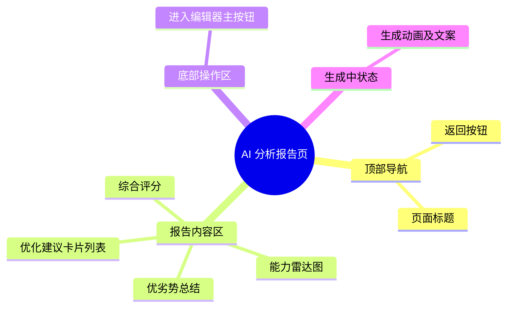

# AI 分析报告页

## 0. 页面文档状态

- 文档版本：Draft
- 生成日期：2026-05-11
- 来源文件：`product/release/product-overview-release.md`
- 来源 Sitemap 行：
  - 生成顺序：50
  - 页面ID：U-020-030
  - 父页面ID：U-020
  - 层级：L2
  - Surface：用户端App
  - Layout 区域：独立层级
  - 页面名称：AI 分析报告页
  - 页面类型：详情/展示
  - Sitemap 页面级MD文件：`product/development/pages/050-ai-report.md`
- 当前输出文件：`product/development/pages/050-ai-report.md`
- 页面级假设 / 待确认编号规则：
  - 页面假设：`PA-001` 起，按首次出现顺序递增。
  - 页面待确认：`PQ-001` 起，按首次出现顺序递增。

## 1. 页面目标与上下文

### 1.1 页面目标

- 页面目的：向用户展示 AI 对其原始简历和目标岗位的匹配度评估结果，并提供具体的优化建议。
- 用户目标：查看自己的简历有哪些不足，了解 AI 能够帮自己优化哪些地方。
- 业务目标：通过高质量的分析报告建立用户的信任感，促使其进入简历编辑器进行最终的优化。
- 页面成功标准：用户点击“一键采纳建议”或“手动修改简历”进入编辑器页面。

### 1.2 页面入口与出口

| 类型 | 来源 / 去向 | 触发条件 | 传入 / 传出数据 | 备注 |
|---|---|---|---|---|
| 入口 | 岗位目标设置页 (U-020-020) | 提交目标岗位并触发分析后 | 传入 `resume_id` | |
| 入口 | 历史简历页 (U-030-020) | 点击历史列表项查看报告 | 传入 `resume_id` | |
| 出口 | 简历编辑器 (U-020-040) | 点击去优化相关操作 | 传入 `resume_id` | |

### 1.3 角色与权限

| 角色 | 是否可访问 | 权限条件 | 不满足时页面表现 | 相关 PA/PQ |
|---|---|---|---|---|
| 普通用户 | 是 | 需有查看该 `resume_id` 的权限 | 提示无权访问 | |
| VIP 会员 | 是 | | | |

### 1.4 全局页面属性

| 属性 | 类型 | 来源 | 默认值 | 影响元素 / 状态 | 说明 |
|---|---|---|---|---|---|
| reportData | object | API | null | 全局展示 | AI 生成的评估报告数据 |
| isGenerating | boolean | local state | true | S-002 | 判断当前是否正在等待 AI 生成报告 |

## 2. 页面结构思维导图



## 3. 页面布局与内容区块

| 区块ID | 区块名称 | 区块类型 | 展示条件 | 包含元素ID | 布局 / 样式定义 | 数据来源 | 相关 PA/PQ |
|---|---|---|---|---|---|---|---|
| S-001 | 页面头部 | header | 常驻 | E-001, E-002 | 标准顶部 Navigation Bar | | |
| S-002 | 生成动画区 | overlay | `isGenerating=true` | E-003, E-004 | 全屏遮罩，居中动画与文案，展示 AI 打字机效果 | | |
| S-003 | 综合得分区 | content | `!isGenerating` | E-005, E-006 | 卡片顶部，强调大数字得分和雷达图 | `reportData` | |
| S-004 | 建议明细区 | content | `!isGenerating` | E-007, E-008 | 垂直列表项，每项说明具体问题及 AI 优化方向 | `reportData` | |
| S-005 | 底部操作区 | footer | `!isGenerating` | E-009 | 固定在屏幕底部的主按钮 | | |

## 4. 页面元素清单

| 元素ID | 元素名称 | 元素类型 | 所属区块 | 是否必需 | 展示条件 | 默认文案 / 内容 | 样式定义 | 数据绑定 | 相关 PA/PQ |
|---|---|---|---|---|---|---|---|---|---|
| E-001 | 返回按钮 | icon | S-001 | 是 | 常驻 | 返回箭头 | | | |
| E-002 | 页面标题 | text | S-001 | 是 | 常驻 | "AI 简历分析报告" | 居中标题 | | |
| E-003 | AI 扫描动画 | animation | S-002 | 是 | `isGenerating` | 扫描线/波浪线动画 | | | |
| E-004 | AI 状态提示 | text | S-002 | 是 | `isGenerating` | "正在评估与目标岗位的匹配度..." | | | |
| E-005 | 匹配得分 | text | S-003 | 是 | `!isGenerating` | "78分" | 巨大且加粗的数字字体，根据分数区分颜色（红/黄/绿） | `reportData.score` | |
| E-006 | 能力雷达图 | chart | S-003 | 否 | `!isGenerating` | 雷达图组件 | echart 或原生画图 | `reportData.dimensions` | |
| E-007 | 核心优劣势 | text | S-004 | 是 | `!isGenerating` | 简短的文字总结 | | `reportData.summary` | |
| E-008 | 优化建议卡片 | card/list | S-004 | 是 | `!isGenerating` | 展示：原内容摘要 -> AI 建议内容 | 列表循环展示，带有“AI 魔法棒”icon 标识 | `reportData.suggestions` | |
| E-009 | 去优化主按钮 | button | S-005 | 是 | `!isGenerating` | "一键采纳建议，进入编辑器" | 全宽大按钮，主色块，悬浮在底部 | | |

## 5. 元素状态矩阵

| 元素ID | 状态 | 触发条件 | 状态来源 | 样式定义 | 可执行动作 | 禁止动作 | 提示文案 / 反馈 | 恢复条件 | 相关 PA/PQ |
|---|---|---|---|---|---|---|---|---|---|
| S-002 | 加载异常 | 轮询/推送接口返回失败或超时 | 接口返回 | 动画停止变成错误图标 | 点击返回 | | "分析超时或失败，请稍后重试" | 退出页面重进 | |
| E-005 | 分数极低 | 匹配度 < 60 | 分数判定 | 红色高亮 | | | "匹配度较低，建议大改" | | |
| E-005 | 分数极高 | 匹配度 > 90 | 分数判定 | 绿色高亮 | | | "非常匹配！仅需微调即可" | | |

## 6. 交互 Action 与执行效果

| ActionID | 触发元素ID | 交互名称 | 用户动作 | 前置条件 | 校验规则 | 执行动作 | 成功结果 | 失败结果 | 页面跳转 / 状态变化 | 埋点事件 | 相关 PA/PQ |
|---|---|---|---|---|---|---|---|---|---|---|---|
| ACT-001 | E-001 | 返回 | 点击 | 无 | 无 | 触发路由返回 | | | 退回首页 | | |
| ACT-002 | E-009 | 进入编辑器 | 点击 | 分析已完成 | 无 | 导航跳转并传参 | | | 携带 `resume_id` 跳 U-020-040 | `click_enter_editor` | （页面假设 PA-001：一键采纳逻辑在编辑器页面内完成，此按钮仅作跳转引流） |

## 7. 数据结构与接口定义

### 7.1 页面数据模型

| 数据对象 | 字段 | 类型 | 必填 | 来源 | 默认值 | 使用位置 | 说明 |
|---|---|---|---|---|---|---|---|
| ReportData | score | number | 是 | API | 0 | E-005 | 0-100 综合得分 |
| ReportData | summary | string | 是 | API | | E-007 | 综合评价 |
| ReportData | suggestions | array | 是 | API | `[]` | E-008 | 每项包含 module, original_text, ai_suggestion |

### 7.2 接口清单

| API ID | 接口名称 | 方法 | 路径 | 触发 ActionID | 请求数据结构 | 返回数据结构 | 成功处理 | 失败处理 | 相关 PA/PQ |
|---|---|---|---|---|---|---|---|---|---|
| API-001 | 轮询/查询分析结果 | GET | `/api/v1/resume/report` | 页面初始化定时器 | `?resume_id=string` | `{ "status": "PENDING"\|"SUCCESS", "report": ReportData }` | 状态变为 SUCCESS 则解除 S-002 | 展示超时失败状态 | （页面假设 PA-002：后台 AI 异步生成，前端轮询查询进度） |

### 7.3 请求 / 返回 JSON 示例

#### API-001 成功返回

```json
{
  "code": 0,
  "message": "success",
  "data": {
    "status": "SUCCESS",
    "report": {
      "score": 82,
      "summary": "您的项目经验较为丰富，但专业技能关键词与目标岗位要求存在部分脱节。",
      "dimensions": [
        { "name": "教育背景", "value": 90 },
        { "name": "项目经验", "value": 85 },
        { "name": "技能匹配", "value": 70 }
      ],
      "suggestions": [
        {
          "module": "工作经历",
          "original_text": "负责了公司旧有系统的维护",
          "ai_suggestion": "主导旧版系统的重构与维护，通过优化底层架构将系统响应时间提升了30%"
        }
      ]
    }
  }
}
```

## 8. 边界状态与错误处理

| 场景ID | 场景类型 | 触发条件 | 页面表现 | 元素表现 | 用户可执行操作 | 系统处理 | 兜底文案 | 相关 PA/PQ |
|---|---|---|---|---|---|---|---|---|
| EDGE-001 | 额度限制拦截 | （该异常应在前置页面拦截，此处为兜底防御） | Toast 报错 | 页面渲染为空或返回 | | 拦截并返回 | "分析额度不足" | |
| EDGE-002 | 分析内容为空 | 返回的数据缺少 suggestions | 正常展示分数 | S-004 区域显示无建议 | 继续去编辑器 | | "AI 认为您的简历已经很棒啦，直接预览吧" | |

## 9. 多媒体与资源

| 资源ID | 资源类型 | 使用位置 | 来源 | 格式 / 尺寸 | 加载状态 | 失败降级 | 可访问性说明 | 相关 PA/PQ |
|---|---|---|---|---|---|---|---|---|
| M-001 | animation | E-003 Lottie 动画 | 本地 / CDN | JSON Lottie | | 静态图片 | AI 分析过程特效 | |

## 10. 页面假设与待确认统一清单

### 10.1 页面假设清单

| 假设ID | 假设内容 | 首次出现位置 | 影响范围 | 影响元素 / Action / API | 置信度 | 用户确认状态 | Release 处理方式 |
|---|---|---|---|---|---|---|---|
| PA-001 | 页面底部的主按钮文案为“一键采纳建议，进入编辑器”，但实际的一键替换是在编辑器组件加载时通过数据注入完成的，本页面不调用替换接口。 | 6 交互 Action (ACT-002) | 接口职责划分 | ACT-002, U-020-040 初始化 | 高 | 待确认 | 确认为正式内容 |
| PA-002 | 因大模型生成较慢，本页面承担了“Loading/轮询查询等待”的职责，通过动画掩盖时间。 | 7.2 接口清单 (API-001) | 交互流转 | API-001, S-002 | 高 | 待确认 | 确认为正式内容 |

### 10.2 页面待确认清单

暂无。
