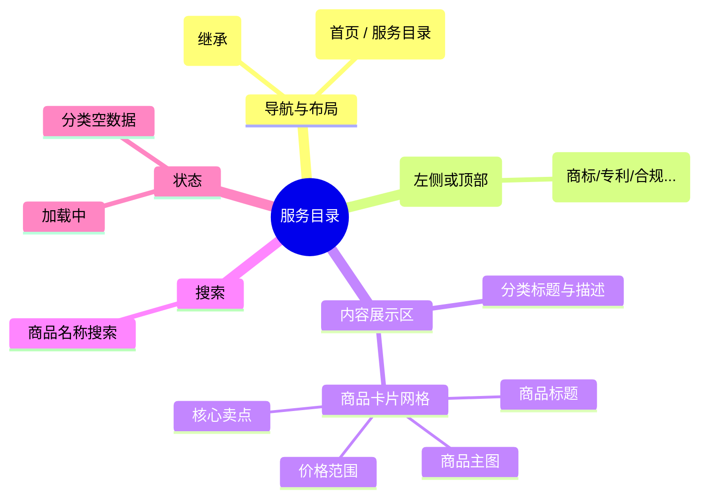

# 服务目录

## 0. 页面文档状态

- 文档版本：Draft v2
- 生成日期：2026-05-13
- 来源文件：`product/release/product-sitemap-release.md`
- 来源主稿：`product/development/pages/050-service-catalog/index.md`
- 来源 Sitemap 行：
  - 生成顺序：50
  - 页面ID：U-300
  - 父页面ID：ROOT
  - 层级：L1
  - Surface：用户端
  - Layout 区域：主导航
  - 页面名称：服务目录
  - 页面类型：列表
  - Sitemap 页面级MD文件：product/development/pages/050-service-catalog.md
- 当前输出文件：product/development/pages/050-service-catalog/index-v2.md
- 页面级假设 / 待确认编号规则：
  - 页面假设：`PA-001` 起，按首次出现顺序递增。
  - 页面待确认：`PQ-001` 起，按首次出现顺序递增。

## 1. 页面目标与上下文

### 1.1 页面目标

- 页面目的：展示平台提供的所有合规服务分类，作为用户浏览与选购服务的总入口。
- 用户目标：通过分类导航快速定位到感兴趣的服务类型（如美国商标注册、欧洲 VAT 等）。
- 业务目标：清晰呈现服务矩阵，提升长尾服务的曝光率。
- 页面成功标准：从目录页跳转至商品详情页的转化率。

### 1.2 页面入口与出口

| 类型 | 来源 / 去向 | 触发条件 | 传入 / 传出数据 | 备注 |
|---|---|---|---|---|
| 入口 | 顶栏导航 | 点击“服务目录” | 无 |  |
| 出口 | 服务商品详情 (U-310) | 点击具体服务项 | 商品 ID |  |
| 出口 | 登录注册 (U-100) | 点击登录 | 无 |  |

### 1.3 角色与权限

| 角色 | 是否可访问 | 权限条件 | 不满足时页面表现 | 相关 PA/PQ |
|---|---|---|---|---|
| 游客 | 是 | 无 | 正常访问 |  |
| 客户用户 | 是 | 无 | 正常访问 |  |

### 1.4 全局页面属性

| 属性 | 类型 | 来源 | 默认值 | 影响元素 / 状态 | 说明 |
|---|---|---|---|---|---|
| platform_brand | string | domain | derived | Logo、色调、推荐位 | 双域名品牌差异化展现，通过全局配置动态匹配 |

## 2. 页面结构思维导图



## 3. 页面布局与内容区块

| 区块ID | 区块名称 | 区块类型 | 展示条件 | 包含元素ID | 布局 / 样式定义 | 数据来源 | 相关 PA/PQ |
|---|---|---|---|---|---|---|---|
| S-001 | 分类侧边栏 | nav | 总是显示 | E-001 | 纵向列表，吸顶 | API-001 |  |
| S-002 | 商品展示网格 | content | 总是显示 | E-002, E-003 | 1280px 居中，3-4 列网格 | API-002 |  |

## 4. 页面元素清单

| 元素ID | 元素名称 | 元素类型 | 所属区块 | 是否必需 | 展示条件 | 默认文案 / 内容 | 样式定义 | 数据绑定 | 相关 PA/PQ |
|---|---|---|---|---|---|---|---|---|---|
| E-001 | 一级分类列表 | list | S-001 | 是 | 总是显示 | 商标 / 专利 / 版权... | 高亮当前项 | categories |  |
| E-002 | 商品卡片 | card | S-002 | 是 | 有数据 | - | 带主图、标题、价格 | product_list |  |
| E-003 | 价格标签 | text | S-002 | 是 | 卡片内 | ¥{price} 起 | 品牌高亮色 | price |  |
| E-004 | 商品搜索框 | input | S-002 | 是 | 总是显示 | 搜索您需要的服务 | 顶部居中或右侧 | search_key |  |

## 5. 元素状态矩阵

| 元素ID | 状态 | 触发条件 | 状态来源 | 样式定义 | 可执行动作 | 禁止动作 | 提示文案 / 反馈 | 恢复条件 | 相关 PA/PQ |
|---|---|---|---|---|---|---|---|---|---|
| E-001 | 激活态 | 点击分类 | current_cat | 文字加粗+品牌色下划线 | - | - | - | - |  |
| E-002 | 鼠标悬浮 | hover | css | 阴影加深+图片微放 | 点击进入 | - | - | - |  |
| E-002 | 已下架 | 状态="off" | item.status | 置灰遮罩 | - | 点击 | 已下架 | - |  |

## 6. 交互 Action 与执行效果

| ActionID | 触发元素ID | 交互名称 | 用户动作 | 前置条件 | 校验规则 | 执行动作 | 成功结果 | 失败结果 | 页面跳转 / 状态变化 | 埋点事件ID | 埋点事件名称 | 不埋点原因 | 相关 PA/PQ |
|---|---|---|---|---|---|---|---|---|---|---|---|---|---|
| ACT-001 | E-001 | 切换分类 | 点击分类项 | - | - | 刷新商品列表 | 列表更新 | - | - | EVT-002 | 分类切换 | - |  |
| ACT-002 | E-002 | 进入详情 | 点击卡片 | - | - | 导航 | - | - | 跳转 U-310 | EVT-003 | 商品点击 | - |  |
| ACT-003 | E-004 | 搜索商品 | 输入并回车 | - | - | 过滤列表 | 列表更新 | - | - | EVT-004 | 目录搜索 | - |  |

## 7. 埋点事件统计设计

### 7.1 埋点事件总表

| 埋点事件ID | 事件名称 | 事件类型 | 关联元素ID / ActionID | 触发时机 | 统计次数口径 | 去重规则 | 上报时机 | 关键属性 | 成功 / 失败归因 | 漏斗阶段 | 相关 PA/PQ |
|---|---|---|---|---|---|---|---|---|---|---|---|
| EVT-001 | 服务目录曝光 | page_view | - | 页面进入 | 每会话 1 次 | sessionId | 实时 | platform_brand | - | 导流起点 |  |
| EVT-002 | 分类点击 | click | E-001 | 点击 | 每次触发 1 次 | - | 实时 | category_id, category_name | - | 意向明确 |  |
| EVT-003 | 商品卡片点击 | click | E-002 | 点击 | 每次触发 1 次 | - | 实时 | product_id, product_name | - | 详情转化 |  |

## 8. 数据结构与接口定义

### 8.1 页面数据模型

| 数据对象 | 字段 | 类型 | 必填 | 来源 | 默认值 | 使用位置 | 说明 |
|---|---|---|---|---|---|---|---|
| Category | id | string | 是 | API | - | E-001 |  |
| Category | name | string | 是 | API | - | E-001 |  |
| ProductItem | id | string | 是 | API | - | - |  |
| ProductItem | title | string | 是 | API | - | E-002 |  |
| ProductItem | main_image | string | 是 | API | - | E-002 |  |
| ProductItem | min_price | number | 是 | API | - | E-003 |  |

### 8.2 接口清单

| API ID | 接口名称 | 方法 | 路径 | 触发 ActionID | 请求数据结构 | 返回数据结构 | 成功处理 | 失败处理 | 相关 PA/PQ |
|---|---|---|---|---|---|---|---|---|---|
| API-001 | 获取分类列表 | GET | /api/catalog/categories | 页面加载 | - | {list} | 渲染侧边栏 | - |  |
| API-002 | 获取商品列表 | GET | /api/catalog/products | 页面加载 / 切换分类 | {category_id, search} | {list} | 渲染网格 | - |  |

## 9. 边界状态与错误处理

| 场景ID | 场景类型 | 触发条件 | 页面表现 | 元素表现 | 用户可执行操作 | 系统处理 | 兜底文案 | 相关 PA/PQ |
|---|---|---|---|---|---|---|---|---|
| EDGE-001 | 暂无商品 | 该分类下无商品 | 显示提示 | - | 切换其他分类 | - | 该分类下暂无服务，敬请期待 |  |

## 10. 多媒体与资源

| 资源ID | 资源类型 | 使用位置 | 来源 | 说明 |
|---|---|---|---|---|
| M-001 | image | E-002 | CDN | 商品主图，上传时需符合固定比例（如 4:3 或 1:1） |

## 11. 页面假设与待确认统一清单

### 11.1 页面假设清单

| 假设ID | 假设内容 | 首次出现位置 | 影响范围 | 影响元素 / Action / API / 埋点事件 | 置信度 | 用户确认状态 | Release 处理方式 |
|---|---|---|---|---|---|---|---|
| - | - | - | - | - | - | - | - |

### 11.2 页面待确认清单

| 待确认ID | 待确认问题 | 首次出现位置 | 影响范围 | 影响元素 / Action / API / 埋点事件 | 优先级 | 用户确认结果 | Release 处理方式 |
|---|---|---|---|---|---|---|---|
| - | - | - | - | - | - | - | - |

## 12. 用户补充描述

> 本章节必须保留在页面 Draft 文档末尾，供用户用自然语言补充或修改当前页面需求。`product-page-release` 生成 release 版本时必须读取、分析并应用这里的内容。
> 如果没有补充，请保留“无”。

```text
无
```
