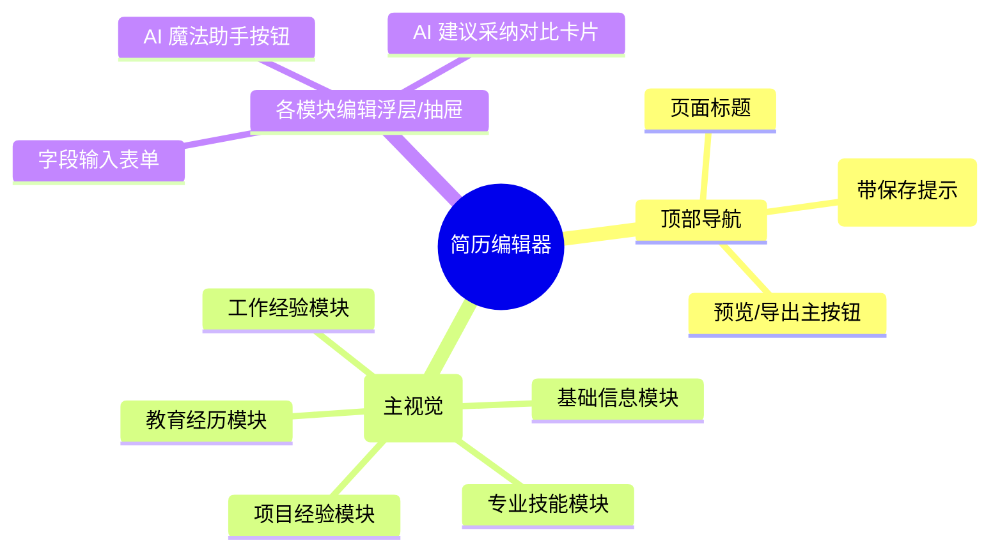

# 简历编辑器

## 0. 页面文档状态

- 文档版本：Draft
- 生成日期：2026-05-11
- 来源文件：`product/release/product-overview-release.md`
- 来源 Sitemap 行：
  - 生成顺序：60
  - 页面ID：U-020-040
  - 父页面ID：U-020
  - 层级：L2
  - Surface：用户端App
  - Layout 区域：独立层级
  - 页面名称：简历编辑器
  - 页面类型：编辑
  - Sitemap 页面级MD文件：`product/development/pages/060-editor.md`
- 当前输出文件：`product/development/pages/060-editor.md`
- 页面级假设 / 待确认编号规则：
  - 页面假设：`PA-001` 起，按首次出现顺序递增。
  - 页面待确认：`PQ-001` 起，按首次出现顺序递增。

## 1. 页面目标与上下文

### 1.1 页面目标

- 页面目的：提供强大的结构化简历在线编辑能力，支持用户查看并采纳 AI 的优化建议。
- 用户目标：在这里修改和完善简历信息，决定是否使用 AI 给出的润色文案。
- 业务目标：提供流畅的编辑体验，凸显 AI 功能的价值（如“魔法润色”、“一键扩写”）。
- 页面成功标准：用户完成简历的编辑与核对，并成功跳转至导出预览页面。

### 1.2 页面入口与出口

| 类型 | 来源 / 去向 | 触发条件 | 传入 / 传出数据 | 备注 |
|---|---|---|---|---|
| 入口 | AI 分析报告页 (U-020-030) | 点击“进入编辑器” | 传入 `resume_id` | |
| 入口 | 首页 (U-020) | 点击近期简历卡片 | 传入 `resume_id` | |
| 入口 | 历史简历页 (U-030-020) | 点击重新编辑 | 传入 `resume_id` | |
| 出口 | 导出预览页 (U-020-040-010) | 点击“预览并导出” | 传入 `resume_id` | |

### 1.3 角色与权限

| 角色 | 是否可访问 | 权限条件 | 不满足时页面表现 | 相关 PA/PQ |
|---|---|---|---|---|
| 普通用户 | 是 | 需对该 `resume_id` 有操作权限 | 无权限或数据不存在则报错返回 | |
| VIP 会员 | 是 | | | |

### 1.4 全局页面属性

| 属性 | 类型 | 来源 | 默认值 | 影响元素 / 状态 | 说明 |
|---|---|---|---|---|---|
| resumeData | object | API | null | 全局展示 | 结构化的简历数据（个人信息、教育、工作等） |
| hasUnsaved | boolean | local state | false | S-001 (返回拦截) | 是否有未保存的本地修改 |

## 2. 页面结构思维导图



## 3. 页面布局与内容区块

| 区块ID | 区块名称 | 区块类型 | 展示条件 | 包含元素ID | 布局 / 样式定义 | 数据来源 | 相关 PA/PQ |
|---|---|---|---|---|---|---|---|
| S-001 | 页面头部 | header | 常驻 | E-001, E-002, E-003 | 包含右侧预览/导出按钮的导航栏 | | |
| S-002 | 模块导航缩略区 | nav | 常驻 | E-004 | 页面顶部的横向锚点滚动条或快捷定位 | | |
| S-003 | 内容编辑主列 | content | 常驻 | E-005, E-006 | 垂直排布的多个模块卡片（基础、教育、工作等） | `resumeData` | |
| S-004 | 详情编辑抽屉 | drawer | 点击具体模块项时 | E-007, E-008, E-009 | 底部弹出的半屏或全屏表单区域 | local draft | （页面假设 PA-001：移动端采用底部抽屉或新页进行具体表单编辑） |

## 4. 页面元素清单

| 元素ID | 元素名称 | 元素类型 | 所属区块 | 是否必需 | 展示条件 | 默认文案 / 内容 | 样式定义 | 数据绑定 | 相关 PA/PQ |
|---|---|---|---|---|---|---|---|---|---|
| E-001 | 返回按钮 | icon | S-001 | 是 | 常驻 | 返回箭头 | | | |
| E-002 | 页面标题 | text | S-001 | 是 | 常驻 | "编辑简历" | | | |
| E-003 | 预览并导出按钮 | button | S-001 | 是 | 常驻 | "预览" | 位于右上角主色按钮 | | |
| E-004 | 模块锚点导航 | tabs | S-002 | 否 | 常驻 | 基础 / 教育 / 工作 / 技能 | 横向可滑动 Tab | | |
| E-005 | 模块标题卡 | card | S-003 | 是 | 按数据有无 | 包含模块名称及“+添加”操作 | | `resumeData` 的 key | |
| E-006 | 模块内容条目 | list-item | S-003 | 是 | 模块下有数据 | 数据摘要展示 | 点击出现右侧箭头或高亮 | `resumeData.xxx[i]` | |
| E-007 | 抽屉-输入表单 | form | S-004 | 是 | S-004 展开 | 具体字段 (如公司、岗位、描述) | 标准表单控件 | `draft` 数据 | |
| E-008 | 抽屉-AI建议卡片 | card | S-004 | 否 | 此字段有 AI 建议 | "AI 建议：..." 及 "采纳" 按钮 | 与表单内联，具有特殊的渐变边框或标识 | `ai_suggestions` | |
| E-009 | 抽屉-单项保存 | button | S-004 | 是 | S-004 展开 | "保存并收起" | 底部全宽按钮 | | |

## 5. 元素状态矩阵

| 元素ID | 状态 | 触发条件 | 状态来源 | 样式定义 | 可执行动作 | 禁止动作 | 提示文案 / 反馈 | 恢复条件 | 相关 PA/PQ |
|---|---|---|---|---|---|---|---|---|---|
| S-003 | 加载 | 简历详情拉取中 | 接口请求 | 骨架屏 | | 点击编辑 | | 数据返回 | |
| E-006 | 带有 AI 优化可用 | 该条目存在 AI 优化点且未被采纳 | 数据比对 | 列表条目旁展示闪烁星光 icon | | | "1条建议待采纳" | | |
| E-003 | 禁用 | 关键必填信息为空（如姓名、电话） | 表单校验 | 置灰 | | 跳转预览 | | 补全信息 | |

## 6. 交互 Action 与执行效果

| ActionID | 触发元素ID | 交互名称 | 用户动作 | 前置条件 | 校验规则 | 执行动作 | 成功结果 | 失败结果 | 页面跳转 / 状态变化 | 埋点事件 | 相关 PA/PQ |
|---|---|---|---|---|---|---|---|---|---|---|---|
| ACT-001 | E-001 | 返回检测 | 点击 | `hasUnsaved` 为假/真 | 若真则弹窗确认放弃 | 路由返回 | | | 无未保存直接退，否则出拦截弹窗 | | |
| ACT-002 | E-006 | 展开编辑项 | 点击 | 无 | 无 | 弹出底部抽屉 S-004 | 渲染 E-007 表单 | | | | |
| ACT-003 | E-008 | 采纳 AI 建议 | 点击 | 当前有高亮建议 | 无 | 建议内容覆盖到表单输入框中 | 文本被替换，建议卡片消失 | | 表单内容更新 | `click_adopt_ai` | |
| ACT-004 | E-009 | 保存单项 | 点击 | 必填项合法 | 内容合法 | API 调用 (API-002) 更新单个模块数据 | 关闭抽屉，更新外部列表，`hasUnsaved=false` | Toast 报错 | | | |
| ACT-005 | E-003 | 去预览 | 点击 | `hasUnsaved=false` 且必填完整 | 无 | 路由跳转并传参 | | | 携带 `resume_id` 跳至 U-020-040-010 | `click_preview_export` | |

## 7. 数据结构与接口定义

### 7.1 页面数据模型

由于简历字段极多，此处采用抽象定义：
| 数据对象 | 字段 | 类型 | 必填 | 来源 | 默认值 | 使用位置 | 说明 |
|---|---|---|---|---|---|---|---|
| ResumeData | basic | object | 是 | API | | E-006 | 姓名电话等 |
| ResumeData | educations | array | 是 | API | `[]` | E-006 | |
| ResumeData | works | array | 是 | API | `[]` | E-006 | |
| ResumeData | skills | array | 否 | API | `[]` | E-006 | |
| AiSuggestionMap| map | object | 否 | API | `{}` | E-008 | 结构：`{ "works.0.description": "建议内容..." }` |

### 7.2 接口清单

| API ID | 接口名称 | 方法 | 路径 | 触发 ActionID | 请求数据结构 | 返回数据结构 | 成功处理 | 失败处理 | 相关 PA/PQ |
|---|---|---|---|---|---|---|---|---|---|
| API-001 | 获取简历详情 | GET | `/api/v1/resume/detail` | 页面初始化 | `?resume_id=string` | `{ "data": ResumeData, "ai_suggestions": AiSuggestionMap }` | 渲染 S-003 及标识出 AI 建议 | 页面报错 | |
| API-002 | 保存局部模块 | POST | `/api/v1/resume/module` | ACT-004 | `{ "resume_id": "string", "module_name": "works", "module_data": {} }` | `{ "success": true }` | 更新本地 `ResumeData` | 提示保存失败 | （页面假设 PA-002：编辑动作是按模块局部保存的，并非全量提交，体验更佳） |

### 7.3 请求 / 返回 JSON 示例

#### API-001 成功返回示例

```json
{
  "code": 0,
  "message": "success",
  "data": {
    "data": {
      "basic": { "name": "张三", "phone": "13800000000" },
      "works": [
        { "id": "W1", "company": "XX公司", "description": "做了后台开发..." }
      ]
    },
    "ai_suggestions": {
      "works_W1_description": "负责核心业务后台微服务架构设计..."
    }
  }
}
```

## 8. 边界状态与错误处理

| 场景ID | 场景类型 | 触发条件 | 页面表现 | 元素表现 | 用户可执行操作 | 系统处理 | 兜底文案 | 相关 PA/PQ |
|---|---|---|---|---|---|---|---|---|
| EDGE-001 | 必填项缺失就预览 | 用户删除姓名后直接点右上角预览 | Toast 提示 | E-003 产生防错动效 | 填写缺失项 | 拦截路由跳转 | "请至少填写完整基础信息后再预览" | |

## 9. 多媒体与资源

无。

## 10. 页面假设与待确认统一清单

### 10.1 页面假设清单

| 假设ID | 假设内容 | 首次出现位置 | 影响范围 | 影响元素 / Action / API | 置信度 | 用户确认状态 | Release 处理方式 |
|---|---|---|---|---|---|---|---|
| PA-001 | 移动端表单编辑长篇幅内容体验不佳，假设采用列表展示 + 抽屉/全屏内页逐条编辑的交互模式 | 3 页面布局与内容区块 (S-004) | 整体编辑区结构 | S-004, E-007, ACT-002 | 高 | 确认 | 确认为正式内容 |
| PA-002 | 每次抽屉编辑完点“保存并收起”即调用接口局部更新模块，确保断网/杀进程也能最大程度保留数据 | 7.2 接口清单 (API-002) | 保存机制及接口要求 | API-002, ACT-004 | 高 | 确认 | 确认为正式内容 |

### 10.2 页面待确认清单

暂无。
