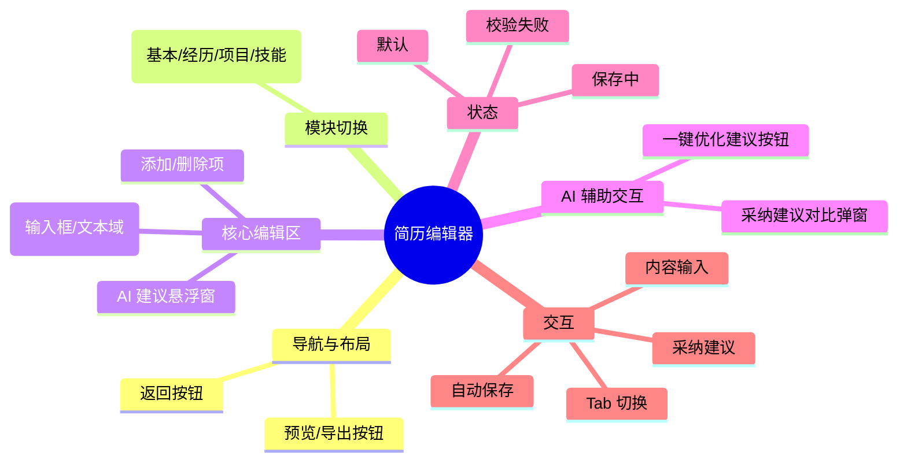

# 简历编辑器

## 0. 页面文档状态

- 文档版本：Draft
- 生成日期：2026-05-11
- 来源文件：`product/release/product-overview-release.md`
- 来源 Sitemap 行：
  - 生成顺序：60
  - 页面ID：U-020-040
  - 父页面ID：U-020
  - 层级：L2
  - Surface：用户端App
  - Layout 区域：独立层级
  - 页面名称：简历编辑器
  - 页面类型：编辑
  - Sitemap 页面级MD文件：product/development/pages/060-editor.md
- 当前输出文件：product/development/pages/060-editor.md
- 页面级假设 / 待确认编号规则：
  - 页面假设：`PA-001` 起，按首次出现顺序递增。
  - 页面待确认：`PQ-001` 起，按首次出现顺序递增。

## 1. 页面目标与上下文

### 1.1 页面目标

- 页面目的：提供简历内容的结构化编辑能力，并辅助用户应用 AI 优化建议。
- 用户目标：根据 AI 建议修改简历内容，提升简历质量。
- 业务目标：沉淀高质量的用户简历数据，提升用户对 AI 建议的采纳率。
- 页面成功标准：用户完成修改并进入导出预览页。

### 1.2 页面入口与出口

| 类型 | 来源 / 去向 | 触发条件 | 传入 / 传出数据 | 备注 |
|---|---|---|---|---|
| 入口 | AI 分析报告页 | 点击“立即去优化” | 简历 ID、建议数据 | |
| 出口 | 导出预览页 | 点击“预览/导出” | 简历 ID、更新后的内容 | 跳转至 U-020-040-010 (U-070) |
| 出口 | AI 分析报告页 | 点击返回 | 无 | 返回 U-050 |

### 1.3 角色与权限

| 角色 | 是否可访问 | 权限条件 | 不满足时页面表现 | 相关 PA/PQ |
|---|---|---|---|---|
| 用户 | 是 | 已登录 | 正常展示 | |

### 1.4 全局页面属性

| 属性 | 类型 | 来源 | 默认值 | 影响元素 / 状态 | 说明 |
|---|---|---|---|---|---|
| current_section | enum | local state | basic | 内容展示 | 基本信息, 工作经历, 项目经历, 教育经历, 个人技能 |
| is_dirty | boolean | local state | false | 保存按钮状态 | 内容是否有未保存修改 |

## 2. 页面结构思维导图

## 3. 页面布局与内容区块

| 区块ID | 区块名称 | 区块类型 | 展示条件 | 包含元素ID | 布局 / 样式定义 | 数据来源 | 相关 PA/PQ |
|---|---|---|---|---|---|---|---|
| S-001 | 顶部操作区 | header | 总是展示 | E-001, E-002 | 顶部固定 | 本地 | |
| S-002 | 模块切换区 | content | 总是展示 | E-003 | 横向滚动 Tab | 本地 | |
| S-003 | 动态表单区 | content | 总是展示 | E-004 | 垂直排列 | API | |
| S-004 | AI 建议浮窗 | overlay | 有对应模块建议时 | E-005, E-006 | 底部悬浮或右侧挂件 | API | |
| S-005 | 底部操作区 | footer | 总是展示 | E-007 | 底部固定 | 本地 | |

## 4. 页面元素清单

| 元素ID | 元素名称 | 元素类型 | 所属区块 | 是否必需 | 展示条件 | 默认文案 / 内容 | 样式定义 | 数据绑定 | 相关 PA/PQ |
|---|---|---|---|---|---|---|---|---|---|
| E-001 | 返回按钮 | button | S-001 | 是 | 总是展示 | <图标 | | 无 | |
| E-002 | 导出预览按钮 | button | S-001 | 是 | 总是展示 | 预览/导出 | 品牌色，圆角 | 无 | |
| E-003 | 模块切换 Tab | nav | S-002 | 是 | 总是展示 | 基本信息 / 工作经历 / ... | 活跃项加下划线 | current_section | |
| E-004 | 表单容器 | group | S-003 | 是 | 总是展示 | 根据模块动态渲染 | | section_data | |
| E-005 | AI 优化悬浮球 | button | S-004 | 否 | 存在建议时 | AI 优化 | 悬浮圆形按钮 | 无 | |
| E-006 | 建议对比弹窗 | modal | S-004 | 否 | 点击悬浮球后 | 展示原内容 vs 优化内容 | 左右对比或上下对比 | suggestion_data | (页面假设 PA-001：对比弹窗支持一键采纳) |
| E-007 | 保存状态文案 | text | S-005 | 否 | is_dirty == false | 已自动保存 | 12px, 灰色 | 无 | |

## 5. 元素状态矩阵

| 元素ID | 状态 | 触发条件 | 状态来源 | 样式定义 | 可执行动作 | 禁止动作 | 提示文案 / 反馈 | 恢复条件 | 相关 PA/PQ |
|---|---|---|---|---|---|---|---|---|---|
| E-002 | 默认 | 总是 | 本地 | 品牌色 | 点击跳转 | 无 | | | |
| E-004 | 输入中 | 用户输入 | 本地 | 高亮边框 | 无 | 无 | | 失去焦点 | |
| E-005 | 呼吸态 | 存在高价值建议 | 本地 | 缩放动画 | 点击打开对比 | 无 | 发现 3 处可优化项 | 已读或采纳 | |

## 6. 交互 Action 与执行效果

| ActionID | 触发元素ID | 交互名称 | 用户动作 | 前置条件 | 校验规则 | 执行动作 | 成功结果 | 失败结果 | 页面跳转 / 状态变化 | 埋点事件ID | 埋点事件名称 | 不埋点原因 | 相关 PA/PQ |
|---|---|---|---|---|---|---|---|---|---|---|---|---|---|
| ACT-001 | E-003 | 切换模块 | 点击 Tab | 无 | 无 | 更新视图 | 展示对应表单 | 无 | UI 状态更新 | EVT-002 | 编辑器模块切换点击 | | |
| ACT-002 | E-005 | 打开 AI 对比 | 点击 | 存在建议 | 无 | 打开弹窗 E-006 | 展示对比 | 无 | 弹窗弹出 | EVT-003 | 编辑器 AI 建议点击 | | |
| ACT-003 | E-006 | 采纳 AI 建议 | 点击“采纳” | 无 | 无 | 更新表单内容 | 覆盖原内容 | 无 | 弹窗关闭，表单更新 | EVT-004 | 编辑器 AI 建议采纳 | | |
| ACT-004 | E-002 | 进入导出预览 | 点击 | 表单内容非空 | 无 | 导航跳转 | 进入预览页 | 校验提示 | 跳转 U-070 | EVT-005 | 编辑器进入预览点击 | | |

## 7. 埋点事件统计设计

### 7.1 埋点事件总表

| 埋点事件ID | 事件名称 | 事件类型 | 关联元素ID / ActionID | 触发时机 | 统计次数口径 | 去重规则 | 上报时机 | 关键属性 | 成功 / 失败归因 | 漏斗阶段 | 相关 PA/PQ |
|---|---|---|---|---|---|---|---|---|---|---|---|
| EVT-001 | 编辑器曝光 | page_view | 无 | 进入页面 | 每页面会话计 1 次 | sessionId | 实时 | page_id, resume_id | | | |
| EVT-002 | 编辑器模块切换点击 | click | ACT-001 | 点击 Tab | 每次触发计 1 次 | 无 | 实时 | target_section | | | |
| EVT-003 | 编辑器 AI 建议点击 | click | ACT-002 | 点击悬浮球 | 每次触发计 1 次 | actionId | 实时 | suggestion_count | | | |
| EVT-004 | 编辑器 AI 建议采纳 | submit | ACT-003 | 点击采纳按钮 | 每次触发计 1 次 | actionId | 实时 | suggestion_id, section_type | | 核心价值点 | |
| EVT-005 | 编辑器进入预览点击 | click | ACT-004 | 点击导出预览 | 每次触发计 1 次 | actionId | 实时 | is_dirty | | 转化漏斗 | |

### 7.2 埋点事件属性定义

| 属性名 | 类型 | 必填 | 来源 | 示例值 | 使用事件ID | 说明 |
|---|---|---|---|---|---|---|
| target_section | string | 是 | Action 参数 | work_exp | EVT-002 | |
| suggestion_id | string | 是 | 建议数据 | SUG-001 | EVT-004 | |

## 8. 数据结构与接口定义

### 8.1 页面数据模型

| 数据对象 | 字段 | 类型 | 必填 | 来源 | 默认值 | 使用位置 | 说明 |
|---|---|---|---|---|---|---|---|
| ResumeContent | basic_info | object | 是 | API | | E-004 | {name, email, phone...} |
| ResumeContent | work_exp | array | 否 | API | | E-004 | [{company, role, duration, content}] |
| Suggestion | id | string | 是 | API | | E-006 | |
| Suggestion | original | string | 是 | API | | E-006 | |
| Suggestion | optimized | string | 是 | API | | E-006 | |

### 8.2 接口清单

| API ID | 接口名称 | 方法 | 路径 | 触发 ActionID | 请求数据结构 | 返回数据结构 | 成功处理 | 失败处理 | 相关 PA/PQ |
|---|---|---|---|---|---|---|---|---|---|
| API-001 | 获取简历详情 | GET | /api/resume/detail | 页面加载 | {resume_id} | {ResumeContent} | 渲染表单 | 错误提示 | |
| API-002 | 自动保存 | POST | /api/resume/save | 定时触发 / 离焦 | {ResumeContent} | {status} | 更新 is_dirty | 无感重试 | |
| API-003 | 获取 AI 实时建议 | GET | /api/ai/suggestions | 模块切换 | {resume_id, section} | {Suggestion[]} | 展示悬浮球 | 无 | |

## 9. 边界状态与错误处理

| 场景ID | 场景类型 | 触发条件 | 页面表现 | 元素表现 | 用户可执行操作 | 系统处理 | 兜底文案 | 相关 PA/PQ |
|---|---|---|---|---|---|---|---|---|
| EDGE-001 | 内容校验失败 | 邮箱格式错误等 | 输入框下方显示红字 | 对应项高亮 | 修正输入 | 阻止跳转 | 请检查输入格式是否正确 | |
| EDGE-002 | 保存失败 | 网络断开 | 顶部提示“保存失败” | E-007 变为重试 | 点击重试 | 暂停自动保存 | 网络已断开，请检查网络设置 | |

## 10. 多媒体与资源

| 资源ID | 资源类型 | 使用位置 | 来源 | 格式 / 尺寸 | 加载状态 | 失败降级 | 可访问性说明 | 相关 PA/PQ |
|---|---|---|---|---|---|---|---|---|
| M-001 | icon | E-005 | 本地 | SVG | 总是加载 | 默认文字 | AI 机器人图标 | |

## 11. 页面假设与待确认统一清单

### 11.1 页面假设清单

| 假设ID | 假设内容 | 首次出现位置 | 影响范围 | 影响元素 / Action / API / 埋点事件 | 置信度 | 用户确认状态 | Release 处理方式 |
|---|---|---|---|---|---|---|---|
| PA-001 | 对比弹窗支持“一键采纳”和“手动微调”两种模式 | 4. 页面元素清单 | 交互复杂度 | E-006, ACT-003 | 高 | 待用户确认 | 确认为正式内容 |

### 11.2 页面待确认清单

| 待确认ID | 待确认问题 | 首次出现位置 | 影响范围 | 影响元素 / Action / API / 埋点事件 | 优先级 | 用户确认结果 | Release 处理方式 |
|---|---|---|---|---|---|---|---|
| PQ-001 | 编辑器是否需要支持“实时预览”小窗口（分屏模式）？ | 3. 页面布局 | UI 复杂度 | S-003 | 高 | 待用户确认 | MVP 暂不提供，需点击预览按钮 |
