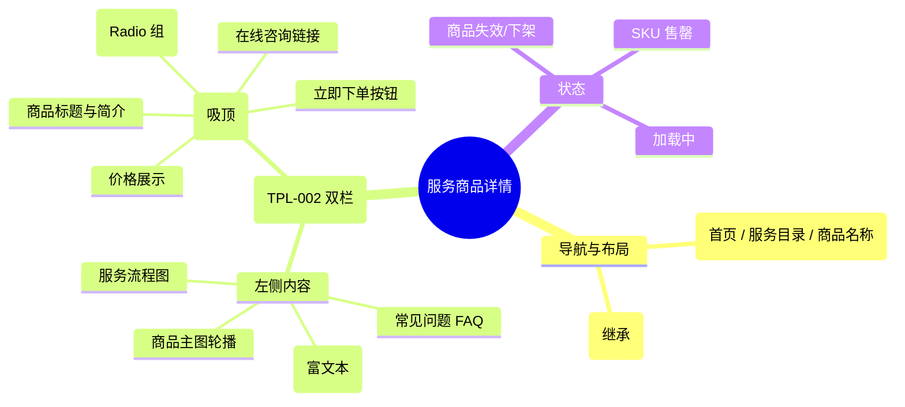

# 服务商品详情

## 0. 页面文档状态

- 文档版本：Draft
- 生成日期：2026-05-13
- 来源文件：`product/release/product-sitemap-release.md`
- 来源 Sitemap 行：
  - 生成顺序：60
  - 页面ID：U-310
  - 父页面ID：U-300
  - 层级：L2
  - Surface：用户端
  - Layout 区域：内容区
  - 页面名称：服务商品详情
  - 页面类型：详情
  - Sitemap 页面级MD文件：product/development/pages/060-service-detail.md
- 当前输出文件：product/development/pages/060-service-detail/index.md

## 1. 页面目标与上下文

### 1.1 页面目标

- 页面目的：展示具体合规服务的详细说明、SKU 选项、价格及流程说明，引导用户完成 SKU 选择并进入下单流程。
- 用户目标：了解服务内容，确认价格，并选定符合需求的 SKU。
- 业务目标：清晰传达服务价值，通过 SKU 差异化定价实现成交。
- 页面成功标准：详情页到下单页的转化率。

### 1.2 页面入口与出口

| 类型 | 来源 / 去向 | 触发条件 | 传入 / 传出数据 | 备注 |
|---|---|---|---|---|
| 入口 | 服务目录 (U-300) | 点击商品卡片 | 商品 ID |  |
| 出口 | 下单确认 (U-320) | 点击“立即下单” | 商品 ID、选定 SKU ID | 需登录，未登录跳转 U-100 |
| 出口 | 服务目录 (U-300) | 点击面包屑 / 返回 | 无 |  |

### 1.3 角色与权限

| 角色 | 是否可访问 | 权限条件 | 不满足时页面表现 | 相关 PA/PQ |
|---|---|---|---|---|
| 游客 | 是 | 无 | 正常显示 | 下单时拦截登录 |
| 客户用户 | 是 | 无 | 正常显示 |  |

### 1.4 全局页面属性

| 属性 | 类型 | 来源 | 默认值 | 影响元素 / 状态 | 说明 |
|---|---|---|---|---|---|
| product_id | string | route | - | 页面数据加载 |  |
| selected_sku_id | string | local state | first sku | 价格、详情展示 | 用户当前选中的 SKU |

## 2. 页面结构思维导图



## 3. 页面布局与内容区块

| 区块ID | 区块名称 | 区块类型 | 展示条件 | 包含元素ID | 布局 / 样式定义 | 数据来源 | 相关 PA/PQ |
|---|---|---|---|---|---|---|---|
| S-001 | 商品基础信息与选购 | content-header | 总是显示 | E-001 至 E-005 | 右侧吸顶容器 | API-001 |  |
| S-002 | 详情介绍区 | content | 总是显示 | E-006 至 E-008 | 左侧主内容区 | API-001 |  |
| S-003 | 固定操作底栏 | footer | 窄屏显示 | E-005 | 移动端/窄屏底部固定 | - |  |

## 4. 页面元素清单

| 元素ID | 元素名称 | 元素类型 | 所属区块 | 是否必需 | 展示条件 | 默认文案 / 内容 | 样式定义 | 数据绑定 | 相关 PA/PQ |
|---|---|---|---|---|---|---|---|---|---|
| E-001 | 商品标题 | text | S-001 | 是 | 总是显示 | 商品名称 | H1 | title |  |
| E-002 | 价格显示 | text | S-001 | 是 | 总是显示 | ¥ {price} | 大字品牌色 | selected_sku.price |  |
| E-003 | SKU 选择器 | radio-group | S-001 | 是 | 总是显示 | 规格名称 | 按钮块状样式 | skus | PA-001 |
| E-004 | 数量选择器 | stepper | S-001 | 否 | 业务需要 | 1 | - | quantity | PQ-001 |
| E-005 | 立即下单按钮 | button | S-001 | 是 | 总是显示 | 立即下单 | 100% 宽，实色 | - |  |
| E-006 | 商品图片/视频 | image | S-002 | 是 | 总是显示 | 主图 | 4:3 比例 | images |  |
| E-007 | 详情富文本 | other | S-002 | 是 | 总是显示 | - | 自定义样式 | description |  |
| E-008 | 流程说明组件 | list | S-002 | 是 | 总是显示 | 步骤 1 > 2 > 3 | 时间轴/步骤条 | flow_steps |  |

## 5. 元素状态矩阵

| 元素ID | 状态 | 触发条件 | 状态来源 | 样式定义 | 可执行动作 | 禁止动作 | 提示文案 / 反馈 | 恢复条件 | 相关 PA/PQ |
|---|---|---|---|---|---|---|---|---|---|
| E-003 | 选中 | 用户点击 | selected_sku_id | 边框加重 | - | - | - | - |  |
| E-003 | 禁用 | SKU 下架或无权限 | sku.status="disabled" | 置灰/中划线 | - | 点击 | 暂不可售 | - |  |
| E-005 | 禁用 | 商品已下架 | product.status="off" | 置灰 | - | 点击 | 该商品已下架 | - |  |
| E-005 | 加载中 | 点击下单后校验 | submitting | loading 图标 | - | 点击 | 正在跳转 | 校验完成 |  |

## 6. 交互 Action 与执行效果

| ActionID | 触发元素ID | 交互名称 | 用户动作 | 前置条件 | 校验规则 | 执行动作 | 成功结果 | 失败结果 | 页面跳转 / 状态变化 | 埋点事件ID | 埋点事件名称 | 不埋点原因 | 相关 PA/PQ |
|---|---|---|---|---|---|---|---|---|---|---|---|---|---|
| ACT-001 | E-003 | 切换 SKU | 点击规格按钮 | - | - | 更新价格与详情数据 | 价格实时更新 | - | - | EVT-002 | SKU 切换 | - |  |
| ACT-002 | E-005 | 立即下单 | 点击 | - | 校验登录态 | 提交下单预校验 | 进入下单确认页 | 拦截登录/错误提示 | 跳转 U-320 或 U-100 | EVT-003 | 立即下单点击 | - |  |
| ACT-003 | E-008 | 查看流程节点 | 点击步骤 | - | - | 弹窗/展开详细说明 | 显示节点详情 | - | - | - | - | 辅助说明不埋点 |  |

## 7. 埋点事件统计设计

### 7.1 埋点事件总表

| 埋点事件ID | 事件名称 | 事件类型 | 关联元素ID / ActionID | 触发时机 | 统计次数口径 | 去重规则 | 上报时机 | 关键属性 | 成功 / 失败归因 | 漏斗阶段 | 相关 PA/PQ |
|---|---|---|---|---|---|---|---|---|---|---|---|
| EVT-001 | 商品详情页曝光 | page_view | - | 页面加载完成 | 每会话 1 次 | sessionId | 实时 | product_id, product_name | - | 意向确认 |  |
| EVT-002 | SKU 选择行为 | click | E-003 | 点击切换 | 每次触发 1 次 | - | 实时 | product_id, sku_id | - | 决策中 |  |
| EVT-003 | 立即下单点击 | click | E-005 | 点击 | 每次触发 1 次 | actionId | 实时 | product_id, sku_id, is_logged_in | result | 支付转化 |  |

## 8. 数据结构与接口定义

### 8.1 页面数据模型

| 数据对象 | 字段 | 类型 | 必填 | 来源 | 默认值 | 使用位置 | 说明 |
|---|---|---|---|---|---|---|---|
| ProductDetail | id | string | 是 | API | - | - |  |
| ProductDetail | title | string | 是 | API | - | E-001 |  |
| ProductDetail | skus | array | 是 | API | [] | E-003 | 包含 id, name, price, status |
| ProductDetail | flow_steps | array | 是 | API | [] | E-008 | 流程步骤摘要 |
| ProductDetail | description | string | 是 | API | - | E-007 | 富文本详情 |

### 8.2 接口清单

| API ID | 接口名称 | 方法 | 路径 | 触发 ActionID | 请求数据结构 | 返回数据结构 | 成功处理 | 失败处理 | 相关 PA/PQ |
|---|---|---|---|---|---|---|---|---|---|
| API-001 | 获取商品详情 | GET | /api/product/detail | 页面加载 | {product_id} | {ProductDetail} | 渲染页面 | 404/下架提示 |  |

## 9. 边界状态与错误处理

| 场景ID | 场景类型 | 触发条件 | 页面表现 | 元素表现 | 用户可执行操作 | 系统处理 | 兜底文案 | 相关 PA/PQ |
|---|---|---|---|---|---|---|---|---|
| EDGE-001 | 商品下架 | status="off" | 显示下架提示 | 下单按钮置灰 | 返回目录 | - | 该商品已下架，去看看其他服务吧 |  |
| EDGE-002 | 无效 SKU | sku 数据缺失 | 价格显示 -- | 下单按钮禁用 | 联系客服 | - | 当前规格暂不可售 |  |

## 10. 多媒体与资源

| 资源ID | 资源类型 | 使用位置 | 说明 |
|---|---|---|---|
| M-001 | image | E-006 | 商品轮播图/详情图 |
| M-002 | icon | E-008 | 流程节点图标 |

## 11. 页面假设与待确认统一清单

### 11.1 页面假设清单

| 假设ID | 假设内容 | 首次出现位置 | 影响范围 | 影响元素 / Action / API / 埋点事件 | 置信度 | 用户确认状态 | Release 处理方式 |
|---|---|---|---|---|---|---|---|
| PA-001 | SKU 规格展示采用平铺按钮形式，点击即选中并刷新右侧价格摘要 | 4. 页面元素清单 | 交互、样式 | E-003 | 高 | 确认 | 更新到正式 |

### 11.2 页面待确认清单

| 待确认ID | 待确认问题 | 首次出现位置 | 影响范围 | 影响元素 / Action / API / 埋点事件 | 优先级 | 用户确认结果 | Release 处理方式 |
|---|---|---|---|---|---|---|---|
| PQ-001 | 当前 MVP 是否需要支持“商品购买数量”？合规服务通常为按件购买，是否限制为 1？ | 4. 页面元素清单 | 功能范围 | E-004 | 中 | 确认 | 支持 |

## 12. 用户补充描述

```text
无
```
