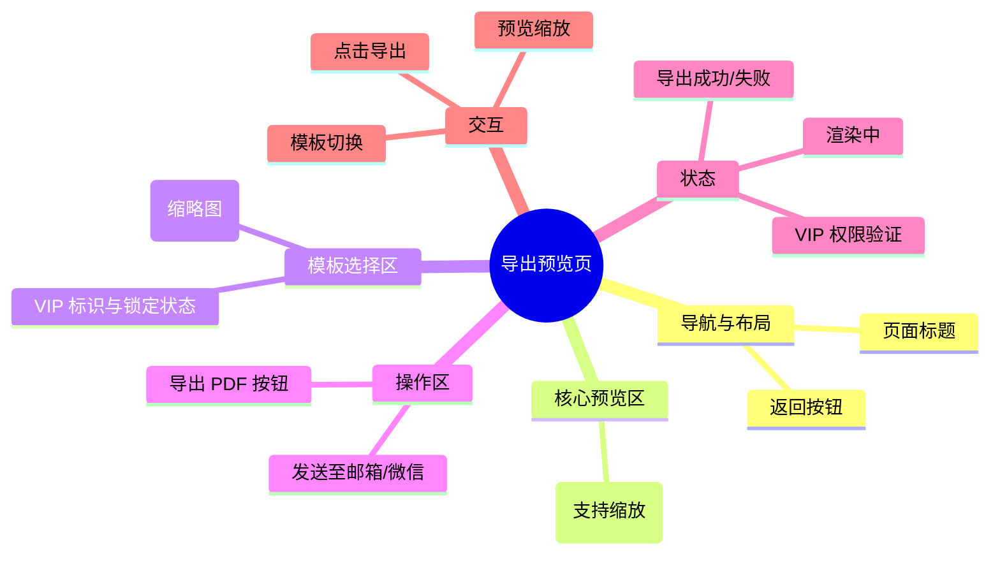

# 导出预览页

## 0. 页面文档状态

- 文档版本：Draft
- 生成日期：2026-05-11
- 来源文件：`product/release/product-overview-release.md`
- 来源 Sitemap 行：
  - 生成顺序：70
  - 页面ID：U-020-040-010
  - 父页面ID：U-020-040
  - 层级：L3
  - Surface：用户端App
  - Layout 区域：独立层级
  - 页面名称：导出预览页
  - 页面类型：功能/展示
  - Sitemap 页面级MD文件：product/development/pages/070-export.md
- 当前输出文件：product/development/pages/070-export.md
- 页面级假设 / 待确认编号规则：
  - 页面假设：`PA-001` 起，按首次出现顺序递增。
  - 页面待确认：`PQ-001` 起，按首次出现顺序递增。

## 1. 页面目标与上下文

### 1.1 页面目标

- 页面目的：提供简历的最终渲染预览，并支持用户导出为 PDF 文件。
- 用户目标：查看简历排版效果，选择模板，并获取可投递的 PDF 文件。
- 业务目标：展示高级模板（会员价值点），引导用户导出并完成求职链路。
- 页面成功标准：用户成功导出 PDF。

### 1.2 页面入口与出口

| 类型 | 来源 / 去向 | 触发条件 | 传入 / 传出数据 | 备注 |
|---|---|---|---|---|
| 入口 | 简历编辑器 | 点击“预览/导出” | 简历 ID、最新内容 | |
| 出口 | 简历编辑器 | 点击返回 | 无 | 返回 U-060 |
| 出口 | 系统分享/保存 | 点击“导出 PDF” | PDF 文件流 | 触发 OS 层级操作 |
| 出口 | 会员订阅页 | 点击锁定模板 | 模板 ID | 跳转至 U-090 |

### 1.3 角色与权限

| 角色 | 是否可访问 | 权限条件 | 不满足时页面表现 | 相关 PA/PQ |
|---|---|---|---|---|
| 用户 | 是 | 已登录 | 正常展示 | |
| VIP 会员 | 是 | 已登录且有效 | 可使用所有模板、无水印 | |

### 1.4 全局页面属性

| 属性 | 类型 | 来源 | 默认值 | 影响元素 / 状态 | 说明 |
|---|---|---|---|---|---|
| current_template_id | string | local state | default | 预览效果 | 当前选中的模板 ID |
| is_vip | boolean | global store | false | 模板锁定状态 | 用户是否为 VIP |

## 2. 页面结构思维导图

## 3. 页面布局与内容区块

| 区块ID | 区块名称 | 区块类型 | 展示条件 | 包含元素ID | 布局 / 样式定义 | 数据来源 | 相关 PA/PQ |
|---|---|---|---|---|---|---|---|
| S-001 | 预览核心区 | content | 总是展示 | E-001 | 占据屏幕 60-70% 空间 | API 渲染 | |
| S-002 | 模板切换区 | content | 总是展示 | E-002 | 底部上方横向滚动 | API | |
| S-003 | 操作按钮区 | footer | 总是展示 | E-003, E-004 | 底部固定 | 本地 | |

## 4. 页面元素清单

| 元素ID | 元素名称 | 元素类型 | 所属区块 | 是否必需 | 展示条件 | 默认文案 / 内容 | 样式定义 | 数据绑定 | 相关 PA/PQ |
|---|---|---|---|---|---|---|---|---|---|
| E-001 | 简历预览窗 | image | S-001 | 是 | 总是展示 | 渲染后的图片/PDF预览 | 阴影效果，支持双指缩放 | preview_url | (页面假设 PA-001：预览采用图片流，导出采用 PDF 流) |
| E-002 | 模板列表 | list | S-002 | 是 | 总是展示 | 模板缩略图 | 80x110 比例卡片 | templates[] | |
| E-003 | 导出 PDF 按钮 | button | S-003 | 是 | 总是展示 | 导出 PDF | 品牌色，全宽 | 无 | |
| E-004 | 分享图标 | icon | S-003 | 否 | 总是展示 | 分享/发送至邮箱 | 幽灵按钮/图标 | 无 | |

## 5. 元素状态矩阵

| 元素ID | 状态 | 触发条件 | 状态来源 | 样式定义 | 可执行动作 | 禁止动作 | 提示文案 / 反馈 | 恢复条件 | 相关 PA/PQ |
|---|---|---|---|---|---|---|---|---|---|
| E-002 | 选中态 | template_id == current | local | 蓝色描边 | 无 | 重复选择 | | 切换模板 | |
| E-002 | 锁定态 | template.is_vip == true && user.is_vip == false | user store | 挂锁图标，半透明遮罩 | 点击触发订阅弹窗 | 预览/导出 | 该模板为 VIP 专享 | 开通 VIP | |
| E-003 | 渲染中 | 切换模板后 API 加载 | API | 禁用，菊花转动 | 无 | 点击 | 正在渲染预览... | 渲染完成 | |

## 6. 交互 Action 与执行效果

| ActionID | 触发元素ID | 交互名称 | 用户动作 | 前置条件 | 校验规则 | 执行动作 | 成功结果 | 失败结果 | 页面跳转 / 状态变化 | 埋点事件ID | 埋点事件名称 | 不埋点原因 | 相关 PA/PQ |
|---|---|---|---|---|---|---|---|---|---|---|---|---|---|
| ACT-001 | E-002 | 切换模板 | 点击模板项 | 非锁定状态 | 无 | 调 API-001 | 更新预览图 | 提示渲染失败 | UI 更新 | EVT-002 | 预览页模板切换 | | |
| ACT-002 | E-003 | 导出 PDF | 点击 | 无 | 无 | 调 API-002 | 调起系统分享 | 提示导出失败 | 弹出系统菜单 | EVT-003 | 预览页导出点击 | | |
| ACT-003 | E-002 | 点击锁定模板 | 点击 | 锁定状态 | 无 | 导航跳转 | 进入订阅页 | 无 | 跳转 U-090 | EVT-004 | 预览页模板转化点击 | | |

## 7. 埋点事件统计设计

### 7.1 埋点事件总表

| 埋点事件ID | 事件名称 | 事件类型 | 关联元素ID / ActionID | 触发时机 | 统计次数口径 | 去重规则 | 上报时机 | 关键属性 | 成功 / 失败归因 | 漏斗阶段 | 相关 PA/PQ |
|---|---|---|---|---|---|---|---|---|---|---|---|
| EVT-001 | 预览页曝光 | page_view | 无 | 进入页面 | 每页面会话计 1 次 | sessionId | 实时 | page_id, template_id | | | |
| EVT-002 | 预览页模板切换 | click | ACT-001 | 点击可用模板 | 每次触发计 1 次 | 无 | 实时 | template_id | | | |
| EVT-003 | 预览页导出点击 | click | ACT-002 | 点击导出按钮 | 每次触发计 1 次 | actionId | 实时 | template_id, is_vip | success / failure | 最终转化 | |
| EVT-004 | 预览页模板转化点击 | click | ACT-003 | 点击锁定模板 | 每次触发计 1 次 | actionId | 实时 | template_id | | 会员转化漏斗 | |

### 7.2 埋点事件属性定义

| 属性名 | 类型 | 必填 | 来源 | 示例值 | 使用事件ID | 说明 |
|---|---|---|---|---|---|---|
| template_id | string | 是 | 元素属性 | TPL-001 | EVT-001, 002 | |
| is_vip | boolean | 是 | 用户状态 | true / false | EVT-003 | |

## 8. 数据结构与接口定义

### 8.1 页面数据模型

| 数据对象 | 字段 | 类型 | 必填 | 来源 | 默认值 | 使用位置 | 说明 |
|---|---|---|---|---|---|---|---|
| TemplateItem | id | string | 是 | API | | E-002 | |
| TemplateItem | name | string | 是 | API | | E-002 | |
| TemplateItem | is_vip | boolean | 是 | API | | E-002 | |
| TemplateItem | thumb | string | 是 | API | | E-002 | |

### 8.2 接口清单

| API ID | 接口名称 | 方法 | 路径 | 触发 ActionID | 请求数据结构 | 返回数据结构 | 成功处理 | 失败处理 | 相关 PA/PQ |
|---|---|---|---|---|---|---|---|---|---|
| API-001 | 获取模板渲染预览 | GET | /api/render/preview | ACT-001 | {resume_id, template_id} | {preview_url} | 更新 E-001 | 错误提示 | |
| API-002 | 生成 PDF 下载链接 | POST | /api/render/export | ACT-002 | {resume_id, template_id} | {pdf_url, filename} | 调起下载 | 错误提示 | |

## 9. 边界状态与错误处理

| 场景ID | 场景类型 | 触发条件 | 页面表现 | 元素表现 | 用户可执行操作 | 系统处理 | 兜底文案 | 相关 PA/PQ |
|---|---|---|---|---|---|---|---|---|
| EDGE-001 | 渲染超时 | 接口 15s 未返回 | Toast 提示重试 | 停止加载动画 | 点击重试 | 无 | 渲染时间较长，请检查网络并重试 | |

## 10. 多媒体与资源

| 资源ID | 资源类型 | 使用位置 | 来源 | 格式 / 尺寸 | 加载状态 | 失败降级 | 可访问性说明 | 相关 PA/PQ |
|---|---|---|---|---|---|---|---|---|
| M-001 | image | E-001 | API | WEBP/PNG | 渐进式加载 | 骨架屏 | 简历预览图 | |

## 11. 页面假设与待确认统一清单

### 11.1 页面假设清单

| 假设ID | 假设内容 | 首次出现位置 | 影响范围 | 影响元素 / Action / API / 埋点事件 | 置信度 | 用户确认状态 | Release 处理方式 |
|---|---|---|---|---|---|---|---|
| PA-001 | 预览采用高清图片流以保证移动端性能，导出时才生成正式 PDF | 4. 页面元素清单 | 性能方案 | E-001 | 高 | 待用户确认 | 确认为正式内容 |

### 11.2 页面待确认清单

| 待确认ID | 待确认问题 | 首次出现位置 | 影响范围 | 影响元素 / Action / API / 埋点事件 | 优先级 | 用户确认结果 | Release 处理方式 |
|---|---|---|---|---|---|---|---|
| PQ-001 | 非 VIP 用户导出时是否强制增加水印？ | 1.3 角色与权限 | 业务策略 | E-003 | 高 | 待用户确认 | 是，普通模板带水印 |
