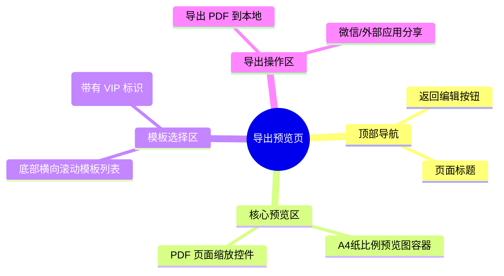

# 导出预览页

## 0. 页面文档状态

- 文档版本：Draft
- 生成日期：2026-05-11
- 来源文件：`product/release/product-overview-release.md`
- 来源 Sitemap 行：
  - 生成顺序：70
  - 页面ID：U-020-040-010
  - 父页面ID：U-020-040
  - 层级：L3
  - Surface：用户端App
  - Layout 区域：独立层级
  - 页面名称：导出预览页
  - 页面类型：功能/展示
  - Sitemap 页面级MD文件：`product/development/pages/070-export.md`
- 当前输出文件：`product/development/pages/070-export.md`
- 页面级假设 / 待确认编号规则：
  - 页面假设：`PA-001` 起，按首次出现顺序递增。
  - 页面待确认：`PQ-001` 起，按首次出现顺序递增。

## 1. 页面目标与上下文

### 1.1 页面目标

- 页面目的：提供最终简历生成效果的真实预览，支持切换排版模板，并最终导出为 PDF。
- 用户目标：确认排版无误后，下载或分享自己的 PDF 简历进行投递。
- 业务目标：作为 App 的核心价值交付终点。同时通过“高级模板”、“去水印”功能作为 VIP 转化引导的核心场景。
- 页面成功标准：用户成功触发导出/分享操作，或非会员因为需要高级功能而点击跳转购买 VIP。

### 1.2 页面入口与出口

| 类型 | 来源 / 去向 | 触发条件 | 传入 / 传出数据 | 备注 |
|---|---|---|---|---|
| 入口 | 简历编辑器 (U-020-040) | 点击右上角“预览” | 传入 `resume_id` | |
| 出口 | 会员订阅页 (U-030-010) | 非会员点击了高级模板或去水印操作被拦截时 | | |
| 出口 | 第三方应用/系统相册 | 导出成功后调用系统 Share Sheet | 导出 PDF 文件对象 | |

### 1.3 角色与权限

| 角色 | 是否可访问 | 权限条件 | 不满足时页面表现 | 相关 PA/PQ |
|---|---|---|---|---|
| 普通用户 | 是 | 对 `resume_id` 有权限 | 拦截返回 | 可预览所有模板，但在使用高级模板或导出无水印版本时会拦截并引导开通 VIP。 |
| VIP 会员 | 是 | | | 尊享所有模板，无水印导出 |

### 1.4 全局页面属性

| 属性 | 类型 | 来源 | 默认值 | 影响元素 / 状态 | 说明 |
|---|---|---|---|---|---|
| selectedTemplateId | string | local state | "default_1" | S-002, API | 当前用户选中的排版模板 ID |
| isPreviewLoading | boolean | API | false | S-002 | 切换模板需要重新渲染预览图 |

## 2. 页面结构思维导图



## 3. 页面布局与内容区块

| 区块ID | 区块名称 | 区块类型 | 展示条件 | 包含元素ID | 布局 / 样式定义 | 数据来源 | 相关 PA/PQ |
|---|---|---|---|---|---|---|---|
| S-001 | 页面头部 | header | 常驻 | E-001, E-002 | 标准顶部 Navigation Bar | | |
| S-002 | 真实预览区 | content | 常驻 | E-003, E-004 | 居中，占大部分屏幕面积的 A4 比例容器，带阴影。深色背景突出白纸。 | API / WebView渲染 | （页面待确认 PQ-001：预览图是前端 WebView 渲染还是后端直接下发图片？） |
| S-003 | 底部控制台 | footer | 常驻 | E-005, E-006, E-007, E-008 | 吸底区域，包含模板选择栏及导出主按钮组 | | |

## 4. 页面元素清单

| 元素ID | 元素名称 | 元素类型 | 所属区块 | 是否必需 | 展示条件 | 默认文案 / 内容 | 样式定义 | 数据绑定 | 相关 PA/PQ |
|---|---|---|---|---|---|---|---|---|---|
| E-001 | 返回修改 | icon | S-001 | 是 | 常驻 | "返回修改" | | | |
| E-002 | 页面标题 | text | S-001 | 是 | 常驻 | "简历预览" | | | |
| E-003 | 预览图容器 | image/webview | S-002 | 是 | 常驻 | 渲染出的简历快照 | | 根据 `resume_id` 和 `template_id` 渲染 | PQ-001 |
| E-004 | 预览加载态 | loading | S-002 | 否 | `isPreviewLoading=true` | 骨架/Loading 圈 | 覆盖在预览图容器上方 | | |
| E-005 | 模板列表栏 | tabs/list | S-003 | 是 | 常驻 | 展示多个排版模板缩略图 | 横向滑动，选中的高亮边框 | `templateList` | |
| E-006 | VIP 模板角标 | icon | S-003 | 否 | 该模板需要 VIP 权限 | "VIP" 小皇冠 | 吸附在缩略图右上角 | | |
| E-007 | 导出 PDF 按钮 | button | S-003 | 是 | 常驻 | "下载 PDF" | | | |
| E-008 | 分享简历按钮 | button | S-003 | 是 | 常驻 | "发给微信/邮箱" | 主色块 | | |

## 5. 元素状态矩阵

| 元素ID | 状态 | 触发条件 | 状态来源 | 样式定义 | 可执行动作 | 禁止动作 | 提示文案 / 反馈 | 恢复条件 | 相关 PA/PQ |
|---|---|---|---|---|---|---|---|---|---|
| E-007 | 处理中 | 点击导出，等待后端生成最终 PDF 文件 | 接口状态 | 按钮变 Loading | | 重复点击 | | 接口下发 PDF URL | |
| E-005 | 拦截提示 | 普通用户点击了带 E-006 角标的高级模板 | VIP 权限判断 | | 触发弹窗 | 实际应用高级模板并去除水印 | 弹窗：“开通 VIP 解锁高级模板并去水印” | | |

## 6. 交互 Action 与执行效果

| ActionID | 触发元素ID | 交互名称 | 用户动作 | 前置条件 | 校验规则 | 执行动作 | 成功结果 | 失败结果 | 页面跳转 / 状态变化 | 埋点事件 | 相关 PA/PQ |
|---|---|---|---|---|---|---|---|---|---|---|---|
| ACT-001 | E-001 | 返回编辑 | 点击 | 无 | 无 | 路由返回 | | | 退回 U-020-040 简历编辑器 | | |
| ACT-002 | E-005 | 切换模板 | 点击项 | 无 | 模板类型鉴权 | `selectedTemplateId` 更新并重新请求预览图 (API-001) | E-003 更新显示 | 提示异常 | 非 VIP 点高级模板触发 VIP 引导弹窗 | `click_switch_template` | |
| ACT-003 | E-007 | 下载本地 | 点击 | PDF生成完毕 | 无 | 调用 API-002 获取下载链接，拉起原生下载模块 | 保存到设备文件夹 | 下载失败 | | `click_download_pdf` | |
| ACT-004 | E-008 | 分享文件 | 点击 | PDF生成完毕 | 无 | 调用 API-002 获取文件，触发系统 Share Sheet | 跳转到外部应用 (如微信) | 分享调起失败 | | `click_share_pdf` | |

## 7. 数据结构与接口定义

### 7.1 页面数据模型

| 数据对象 | 字段 | 类型 | 必填 | 来源 | 默认值 | 使用位置 | 说明 |
|---|---|---|---|---|---|---|---|
| TemplateItem | id | string | 是 | API | | E-005 | |
| TemplateItem | name | string | 是 | API | | E-005 | "极简商务"、"创意设计"等 |
| TemplateItem | is_vip | boolean | 是 | API | | E-006 | 是否为高级模板 |
| TemplateItem | thumb_url | string | 是 | API | | E-005 | 底部缩略图 URL |

### 7.2 接口清单

| API ID | 接口名称 | 方法 | 路径 | 触发 ActionID | 请求数据结构 | 返回数据结构 | 成功处理 | 失败处理 | 相关 PA/PQ |
|---|---|---|---|---|---|---|---|---|---|
| API-000 | 获取可用模板列表 | GET | `/api/v1/templates` | 页面初始化 | 无 | `{ "list": [TemplateItem] }` | 渲染 E-005 列表 | 报错重试 | |
| API-001 | 获取简历预览图 | GET | `/api/v1/resume/preview` | 页面加载 / 切换模板 | `?resume_id=str&tpl_id=str` | `{ "image_url": "string" }` | 渲染 E-003 （如果PQ-001确定用后端返回图片方案） | 展示默认错误底图 | PQ-001 |
| API-002 | 请求最终导出文件 | POST | `/api/v1/resume/export` | ACT-003 / 004 | `{ "resume_id": "str", "tpl_id": "str" }` | `{ "pdf_url": "string" }` | 拉起系统下载 / 分享组件进行本地化处理 | Toast 提示导出生成失败 | （页面假设 PA-001：为了避免客户端排版碎片化，最终的高保真 PDF 统一由后端 Headless Chrome 或类似方案渲染后返回） |

### 7.3 请求 / 返回 JSON 示例

#### API-002 成功返回示例

```json
{
  "code": 0,
  "message": "success",
  "data": {
    "pdf_url": "https://cdn.xxx.com/pdf/resume_u12345_1234.pdf",
    "expire_in": 3600
  }
}
```

## 8. 边界状态与错误处理

| 场景ID | 场景类型 | 触发条件 | 页面表现 | 元素表现 | 用户可执行操作 | 系统处理 | 兜底文案 | 相关 PA/PQ |
|---|---|---|---|---|---|---|---|---|
| EDGE-001 | 导出服务超时 | 后端渲染 PDF 时负载过高 | Toast 超时提示 | E-007 恢复状态 | 重试 | | "排队生成的人数较多，请稍后重试" | |

## 9. 多媒体与资源

无额外说明。

## 10. 页面假设与待确认统一清单

### 10.1 页面假设清单

| 假设ID | 假设内容 | 首次出现位置 | 影响范围 | 影响元素 / Action / API | 置信度 | 用户确认状态 | Release 处理方式 |
|---|---|---|---|---|---|---|---|
| PA-001 | 最终的 PDF 生成由服务器端负责，App 端仅负责接收生成的 URL 链接并调用系统控件下载或分享，以保证各端导出的样式绝对一致。 | 7.2 接口清单 (API-002) | 客户端核心业务逻辑架构 | API-002, ACT-003, ACT-004 | 高 | 确认 | 确认为正式内容 |

### 10.2 页面待确认清单

| 待确认ID | 待确认问题 | 首次出现位置 | 影响范围 | 影响元素 / Action / API | 优先级 | 用户确认结果 | Release 处理方式 |
|---|---|---|---|---|---|---|---|
| PQ-001 | 中间的“预览图”是前端直接用 HTML/CSS(WebView) 临时渲染的，还是每次切换模板都请求后端返回一张长图片？（建议：移动端用后端返回的高清长图更可控，不易乱码变形） | 3 页面布局与内容区块 (S-002) | 渲染架构 | S-002, E-003, API-001 | 高 | 确认 | 前端直接用 HTML/CSS(WebView) 临时渲染 |
