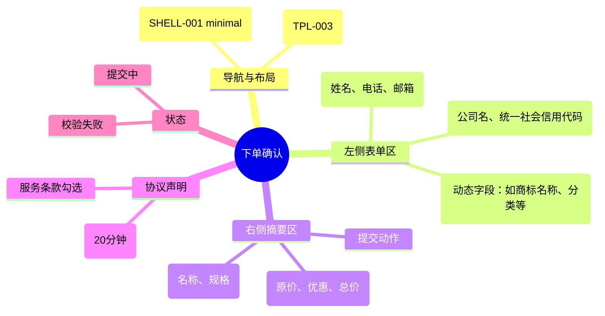

# 下单确认

## 0. 页面文档状态

- 文档版本：Draft
- 生成日期：2026-05-13
- 来源文件：`product/release/product-sitemap-release.md`
- 来源 Sitemap 行：
  - 生成顺序：70
  - 页面ID：U-320
  - 父页面ID：U-310
  - 层级：L2
  - Surface：用户端
  - Layout 区域：独立页
  - 页面名称：下单确认
  - 页面类型：表单
  - Sitemap 页面级MD文件：product/development/pages/070-order-checkout.md
- 当前输出文件：product/development/pages/070-order-checkout/index.md

## 1. 页面目标与上下文

### 1.1 页面目标

- 页面目的：收集用户下单所需的联系信息、公司信息及服务特定字段，确认最终订单金额并创建订单。
- 用户目标：准确填写信息并提交，进入支付环节。
- 业务目标：获取合规服务所需的初始数据，锁定交易。
- 页面成功标准：表单填写完成率及订单创建成功率。

### 1.2 页面入口与出口

| 类型 | 来源 / 去向 | 触发条件 | 传入 / 传出数据 | 备注 |
|---|---|---|---|---|
| 入口 | 服务商品详情 (U-310) | 点击“立即下单” | 商品 ID、SKU ID |  |
| 出口 | 支付收银台 (U-330) | 点击“提交订单”且成功 | 订单 ID、支付金额 |  |
| 出口 | 服务商品详情 (U-310) | 点击返回 | 无 |  |

### 1.3 角色与权限

| 角色 | 是否可访问 | 权限条件 | 不满足时页面表现 | 相关 PA/PQ |
|---|---|---|---|---|
| 客户用户 | 是 | 已登录 | 跳转登录页 |  |

### 1.4 全局页面属性

| 属性 | 类型 | 来源 | 默认值 | 影响元素 / 状态 | 说明 |
|---|---|---|---|---|---|
| product_sku_id | string | route / params | - | 动态表单加载 | 确定当前 SKU 对应的动态字段 (PA-001) |

## 2. 页面结构思维导图



## 3. 页面布局与内容区块

| 区块ID | 区块名称 | 区块类型 | 展示条件 | 包含元素ID | 布局 / 样式定义 | 数据来源 | 相关 PA/PQ |
|---|---|---|---|---|---|---|---|
| S-001 | 订单基础信息表单 | content | 总是显示 | E-001 至 E-003 | 左侧大栏，分组排列 | 用户输入 / 个人中心预填 |  |
| S-002 | 动态服务字段 | content | 总是显示 | E-004 | 随 SKU 变化 | API-001 | PA-001 |
| S-003 | 结算摘要与操作 | side-summary | 总是显示 | E-005 至 E-008 | 右侧吸附小栏 | 计算得出 |  |

## 4. 页面元素清单

| 元素ID | 元素名称 | 元素类型 | 所属区块 | 是否必需 | 展示条件 | 默认文案 / 内容 | 样式定义 | 数据绑定 | 相关 PA/PQ |
|---|---|---|---|---|---|---|---|---|---|
| E-001 | 联系人分组 | group | S-001 | 是 | 总是显示 | 联系人信息 | 卡片样式 | - |  |
| E-002 | 公司信息分组 | group | S-001 | 是 | 总是显示 | 公司信息 | 卡片样式 | - |  |
| E-003 | 邮箱输入框 | input | S-001 | 是 | 总是显示 | 请输入接收回执的邮箱 | - | contact_email |  |
| E-004 | 动态表单容器 | other | S-002 | 是 | 总是显示 | - | 渲染对应 SKU 的字段 | dynamic_fields | PA-001 |
| E-005 | 商品摘要卡片 | card | S-003 | 是 | 总是显示 | - | 包含图、名、规格 | - |  |
| E-006 | 总金额展示 | text | S-003 | 是 | 总是显示 | ¥ {total_price} | 红色大字 | total_price |  |
| E-007 | 支付限时提示 | alert | S-003 | 是 | 总是显示 | 请在 20 分钟内完成支付 | 弱提示 | - |  |
| E-008 | 提交订单按钮 | button | S-003 | 是 | 总是显示 | 提交订单 | 100% 宽，实色 | - |  |

## 5. 元素状态矩阵

| 元素ID | 状态 | 触发条件 | 状态来源 | 样式定义 | 可执行动作 | 禁止动作 | 提示文案 / 反馈 | 恢复条件 | 相关 PA/PQ |
|---|---|---|---|---|---|---|---|---|---|
| E-008 | 默认 | 页面加载 | - | - | 提交 | - | - | - |  |
| E-008 | 禁用 | 必填项未填 / 协议未勾选 | validation | 置灰 | - | 点击 | 请完善信息 | 填满必填项 |  |
| E-008 | 提交中 | 点击后接口请求 | submitting | loading | - | 点击 | 正在创建订单 | 请求结束 |  |

## 6. 交互 Action 与执行效果

| ActionID | 触发元素ID | 交互名称 | 用户动作 | 前置条件 | 校验规则 | 执行动作 | 成功结果 | 失败结果 | 页面跳转 / 状态变化 | 埋点事件ID | 埋点事件名称 | 不埋点原因 | 相关 PA/PQ |
|---|---|---|---|---|---|---|---|---|---|---|---|---|---|
| ACT-001 | E-008 | 提交订单 | 点击 | 校验通过 | 必填、格式校验 | 调用下单接口 (API-002) | 拿到 orderId，跳转支付 | 错误提示 | 跳转 U-330 | EVT-003 | 提交订单点击 | - |  |
| ACT-002 | - | 自动填充 | 页面进入 | 已有历史信息 | - | 填充联系人、公司信息 | 表单已填 | - | - | - | - | 自动行为不埋点 | PA-002 |

## 7. 埋点事件统计设计

### 7.1 埋点事件总表

| 埋点事件ID | 事件名称 | 事件类型 | 关联元素ID / ActionID | 触发时机 | 统计次数口径 | 去重规则 | 上报时机 | 关键属性 | 成功 / 失败归因 | 漏斗阶段 | 相关 PA/PQ |
|---|---|---|---|---|---|---|---|---|---|---|---|
| EVT-001 | 下单页曝光 | page_view | - | 页面进入 | 每会话 1 次 | sessionId | 实时 | product_sku_id | - | 转化中 |  |
| EVT-002 | 校验失败 | validation_error | E-008 | 提交时校验未通过 | 每次触发 1 次 | - | 实时 | error_fields | - | 异常 |  |
| EVT-003 | 订单提交结果 | submit | E-008 | 接口返回结果 | 每次触发 1 次 | actionId | 接口返回 | result, error_code | - | 转化完成 |  |

## 8. 数据结构与接口定义

### 8.1 页面数据模型

| 数据对象 | 字段 | 类型 | 必填 | 来源 | 默认值 | 使用位置 | 说明 |
|---|---|---|---|---|---|---|---|
| CheckoutForm | contact_name | string | 是 | local/API | - | S-001 |  |
| CheckoutForm | company_name | string | 是 | local/API | - | S-001 |  |
| CheckoutForm | dynamic_fields | object | 是 | local | {} | S-002 | 结构随 SKU 变化 |

### 8.2 接口清单

| API ID | 接口名称 | 方法 | 路径 | 触发 ActionID | 请求数据结构 | 返回数据结构 | 成功处理 | 失败处理 | 相关 PA/PQ |
|---|---|---|---|---|---|---|---|---|---|
| API-001 | 获取下单字段定义 | GET | /api/checkout/fields | 页面加载 | {sku_id} | {fields_schema} | 渲染动态表单 | - | PA-001 |
| API-002 | 提交订单 | POST | /api/order/create | ACT-001 | {sku_id, form_data} | {order_id, amount} | 跳转支付 | 提示失败 |  |

## 9. 边界状态与错误处理

| 场景ID | 场景类型 | 触发条件 | 页面表现 | 元素表现 | 用户可执行操作 | 系统处理 | 兜底文案 | 相关 PA/PQ |
|---|---|---|---|---|---|---|---|---|
| EDGE-001 | 商品库存/状态失效 | 提交时商品已下架 | 弹窗提示 | - | 返回目录 | - | 抱歉，该服务已下架或规格已变动 |  |

## 10. 多媒体与资源

| 资源ID | 资源类型 | 使用位置 | 说明 |
|---|---|---|---|
| M-001 | icon | S-001 | 联系人、公司图标 |

## 11. 页面假设与待确认统一清单

### 11.1 页面假设清单

| 假设ID | 假设内容 | 首次出现位置 | 影响范围 | 影响元素 / Action / API / 埋点事件 | 置信度 | 用户确认状态 | Release 处理方式 |
|---|---|---|---|---|---|---|---|
| PA-001 | 下单页的动态字段由 SKU 绑定的服务模板决定，后端接口实时下发 schema 用于渲染 | 1.4 全局页面属性 | 动态表单 | E-004, API-001 | 高 | 确认 | 更新到正式 |
| PA-002 | 如果用户之前有过下单或在“账号设置”中维护过公司信息，进入该页时将自动填入最近使用的信息 | 6. 交互 Action | 表单填充 | ACT-002 | 中 | 确认 | 不展示公司相关信息 |

### 11.2 页面待确认清单

| 待确认ID | 待确认问题 | 首次出现位置 | 影响范围 | 影响元素 / Action / API / 埋点事件 | 优先级 | 用户确认结果 | Release 处理方式 |
|---|---|---|---|---|---|---|---|
| PQ-001 | 是否支持在下单页“更换公司”或“新增公司”？当前假设为直接在表单项内编辑。 | 3. 页面布局 | 交互逻辑 | E-002 | 中 | 确认 | 不支持 |

## 12. 用户补充描述

```text
下单页仅做已选服务（商品）的SKU、数量、价格，不展示其他信息，也不会出现优惠、减免等功能
```
