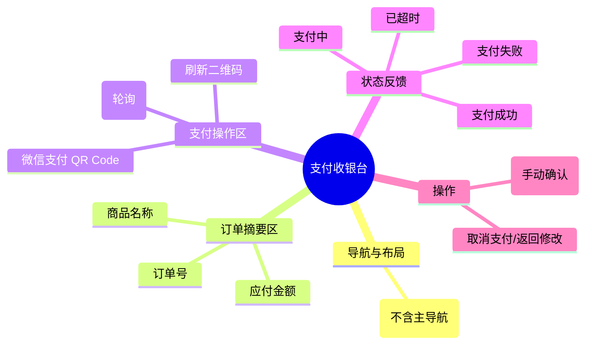

# 支付收银台

## 0. 页面文档状态

- 文档版本：Draft
- 生成日期：2026-05-13
- 来源文件：`product/release/product-sitemap-release.md`
- 来源 Sitemap 行：
  - 生成顺序：80
  - 页面ID：U-330
  - 父页面ID：U-320
  - 层级：L2
  - Surface：用户端
  - Layout 区域：独立页
  - 页面名称：支付收银台
  - 页面类型：支付
  - Sitemap 页面级MD文件：product/development/pages/080-payment-checkout.md
- 当前输出文件：product/development/pages/080-payment-checkout/index.md

## 1. 页面目标与上下文

### 1.1 页面目标

- 页面目的：提供订单支付的最终入口，支持微信扫码支付。
- 用户目标：快速完成支付，启动服务流程。
- 业务目标：确认成交，回收资金。
- 页面成功标准：支付完成率及 20 分钟内支付成功率。

### 1.2 页面入口与出口

| 类型 | 来源 / 去向 | 触发条件 | 传入 / 传出数据 | 备注 |
|---|---|---|---|---|
| 入口 | 下单确认 (U-320) | 提交订单成功 | 订单 ID、金额 |  |
| 入口 | 订单列表 (U-410) | 点击“去支付” | 订单 ID |  |
| 出口 | 订单详情 (U-420) | 支付成功 | 订单 ID | 自动跳转 |
| 出口 | 我的服务 (U-500) | 支付成功 | 无 | 可选跳转 |

### 1.3 角色与权限

| 角色 | 是否可访问 | 权限条件 | 不满足时页面表现 | 相关 PA/PQ |
|---|---|---|---|---|
| 客户用户 | 是 | 订单所属者 | 报错提示无权限 |  |

### 1.4 全局页面属性

| 属性 | 类型 | 来源 | 默认值 | 影响元素 / 状态 | 说明 |
|---|---|---|---|---|---|
| order_id | string | route | - | 页面数据加载 |  |
| time_remaining | number | local state | 1200 (seconds) | 倒计时显示、失效状态 | 20 分钟支付倒计时 |

## 2. 页面结构思维导图



## 3. 页面布局与内容区块

| 区块ID | 区块名称 | 区块类型 | 展示条件 | 包含元素ID | 布局 / 样式定义 | 数据来源 | 相关 PA/PQ |
|---|---|---|---|---|---|---|---|
| S-001 | 订单简要信息 | header | 总是显示 | E-001 至 E-003 | 顶部横条或左侧块 | API-001 |  |
| S-002 | 微信支付主区 | content | 未过期 | E-004 至 E-006 | 居中卡片，突出二维码 | API-002 |  |
| S-003 | 超时/失败处理 | overlay | 状态触发 | E-007 | 覆盖主区 | - |  |

## 4. 页面元素清单

| 元素ID | 元素名称 | 元素类型 | 所属区块 | 是否必需 | 展示条件 | 默认文案 / 内容 | 样式定义 | 数据绑定 | 相关 PA/PQ |
|---|---|---|---|---|---|---|---|---|---|
| E-001 | 订单号展示 | text | S-001 | 是 | 总是显示 | 订单号：{order_id} | - | order_id |  |
| E-002 | 应付金额 | text | S-001 | 是 | 总是显示 | ¥ {amount} | 红色大字 | amount |  |
| E-003 | 剩余时间倒计时 | text | S-001 | 是 | 未过期 | 支付剩余时间：{mm:ss} | 橙色弱提示 | time_remaining |  |
| E-004 | 微信支付二维码 | image | S-002 | 是 | 未过期 | 二维码图片 | 240x240 | pay_url |  |
| E-005 | 支付提示说明 | text | S-002 | 是 | 未过期 | 请使用微信扫码完成支付 | - | - |  |
| E-006 | 刷新二维码按钮 | button | S-002 | 否 | 二维码失效 | 刷新二维码 | 链接样式 | - |  |
| E-007 | 超时提示卡片 | modal | S-003 | 是 | time_remaining=0 | 订单支付超时已关闭 | 中央弹层 | - |  |
| E-008 | 返回订单列表 | button | S-003 | 是 | 支付异常 | 返回订单列表 | 描边样式 | - |  |

## 5. 元素状态矩阵

| 元素ID | 状态 | 触发条件 | 状态来源 | 样式定义 | 可执行动作 | 禁止动作 | 提示文案 / 反馈 | 恢复条件 | 相关 PA/PQ |
|---|---|---|---|---|---|---|---|---|---|
| E-004 | 加载中 | 页面初始化 | loading | 骨架屏 | - | - | 正在生成支付二维码 | 加载完成 |  |
| E-004 | 失效 | 二维码过期或 20min 结束 | expired | 遮罩 | - | 扫码 | 请重新获取二维码 | 点击刷新 |  |
| E-007 | 显示 | time_remaining=0 | timeout | 居中弹窗 | 返回查看订单 | 支付 | 支付超时 | - |  |

## 6. 交互 Action 与执行效果

| ActionID | 触发元素ID | 交互名称 | 用户动作 | 前置条件 | 校验规则 | 执行动作 | 成功结果 | 失败结果 | 页面跳转 / 状态变化 | 埋点事件ID | 埋点事件名称 | 不埋点原因 | 相关 PA/PQ |
|---|---|---|---|---|---|---|---|---|---|---|---|---|---|
| ACT-001 | - | 支付状态轮询 | 自动触发 | 二维码显示后 | - | 每 3s 调用接口 (API-003) | 支付成功 | 保持轮询 | 跳转 U-420 | EVT-002 | 支付成功 | - |  |
| ACT-002 | E-006 | 刷新二维码 | 点击 | 二维码过期 | - | 重新获取支付参数 | 二维码更新 | - | - | - | - | 基础刷新不埋点 |  |
| ACT-003 | E-008 | 取消并返回 | 点击 | - | - | 导航 | - | - | 跳转 U-410 | EVT-003 | 支付中断返回 | - |  |

## 7. 埋点事件统计设计

### 7.1 埋点事件总表

| 埋点事件ID | 事件名称 | 事件类型 | 关联元素ID / ActionID | 触发时机 | 统计次数口径 | 去重规则 | 上报时机 | 关键属性 | 成功 / 失败归因 | 漏斗阶段 | 相关 PA/PQ |
|---|---|---|---|---|---|---|---|---|---|---|---|
| EVT-001 | 支付收银台曝光 | page_view | - | 页面进入 | 每会话 1 次 | sessionId | 实时 | order_id, amount | - | 支付核心 |  |
| EVT-002 | 支付成功 | api_success | ACT-001 | 接口确认支付完成 | 每次触发 1 次 | order_id | 实时 | order_id, amount, pay_method | - | 支付完成 |  |
| EVT-003 | 支付退出 | exit | ACT-003 | 用户主动返回或关闭 | 每次触发 1 次 | - | 实时 | order_id, reason | - | 支付中断 |  |
| EVT-004 | 支付超时 | timeout | E-007 | 20 分钟结束 | 每订单 1 次 | order_id | 实时 | order_id | - | 支付中断 |  |

## 8. 数据结构与接口定义

### 8.1 页面数据模型

| 数据对象 | 字段 | 类型 | 必填 | 来源 | 默认值 | 使用位置 | 说明 |
|---|---|---|---|---|---|---|---|
| PayInfo | order_id | string | 是 | API | - | E-001 |  |
| PayInfo | amount | number | 是 | API | - | E-002 |  |
| PayInfo | pay_url | string | 是 | API | - | E-004 | 微信支付短链/二维码内容 |
| PayInfo | expire_time | number | 是 | API | - | E-003 | 过期时间戳 |

### 8.2 接口清单

| API ID | 接口名称 | 方法 | 路径 | 触发 ActionID | 请求数据结构 | 返回数据结构 | 成功处理 | 失败处理 | 相关 PA/PQ |
|---|---|---|---|---|---|---|---|---|---|
| API-001 | 获取支付信息 | GET | /api/pay/info | 页面加载 | {order_id} | {PayInfo} | 渲染页面 | 报错并返回 |  |
| API-003 | 查询支付状态 | GET | /api/pay/status | ACT-001 | {order_id} | {status} | 跳转成功页 | 保持轮询 |  |

## 9. 边界状态与错误处理

| 场景ID |场景类型 | 触发条件 | 页面表现 | 元素表现 | 用户可执行操作 | 系统处理 | 兜底文案 | 相关 PA/PQ |
|---|---|---|---|---|---|---|---|---|
| EDGE-001 | 支付超时 | 倒计时结束 | 显示超时弹窗 | 二维码失效 | 查看订单 | 标记订单为“已关闭” | 支付超时，请重新下单 |  |
| EDGE-002 | 微信支付唤起失败 | 接口返回错误 | 提示重试 | 刷新按钮显示 | 点击重试 | - | 支付通道繁忙，请稍后重试 |  |

## 10. 多媒体与资源

| 资源ID | 资源类型 | 使用位置 | 说明 |
|---|---|---|---|
| M-001 | icon | S-002 | 微信支付 Logo |
| M-002 | image | E-004 | 动态二维码 |

## 11. 页面假设与待确认统一清单

### 11.1 页面假设清单

| 假设ID | 假设内容 | 首次出现位置 | 影响范围 | 影响元素 / Action / API / 埋点事件 | 置信度 | 用户确认状态 | Release 处理方式 |
|---|---|---|---|---|---|---|---|
| PA-001 | 支付状态通过前端 3s 轮询实现，后续可升级为 WebSocket 推送 | 6. 交互 Action | 交互性能 | ACT-001 | 高 | 待用户确认 |  |

### 11.2 页面待确认清单

| 待确认ID | 待确认问题 | 首次出现位置 | 影响范围 | 影响元素 / Action / API / 埋点事件 | 优先级 | 用户确认结果 | Release 处理方式 |
|---|---|---|---|---|---|---|---|
| PQ-001 | 是否需要支持“支付宝支付”或其他支付方式？当前仅规划微信支付。 | 1.1 页面目标 | 功能范围 | 元素清单 | 中 | 待用户确认 |  |

## 12. 用户补充描述

```text
无
```
