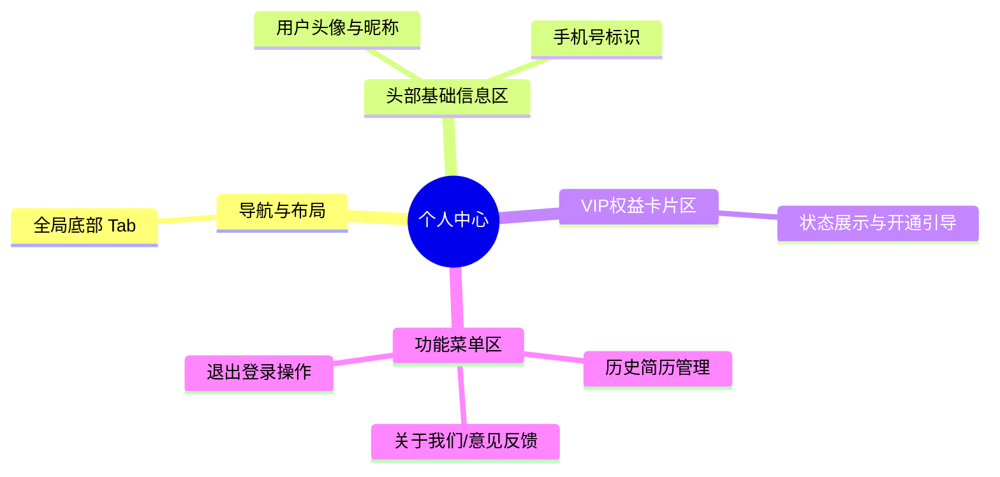

# 个人中心

## 0. 页面文档状态

- 文档版本：Draft
- 生成日期：2026-05-11
- 来源文件：`product/release/product-overview-release.md`
- 来源 Sitemap 行：
  - 生成顺序：80
  - 页面ID：U-030
  - 父页面ID：ROOT
  - 层级：L1
  - Surface：用户端App
  - Layout 区域：底部Tab 2
  - 页面名称：个人中心
  - 页面类型：用户中心
  - Sitemap 页面级MD文件：`product/development/pages/080-profile.md`
- 当前输出文件：`product/development/pages/080-profile.md`
- 页面级假设 / 待确认编号规则：
  - 页面假设：`PA-001` 起，按首次出现顺序递增。
  - 页面待确认：`PQ-001` 起，按首次出现顺序递增。

## 1. 页面目标与上下文

### 1.1 页面目标

- 页面目的：展示用户的基本信息和权限状态，并作为“会员订阅”、“历史简历”等个人管理功能的统一入口。
- 用户目标：查看自己的 VIP 到期时间，管理以前生成的简历，或进行账号相关操作。
- 业务目标：在此页面提供高强度的“开通 VIP”导流入口。
- 页面成功标准：用户顺利找到需要的设置项，或点击进入了 VIP 订阅页面。

### 1.2 页面入口与出口

| 类型 | 来源 / 去向 | 触发条件 | 传入 / 传出数据 | 备注 |
|---|---|---|---|---|
| 入口 | 首页 (U-020) | 点击底部 Tab | 无 | 切换 Tab |
| 出口 | 会员订阅页 (U-030-010) | 点击 VIP 状态卡片或入口 | 无 | |
| 出口 | 历史简历页 (U-030-020) | 点击“历史简历”菜单 | 无 | |
| 出口 | 登录注册页 (U-010) | 点击“退出登录” | 无 | 会清空本地 token |

### 1.3 角色与权限

| 角色 | 是否可访问 | 权限条件 | 不满足时页面表现 | 相关 PA/PQ |
|---|---|---|---|---|
| 游客 | 否 | 需有效登录态 Token | 拦截跳转到 U-010 | |
| 普通用户 | 是 | | 显示“开通 VIP”引导 | |
| VIP 会员 | 是 | | 显示 VIP 尊贵身份及到期日 | |

### 1.4 全局页面属性

| 属性 | 类型 | 来源 | 默认值 | 影响元素 / 状态 | 说明 |
|---|---|---|---|---|---|
| userInfo | object | API | null | S-001, S-002 | 包含昵称、头像、手机号、是否VIP及过期时间等 |

## 2. 页面结构思维导图

## 3. 页面布局与内容区块

| 区块ID | 区块名称 | 区块类型 | 展示条件 | 包含元素ID | 布局 / 样式定义 | 数据来源 | 相关 PA/PQ |
|---|---|---|---|---|---|---|---|
| S-001 | 用户信息头部 | header | 常驻 | E-001, E-002, E-003 | 页面顶部，居左头像+昵称+手机号 | `userInfo` | |
| S-002 | VIP 状态卡片 | card | 常驻 | E-004, E-005, E-006 | 头部下方横向卡片，采用渐变背景色凸显会员质感 | `userInfo` | |
| S-003 | 菜单列表区 | list | 常驻 | E-007, E-008, E-009 | 垂直单列 list 项排布 | | |
| S-004 | 底部导航 | footer | 常驻 | E-010, E-011 | 固定底部 Tab | | |

## 4. 页面元素清单

| 元素ID | 元素名称 | 元素类型 | 所属区块 | 是否必需 | 展示条件 | 默认文案 / 内容 | 样式定义 | 数据绑定 | 相关 PA/PQ |
|---|---|---|---|---|---|---|---|---|---|
| E-001 | 用户头像 | image | S-001 | 是 | 常驻 | 默认灰色头像 | 圆形 64x64px | `userInfo.avatar` | |
| E-002 | 用户昵称 | text | S-001 | 是 | 常驻 | "手机用户_XXXX" | 粗体文字 | `userInfo.nickname` | |
| E-003 | 绑定手机号 | text | S-001 | 是 | 常驻 | "138****0000" | 灰色小字 | `userInfo.phone` | |
| E-004 | VIP 会员卡片 | card | S-002 | 是 | 常驻 | | 质感渐变色背景 | | |
| E-005 | 会员状态文字 | text | S-002 | 是 | 常驻 | "您还不是VIP" 或 "VIP将于 XXX 过期" | | `userInfo.is_vip` | |
| E-006 | 会员开通按钮 | button | S-002 | 是 | 常驻 | "立即开通" / "立即续费" | 金色或主色小按钮 | | |
| E-007 | 历史简历入口 | list-item | S-003 | 是 | 常驻 | "我的简历" | 列表栏，带右箭头 | | |
| E-008 | 意见反馈入口 | list-item | S-003 | 否 | 常驻 | "意见反馈" | 列表栏，带右箭头 | | （页面假设 PA-001：App 常规设置应该包含基础的反馈入口） |
| E-009 | 退出登录按钮 | button | S-003 | 是 | 常驻 | "退出登录" | 底部居中红色文字按钮 | | |
| E-010 | 首页 Tab | tab | S-004 | 是 | 常驻 | 首页 Icon | 灰色图标 | | |
| E-011 | 个人中心 Tab | tab | S-004 | 是 | 常驻 | 个人中心 Icon (激活态) | 主色图标 | | |

## 5. 元素状态矩阵

| 元素ID | 状态 | 触发条件 | 状态来源 | 样式定义 | 可执行动作 | 禁止动作 | 提示文案 / 反馈 | 恢复条件 | 相关 PA/PQ |
|---|---|---|---|---|---|---|---|---|---|
| S-001 | 加载 | 接口获取数据中 | 接口请求 | 头像和昵称显示骨架图 | | | | 数据返回 | |
| E-004 | 会员样式 | `userInfo.is_vip` 为 true | 接口返回 | 黑金/紫金尊贵主题色 | 点击进入续费 | | | | |
| E-004 | 非会员样式 | `userInfo.is_vip` 为 false | 接口返回 | 银色/素色主题 | 点击进入开通 | | | | |

## 6. 交互 Action 与执行效果

| ActionID | 触发元素ID | 交互名称 | 用户动作 | 前置条件 | 校验规则 | 执行动作 | 成功结果 | 失败结果 | 页面跳转 / 状态变化 | 埋点事件 | 相关 PA/PQ |
|---|---|---|---|---|---|---|---|---|---|---|---|
| ACT-001 | E-006 | 去开通VIP | 点击 | 无 | 无 | 导航跳转 | | | 跳转 U-030-010 | `click_vip_card` | |
| ACT-002 | E-007 | 历史简历 | 点击 | 无 | 无 | 导航跳转 | | | 跳转 U-030-020 | `click_history_list` | |
| ACT-003 | E-009 | 退出登录 | 点击 | 无 | 二次确认 | 清除本地 Token | 跳转至 U-010 | | 拦截弹窗 | `click_logout` | |
| ACT-004 | E-010 | 切换首页 | 点击 | 无 | 无 | 导航跳转 | | | 切换回 U-020 | `switch_tab_home` | |

## 7. 数据结构与接口定义

### 7.1 页面数据模型

复用 U-020 中的 `user_info` 模型。

### 7.2 接口清单

| API ID | 接口名称 | 方法 | 路径 | 触发 ActionID | 请求数据结构 | 返回数据结构 | 成功处理 | 失败处理 | 相关 PA/PQ |
|---|---|---|---|---|---|---|---|---|---|
| API-001 | 获取用户基础信息 | GET | `/api/v1/user/info` | 页面初始化 | 无 | 同 U-020 API-002 | 渲染 S-001, S-002 | 异常状态重试 | |

### 7.3 请求 / 返回 JSON 示例

同 U-020，不再赘述。

## 8. 边界状态与错误处理

| 场景ID | 场景类型 | 触发条件 | 页面表现 | 元素表现 | 用户可执行操作 | 系统处理 | 兜底文案 | 相关 PA/PQ |
|---|---|---|---|---|---|---|---|---|
| EDGE-001 | 网络异常 | 获取用户信息失败 | 头像空白、VIP卡片骨架图 | | 下拉刷新 | | "数据获取失败，请下拉刷新" | |

## 9. 多媒体与资源

无特殊说明。

## 10. 页面假设与待确认统一清单

### 10.1 页面假设清单

| 假设ID | 假设内容 | 首次出现位置 | 影响范围 | 影响元素 / Action / API | 置信度 | 用户确认状态 | Release 处理方式 |
|---|---|---|---|---|---|---|---|
| PA-001 | 包含意见反馈等基础支撑入口 | 4 页面元素清单 (E-008) | 菜单项 | E-008 | 高 | 待确认 | 确认为正式内容 |

### 10.2 页面待确认清单

暂无。
