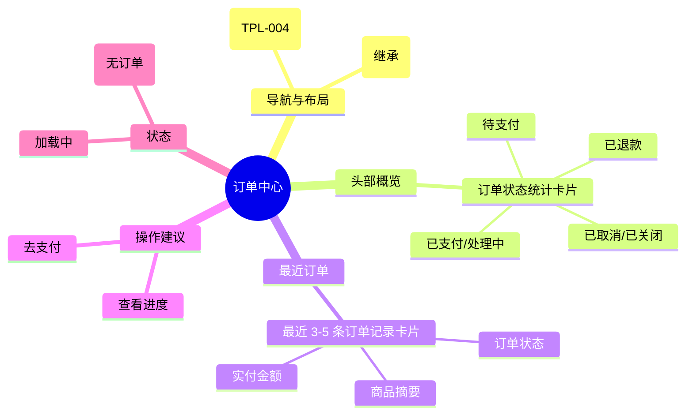

# 订单中心

## 0. 页面文档状态

- 文档版本：Draft v2
- 生成日期：2026-05-13
- 来源文件：`product/release/product-sitemap-release.md`
- 来源主稿：`product/development/pages/090-order-center/index.md`
- 来源 Sitemap 行：
  - 生成顺序：90
  - 页面ID：U-400
  - 父页面ID：ROOT
  - 层级：L1
  - Surface：用户端
  - Layout 区域：主导航
  - 页面名称：订单中心
  - 页面类型：首页
  - Sitemap 页面级MD文件：product/development/pages/090-order-center.md
- 当前输出文件：product/development/pages/090-order-center/index-v2.md
- 页面级假设 / 待确认编号规则：
  - 页面假设：`PA-001` 起，按首次出现顺序递增。
  - 页面待确认：`PQ-001` 起，按首次出现顺序递增。

## 1. 页面目标与上下文

### 1.1 页面目标

- 页面目的：作为用户订单管理的入口页，汇总不同状态下的订单统计，提供快速进入订单列表或详情的路径。
- 用户目标：查看我的订单概览，快速找到需要支付或查看进度的订单。
- 业务目标：清晰划分订单生命周期，引导用户完成支付，并区分展示“订单”与“案件服务”的不同阶段。
- 页面成功标准：首页点击各类订单状态卡片的分流效率。

### 1.2 页面入口与出口

| 类型 | 来源 / 去向 | 触发条件 | 传入 / 传出数据 | 备注 |
|---|---|---|---|---|
| 入口 | 顶栏导航 | 点击“订单中心” | 无 |  |
| 出口 | 订单列表 (U-410) | 点击统计卡片 | 状态筛选参数 |  |
| 出口 | 订单详情 (U-420) | 点击最近订单项 | 订单 ID |  |

### 1.3 角色与权限

| 角色 | 是否可访问 | 权限条件 | 不满足时页面表现 | 相关 PA/PQ |
|---|---|---|---|---|
| 客户用户 | 是 | 已登录 | 跳转登录页 |  |

### 1.4 全局页面属性

| 属性 | 类型 | 来源 | 默认值 | 影响元素 / 状态 | 说明 |
|---|---|---|---|---|---|
| order_stats | object | API | {pending_pay:0, ...} | 卡片显示数字 | 各状态订单计数 |

## 2. 页面结构思维导图



## 3. 页面布局与内容区块

| 区块ID | 区块名称 | 区块类型 | 展示条件 | 包含元素ID | 布局 / 样式定义 | 数据来源 | 相关 PA/PQ |
|---|---|---|---|---|---|---|---|
| S-001 | 订单状态统计 | header | 总是显示 | E-001 | 4 列等分布局 | API-001 |  |
| S-002 | 最近订单列表 | content | 有数据时显示 | E-002, E-003 | 垂直列表卡片 | API-001 |  |
| S-003 | 引导区块 | content | 无数据时显示 | E-004 | 居中空状态 | - |  |

## 4. 页面元素清单

| 元素ID | 元素名称 | 元素类型 | 所属区块 | 是否必需 | 展示条件 | 默认文案 / 内容 | 样式定义 | 数据绑定 | 相关 PA/PQ |
|---|---|---|---|---|---|---|---|---|---|
| E-001 | 状态统计卡片 | list | S-001 | 是 | 总是显示 | 待支付 / 已支付... | 品牌色数字强调 | order_stats |  |
| E-002 | 最近订单项 | card | S-002 | 是 | 有数据 | - | 包含时间、金额、状态 | recent_orders |  |
| E-003 | 查看全部链接 | button | S-002 | 是 | 有数据 | 查看全部订单 | 右上角链接 | - |  |
| E-004 | 浏览服务按钮 | button | S-003 | 是 | 无数据 | 去浏览服务 | 品牌色主按钮 | - |  |

## 5. 元素状态矩阵

| 元素ID | 状态 | 触发条件 | 状态来源 | 样式定义 | 可执行动作 | 禁止动作 | 提示文案 / 反馈 | 恢复条件 | 相关 PA/PQ |
|---|---|---|---|---|---|---|---|---|---|
| E-001 | 高亮 | 对应状态计数 > 0 | count > 0 | 品牌色文字 | 点击跳转 | - | - | - |  |
| E-002 | 支付超时 | 订单过期 | order.status="closed" | 置灰 | - | 支付 | 已过期 | - |  |

## 6. 交互 Action 与执行效果

| ActionID | 触发元素ID | 交互名称 | 用户动作 | 前置条件 | 校验规则 | 执行动作 | 成功结果 | 失败结果 | 页面跳转 / 状态变化 | 埋点事件ID | 埋点事件名称 | 不埋点原因 | 相关 PA/PQ |
|---|---|---|---|---|---|---|---|---|---|---|---|---|---|
| ACT-001 | E-001 | 进入对应列表 | 点击卡片 | - | - | 导航 | - | - | 跳转 U-410 并带状态 | EVT-002 | 状态卡片点击 | - |  |
| ACT-002 | E-002 | 进入订单详情 | 点击订单项 | - | - | 导航 | - | - | 跳转 U-420 | EVT-003 | 最近订单点击 | - |  |
| ACT-003 | E-004 | 跳转服务目录 | 点击 | - | - | 导航 | - | - | 跳转 U-300 | - | - | 基础引导不埋点 |  |

## 7. 埋点事件统计设计

### 7.1 埋点事件总表

| 埋点事件ID | 事件名称 | 事件类型 | 关联元素ID / ActionID | 触发时机 | 统计次数口径 | 去重规则 | 上报时机 | 关键属性 | 成功 / 失败归因 | 漏斗阶段 | 相关 PA/PQ |
|---|---|---|---|---|---|---|---|---|---|---|---|
| EVT-001 | 订单中心曝光 | page_view | - | 页面进入 | 每会话 1 次 | sessionId | 实时 | total_order_count | - | 订单首页 |  |
| EVT-002 | 统计卡片点击 | click | E-001 | 点击 | 每次触发 1 次 | - | 实时 | order_status | - | 分流 |  |
| EVT-003 | 最近订单点击 | click | E-002 | 点击 | 每次触发 1 次 | - | 实时 | order_id, order_status | - | 详情转化 |  |

## 8. 数据结构与接口定义

### 8.1 页面数据模型

| 数据对象 | 字段 | 类型 | 必填 | 来源 | 默认值 | 使用位置 | 说明 |
|---|---|---|---|---|---|---|---|
| OrderCenterData | stats | object | 是 | API | {pending:0, ...} | E-001 | 各状态计数 |
| OrderCenterData | recent_orders | array | 是 | API | [] | E-002 | 最近 5 条订单 |

### 8.2 接口清单

| API ID | 接口名称 | 方法 | 路径 | 触发 ActionID | 请求数据结构 | 返回数据结构 | 成功处理 | 失败处理 | 相关 PA/PQ |
|---|---|---|---|---|---|---|---|---|---|
| API-001 | 获取订单中心概览 | GET | /api/order/center-summary | 页面加载 | - | {stats, recent_orders} | 渲染页面 | 报错提示 |  |

## 9. 边界状态与错误处理

| 场景ID | 场景类型 | 触发条件 | 页面表现 | 元素表现 | 用户可执行操作 | 系统处理 | 兜底文案 | 相关 PA/PQ |
|---|---|---|---|---|---|---|---|---|
| EDGE-001 | 无订单记录 | 接口返回为空 | 显示空状态插画 | - | 去浏览服务 | - | 还没有订单，快去看看合规服务吧 |  |

## 10. 多媒体与资源

| 资源ID | 资源类型 | 使用位置 | 说明 |
|---|---|---|---|
| M-001 | image | S-003 | 空状态插图 |

## 11. 页面假设与待确认统一清单

### 11.1 页面假设清单

| 假设ID | 假设内容 | 首次出现位置 | 影响范围 | 影响元素 / Action / API / 埋点事件 | 置信度 | 用户确认状态 | Release 处理方式 |
|---|---|---|---|---|---|---|---|
| - | - | - | - | - | - | - | - |

### 11.2 页面待确认清单

| 待确认ID | 待确认问题 | 首次出现位置 | 影响范围 | 影响元素 / Action / API / 埋点事件 | 优先级 | 用户确认结果 | Release 处理方式 |
|---|---|---|---|---|---|---|---|
| - | - | - | - | - | - | - | - |

## 12. 用户补充描述

> 本章节必须保留在页面 Draft 文档末尾，供用户用自然语言补充或修改当前页面需求。`product-page-release` 生成 release 版本时必须读取、分析并应用这里的内容。
> 如果没有补充，请保留“无”。

```text
无
```
