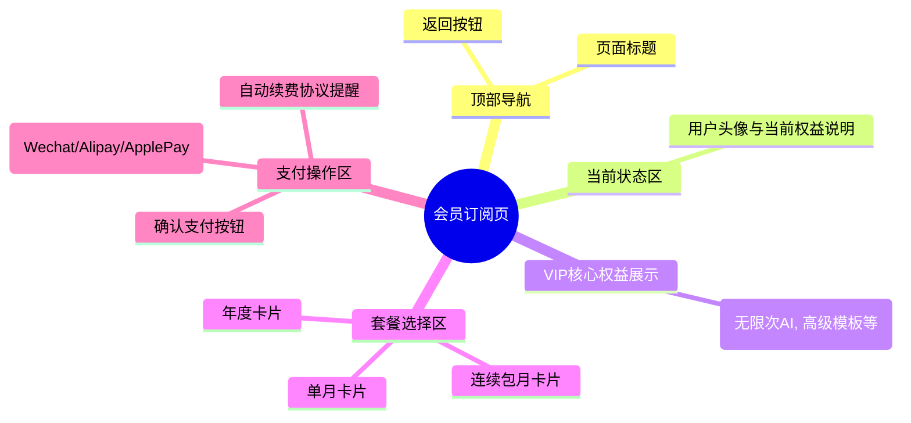

# 会员订阅页

## 0. 页面文档状态

- 文档版本：Draft
- 生成日期：2026-05-11
- 来源文件：`product/release/product-overview-release.md`
- 来源 Sitemap 行：
  - 生成顺序：90
  - 页面ID：U-030-010
  - 父页面ID：U-030
  - 层级：L2
  - Surface：用户端App
  - Layout 区域：独立层级
  - 页面名称：会员订阅页
  - 页面类型：支付
  - Sitemap 页面级MD文件：`product/development/pages/090-vip-subscription.md`
- 当前输出文件：`product/development/pages/090-vip-subscription.md`
- 页面级假设 / 待确认编号规则：
  - 页面假设：`PA-001` 起，按首次出现顺序递增。
  - 页面待确认：`PQ-001` 起，按首次出现顺序递增。

## 1. 页面目标与上下文

### 1.1 页面目标

- 页面目的：提供 VIP 套餐选择和支付功能，完成商业化闭环。
- 用户目标：查看 VIP 权益，选择合适自己的套餐，并通过三方支付完成购买。
- 业务目标：促进用户进行付费订阅转化，提升营收。
- 页面成功标准：用户成功唤起支付 SDK 并完成扣款，权益更新成功。

### 1.2 页面入口与出口

| 类型 | 来源 / 去向 | 触发条件 | 传入 / 传出数据 | 备注 |
|---|---|---|---|---|
| 入口 | 个人中心 (U-030) | 点击 VIP 状态卡片 | 无 | |
| 入口 | 导出预览页 (U-020-040-010) | 非会员点击高级模板或导出无水印时 | 传入 `source=export` | 支付成功后应跳回预览页 |
| 出口 | 上一页 | 点击返回按钮，或支付成功自动返回 | 会员状态 | |

### 1.3 角色与权限

| 角色 | 是否可访问 | 权限条件 | 不满足时页面表现 | 相关 PA/PQ |
|---|---|---|---|---|
| 普通用户 | 是 | 需登录态 | 拦截至登录 | 核心引导对象 |
| VIP 会员 | 是 | | | 展示续费或升配选项 |

### 1.4 全局页面属性

| 属性 | 类型 | 来源 | 默认值 | 影响元素 / 状态 | 说明 |
|---|---|---|---|---|---|
| packages | array | API | `[]` | S-003, E-005 | 可供购买的 VIP 套餐列表 |
| selectedPkgId | string | local state | `null` | E-005, E-008 | 用户当前选中的套餐 |
| payMethod | string | local / device | "wechat" | E-007 | 当前选中的支付方式 (iOS默认 Apple Pay) |

## 2. 页面结构思维导图



## 3. 页面布局与内容区块

| 区块ID | 区块名称 | 区块类型 | 展示条件 | 包含元素ID | 布局 / 样式定义 | 数据来源 | 相关 PA/PQ |
|---|---|---|---|---|---|---|---|
| S-001 | 页面头部 | header | 常驻 | E-001, E-002 | 标准顶部 Navigation Bar，透明或深色渐变 | | |
| S-002 | 权益说明区 | content | 常驻 | E-003, E-004 | 大图+并排文字图标展示核心特权 | | |
| S-003 | 套餐选择区 | content | 常驻 | E-005 | 横向或网格布局的商品卡片 | `packages` | |
| S-004 | 支付方式与底部按钮 | footer | 常驻 | E-006, E-007, E-008, E-009 | 吸附在底部的内容及大尺寸确认支付按钮 | | |

## 4. 页面元素清单

| 元素ID | 元素名称 | 元素类型 | 所属区块 | 是否必需 | 展示条件 | 默认文案 / 内容 | 样式定义 | 数据绑定 | 相关 PA/PQ |
|---|---|---|---|---|---|---|---|---|---|
| E-001 | 返回按钮 | icon | S-001 | 是 | 常驻 | 返回箭头 | | | |
| E-002 | 页面标题 | text | S-001 | 是 | 常驻 | "升级 VIP 会员" | | | |
| E-003 | 当前账号状态 | text | S-002 | 是 | 常驻 | 账号名 + 当前是否为VIP及过期时间 | | 用户信息 | |
| E-004 | 核心特权清单 | list | S-002 | 是 | 常驻 | "无限次AI优化", "解锁高级模板", "免除PDF水印" | 带有金色 icon 的列表 | | |
| E-005 | 套餐商品卡片 | card | S-003 | 是 | 常驻 | 包含价格、原价、优惠标签 (如"特惠") | 选中态带金色粗边框及勾选角标 | `packages` | |
| E-006 | 支付方式标题 | text | S-004 | 否 | 安卓设备 | "选择支付方式" | | | （页面假设 PA-001：iOS 只允许 Apple Pay，故隐藏此区域） |
| E-007 | 支付方式选项 | radio-group | S-004 | 否 | 安卓设备 | 微信支付 / 支付宝 | | `payMethod` | |
| E-008 | 确认支付按钮 | button | S-004 | 是 | 常驻 | "立即支付 ￥XX" | 全宽按钮，主色/金色块 | 动态显示选中套餐价格 | |
| E-009 | 自动续费协议 | text | S-004 | 否 | 选中连续包月/年套餐时 | "开通即同意《自动续费协议》..." | 灰色小字链接 | | |

## 5. 元素状态矩阵

| 元素ID | 状态 | 触发条件 | 状态来源 | 样式定义 | 可执行动作 | 禁止动作 | 提示文案 / 反馈 | 恢复条件 | 相关 PA/PQ |
|---|---|---|---|---|---|---|---|---|---|
| E-008 | 处理中 | 接口请求创建订单或拉起 SDK 期间 | 接口/SDK状态 | 变为 Loading | | 重复点击 | | SDK回调（成功/失败/取消） | |

## 6. 交互 Action 与执行效果

| ActionID | 触发元素ID | 交互名称 | 用户动作 | 前置条件 | 校验规则 | 执行动作 | 成功结果 | 失败结果 | 页面跳转 / 状态变化 | 埋点事件 | 相关 PA/PQ |
|---|---|---|---|---|---|---|---|---|---|---|---|
| ACT-001 | E-001 | 返回 | 点击 | 无 | 无 | 触发路由返回 | | | 退回个人中心或来源页 | | |
| ACT-002 | E-005 | 选择套餐 | 点击 | 无 | 无 | 切换 `selectedPkgId` | UI 高亮更新 | | | | |
| ACT-003 | E-007 | 选择支付方式 | 点击 | 安卓端 | 无 | 切换 `payMethod` | UI 勾选更新 | | | | PA-001 |
| ACT-004 | E-008 | 确认支付 | 点击 | 选中了套餐 | 无 | API 调用创建订单 (API-002) 并拉起本地支付 SDK | 接收支付成功回调 | 支付取消或异常 | 成功则展示成功弹窗并返回上一页 | `click_pay_vip` | （页面假设 PA-002：客户端支付闭环） |

## 7. 数据结构与接口定义

### 7.1 页面数据模型

| 数据对象 | 字段 | 类型 | 必填 | 来源 | 默认值 | 使用位置 | 说明 |
|---|---|---|---|---|---|---|---|
| VipPackage | id | string | 是 | API | | E-005 | 套餐唯一标识 |
| VipPackage | name | string | 是 | API | | E-005 | "连续包月"等 |
| VipPackage | price | number | 是 | API | | E-005 | 实际支付价格 |
| VipPackage | origin_price | number | 否 | API | | E-005 | 划线价 |
| VipPackage | is_auto_renew | boolean | 是 | API | | E-009 | 是否自动续费协议触发 |

### 7.2 接口清单

| API ID | 接口名称 | 方法 | 路径 | 触发 ActionID | 请求数据结构 | 返回数据结构 | 成功处理 | 失败处理 | 相关 PA/PQ |
|---|---|---|---|---|---|---|---|---|---|
| API-001 | 获取套餐列表 | GET | `/api/v1/vip/packages` | 页面初始化 | `?os=ios/android` | `{ "list": [VipPackage] }` | 渲染 E-005，默认选中推荐项 | 展示错误态 | |
| API-002 | 创建支付订单 | POST | `/api/v1/vip/order` | ACT-004 | `{ "pkg_id": "str", "pay_method": "str" }` | `{ "order_id": "str", "pay_params": {} }` | 使用 `pay_params` 拉起 ApplePay / 微信 / 支付宝 SDK | Toast 提示订单创建失败 | |

### 7.3 请求 / 返回 JSON 示例

#### API-002 成功返回示例

```json
{
  "code": 0,
  "message": "success",
  "data": {
    "order_id": "ORD2026051112345",
    "pay_params": {
      "appId": "wx_xxxx",
      "partnerId": "...",
      "prepayId": "...",
      "sign": "..."
    }
  }
}
```

## 8. 边界状态与错误处理

| 场景ID | 场景类型 | 触发条件 | 页面表现 | 元素表现 | 用户可执行操作 | 系统处理 | 兜底文案 | 相关 PA/PQ |
|---|---|---|---|---|---|---|---|---|
| EDGE-001 | 支付取消 | 用户在三方支付 SDK 界面点击了取消 | 支付中断返回当前页 | 按钮恢复正常 | 重新点击支付 | 本地接收取消 callback | "已取消支付" | |
| EDGE-002 | 支付结果确认中 | 后端未立即收到微信异步通知 | 弹窗提示 | | 点击刷新状态 | 客户端轮询查单 | "正在确认支付结果，请稍候" | |

## 9. 多媒体与资源

无特殊多媒体资源，卡片多以 CSS 样式及矢量 icon 实现。

## 10. 页面假设与待确认统一清单

### 10.1 页面假设清单

| 假设ID | 假设内容 | 首次出现位置 | 影响范围 | 影响元素 / Action / API | 置信度 | 用户确认状态 | Release 处理方式 |
|---|---|---|---|---|---|---|---|
| PA-001 | 考虑到 App Store 的审核政策，iOS 端只能使用 Apple Pay IAP，不展示第三方支付方式选择；安卓端展示微信与支付宝。 | 4 页面元素清单 (E-006) | 跨端 UI 差异 | E-006, E-007, ACT-003 | 高 | 确认 | 确认为正式内容 |
| PA-002 | 支付流程由前端获取 pay_params 后调起原生 SDK 完成闭环，而不是跳转网页支付。 | 6 交互 Action (ACT-004) | 客户端研发逻辑 | ACT-004, API-002 | 高 | 确认 | 确认为正式内容 |

### 10.2 页面待确认清单

暂无。
