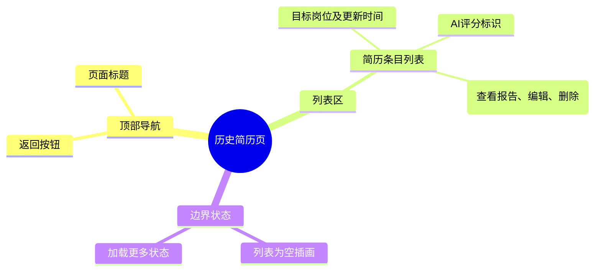

# 历史简历页

## 0. 页面文档状态

- 文档版本：Draft
- 生成日期：2026-05-11
- 来源文件：`product/release/product-overview-release.md`
- 来源 Sitemap 行：
  - 生成顺序：100
  - 页面ID：U-030-020
  - 父页面ID：U-030
  - 层级：L2
  - Surface：用户端App
  - Layout 区域：独立层级
  - 页面名称：历史简历页
  - 页面类型：列表
  - Sitemap 页面级MD文件：`product/development/pages/100-history.md`
- 当前输出文件：`product/development/pages/100-history.md`
- 页面级假设 / 待确认编号规则：
  - 页面假设：`PA-001` 起，按首次出现顺序递增。
  - 页面待确认：`PQ-001` 起，按首次出现顺序递增。

## 1. 页面目标与上下文

### 1.1 页面目标

- 页面目的：作为一个归档库，展示用户过去上传并生成过的所有简历记录。
- 用户目标：找回之前的旧简历，进行二次编辑优化或重新导出下载。
- 业务目标：提供完备的数据云同步与管理能力，增强用户粘性。
- 页面成功标准：用户能够顺畅地浏览、查找目标简历，并进行编辑或删除管理。

### 1.2 页面入口与出口

| 类型 | 来源 / 去向 | 触发条件 | 传入 / 传出数据 | 备注 |
|---|---|---|---|---|
| 入口 | 个人中心 (U-030) | 点击“我的简历”菜单项 | 无 | |
| 入口 | 首页 (U-020) | 点击近期简历区域的“查看全部” | 无 | |
| 出口 | AI 分析报告页 (U-020-030) | 点击列表项“查看报告” | 传入 `resume_id` | |
| 出口 | 简历编辑器 (U-020-040) | 点击列表项“继续编辑” | 传入 `resume_id` | |

### 1.3 角色与权限

| 角色 | 是否可访问 | 权限条件 | 不满足时页面表现 | 相关 PA/PQ |
|---|---|---|---|---|
| 普通用户/VIP | 是 | 需登录态 | 拦截返回或要求登录 | 只能看到自己账号下的简历记录 |

### 1.4 全局页面属性

| 属性 | 类型 | 来源 | 默认值 | 影响元素 / 状态 | 说明 |
|---|---|---|---|---|---|
| historyList | array | API | `[]` | S-002 | 历史简历列表数据，支持分页加载 |
| page | number | local state | 1 | API请求 | 当前分页页码 |

## 2. 页面结构思维导图

## 3. 页面布局与内容区块

| 区块ID | 区块名称 | 区块类型 | 展示条件 | 包含元素ID | 布局 / 样式定义 | 数据来源 | 相关 PA/PQ |
|---|---|---|---|---|---|---|---|
| S-001 | 页面头部 | header | 常驻 | E-001, E-002 | 标准顶部 Navigation Bar | | |
| S-002 | 简历列表区 | content | 常驻 | E-003, E-004, E-005 | 纵向滚动的长列表，支持下拉刷新与上拉加载更多 | `historyList` | |

## 4. 页面元素清单

| 元素ID | 元素名称 | 元素类型 | 所属区块 | 是否必需 | 展示条件 | 默认文案 / 内容 | 样式定义 | 数据绑定 | 相关 PA/PQ |
|---|---|---|---|---|---|---|---|---|---|
| E-001 | 返回按钮 | icon | S-001 | 是 | 常驻 | 返回箭头 | | | |
| E-002 | 页面标题 | text | S-001 | 是 | 常驻 | "我的简历" | 居中标题 | | |
| E-003 | 简历卡片 | card | S-002 | 是 | `historyList.length > 0` | 循环渲染的卡片 | 白底阴影卡片，内含左右排版 | `historyList` 项 | |
| E-004 | AI 评分标识 | text | S-002 | 否 | 该简历有评分 | "85分" | 数字角标或进度环 | 列表项的 `ai_score` | |
| E-005 | 操作按钮组 | buttons | S-002 | 是 | `historyList.length > 0` | "查看报告", "编辑", "删除" | 卡片底部的操作栏（文字按钮） | | |
| E-006 | 空状态提示 | empty | S-002 | 是 | `historyList.length === 0` | "您还没有生成过简历，去首页开启吧" | 居中插画及灰色文字 | | |

## 5. 元素状态矩阵

| 元素ID | 状态 | 触发条件 | 状态来源 | 样式定义 | 可执行动作 | 禁止动作 | 提示文案 / 反馈 | 恢复条件 | 相关 PA/PQ |
|---|---|---|---|---|---|---|---|---|---|
| S-002 | 加载更多 | 用户滚动到底部 | 分页触发 | 列表底部显示 Loading 菊花图 | | | | 新数据返回 | |
| S-002 | 到底了 | 接口返回无更多数据 | API标记 | 列表底部显示 "没有更多了" | | | | | |

## 6. 交互 Action 与执行效果

| ActionID | 触发元素ID | 交互名称 | 用户动作 | 前置条件 | 校验规则 | 执行动作 | 成功结果 | 失败结果 | 页面跳转 / 状态变化 | 埋点事件 | 相关 PA/PQ |
|---|---|---|---|---|---|---|---|---|---|---|---|
| ACT-001 | E-001 | 返回 | 点击 | 无 | 无 | 触发路由返回 | | | 退回上一页 | | |
| ACT-002 | E-005 (查看) | 查看分析报告 | 点击 | 报告存在 | 无 | 导航跳转并传参 | | | 携带 `resume_id` 跳 U-020-030 | | |
| ACT-003 | E-005 (编辑) | 继续编辑 | 点击 | 无 | 无 | 导航跳转并传参 | | | 携带 `resume_id` 跳 U-020-040 | | |
| ACT-004 | E-005 (删除) | 删除简历 | 点击 | 无 | 需弹窗二次确认 | API 调用 (API-002) | 列表移除该项，Toast 成功 | Toast 报错 | 确认弹窗消失 | `click_delete_resume` | |

## 7. 数据结构与接口定义

### 7.1 页面数据模型

| 数据对象 | 字段 | 类型 | 必填 | 来源 | 默认值 | 使用位置 | 说明 |
|---|---|---|---|---|---|---|---|
| HistoryList | resume_id | string | 是 | API | | ACT-002, 003, 004 | |
| HistoryList | target_job | string | 否 | API | "未设置目标" | E-003 | |
| HistoryList | update_time | string | 是 | API | | E-003 | |
| HistoryList | ai_score | number | 否 | API | | E-004 | |

### 7.2 接口清单

| API ID | 接口名称 | 方法 | 路径 | 触发 ActionID | 请求数据结构 | 返回数据结构 | 成功处理 | 失败处理 | 相关 PA/PQ |
|---|---|---|---|---|---|---|---|---|---|
| API-001 | 获取全部历史简历 | GET | `/api/v1/resume/history` | 页面初始化/滚动到底部 | `?page=1&size=20` | `{ "list": [HistoryList], "has_more": boolean }` | 拼接数据至 `historyList` | Toast 报错 | |
| API-002 | 删除历史简历记录 | DELETE | `/api/v1/resume/{resume_id}` | ACT-004 | URL 占位符 | `{ "success": true }` | 更新本地列表视图 | Toast 提示异常 | |

### 7.3 请求 / 返回 JSON 示例

同 U-020 首页的近期简历数据结构，只增加了分页支持。

## 8. 边界状态与错误处理

| 场景ID | 场景类型 | 触发条件 | 页面表现 | 元素表现 | 用户可执行操作 | 系统处理 | 兜底文案 | 相关 PA/PQ |
|---|---|---|---|---|---|---|---|---|
| EDGE-001 | 网络断开 | 初始化获取列表失败 | 占据主体的错误状态插图 | | 点击重试 | | "网络加载失败，请点击重试" | |

## 9. 多媒体与资源

| 资源ID | 资源类型 | 使用位置 | 来源 | 格式 / 尺寸 | 加载状态 | 失败降级 | 可访问性说明 | 相关 PA/PQ |
|---|---|---|---|---|---|---|---|---|
| M-001 | image | E-006 空状态插画 | 本地预置 | SVG | | | 纯视觉指示 | |

## 10. 页面假设与待确认统一清单

### 10.1 页面假设清单

暂无强假设。

### 10.2 页面待确认清单

暂无。
