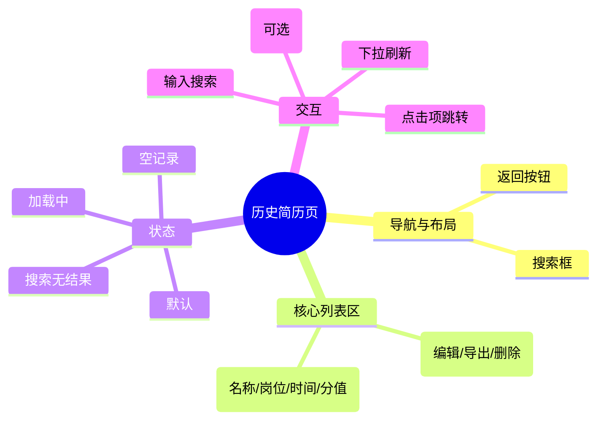

# 历史简历页

## 0. 页面文档状态

- 文档版本：Draft
- 生成日期：2026-05-11
- 来源文件：`product/release/product-overview-release.md`
- 来源 Sitemap 行：
  - 生成顺序：100
  - 页面ID：U-030-020
  - 父页面ID：U-030
  - 层级：L2
  - Surface：用户端App
  - Layout 区域：独立层级
  - 页面名称：历史简历页
  - 页面类型：列表
  - Sitemap 页面级MD文件：product/development/pages/100-history.md
- 当前输出文件：product/development/pages/100-history.md
- 页面级假设 / 待确认编号规则：
  - 页面假设：`PA-001` 起，按首次出现顺序递增。
  - 页面待确认：`PQ-001` 起，按首次出现顺序递增。

## 1. 页面目标与上下文

### 1.1 页面目标

- 页面目的：提供用户所有历史简历记录的管理入口。
- 用户目标：找回之前优化的简历，进行二次修改或直接导出。
- 业务目标：提升用户留存，通过历史记录沉淀用户数据。
- 页面成功标准：用户成功打开历史简历进入编辑器或预览页。

### 1.2 页面入口与出口

| 类型 | 来源 / 去向 | 触发条件 | 传入 / 传出数据 | 备注 |
|---|---|---|---|---|
| 入口 | 个人中心 | 点击历史简历入口 | 无 | |
| 出口 | 简历编辑器 | 点击“编辑” | 简历 ID | 跳转至 U-060 |
| 出口 | 导出预览页 | 点击“导出” | 简历 ID | 跳转至 U-070 |
| 出口 | 个人中心 | 点击返回 | 无 | 返回 U-080 |

### 1.3 角色与权限

| 角色 | 是否可访问 | 权限条件 | 不满足时页面表现 | 相关 PA/PQ |
|---|---|---|---|---|
| 用户 | 是 | 已登录 | 正常展示 | |

### 1.4 全局页面属性

| 属性 | 类型 | 来源 | 默认值 | 影响元素 / 状态 | 说明 |
|---|---|---|---|---|---|
| has_data | boolean | API | false | 页面展示 | 是否有历史记录 |
| search_keyword | string | local state | "" | 列表过滤 | 搜索框输入内容 |

## 2. 页面结构思维导图

## 3. 页面布局与内容区块

| 区块ID | 区块名称 | 区块类型 | 展示条件 | 包含元素ID | 布局 / 样式定义 | 数据来源 | 相关 PA/PQ |
|---|---|---|---|---|---|---|---|
| S-001 | 搜索导航区 | header | 总是展示 | E-001, E-002 | 顶部固定，带搜索栏 | 本地 | |
| S-002 | 历史列表区 | content | has_data == true | E-003 | 垂直滚动列表 | API | |
| S-003 | 空状态区 | content | has_data == false | E-004 | 居中展示 | 本地 | |

## 4. 页面元素清单

| 元素ID | 元素名称 | 元素类型 | 所属区块 | 是否必需 | 展示条件 | 默认文案 / 内容 | 样式定义 | 数据绑定 | 相关 PA/PQ |
|---|---|---|---|---|---|---|---|---|---|
| E-001 | 返回按钮 | button | S-001 | 是 | 总是展示 | <图标 | | 无 | |
| E-002 | 搜索输入框 | input | S-001 | 是 | 总是展示 | 搜索简历名称或岗位 | 灰色背景，圆角 | search_keyword | |
| E-003 | 简历卡片列表 | list | S-002 | 是 | has_data == true | 列表项 | 间距 12px | history_list | (页面假设 PA-001：列表支持分页加载) |
| E-004 | 空状态占位 | other | S-003 | 是 | has_data == false | 您还没有任何优化记录 | 插画 + 文案 | 无 | |
| E-005 | 编辑按钮 | button | S-002/项 | 是 | 总是展示 | 编辑 | 文字按钮 | 无 | |
| E-006 | 导出按钮 | button | S-002/项 | 是 | 总是展示 | 导出 | 文字按钮 | 无 | |
| E-007 | 删除按钮 | button | S-002/项 | 是 | 总是展示 | 删除图标 | 红色图标 | 无 | (页面假设 PA-002：删除需二次确认) |

## 5. 元素状态矩阵

| 元素ID | 状态 | 触发条件 | 状态来源 | 样式定义 | 可执行动作 | 禁止动作 | 提示文案 / 反馈 | 恢复条件 | 相关 PA/PQ |
|---|---|---|---|---|---|---|---|---|---|
| E-003 | 加载中 | 首次载入或翻页 | API | 加载动画/骨架屏 | 无 | 无 | | API 返回 | |
| E-007 | 默认 | 总是 | 本地 | 红色 | 点击弹出确认 | 无 | | | |

## 6. 交互 Action 与执行效果

| ActionID | 触发元素ID | 交互名称 | 用户动作 | 前置条件 | 校验规则 | 执行动作 | 成功结果 | 失败结果 | 页面跳转 / 状态变化 | 埋点事件ID | 埋点事件名称 | 不埋点原因 | 相关 PA/PQ |
|---|---|---|---|---|---|---|---|---|---|---|---|---|---|
| ACT-001 | E-002 | 搜索过滤 | 输入 | 无 | 无 | 本地或调 API | 刷新列表展示 | 无 | 列表内容变化 | EVT-002 | 历史页搜索执行 | | |
| ACT-002 | E-005 | 点击编辑 | 点击 | 无 | 无 | 导航跳转 | 进入编辑器 | 无 | 跳转 U-060 | EVT-003 | 历史页编辑点击 | | |
| ACT-003 | E-006 | 点击导出 | 点击 | 无 | 无 | 导航跳转 | 进入预览页 | 无 | 跳转 U-070 | EVT-004 | 历史页导出点击 | | |
| ACT-004 | E-007 | 确认删除 | 点击确认 | 无 | 二次确认通过 | 调 API-002 | 移除对应项 | 提示删除失败 | 列表刷新 | EVT-005 | 历史页删除确认 | | |

## 7. 埋点事件统计设计

### 7.1 埋点事件总表

| 埋点事件ID | 事件名称 | 事件类型 | 关联元素ID / ActionID | 触发时机 | 统计次数口径 | 去重规则 | 上报时机 | 关键属性 | 成功 / 失败归因 | 漏斗阶段 | 相关 PA/PQ |
|---|---|---|---|---|---|---|---|---|---|---|---|
| EVT-001 | 历史页曝光 | page_view | 无 | 进入页面 | 每页面会话计 1 次 | sessionId | 实时 | page_id | | | |
| EVT-002 | 历史页搜索执行 | action | ACT-001 | 搜索框回车或延时 | 每次触发计 1 次 | 无 | 实时 | keyword_length | | | |
| EVT-003 | 历史页编辑点击 | click | ACT-002 | 点击项中编辑 | 每次触发计 1 次 | actionId | 实时 | resume_id | | | |
| EVT-004 | 历史页导出点击 | click | ACT-003 | 点击项中导出 | 每次触发计 1 次 | actionId | 实时 | resume_id | | | |
| EVT-005 | 历史页删除确认 | click | ACT-004 | 确认删除通过 | 每次触发计 1 次 | requestId | 实时 | resume_id | | | |

### 7.2 埋点事件属性定义

| 属性名 | 类型 | 必填 | 来源 | 示例值 | 使用事件ID | 说明 |
|---|---|---|---|---|---|---|
| page_id | string | 是 | Sitemap 页面ID | U-100 | EVT-001 | |
| resume_id | string | 是 | 列表项数据 | res_999 | EVT-003, 004, 005 | |

## 8. 数据结构与接口定义

### 8.1 页面数据模型

| 数据对象 | 字段 | 类型 | 必填 | 来源 | 默认值 | 使用位置 | 说明 |
|---|---|---|---|---|---|---|---|
| HistoryList | items | array | 是 | API | [] | E-003 | |
| HistoryItem | id | string | 是 | API | | E-003 | |
| HistoryItem | name | string | 是 | API | | E-003 | |
| HistoryItem | target_job | string | 是 | API | | E-003 | |
| HistoryItem | update_at | string | 是 | API | | E-003 | |

### 8.2 接口清单

| API ID | 接口名称 | 方法 | 路径 | 触发 ActionID | 请求数据结构 | 返回数据结构 | 成功处理 | 失败处理 | 相关 PA/PQ |
|---|---|---|---|---|---|---|---|---|---|
| API-001 | 获取历史列表 | GET | /api/resume/history | 页面载入 / ACT-001 | {q, page, size} | {items[], total} | 渲染列表 | 错误提示 | |
| API-002 | 删除简历 | DELETE | /api/resume/delete | ACT-004 | {resume_id} | {status} | 移除并提示成功 | 错误提示 | |

## 9. 边界状态与错误处理

| 场景ID | 场景类型 | 触发条件 | 页面表现 | 元素表现 | 用户可执行操作 | 系统处理 | 兜底文案 | 相关 PA/PQ |
|---|---|---|---|---|---|---|---|---|
| EDGE-001 | 搜索无结果 | 关键字无匹配 | 提示“未找到相关简历” | 展示 S-003 | 清空搜索 | 无 | 换个关键词试试吧 | |
| EDGE-002 | 列表拉取失败 | 接口异常 | 错误提示页面 | 展示重试按钮 | 点击重试 | 无 | 列表获取失败，请检查网络 | |

## 10. 多媒体与资源

| 资源ID | 资源类型 | 使用位置 | 来源 | 格式 / 尺寸 | 加载状态 | 失败降级 | 可访问性说明 | 相关 PA/PQ |
|---|---|---|---|---|---|---|---|---|
| M-001 | image | S-003 | 本地 | SVG | 总是加载 | 不展示 | 空历史插画 | |

## 11. 页面假设与待确认统一清单

### 11.1 页面假设清单

| 假设ID | 假设内容 | 首次出现位置 | 影响范围 | 影响元素 / Action / API / 埋点事件 | 置信度 | 用户确认状态 | Release 处理方式 |
|---|---|---|---|---|---|---|---|
| PA-001 | 历史列表支持分页加载，每页 20 条 | 4. 页面元素清单 | 性能方案 | E-003, API-001 | 高 | 确认 | 确认为正式内容，支持上拉加载更多 |
| PA-002 | 删除记录需要进行二次确认以防误操作 | 4. 页面元素清单 | 交互安全 | E-007, ACT-004 | 高 | 确认 | 确认为正式内容 |

### 11.2 页面待确认清单

| 待确认ID | 待确认问题 | 首次出现位置 | 影响范围 | 影响元素 / Action / API / 埋点事件 | 优先级 | 用户确认结果 | Release 处理方式 |
|---|---|---|---|---|---|---|---|
| PQ-001 | 是否需要支持批量删除功能？ | 6. 交互 Action | 功能范围 | ACT-004 | 低 | 确认 | 不需要 |
