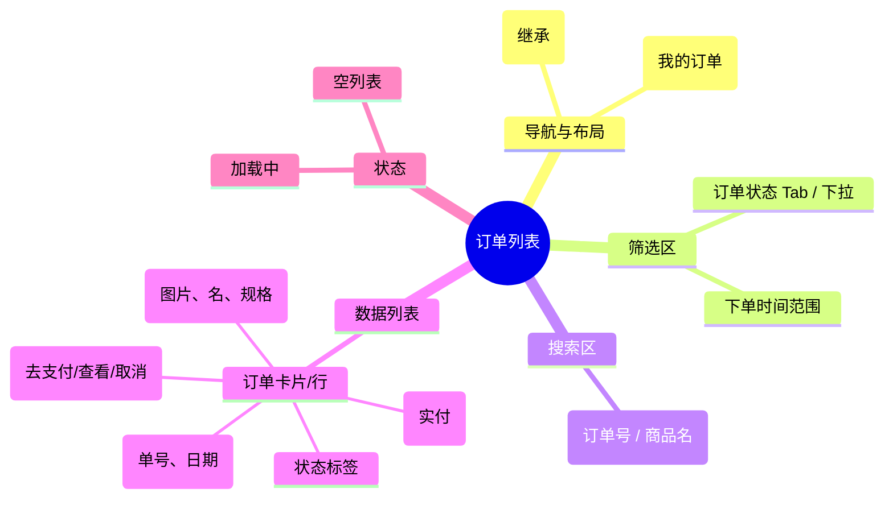

# 订单列表

## 0. 页面文档状态

- 文档版本：Draft
- 生成日期：2026-05-13
- 来源文件：`product/release/product-sitemap-release.md`
- 来源 Sitemap 行：
  - 生成顺序：100
  - 页面ID：U-410
  - 父页面ID：U-400
  - 层级：L2
  - Surface：用户端
  - Layout 区域：内容区
  - 页面名称：订单列表
  - 页面类型：列表
  - Sitemap 页面级MD文件：product/development/pages/100-order-list.md
- 当前输出文件：product/development/pages/100-order-list/index.md

## 1. 页面目标与上下文

### 1.1 页面目标

- 页面目的：提供用户所有订单的详细列表，支持状态过滤与搜索。
- 用户目标：查看历史订单、处理未支付订单或申请退款。
- 业务目标：闭环订单流程，提供订单生命周期的完整查询能力。
- 页面成功标准：订单搜索/筛选的成功率及支付/退款操作的转化率。

### 1.2 页面入口与出口

| 类型 | 来源 / 去向 | 触发条件 | 传入 / 传出数据 | 备注 |
|---|---|---|---|---|
| 入口 | 订单中心 (U-400) | 点击统计卡片 | 状态筛选 |  |
| 出口 | 订单详情 (U-420) | 点击列表行 | 订单 ID |  |
| 出口 | 支付收银台 (U-330) | 点击“去支付” | 订单 ID |  |

### 1.3 角色与权限

| 角色 | 是否可访问 | 权限条件 | 不满足时页面表现 | 相关 PA/PQ |
|---|---|---|---|---|
| 客户用户 | 是 | 已登录 | 跳转登录页 |  |

### 1.4 全局页面属性

| 属性 | 类型 | 来源 | 默认值 | 影响元素 / 状态 | 说明 |
|---|---|---|---|---|---|
| filter_status | enum | route | "all" | 列表过滤 | 全部 / 待支付 / 处理中 / 已取消 / 已退款 |

## 2. 页面结构思维导图



## 3. 页面布局与内容区块

| 区块ID | 区块名称 | 区块类型 | 展示条件 | 包含元素ID | 布局 / 样式定义 | 数据来源 | 相关 PA/PQ |
|---|---|---|---|---|---|---|---|
| S-001 | 订单状态导航 | header | 总是显示 | E-001 | 水平 Tab 切换 | - |  |
| S-002 | 组合搜索栏 | content | 总是显示 | E-002, E-003 | 水平排列 | - |  |
| S-003 | 订单数据区 | content | 总是显示 | E-004 | 垂直卡片列表 | API-001 |  |

## 4. 页面元素清单

| 元素ID | 元素名称 | 元素类型 | 所属区块 | 是否必需 | 展示条件 | 默认文案 / 内容 | 样式定义 | 数据绑定 | 相关 PA/PQ |
|---|---|---|---|---|---|---|---|---|---|
| E-001 | 状态 Tab | tab | S-001 | 是 | 总是显示 | 全部 / 待支付... | 品牌激活样式 | filter_status |  |
| E-002 | 时间选择器 | date-range | S-002 | 是 | 总是显示 | 近三月 / 全部 | - | time_range |  |
| E-003 | 订单搜索框 | input | S-002 | 是 | 总是显示 | 搜索订单号 | - | search_key |  |
| E-004 | 订单项卡片 | list | S-003 | 是 | 有数据 | - | 分块卡片 | order_list |  |
| E-005 | 去支付按钮 | button | S-004 | 否 | 状态=待支付 | 去支付 | 品牌色实色 | - |  |
| E-006 | 查看详情按钮 | button | S-004 | 是 | 总是显示 | 订单详情 | 链接/描边样式 | - |  |

## 5. 元素状态矩阵

| 元素ID | 状态 | 触发条件 | 状态来源 | 样式定义 | 可执行动作 | 禁止动作 | 提示文案 / 反馈 | 恢复条件 | 相关 PA/PQ |
|---|---|---|---|---|---|---|---|---|---|
| E-004 | 状态标签 | 订单状态变更 | item.status | 不同颜色标签 | - | - | 待支付(橙)/已支付(绿)/已关闭(灰) | - |  |
| E-005 | 隐藏 | 状态非待支付 | item.status!="pending" | hidden | - | - | - | - |  |

## 6. 交互 Action 与执行效果

| ActionID | 触发元素ID | 交互名称 | 用户动作 | 前置条件 | 校验规则 | 执行动作 | 成功结果 | 失败结果 | 页面跳转 / 状态变化 | 埋点事件ID | 埋点事件名称 | 不埋点原因 | 相关 PA/PQ |
|---|---|---|---|---|---|---|---|---|---|---|---|---|---|
| ACT-001 | E-001 | 切换状态 | 点击 Tab | - | - | 刷新列表数据 | 列表更新 | - | - | EVT-002 | 状态切换 | - |  |
| ACT-002 | E-005 | 支付订单 | 点击 | - | 校验库存/状态 | 导航 | - | - | 跳转 U-330 | EVT-003 | 去支付点击 | - |  |
| ACT-003 | E-006 | 查看详情 | 点击 | - | - | 导航 | - | - | 跳转 U-420 | EVT-004 | 订单详情点击 | - |  |

## 7. 埋点事件统计设计

### 7.1 埋点事件总表

| 埋点事件ID | 事件名称 | 事件类型 | 关联元素ID / ActionID | 触发时机 | 统计次数口径 | 去重规则 | 上报时机 | 关键属性 | 成功 / 失败归因 | 漏斗阶段 | 相关 PA/PQ |
|---|---|---|---|---|---|---|---|---|---|---|---|
| EVT-001 | 订单列表曝光 | page_view | - | 页面进入 | 每会话 1 次 | sessionId | 实时 | total_count | - | 列表查看 |  |
| EVT-002 | 筛选操作 | click | E-001 | 点击 | 每次触发 1 次 | - | 实时 | filter_status | - | 效率工具 |  |
| EVT-003 | 支付按钮点击 | click | E-005 | 点击 | 每次触发 1 次 | - | 实时 | order_id, amount | - | 转化中 |  |

## 8. 数据结构与接口定义

### 8.1 页面数据模型

| 数据对象 | 字段 | 类型 | 必填 | 来源 | 默认值 | 使用位置 | 说明 |
|---|---|---|---|---|---|---|---|
| OrderItem | order_id | string | 是 | API | - | E-004 |  |
| OrderItem | status | enum | 是 | API | - | E-004 |  |
| OrderItem | product_name | string | 是 | API | - | E-004 |  |
| OrderItem | total_amount | number | 是 | API | - | E-004 |  |
| OrderItem | create_time | string | 是 | API | - | E-004 |  |

### 8.2 接口清单

| API ID | 接口名称 | 方法 | 路径 | 触发 ActionID | 请求数据结构 | 返回数据结构 | 成功处理 | 失败处理 | 相关 PA/PQ |
|---|---|---|---|---|---|---|---|---|---|
| API-001 | 获取订单列表 | GET | /api/order/list | 页面加载 / 筛选 | {page, limit, status, search} | {list, total} | 渲染列表 | 错误提示 |  |

## 9. 边界状态与错误处理

| 场景ID | 场景类型 | 触发条件 | 页面表现 | 元素表现 | 用户可执行操作 | 系统处理 | 兜底文案 | 相关 PA/PQ |
|---|---|---|---|---|---|---|---|---|
| EDGE-001 | 无订单 | 接口返回空 | 显示空插画 | - | 去购买服务 | - | 暂无订单记录，去逛逛吧 |  |

## 10. 多媒体与资源

| 资源ID | 资源类型 | 使用位置 | 说明 |
|---|---|---|---|
| M-001 | icon | S-003 | 订单状态对应图标 |

## 11. 页面假设与待确认统一清单

### 11.1 页面假设清单

| 假设ID | 假设内容 | 首次出现位置 | 影响范围 | 影响元素 / Action / API / 埋点事件 | 置信度 | 用户确认状态 | Release 处理方式 |
|---|---|---|---|---|---|---|---|
| PA-001 | 订单列表默认按“下单时间”倒序排列 | 3. 页面布局 | 排序逻辑 | E-004 | 高 | 待用户确认 |  |

### 11.2 页面待确认清单

| 待确认ID | 待确认问题 | 首次出现位置 | 影响范围 | 影响元素 / Action / API / 埋点事件 | 优先级 | 用户确认结果 | Release 处理方式 |
|---|---|---|---|---|---|---|---|
| PQ-001 | 是否需要支持“批量支付”或“批量取消”？当前假设为逐单处理。 | 3. 页面布局 | 功能范围 | - | 低 | 待用户确认 |  |

## 12. 用户补充描述

```text
无
```
