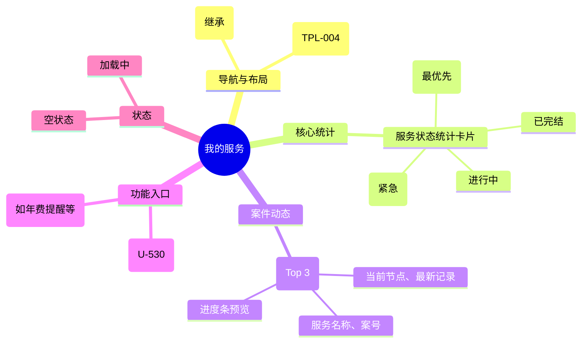

# 我的服务

## 0. 页面文档状态

- 文档版本：Draft
- 生成日期：2026-05-13
- 来源文件：`product/release/product-sitemap-release.md`
- 来源 Sitemap 行：
  - 生成顺序：120
  - 页面ID：U-500
  - 父页面ID：ROOT
  - 层级：L1
  - Surface：用户端
  - Layout 区域：主导航
  - 页面名称：我的服务
  - 页面类型：首页
  - Sitemap 页面级MD文件：product/development/pages/120-service-center.md
- 当前输出文件：product/development/pages/120-service-center/index.md

## 1. 页面目标与上下文

### 1.1 页面目标

- 页面目的：作为用户查看所有正在履约中的合规服务（案件）的总览页，侧重于展现服务深度、节点进度及风险提醒。
- 用户目标：了解我所有案件的整体进展，识别哪些案件处于风险状态或需要补充资料。
- 业务目标：通过多维统计引导用户处理案件阻塞点，确保交付及时性。
- 页面成功标准：首页点击风险/待补件卡片的转化率。

### 1.2 页面入口与出口

| 类型 | 来源 / 去向 | 触发条件 | 传入 / 传出数据 | 备注 |
|---|---|---|---|---|
| 入口 | 顶栏导航 | 点击“我的服务” | 无 |  |
| 出口 | 服务案件列表 (U-510) | 点击统计卡片 | 状态筛选 |  |
| 出口 | 案件详情 (U-520) | 点击最近活跃案件 | 案件 ID |  |
| 出口 | 官方文件下载记录 (U-530) | 点击“下载中心”链接 | 无 |  |

### 1.3 角色与权限

| 角色 | 是否可访问 | 权限条件 | 不满足时页面表现 | 相关 PA/PQ |
|---|---|---|---|---|
| 客户用户 | 是 | 已登录 | 跳转登录页 |  |

### 1.4 全局页面属性

| 属性 | 类型 | 来源 | 默认值 | 影响元素 / 状态 | 说明 |
|---|---|---|---|---|---|
| case_stats | object | API | {data_pending:0, ...} | 卡片显示数字 |  |

## 2. 页面结构思维导图



## 3. 页面布局与内容区块

| 区块ID | 区块名称 | 区块类型 | 展示条件 | 包含元素ID | 布局 / 样式定义 | 数据来源 | 相关 PA/PQ |
|---|---|---|---|---|---|---|---|
| S-001 | 服务核心指标 | header | 总是显示 | E-001 | 4 列卡片网格 | API-001 |  |
| S-002 | 活跃案件追踪 | content | 有案件时显示 | E-002, E-003 | 垂直列表 | API-001 |  |
| S-003 | 工具与下载区 | side-panel | 总是显示 | E-004 | 侧边或底部快捷区 | - |  |

## 4. 页面元素清单

| 元素ID | 元素名称 | 元素类型 | 所属区块 | 是否必需 | 展示条件 | 默认文案 / 内容 | 样式定义 | 数据绑定 | 相关 PA/PQ |
|---|---|---|---|---|---|---|---|---|---|
| E-001 | 服务状态卡片 | list | S-001 | 是 | 总是显示 | 资料待补 / 风险... | 状态敏感色 | case_stats |  |
| E-002 | 案件概览项 | card | S-002 | 是 | 有案件 | - | 包含进度条 UI | active_cases | PA-001 |
| E-003 | 查看全部案件 | button | S-002 | 是 | 有案件 | 查看全部案件 | 右侧链接 | - |  |
| E-004 | 下载中心入口 | card | S-003 | 是 | 总是显示 | 官方文件下载 | 图标+文字 | - |  |

## 5. 元素状态矩阵

| 元素ID | 状态 | 触发条件 | 状态来源 | 样式定义 | 可执行动作 | 禁止动作 | 提示文案 / 反馈 | 恢复条件 | 相关 PA/PQ |
|---|---|---|---|---|---|---|---|---|---|
| E-001 | 预警状态 | 风险计数 > 0 | risk_count > 0 | 红色闪烁或徽标 | 点击跳转 | - | {n} 个案件存在风险 | 风险消除 |  |
| E-002 | 进度节点 | 节点变更 | case.node | 步骤条高亮 | 点击查看 | - | 当前：资料审核中 | - |  |

## 6. 交互 Action 与执行效果

| ActionID | 触发元素ID | 交互名称 | 用户动作 | 前置条件 | 校验规则 | 执行动作 | 成功结果 | 失败结果 | 页面跳转 / 状态变化 | 埋点事件ID | 埋点事件名称 | 不埋点原因 | 相关 PA/PQ |
|---|---|---|---|---|---|---|---|---|---|---|---|---|---|
| ACT-001 | E-001 | 状态分流 | 点击统计卡片 | - | - | 导航 | - | - | 跳转 U-510 并带状态 | EVT-002 | 统计卡片点击 | - |  |
| ACT-002 | E-002 | 进入案件详情 | 点击卡片 | - | - | 导航 | - | - | 跳转 U-520 | EVT-003 | 案件概览点击 | - |  |
| ACT-003 | E-004 | 跳转下载中心 | 点击 | - | - | 导航 | - | - | 跳转 U-530 | - | - | 基础跳转不埋点 |  |

## 7. 埋点事件统计设计

### 7.1 埋点事件总表

| 埋点事件ID | 事件名称 | 事件类型 | 关联元素ID / ActionID | 触发时机 | 统计次数口径 | 去重规则 | 上报时机 | 关键属性 | 成功 / 失败归因 | 漏斗阶段 | 相关 PA/PQ |
|---|---|---|---|---|---|---|---|---|---|---|---|
| EVT-001 | 我的服务曝光 | page_view | - | 页面进入 | 每会话 1 次 | sessionId | 实时 | total_case_count | - | 服务首页 |  |
| EVT-002 | 服务统计点击 | click | E-001 | 点击 | 每次触发 1 次 | - | 实时 | case_status_type | - | 分流 |  |
| EVT-003 | 案件概览点击 | click | E-002 | 点击 | 每次触发 1 次 | - | 实时 | case_id, current_node | - | 详情转化 |  |

## 8. 数据结构与接口定义

### 8.1 页面数据模型

| 数据对象 | 字段 | 类型 | 必填 | 来源 | 默认值 | 使用位置 | 说明 |
|---|---|---|---|---|---|---|---|
| ServiceSummary | stats | object | 是 | API | {risk:0, ...} | E-001 | 各状态案件计数 |
| ServiceSummary | active_cases | array | 是 | API | [] | E-002 | 最近活跃案件列表 |

### 8.2 接口清单

| API ID | 接口名称 | 方法 | 路径 | 触发 ActionID | 请求数据结构 | 返回数据结构 | 成功处理 | 失败处理 | 相关 PA/PQ |
|---|---|---|---|---|---|---|---|---|---|
| API-001 | 获取服务中心概览 | GET | /api/service/summary | 页面加载 | - | {stats, active_cases} | 渲染页面 | 错误提示 |  |

## 9. 边界状态与错误处理

| 场景ID | 场景类型 | 触发条件 | 页面表现 | 元素表现 | 用户可执行操作 | 系统处理 | 兜底文案 | 相关 PA/PQ |
|---|---|---|---|---|---|---|---|---|
| EDGE-001 | 无案件 | 接口返回空 | 显示空状态插画 | - | 去购买服务 | - | 您还没有正在进行的服务 |  |

## 10. 多媒体与资源

| 资源ID | 资源类型 | 使用位置 | 说明 |
|---|---|---|---|
| M-001 | icon | S-001 | 服务状态图标 |
| M-002 | image | S-003 | 下载中心配图 |

## 11. 页面假设与待确认统一清单

### 11.1 页面假设清单

| 假设ID | 假设内容 | 首次出现位置 | 影响范围 | 影响元素 / Action / API / 埋点事件 | 置信度 | 用户确认状态 | Release 处理方式 |
|---|---|---|---|---|---|---|---|
| PA-001 | 案件进度预览采用“简易步骤条”，仅展示当前节点的前后两个节点，详情通过跳转查看 | 4. 页面元素清单 | UI 展示 | E-002 | 中 | 待用户确认 |  |

### 11.2 页面待确认清单

| 待确认ID | 待确认问题 | 首次出现位置 | 影响范围 | 影响元素 / Action / API / 埋点事件 | 优先级 | 用户确认结果 | Release 处理方式 |
|---|---|---|---|---|---|---|---|
| PQ-001 | 是否需要在此展示“专属客服”联系方式？当前假设为使用全局悬浮球。 | 1.1 页面目标 | 功能范围 | - | 中 | 待用户确认 |  |

## 12. 用户补充描述

```text
无
```
