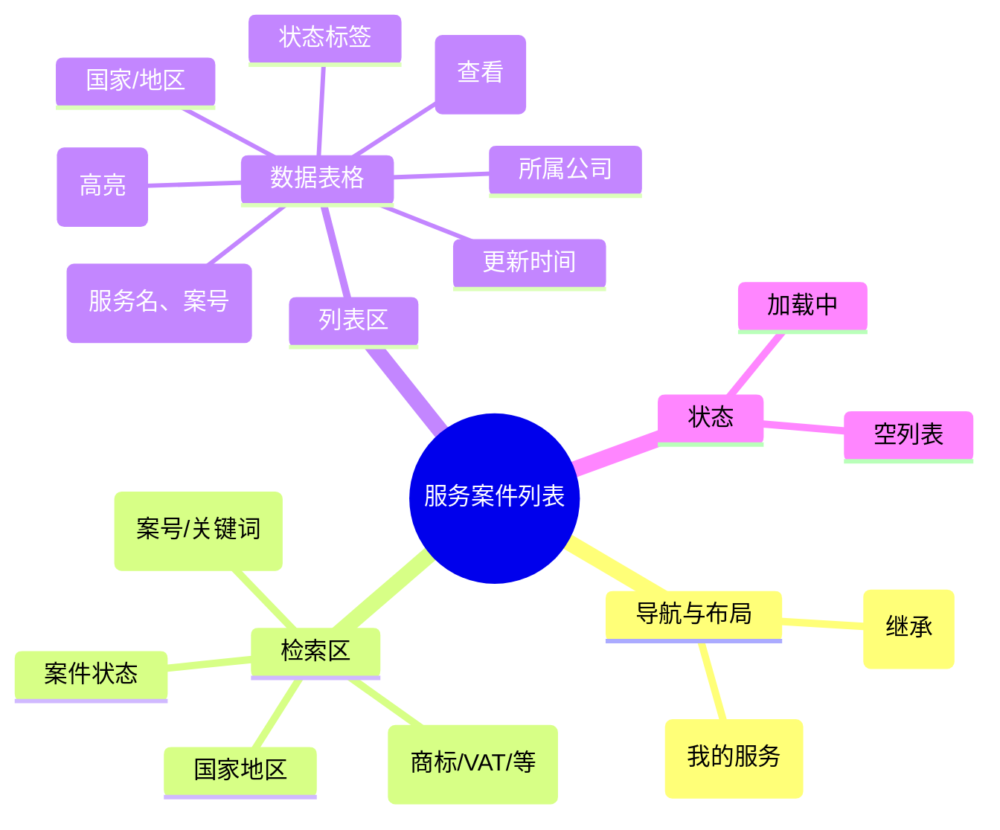

# 服务案件列表

## 0. 页面文档状态

- 文档版本：Draft
- 生成日期：2026-05-13
- 来源文件：`product/release/product-sitemap-release.md`
- 来源 Sitemap 行：
  - 生成顺序：130
  - 页面ID：U-510
  - 父页面ID：U-500
  - 层级：L2
  - Surface：用户端
  - Layout 区域：内容区
  - 页面名称：服务案件列表
  - 页面类型：列表
  - Sitemap 页面级MD文件：product/development/pages/130-service-case-list.md
- 当前输出文件：product/development/pages/130-service-case-list/index.md

## 1. 页面目标与上下文

### 1.1 页面目标

- 页面目的：提供所有服务案件（已支付且启动）的清单视图，支持深度检索与状态跟踪。
- 用户目标：批量管理名下的合规案件，快速识别进度停滞的案件。
- 业务目标：作为服务交付的主要索引页，降低用户寻找特定案件的难度。
- 页面成功标准：筛选功能的准确性及案件详情点击率。

### 1.2 页面入口与出口

| 类型 | 来源 / 去向 | 触发条件 | 传入 / 传出数据 | 备注 |
|---|---|---|---|---|
| 入口 | 我的服务 (U-500) | 点击统计卡片 | 状态筛选条件 |  |
| 出口 | 案件详情 (U-520) | 点击案件项 | 案件 ID |  |

### 1.3 角色与权限

| 角色 | 是否可访问 | 权限条件 | 不满足时页面表现 | 相关 PA/PQ |
|---|---|---|---|---|
| 客户用户 | 是 | 已登录 | 跳转登录页 |  |

### 1.4 全局页面属性

| 属性 | 类型 | 来源 | 默认值 | 影响元素 / 状态 | 说明 |
|---|---|---|---|---|---|
| filter_status | enum | route | "all" | 列表过滤 | 进行中 / 资料待补 / 已完结 / 异常 |

## 2. 页面结构思维导图



## 3. 页面布局与内容区块

| 区块ID | 区块名称 | 区块类型 | 展示条件 | 包含元素ID | 布局 / 样式定义 | 数据来源 | 相关 PA/PQ |
|---|---|---|---|---|---|---|---|
| S-001 | 组合筛选栏 | header | 总是显示 | E-001 至 E-004 | 多行自适应排列 | API-001 |  |
| S-002 | 案件数据表格 | content | 总是显示 | E-005, E-006 | 响应式表格 | API-001 | PA-001 |

## 4. 页面元素清单

| 元素ID | 元素名称 | 元素类型 | 所属区块 | 是否必需 | 展示条件 | 默认文案 / 内容 | 样式定义 | 数据绑定 | 相关 PA/PQ |
|---|---|---|---|---|---|---|---|---|---|
| E-001 | 服务分类下拉 | select | S-001 | 是 | 总是显示 | 全部服务 | - | service_type |  |
| E-002 | 国家下拉 | select | S-001 | 是 | 总是显示 | 全部国家 | - | country |  |
| E-003 | 状态切换 Tab | tab | S-001 | 是 | 总是显示 | 进行中 / 资料待补... | 品牌激活样式 | filter_status |  |
| E-004 | 案号搜索框 | input | S-001 | 是 | 总是显示 | 搜索案号/关键词 | - | search_key |  |
| E-005 | 案件数据表格 | list | S-002 | 是 | 有数据 | - | 表格行样式 | case_list | PA-001 |
| E-006 | 详情操作按钮 | button | S-002 | 是 | 总是显示 | 查看 | 蓝色链接 | - |  |

## 5. 元素状态矩阵

| 元素ID | 状态 | 触发条件 | 状态来源 | 样式定义 | 可执行动作 | 禁止动作 | 提示文案 / 反馈 | 恢复条件 | 相关 PA/PQ |
|---|---|---|---|---|---|---|---|---|---|
| E-005 | 资料待补状态 | status="data_pending" | item.status | 红色文字/标签 | 点击去补件 | - | 待补件 | 资料提交成功 |  |
| E-005 | 进行中状态 | status="processing" | item.status | 蓝色文字/标签 | 点击查看 | - | 进行中 | - |  |

## 6. 交互 Action 与执行效果

| ActionID | 触发元素ID | 交互名称 | 用户动作 | 前置条件 | 校验规则 | 执行动作 | 成功结果 | 失败结果 | 页面跳转 / 状态变化 | 埋点事件ID | 埋点事件名称 | 不埋点原因 | 相关 PA/PQ |
|---|---|---|---|---|---|---|---|---|---|---|---|---|---|
| ACT-001 | E-001/002/003/004 | 触发搜索 | 变更或回车 | - | - | 刷新列表数据 | 列表更新 | - | - | EVT-002 | 案件检索 | - |  |
| ACT-002 | E-006 | 查看详情 | 点击 | - | - | 导航 | - | - | 跳转 U-520 | EVT-003 | 案件点击 | - |  |

## 7. 埋点事件统计设计

### 7.1 埋点事件总表

| 埋点事件ID | 事件名称 | 事件类型 | 关联元素ID / ActionID | 触发时机 | 统计次数口径 | 去重规则 | 上报时机 | 关键属性 | 成功 / 失败归因 | 漏斗阶段 | 相关 PA/PQ |
|---|---|---|---|---|---|---|---|---|---|---|---|
| EVT-001 | 案件列表曝光 | page_view | - | 页面进入 | 每会话 1 次 | sessionId | 实时 | total_count | - | 列表查看 |  |
| EVT-002 | 检索行为 | click | E-004 | 触发检索 | 每次触发 1 次 | - | 实时 | filter_params | - | 效率工具 |  |
| EVT-003 | 案件点击 | click | E-006 | 点击 | 每次触发 1 次 | - | 实时 | case_id, case_status | - | 进入详情 |  |

## 8. 数据结构与接口定义

### 8.1 页面数据模型

| 数据对象 | 字段 | 类型 | 必填 | 来源 | 默认值 | 使用位置 | 说明 |
|---|---|---|---|---|---|---|---|
| CaseItem | case_id | string | 是 | API | - | E-005 |  |
| CaseItem | service_name | string | 是 | API | - | E-005 |  |
| CaseItem | country | string | 是 | API | - | E-005 |  |
| CaseItem | current_node | string | 是 | API | - | E-005 | 当前所在流程节点 |
| CaseItem | status | enum | 是 | API | - | E-005 | 案件状态 |

### 8.2 接口清单

| API ID | 接口名称 | 方法 | 路径 | 触发 ActionID | 请求数据结构 | 返回数据结构 | 成功处理 | 失败处理 | 相关 PA/PQ |
|---|---|---|---|---|---|---|---|---|---|
| API-001 | 获取案件列表 | GET | /api/service/case-list | 页面加载 / 筛选 | {page, limit, service, country, status, search} | {list, total} | 渲染列表 | 错误提示 |  |

## 9. 边界状态与错误处理

| 场景ID | 场景类型 | 触发条件 | 页面表现 | 元素表现 | 用户可执行操作 | 系统处理 | 兜底文案 | 相关 PA/PQ |
|---|---|---|---|---|---|---|---|---|
| EDGE-001 | 检索无结果 | 接口返回空 | 显示提示 | - | 重置筛选 | - | 没找到相关案件，换个关键词试试 |  |

## 10. 多媒体与资源

| 资源ID | 资源类型 | 使用位置 | 说明 |
|---|---|---|---|
| M-001 | icon | S-002 | 流程节点对应状态图标 |

## 11. 页面假设与待确认统一清单

### 11.1 页面假设清单

| 假设ID | 假设内容 | 首次出现位置 | 影响范围 | 影响元素 / Action / API / 埋点事件 | 置信度 | 用户确认状态 | Release 处理方式 |
|---|---|---|---|---|---|---|---|
| PA-001 | 表格默认按照“更新时间”倒序排列，并在“资料待补”状态下置顶展示 | 3. 页面布局 | 排序逻辑 | E-005 | 高 | 待用户确认 |  |

### 11.2 页面待确认清单

| 待确认ID | 待确认问题 | 首次出现位置 | 影响范围 | 影响元素 / Action / API / 埋点事件 | 优先级 | 用户确认结果 | Release 处理方式 |
|---|---|---|---|---|---|---|---|
| PQ-001 | 是否需要支持“批量导出”当前案件列表数据？ | 1.1 页面目标 | 功能范围 | - | 低 | 待用户确认 |  |

## 12. 用户补充描述

```text
无
```
