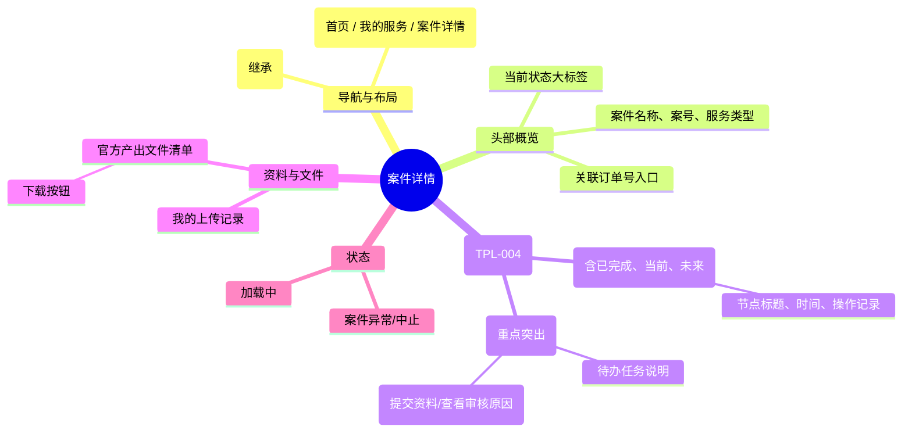

# 案件详情

## 0. 页面文档状态

- 文档版本：Draft
- 生成日期：2026-05-13
- 来源文件：`product/release/product-sitemap-release.md`
- 来源 Sitemap 行：
  - 生成顺序：140
  - 页面ID：U-520
  - 父页面ID：U-500
  - 层级：L2
  - Surface：用户端
  - Layout 区域：内容区
  - 页面名称：案件详情
  - 页面类型：详情
  - Sitemap 页面级MD文件：product/development/pages/140-case-detail.md
- 当前输出文件：product/development/pages/140-case-detail/index.md

## 1. 页面目标与上下文

### 1.1 页面目标

- 页面目的：展示单个合规案件的完整全生命周期视图，包括所有历史操作记录、当前节点任务、未来流程预期及官方产出文件。
- 用户目标：了解案件目前卡在哪了，需要我做什么，以及下载官方下发的证书/回执。
- 业务目标：作为服务交互的核心闭环，承载“资料收集”与“结果交付”的双重职能。
- 页面成功标准：用户在需要补件时的平均响应时长及官方文件的下载量。

### 1.2 页面入口与出口

| 类型 | 来源 / 去向 | 触发条件 | 传入 / 传出数据 | 备注 |
|---|---|---|---|---|
| 入口 | 服务案件列表 (U-510) | 点击案件项 | 案件 ID |  |
| 入口 | 用户工作台 (U-200) | 点击概览卡片 | 案件 ID |  |
| 出口 | 节点资料提交视图 (U-521) | 点击“去提交资料” | 节点 ID、案件 ID | 针对当前活跃节点 |
| 出口 | 订单详情 (U-420) | 点击“查看关联订单” | 订单 ID |  |

### 1.3 角色与权限

| 角色 | 是否可访问 | 权限条件 | 不满足时页面表现 | 相关 PA/PQ |
|---|---|---|---|---|
| 客户用户 | 是 | 案件所属者 | 报错提示无权限 |  |

### 1.4 全局页面属性

| 属性 | 类型 | 来源 | 默认值 | 影响元素 / 状态 | 说明 |
|---|---|---|---|---|---|
| case_id | string | route | - | 页面数据加载 |  |
| current_node_id | string | API | - | 活跃操作区渲染 | 当前推进到的流程节点 |

## 2. 页面结构思维导图



## 3. 页面布局与内容区块

| 区块ID | 区块名称 | 区块类型 | 展示条件 | 包含元素ID | 布局 / 样式定义 | 数据来源 | 相关 PA/PQ |
|---|---|---|---|---|---|---|---|
| S-001 | 案件基础信息 | header | 总是显示 | E-001, E-002 | 顶部标题区 | API-001 |  |
| S-002 | 流程进度主轴 | content | 总是显示 | E-003, E-004 | 居中主内容，时间轴样式 | API-001 |  |
| S-003 | 文件与附件区 | footer | 总是显示 | E-005, E-006 | 底部平铺或侧边栏 | API-002 |  |

## 4. 页面元素清单

| 元素ID | 元素名称 | 元素类型 | 所属区块 | 是否必需 | 展示条件 | 默认文案 / 内容 | 样式定义 | 数据绑定 | 相关 PA/PQ |
|---|---|---|---|---|---|---|---|---|---|
| E-001 | 案件大标题 | text | S-001 | 是 | 总是显示 | {服务名} - {国家} | H1 | title |  |
| E-002 | 案号与订单链接 | text | S-001 | 是 | 总是显示 | 案号：{case_no} | - | case_no |  |
| E-003 | 流程时间轴组件 | list | S-002 | 是 | 总是显示 | - | 垂直时间轴 | flow_history |  |
| E-004 | 活跃节点操作位 | card | S-002 | 否 | 节点需要交互 | 去提交资料 | 品牌色高亮容器 | current_node | PA-001 |
| E-005 | 官方文件列表 | list | S-003 | 否 | 有文件下发 | 官方回执/证书 | 带下载图标 | official_files |  |
| E-006 | 资料回填记录 | list | S-003 | 否 | 有上传记录 | 用户提交的资料 | 预览小图/文件名 | user_uploads |  |

## 5. 元素状态矩阵

| 元素ID | 状态 | 触发条件 | 状态来源 | 样式定义 | 可执行动作 | 禁止动作 | 提示文案 / 反馈 | 恢复条件 | 相关 PA/PQ |
|---|---|---|---|---|---|---|---|---|---|
| E-004 | 待办状态 | 节点="资料待补" | node.status="pending" | 橙色背景 | 点击跳转 U-521 | - | 需补充资料 | 资料提交 |  |
| E-004 | 审核中状态 | 资料已交 | node.status="reviewing" | 蓝色背景 | - | 点击提交 | 资料审核中 | 审核通过/驳回 |  |
| E-005 | 可下载 | 文件已生成 | file.url exists | - | 点击下载 | - | - | - |  |

## 6. 交互 Action 与执行效果

| ActionID | 触发元素ID | 交互名称 | 用户动作 | 前置条件 | 校验规则 | 执行动作 | 成功结果 | 失败结果 | 页面跳转 / 状态变化 | 埋点事件ID | 埋点事件名称 | 不埋点原因 | 相关 PA/PQ |
|---|---|---|---|---|---|---|---|---|---|---|---|---|---|
| ACT-001 | E-004 | 处理节点任务 | 点击按钮 | 节点需要操作 | - | 导航 | - | - | 跳转 U-521 | EVT-002 | 节点操作点击 | - |  |
| ACT-002 | E-005 | 下载官方文件 | 点击下载 | - | - | 触发浏览器下载 | 文件下载 | 报错提示 | - | EVT-003 | 文件下载点击 | - |  |

## 7. 埋点事件统计设计

### 7.1 埋点事件总表

| 埋点事件ID | 事件名称 | 事件类型 | 关联元素ID / ActionID | 触发时机 | 统计次数口径 | 去重规则 | 上报时机 | 关键属性 | 成功 / 失败归因 | 漏斗阶段 | 相关 PA/PQ |
|---|---|---|---|---|---|---|---|---|---|---|---|
| EVT-001 | 案件详情曝光 | page_view | - | 页面加载完成 | 每会话 1 次 | sessionId | 实时 | case_id, current_node | - | 详情查看 |  |
| EVT-002 | 补件操作点击 | click | E-004 | 点击 | 每次触发 1 次 | - | 实时 | case_id, node_id | - | 交互启动 |  |
| EVT-003 | 官方文件下载 | click | E-005 | 点击 | 每次触发 1 次 | - | 实时 | file_id, file_type | - | 价值交付 |  |

## 8. 数据结构与接口定义

### 8.1 页面数据模型

| 数据对象 | 字段 | 类型 | 必填 | 来源 | 默认值 | 使用位置 | 说明 |
|---|---|---|---|---|---|---|---|
| CaseDetail | id | string | 是 | API | - | - |  |
| CaseDetail | flow_history | array | 是 | API | [] | E-003 | 节点历史与状态 |
| CaseDetail | current_node | object | 否 | API | - | E-004 | 当前活跃节点详情 |
| CaseDetail | official_files | array | 否 | API | [] | E-005 | 官方下发文件 |

### 8.2 接口清单

| API ID | 接口名称 | 方法 | 路径 | 触发 ActionID | 请求数据结构 | 返回数据结构 | 成功处理 | 失败处理 | 相关 PA/PQ |
|---|---|---|---|---|---|---|---|---|---|
| API-001 | 获取案件全景详情 | GET | /api/case/detail | 页面加载 | {case_id} | {CaseDetail} | 渲染页面 | 错误提示 |  |
| API-002 | 获取案件相关文件 | GET | /api/case/files | 页面加载 | {case_id} | {file_list} | 渲染文件列表 | - |  |

## 9. 边界状态与错误处理

| 场景ID | 场景类型 | 触发条件 | 页面表现 | 元素表现 | 用户可执行操作 | 系统处理 | 兜底文案 | 相关 PA/PQ |
|---|---|---|---|---|---|---|---|---|
| EDGE-001 | 案件中止 | 状态="cancelled" | 详情页置灰 | 时间轴标记中止 | 联系客服 | - | 该案件已中止处理 |  |

## 10. 多媒体与资源

| 资源ID | 资源类型 | 使用位置 | 说明 |
|---|---|---|---|
| M-001 | icon | S-002 | 时间轴各状态图标 |
| M-002 | icon | E-005 | PDF/ZIP 下载图标 |

## 11. 页面假设与待确认统一清单

### 11.1 页面假设清单

| 假设ID | 假设内容 | 首次出现位置 | 影响范围 | 影响元素 / Action / API / 埋点事件 | 置信度 | 用户确认状态 | Release 处理方式 |
|---|---|---|---|---|---|---|---|
| PA-001 | 活跃节点操作位在页面上方突出展示，如果是“资料待补”状态，需通过高亮颜色（如橙色）强调 | 2. 页面结构 | 交互 | E-004 | 高 | 确认 | 更新到正式 |

### 11.2 页面待确认清单

| 待确认ID | 待确认问题 | 首次出现位置 | 影响范围 | 影响元素 / Action / API / 埋点事件 | 优先级 | 用户确认结果 | Release 处理方式 |
|---|---|---|---|---|---|---|---|
| PQ-001 | 是否需要展示服务该案件的“专属客服/交付专家”头像及联系方式？ | 1.1 页面目标 | 页面元素 | - | 中 | 确认 | 不需要 |

## 12. 用户补充描述

```text
无
```
