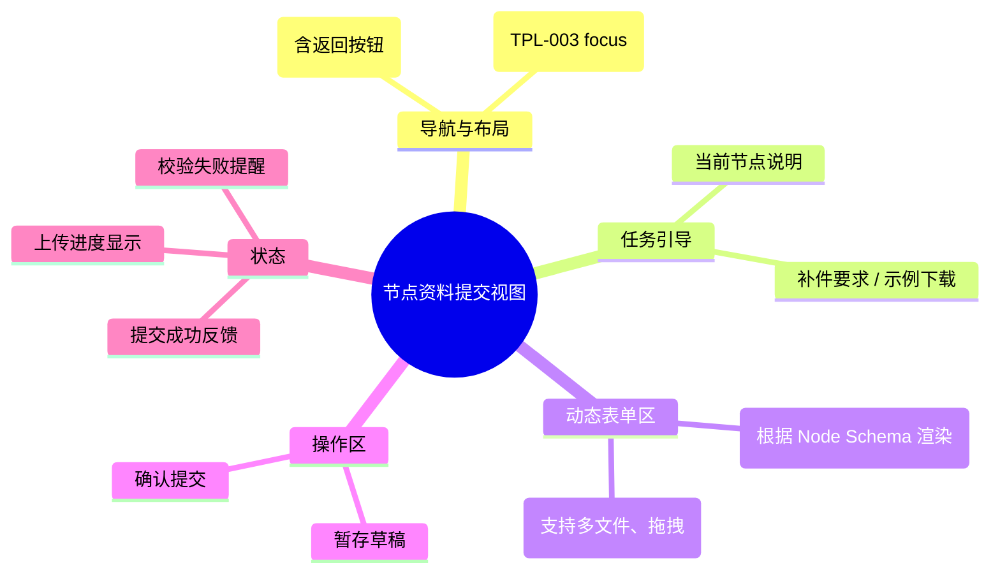

# 节点资料提交视图

## 0. 页面文档状态

- 文档版本：Draft
- 生成日期：2026-05-13
- 来源文件：`product/release/product-sitemap-release.md`
- 来源 Sitemap 行：
  - 生成顺序：150
  - 页面ID：U-521
  - 父页面ID：U-520
  - 层级：L3
  - Surface：用户端
  - Layout 区域：独立视图
  - 页面名称：节点资料提交视图
  - 页面类型：表单
  - Sitemap 页面级MD文件：product/development/pages/150-node-submit-view.md
- 当前输出文件：product/development/pages/150-node-submit-view/index.md

## 1. 页面目标与上下文

### 1.1 页面目标

- 页面目的：针对案件流程中特定的“待补件”或“待提交”节点，提供专用的动态资料填报界面。
- 用户目标：根据系统提示，准确上传所需附件并填写相关字段，以推进案件进入下一节点。
- 业务目标：结构化收集交付所需的基础资料，支持后台自动或人工审核。
- 页面成功标准：单节点资料的一次性提交通过率。

### 1.2 页面入口与出口

| 类型 | 来源 / 去向 | 触发条件 | 传入 / 传出数据 | 备注 |
|---|---|---|---|---|
| 入口 | 案件详情 (U-520) | 点击“去提交资料” | 案件 ID、节点 ID |  |
| 入口 | 待办事项列表 (U-210) | 点击对应的补件项 | 案件 ID、节点 ID |  |
| 出口 | 案件详情 (U-520) | 提交成功或取消 | 提交状态 |  |

### 1.3 角色与权限

| 角色 | 是否可访问 | 权限条件 | 不满足时页面表现 | 相关 PA/PQ |
|---|---|---|---|---|
| 客户用户 | 是 | 案件所属者且该节点处于待办状态 | 报错提示节点不可操作 |  |

### 1.4 全局页面属性

| 属性 | 类型 | 来源 | 默认值 | 影响元素 / 状态 | 说明 |
|---|---|---|---|---|---|
| case_id | string | route | - | 数据提交目标 |  |
| node_id | string | route | - | 表单定义加载 | 决定渲染哪些字段和附件要求 (PA-001) |

## 2. 页面结构思维导图



## 3. 页面布局与内容区块

| 区块ID | 区块名称 | 区块类型 | 展示条件 | 包含元素ID | 布局 / 样式定义 | 数据来源 | 相关 PA/PQ |
|---|---|---|---|---|---|---|---|
| S-001 | 任务引导区 | header | 总是显示 | E-001 | 顶部背景条 | API-001 |  |
| S-002 | 动态填报区 | content | 总是显示 | E-002, E-003 | 1280px 居中大容器 | API-001 | PA-001 |
| S-003 | 底部操作栏 | footer | 总是显示 | E-004, E-005 | 吸底展示 | - |  |

## 4. 页面元素清单

| 元素ID | 元素名称 | 元素类型 | 所属区块 | 是否必需 | 展示条件 | 默认文案 / 内容 | 样式定义 | 数据绑定 | 相关 PA/PQ |
|---|---|---|---|---|---|---|---|---|---|
| E-001 | 节点处理指南 | alert | S-001 | 是 | 总是显示 | 请根据以下要求提交资料 | 提示样式 | node_guide |  |
| E-002 | 动态输入字段 | other | S-002 | 否 | 根据 Schema | - | 表单项样式 | dynamic_fields | PA-001 |
| E-003 | 附件上传组件 | upload | S-002 | 否 | 根据 Schema | 点击或拖拽上传 | 支持缩略图预览 | attachments | PA-002 |
| E-004 | 暂存草稿按钮 | button | S-003 | 是 | 总是显示 | 暂存草稿 | 弱化样式 | - |  |
| E-005 | 确认提交按钮 | button | S-003 | 是 | 总是显示 | 确认提交 | 品牌色主按钮 | - |  |
| E-006 | 驳回原因说明 | alert | S-001 | 否 | 状态=被驳回 | 驳回原因：{reason} | 红色警告样式 | reject_reason |  |

## 5. 元素状态矩阵

| 元素ID | 状态 | 触发条件 | 状态来源 | 样式定义 | 可执行动作 | 禁止动作 | 提示文案 / 反馈 | 恢复条件 | 相关 PA/PQ |
|---|---|---|---|---|---|---|---|---|---|
| E-003 | 上传中 | 文件选择后 | uploading | 进度条 | - | 重复上传 | 正在上传 {n}% | 上传完成 |  |
| E-003 | 上传失败 | 网络或格式错误 | upload_error | 红色图标 | 点击重试 | - | 上传失败，请检查文件 | 重新选择 |  |
| E-005 | 禁用 | 必填项未满 | validation | 置灰 | - | 点击 | 请完善必填项 | 校验通过 |  |

## 6. 交互 Action 与执行效果

| ActionID | 触发元素ID | 交互名称 | 用户动作 | 前置条件 | 校验规则 | 执行动作 | 成功结果 | 失败结果 | 页面跳转 / 状态变化 | 埋点事件ID | 埋点事件名称 | 不埋点原因 | 相关 PA/PQ |
|---|---|---|---|---|---|---|---|---|---|---|---|---|---|
| ACT-001 | E-003 | 文件上传 | 选择文件 | 符合格式/大小 | 见 PA-002 | 调用上传 API | 获取 fileId | 错误提示 | - | EVT-002 | 文件上传操作 | - | PA-002 |
| ACT-002 | E-005 | 提交资料 | 点击 | 校验通过 | 必填项、格式 | 调用提交 API (API-002) | 返回 U-520 | 提示提交失败 | 跳转 U-520 | EVT-003 | 提交资料确认 | - |  |
| ACT-003 | E-004 | 暂存草稿 | 点击 | - | - | 保存当前表单状态 | 提示保存成功 | - | - | - | - | 基础保存不埋点 |  |

## 7. 埋点事件统计设计

### 7.1 埋点事件总表

| 埋点事件ID | 事件名称 | 事件类型 | 关联元素ID / ActionID | 触发时机 | 统计次数口径 | 去重规则 | 上报时机 | 关键属性 | 成功 / 失败归因 | 漏斗阶段 | 相关 PA/PQ |
|---|---|---|---|---|---|---|---|---|---|---|---|
| EVT-001 | 提交页曝光 | page_view | - | 页面进入 | 每会话 1 次 | sessionId | 实时 | case_id, node_id | - | 交互开始 |  |
| EVT-002 | 文件上传 | action | E-003 | 每次文件上传成功 | 每次触发 1 次 | - | 实时 | file_type, file_size | - | 交互中 |  |
| EVT-003 | 提交结果 | submit | E-005 | 点击提交并返回结果 | 每次触发 1 次 | actionId | 接口返回 | case_id, result, error_fields | - | 交互结束 |  |

## 8. 数据结构与接口定义

### 8.1 页面数据模型

| 数据对象 | 字段 | 类型 | 必填 | 来源 | 默认值 | 使用位置 | 说明 |
|---|---|---|---|---|---|---|---|
| NodeSubmitForm | fields_schema | array | 是 | API | [] | E-002 | 动态字段定义 |
| NodeSubmitForm | initial_values | object | 否 | API | {} | E-002 | 暂存或被驳回的旧值 |

### 8.2 接口清单

| API ID | 接口名称 | 方法 | 路径 | 触发 ActionID | 请求数据结构 | 返回数据结构 | 成功处理 | 失败处理 | 相关 PA/PQ |
|---|---|---|---|---|---|---|---|---|---|
| API-001 | 获取节点提交定义 | GET | /api/case/node-schema | 页面加载 | {case_id, node_id} | {schema, values} | 渲染表单 | 错误提示 | PA-001 |
| API-002 | 提交节点资料 | POST | /api/case/node-submit | ACT-002 | {case_id, node_id, data} | {success} | 跳转详情 | 错误提示 |  |

## 9. 边界状态与错误处理

| 场景ID | 场景类型 | 触发条件 | 页面表现 | 元素表现 | 用户可执行操作 | 系统处理 | 兜底文案 | 相关 PA/PQ |
|---|---|---|---|---|---|---|---|---|
| EDGE-001 | 提交冲突 | 后台已进入下一节点 | 弹窗提示 | - | 返回详情 | - | 该节点资料已被其他人提交或已进入下一环节 |  |

## 10. 多媒体与资源

| 资源ID | 资源类型 | 使用位置 | 说明 |
|---|---|---|---|
| M-001 | image | E-001 | 补件示例图预览 |
| M-002 | icon | E-003 | 各文件类型对应图标 |

## 11. 页面假设与待确认统一清单

### 11.1 页面假设清单

| 假设ID | 假设内容 | 首次出现位置 | 影响范围 | 影响元素 / Action / API / 埋点事件 | 置信度 | 用户确认状态 | Release 处理方式 |
|---|---|---|---|---|---|---|---|
| PA-001 | 节点的提交表单结构由服务模板配置下发，前端根据 schema 自动渲染字段与校验规则 | 1.4 全局页面属性 | 动态表单 | E-002, API-001 | 高 | 待用户确认 |  |
| PA-002 | 文件上传需支持分片上传以应对大文件（如专利扫描件），且支持断点续传 | 6. 交互 Action | 文件上传 | ACT-001 | 中 | 待用户确认 |  |

### 11.2 页面待确认清单

| 待确认ID | 待确认问题 | 首次出现位置 | 影响范围 | 影响元素 / Action / API / 埋点事件 | 优先级 | 用户确认结果 | Release 处理方式 |
|---|---|---|---|---|---|---|---|
| PQ-001 | 是否需要支持“OCR 识别”功能（如营业执照自动填表）？当前 MVP 假设为手动填写。 | 4. 页面元素清单 | 自动化 | E-002 | 低 | 待用户确认 |  |

## 12. 用户补充描述

```text
无
```
