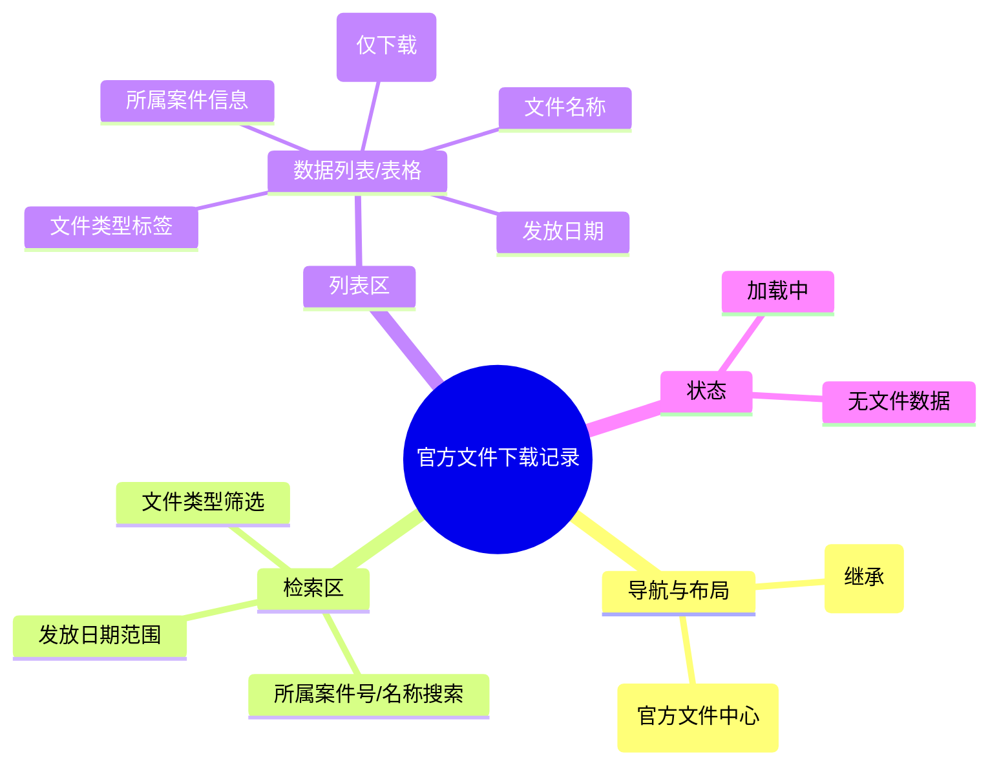

# 官方文件下载记录

## 0. 页面文档状态

- 文档版本：Draft v2
- 生成日期：2026-05-13
- 来源文件：`product/release/product-sitemap-release.md`
- 来源主稿：`product/development/pages/160-file-downloads/index.md`
- 来源 Sitemap 行：
  - 生成顺序：160
  - 页面ID：U-530
  - 父页面ID：U-500
  - 层级：L2
  - Surface：用户端
  - Layout 区域：内容区
  - 页面名称：官方文件下载记录
  - 页面类型：列表
  - Sitemap 页面级MD文件：product/development/pages/160-file-downloads.md
- 当前输出文件：product/development/pages/160-file-downloads/index-v2.md
- 页面级假设 / 待确认编号规则：
  - 页面假设：`PA-001` 起，按首次出现顺序递增。
  - 页面待确认：`PQ-001` 起，按首次出现顺序递增。

## 1. 页面目标与上下文

### 1.1 页面目标

- 页面目的：汇总用户名下所有案件产生的官方正式文件（如商标注册证、受理回执、专利证书等），提供一键式查询与下载中心。
- 用户目标：无需进入每个案件详情，即可快速找到并下载所需的证明文件。
- 业务目标：作为平台“交付成果”的集中展示区，提升用户对服务闭环的感知度。
- 页面成功标准：文件的成功下载率及搜索过滤的使用频率。

### 1.2 页面入口与出口

| 类型 | 来源 / 去向 | 触发条件 | 传入 / 传出数据 | 备注 |
|---|---|---|---|---|
| 入口 | 我的服务 (U-500) | 点击“下载中心” | 无 |  |
| 出口 | 案件详情 (U-520) | 点击所属案件号 | 案件 ID |  |

### 1.3 角色与权限

| 角色 | 是否可访问 | 权限条件 | 不满足时页面表现 | 相关 PA/PQ |
|---|---|---|---|---|
| 客户用户 | 是 | 已登录 | 跳转登录页 |  |

### 1.4 全局页面属性

| 属性 | 类型 | 来源 | 默认值 | 影响元素 / 状态 | 说明 |
|---|---|---|---|---|---|
| filter_file_type | enum | route | "all" | 列表过滤 | 全部 / 证书 / 回执 / 通知书 |

## 2. 页面结构思维导图



## 3. 页面布局与内容区块

| 区块ID | 区块名称 | 区块类型 | 展示条件 | 包含元素ID | 布局 / 样式定义 | 数据来源 | 相关 PA/PQ |
|---|---|---|---|---|---|---|---|
| S-001 | 过滤器工具栏 | header | 总是显示 | E-001, E-002 | 水平对齐 | - |  |
| S-002 | 文件数据表格 | content | 总是显示 | E-003, E-004 | 响应式表格 | API-001 |  |

## 4. 页面元素清单

| 元素ID | 元素名称 | 元素类型 | 所属区块 | 是否必需 | 展示条件 | 默认文案 / 内容 | 样式定义 | 数据绑定 | 相关 PA/PQ |
|---|---|---|---|---|---|---|---|---|---|
| E-001 | 文件类型 Tab | tab | S-001 | 是 | 总是显示 | 全部 / 证书 / 官文 | 品牌激活样式 | filter_file_type |  |
| E-002 | 案号搜索框 | input | S-001 | 是 | 总是显示 | 搜索案号/案件名 | - | search_key |  |
| E-003 | 文件表格主体 | list | S-002 | 是 | 有数据 | - | - | file_list |  |
| E-004 | 下载图标按钮 | button | S-002 | 是 | 总是显示 | 下载图标 | 蓝色，仅支持下载，不支持预览 | - |  |

## 5. 元素状态矩阵

| 元素ID | 状态 | 触发条件 | 状态来源 | 样式定义 | 可执行动作 | 禁止动作 | 提示文案 / 反馈 | 恢复条件 | 相关 PA/PQ |
|---|---|---|---|---|---|---|---|---|---|
| E-004 | 加载中 | 点击下载后 | loading | 旋转图标 | - | 重复点击 | 正在启动下载... | 下载触发后 |  |

## 6. 交互 Action 与执行效果

| ActionID | 触发元素ID | 交互名称 | 用户动作 | 前置条件 | 校验规则 | 执行动作 | 成功结果 | 失败结果 | 页面跳转 / 状态变化 | 埋点事件ID | 埋点事件名称 | 不埋点原因 | 相关 PA/PQ |
|---|---|---|---|---|---|---|---|---|---|---|---|---|---|
| ACT-001 | E-001/002 | 组合搜索 | 变更筛选 | - | - | 刷新文件列表 | 列表更新 | - | - | EVT-002 | 检索操作 | - |  |
| ACT-002 | E-004 | 单个下载 | 点击图标 | - | - | 触发浏览器文件下载 | 文件开始下载 | 报错 | - | EVT-003 | 单文件下载 | - |  |

## 7. 埋点事件统计设计

### 7.1 埋点事件总表

| 埋点事件ID | 事件名称 | 事件类型 | 关联元素ID / ActionID | 触发时机 | 统计次数口径 | 去重规则 | 上报时机 | 关键属性 | 成功 / 失败归因 | 漏斗阶段 | 相关 PA/PQ |
|---|---|---|---|---|---|---|---|---|---|---|---|
| EVT-001 | 下载中心曝光 | page_view | - | 页面进入 | 每会话 1 次 | sessionId | 实时 | total_file_count | - | 下载查看 |  |
| EVT-002 | 文件检索 | action | E-002 | 触发搜索 | 每次触发 1 次 | - | 实时 | search_key, file_type | - | 效率工具 |  |
| EVT-003 | 下载点击 | click | E-004 | 单次点击 | 每次触发 1 次 | - | 实时 | file_id, file_type, case_id | - | 交付落地 |  |

## 8. 数据结构与接口定义

### 8.1 页面数据模型

| 数据对象 | 字段 | 类型 | 必填 | 来源 | 默认值 | 使用位置 | 说明 |
|---|---|---|---|---|---|---|---|
| OfficialFile | id | string | 是 | API | - | - |  |
| OfficialFile | name | string | 是 | API | - | E-003 | 文件展示名称 |
| OfficialFile | type | enum | 是 | API | - | E-003 | cert / notice / receipt |
| OfficialFile | case_no | string | 是 | API | - | E-003 | 所属案号 |
| OfficialFile | issue_date | string | 是 | API | - | E-003 | 官文日期 |

### 8.2 接口清单

| API ID | 接口名称 | 方法 | 路径 | 触发 ActionID | 请求数据结构 | 返回数据结构 | 成功处理 | 失败处理 | 相关 PA/PQ |
|---|---|---|---|---|---|---|---|---|---|
| API-001 | 获取官文列表 | GET | /api/service/official-files | 页面加载 / 检索 | {page, limit, file_type, search} | {list, total} | 渲染表格 | - |  |

## 9. 边界状态与错误处理

| 场景ID | 场景类型 | 触发条件 | 页面表现 | 元素表现 | 用户可执行操作 | 系统处理 | 兜底文案 | 相关 PA/PQ |
|---|---|---|---|---|---|---|---|---|
| EDGE-001 | 文件过期/失效 | 云存储链接失效 | 提示文件已失效 | 下载按钮置灰 | 联系客服 | - | 抱歉，该文件已失效，请联系客服获取 |  |

## 10. 多媒体与资源

| 资源ID | 资源类型 | 使用位置 | 说明 |
|---|---|---|---|
| M-001 | icon | E-003 | PDF / 图片 缩略图图标 |

## 11. 页面假设与待确认统一清单

### 11.1 页面假设清单

| 假设ID | 假设内容 | 首次出现位置 | 影响范围 | 影响元素 / Action / API / 埋点事件 | 置信度 | 用户确认状态 | Release 处理方式 |
|---|---|---|---|---|---|---|---|
| - | - | - | - | - | - | - | - |

### 11.2 页面待确认清单

| 待确认ID | 待确认问题 | 首次出现位置 | 影响范围 | 影响元素 / Action / API / 埋点事件 | 优先级 | 用户确认结果 | Release 处理方式 |
|---|---|---|---|---|---|---|---|
| - | - | - | - | - | - | - | - |

## 12. 用户补充描述

> 本章节必须保留在页面 Draft 文档末尾，供用户用自然语言补充或修改当前页面需求。`product-page-release` 生成 release 版本时必须读取、分析并应用这里的内容。
> 如果没有补充，请保留“无”。

```text
无
```
