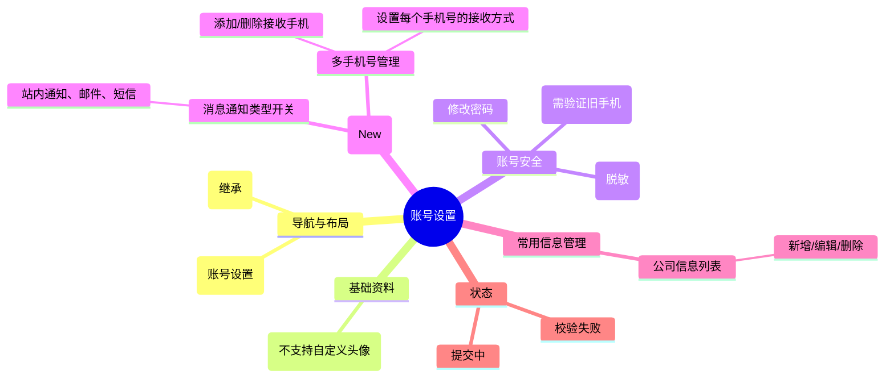

# 账号设置

## 0. 页面文档状态

- 文档版本：Draft v2
- 生成日期：2026-05-13
- 来源文件：`product/release/product-sitemap-release.md`
- 来源主稿：`product/development/pages/190-account-settings/index.md`
- 来源 Sitemap 行：
  - 生成顺序：190
  - 页面ID：U-620
  - 父页面ID：U-600
  - 层级：L2
  - Surface：用户端
  - Layout 区域：内容区
  - 页面名称：账号设置
  - 页面类型：表单
  - Sitemap 页面级MD文件：product/development/pages/190-account-settings.md
- 当前输出文件：product/development/pages/190-account-settings/index-v2.md
- 页面级假设 / 待确认编号规则：
  - 页面假设：`PA-001` 起，按首次出现顺序递增。
  - 页面待确认：`PQ-001` 起，按首次出现顺序递增。

## 1. 页面目标与上下文

### 1.1 页面目标

- 页面目的：提供用户账号安全性管理（密码、手机号）、通知偏好设置及常用公司信息的维护。
- 用户目标：确保账号安全，设置消息接收渠道，更新资料，或预设公司信息以简化下单流程。
- 业务目标：完善用户画像，提升通知触达率与账号安全等级。
- 页面成功标准：用户资料与通知偏好设置的覆盖率。

### 1.2 页面入口与出口

| 类型 | 来源 / 去向 | 触发条件 | 传入 / 传出数据 | 备注 |
|---|---|---|---|---|
| 入口 | 个人中心 (U-600) | 点击“账号设置” | 无 |  |
| 出口 | 个人中心 (U-600) | 点击返回 | 无 |  |

### 1.3 角色与权限

| 角色 | 是否可访问 | 权限条件 | 不满足时页面表现 | 相关 PA/PQ |
|---|---|---|---|---|
| 客户用户 | 是 | 已登录 | 跳转登录页 |  |

### 1.4 全局页面属性

| 属性 | 类型 | 来源 | 默认值 | 影响元素 / 状态 | 说明 |
|---|---|---|---|---|---|
| current_user_id | string | store | - | 数据加载 |  |

## 2. 页面结构思维导图



## 3. 页面布局与内容区块

| 区块ID | 区块名称 | 区块类型 | 展示条件 | 包含元素ID | 布局 / 样式定义 | 数据来源 | 相关 PA/PQ |
|---|---|---|---|---|---|---|---|
| S-001 | 基础与安全设置 | content | 总是显示 | E-001 至 E-004 | 分组列表卡片 | API-001 |  |
| S-003 | 消息通知偏好 | content | 总是显示 | E-007, E-008 | 分组卡片，含多选与列表 | API-001 |  |
| S-002 | 常用公司管理 | content | 总是显示 | E-005, E-006 | 垂直列表 | API-002 |  |

## 4. 页面元素清单

| 元素ID | 元素名称 | 元素类型 | 所属区块 | 是否必需 | 展示条件 | 默认文案 / 内容 | 样式定义 | 数据绑定 | 相关 PA/PQ |
|---|---|---|---|---|---|---|---|---|---|
| E-001 | 昵称输入框 | input | S-001 | 是 | 总是显示 | {nickname} | - | user.nickname |  |
| E-002 | 主手机号展示 | text | S-001 | 是 | 总是显示 | 138****0000 | - | user.main_mobile |  |
| E-003 | 修改密码链接 | button | S-001 | 是 | 总是显示 | 修改密码 | 链接样式 | - |  |
| E-004 | 更换主手机 | button | S-001 | 是 | 总是显示 | 更换 | 需验证旧手机 | - |  |
| E-007 | 全局消息开关 | checkbox_group | S-003 | 是 | 总是显示 | 站内/邮件/短信 | 开关 UI | user.notif_types |  |
| E-008 | 接收手机号列表 | list | S-003 | 是 | 总是显示 | - | 列表展示，含删除与设置 | user.notif_mobiles |  |
| E-005 | 公司信息列表 | list | S-002 | 否 | 有公司数据 | - | 表格或简易列表 | company_list |  |
| E-006 | 新增公司按钮 | button | S-002 | 是 | 总是显示 | + 新增公司 | 品牌色描边 | - |  |

## 5. 元素状态矩阵

| 元素ID | 状态 | 触发条件 | 状态来源 | 样式定义 | 可执行动作 | 禁止动作 | 提示文案 / 反馈 | 恢复条件 | 相关 PA/PQ |
|---|---|---|---|---|---|---|---|---|---|
| E-001 | 编辑中 | 获得焦点 | - | 边框变色 | - | - | - | - |  |
| E-004 | 验证旧手机 | 点击后 | step=1 | 弹窗 | 填写旧手机验证码 | - | 请先验证原手机号 | 验证通过进入 step2 |  |
| E-008 | 设置方式 | 点击行内设置 | - | 气泡/弹窗 | 勾选接收类型 | - | - | 确定保存 |  |

## 6. 交互 Action 与执行效果

| ActionID | 触发元素ID | 交互名称 | 用户动作 | 前置条件 | 校验规则 | 执行动作 | 成功结果 | 失败结果 | 页面跳转 / 状态变化 | 埋点事件ID | 埋点事件名称 | 不埋点原因 | 相关 PA/PQ |
|---|---|---|---|---|---|---|---|---|---|---|---|---|---|
| ACT-001 | E-001 | 保存昵称 | 失去焦点 | 内容变更 | 长度限制 | 调用更新接口 | 提示成功 | - | - | - | - | 基础操作 |  |
| ACT-002 | E-003 | 修改密码 | 弹窗提交 | 短信验证 | 复杂度 | 调用接口 | 提示成功 | 错误提示 | - | EVT-002 | 密码修改成功 | - |  |
| ACT-004 | E-004 | 更换主手机 | 流程完成 | 旧手机已验证 | 验证码校验 | 调用更新接口 | 更新显示 | 错误提示 | - | - | - | 安全验证 |  |
| ACT-005 | E-008 | 手机号管理 | 点击增删 | - | 格式校验 | 调用管理接口 | 列表刷新 | 提示失败 | - | - | - | 基础操作 |  |
| ACT-006 | E-007/008 | 设置偏好 | 勾选/变更 | - | - | 调用偏好更新接口 | 实时生效提示 | - | - | EVT-004 | 通知偏好变更 | - |  |
| ACT-003 | E-006 | 新增公司 | 提交 | - | 必填项 | 调用接口 | 列表刷新 | 错误提示 | - | EVT-003 | 新增公司成功 | - |  |

## 7. 埋点事件统计设计

### 7.1 埋点事件总表

| 埋点事件ID | 事件名称 | 事件类型 | 关联元素ID / ActionID | 触发时机 | 统计次数口径 | 去重规则 | 上报时机 | 关键属性 | 成功 / 失败归因 | 漏斗阶段 | 相关 PA/PQ |
|---|---|---|---|---|---|---|---|---|---|---|---|
| EVT-001 | 账号设置曝光 | page_view | - | 页面进入 | 每会话 1 次 | sessionId | 实时 | user_id | - | - |  |
| EVT-002 | 密码修改 | action | ACT-002 | 提交成功 | 每次触发 1 次 | - | 实时 | user_id | - | 安全强化 |  |
| EVT-003 | 公司维护 | action | ACT-003 | 提交成功 | 每次触发 1 次 | - | 实时 | company_count | - | 资料完善 |  |
| EVT-004 | 通知偏好变更 | click | ACT-006 | 状态改变 | 每次触发 1 次 | - | 实时 | notif_type, status | - | 通知优化 |  |

## 8. 数据结构与接口 definition

### 8.1 页面数据模型

| 数据对象 | 字段 | 类型 | 必填 | 来源 | 默认值 | 使用位置 | 说明 |
|---|---|---|---|---|---|---|---|
| UserDetail | nickname | string | 是 | API | - | E-001 |  |
| UserDetail | main_mobile | string | 是 | API | - | E-002 |  |
| UserDetail | notif_types | array | 是 | API | [] | E-007 | 全局偏好 |
| UserDetail | notif_mobiles | array | 是 | API | [] | E-008 | 多手机号及其偏好配置 |

### 8.2 接口清单

| API ID | 接口名称 | 方法 | 路径 | 触发 ActionID | 请求数据结构 | 返回数据结构 | 成功处理 | 失败处理 | 相关 PA/PQ |
|---|---|---|---|---|---|---|---|---|---|
| API-001 | 获取账号全量设置 | GET | /api/user/settings-v2 | 页面加载 | - | {UserDetail} | 渲染页面 | - |  |
| API-004 | 更新通知偏好 | POST | /api/user/notif-preference | ACT-006 | {type, mobiles[]} | {success} | 提示成功 | - |  |

## 9. 边界状态与错误处理

| 场景ID | 场景类型 | 触发条件 | 页面表现 | 元素表现 | 用户可执行操作 | 系统处理 | 兜底文案 | 相关 PA/PQ |
|---|---|---|---|---|---|---|---|---|
| EDGE-001 | 旧手机不可用 | 无法接收验证码 | - | - | 联系客服 | - | 原手机号无法使用时，请联系客服处理 |  |

## 10. 多媒体与资源

| 资源ID | 资源类型 | 使用位置 | 说明 |
|---|---|---|---|
| M-001 | icon | S-001 | 安全与通知图标 |

## 11. 页面假设与待确认统一清单

### 11.1 页面假设清单

| 假设ID | 假设内容 | 首次出现位置 | 影响范围 | 影响元素 / Action / API / 埋点事件 | 置信度 | 用户确认状态 | Release 处理方式 |
|---|---|---|---|---|---|---|---|
| - | - | - | - | - | - | - | - |

### 11.2 页面待确认清单

| 待确认ID | 待确认问题 | 首次出现位置 | 影响范围 | 影响元素 / Action / API / 埋点事件 | 优先级 | 用户确认结果 | Release 处理方式 |
|---|---|---|---|---|---|---|---|
| - | - | - | - | - | - | - | - |

## 12. 用户补充描述

> 本章节必须保留在页面 Draft 文档末尾，供用户用自然语言补充或修改当前页面需求。`product-page-release` 生成 release 版本时必须读取、分析并应用这里的内容。
> 如果没有补充，请保留“无”。

```text
无
```
