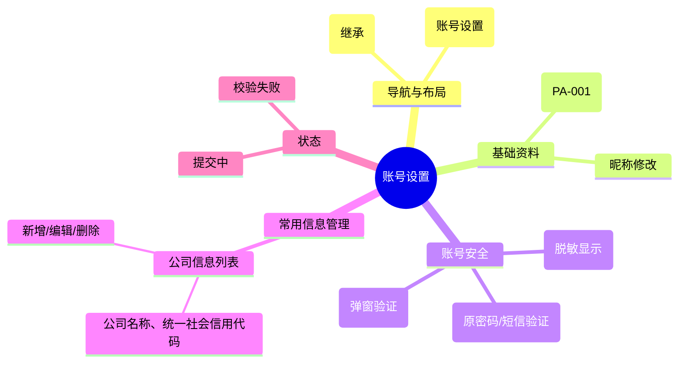

# 账号设置

## 0. 页面文档状态

- 文档版本：Draft
- 生成日期：2026-05-13
- 来源文件：`product/release/product-sitemap-release.md`
- 来源 Sitemap 行：
  - 生成顺序：190
  - 页面ID：U-620
  - 父页面ID：U-600
  - 层级：L2
  - Surface：用户端
  - Layout 区域：内容区
  - 页面名称：账号设置
  - 页面类型：表单
  - Sitemap 页面级MD文件：product/development/pages/190-account-settings.md
- 当前输出文件：product/development/pages/190-account-settings/index.md

## 1. 页面目标与上下文

### 1.1 页面目标

- 页面目的：提供用户账号安全性管理（密码、手机号）及基础资料（昵称、默认公司信息）的配置与维护。
- 用户目标：确保账号安全，更新联系方式，或预设公司信息以简化下单流程。
- 业务目标：完善用户信息画像，提升账号安全等级。
- 页面成功标准：用户资料修改的成功率。

### 1.2 页面入口与出口

| 类型 | 来源 / 去向 | 触发条件 | 传入 / 传出数据 | 备注 |
|---|---|---|---|---|
| 入口 | 个人中心 (U-600) | 点击“账号设置” | 无 |  |
| 出口 | 个人中心 (U-600) | 点击返回 | 无 |  |

### 1.3 角色与权限

| 角色 | 是否可访问 | 权限条件 | 不满足时页面表现 | 相关 PA/PQ |
|---|---|---|---|---|
| 客户用户 | 是 | 已登录 | 跳转登录页 |  |

### 1.4 全局页面属性

| 属性 | 类型 | 来源 | 默认值 | 影响元素 / 状态 | 说明 |
|---|---|---|---|---|---|
| current_user_id | string | store | - | 数据加载 |  |

## 2. 页面结构思维导图



## 3. 页面布局与内容区块

| 区块ID | 区块名称 | 区块类型 | 展示条件 | 包含元素ID | 布局 / 样式定义 | 数据来源 | 相关 PA/PQ |
|---|---|---|---|---|---|---|---|
| S-001 | 基础与安全设置 | content | 总是显示 | E-001 至 E-004 | 分组列表卡片 | API-001 |  |
| S-002 | 常用公司管理 | content | 总是显示 | E-005 | 垂直列表，含新增按钮 | API-002 |  |

## 4. 页面元素清单

| 元素ID | 元素名称 | 元素类型 | 所属区块 | 是否必需 | 展示条件 | 默认文案 / 内容 | 样式定义 | 数据绑定 | 相关 PA/PQ |
|---|---|---|---|---|---|---|---|---|---|
| E-001 | 昵称输入框 | input | S-001 | 是 | 总是显示 | {nickname} | - | user.nickname |  |
| E-002 | 手机号展示 | text | S-001 | 是 | 总是显示 | 138****0000 | - | user.mobile |  |
| E-003 | 修改密码链接 | button | S-001 | 是 | 总是显示 | 修改密码 | 链接样式 | - |  |
| E-004 | 更换手机链接 | button | S-001 | 是 | 总是显示 | 更换 | 链接样式 | - |  |
| E-005 | 公司信息列表 | list | S-002 | 否 | 有公司数据 | - | 表格或简易列表 | company_list |  |
| E-006 | 新增公司按钮 | button | S-002 | 是 | 总是显示 | + 新增公司 | 品牌色描边 | - |  |

## 5. 元素状态矩阵

| 元素ID | 状态 | 触发条件 | 状态来源 | 样式定义 | 可执行动作 | 禁止动作 | 提示文案 / 反馈 | 恢复条件 | 相关 PA/PQ |
|---|---|---|---|---|---|---|---|---|---|
| E-001 | 编辑中 | 获得焦点 | - | 边框变色 | - | - | - | - |  |
| E-003 | 弹窗中 | 点击后 | modal_show | 弹出 Modal | 填写新密码 | - | - | 提交或关闭 |  |

## 6. 交互 Action 与执行效果

| ActionID | 触发元素ID | 交互名称 | 用户动作 | 前置条件 | 校验规则 | 执行动作 | 成功结果 | 失败结果 | 页面跳转 / 状态变化 | 埋点事件ID | 埋点事件名称 | 不埋点原因 | 相关 PA/PQ |
|---|---|---|---|---|---|---|---|---|---|---|---|---|---|
| ACT-001 | E-001 | 保存昵称 | 失去焦点或点击保存 | 内容变更 | 长度限制 | 调用更新接口 | 提示成功 | 报错提示 | - | - | - | 基础操作不埋点 |  |
| ACT-002 | E-003 | 修改密码 | 弹窗提交 | 短信验证码正确 | 密码复杂度 | 调用改密接口 | 提示成功 | 错误提示 | - | EVT-002 | 密码修改成功 | - |  |
| ACT-003 | E-006 | 新增公司 | 点击并提交 | - | 必填项校验 | 调用新增接口 | 列表更新 | 错误提示 | - | EVT-003 | 新增公司成功 | - |  |

## 7. 埋点事件统计设计

### 7.1 埋点事件总表

| 埋点事件ID | 事件名称 | 事件类型 | 关联元素ID / ActionID | 触发时机 | 统计次数口径 | 去重规则 | 上报时机 | 关键属性 | 成功 / 失败归因 | 漏斗阶段 | 相关 PA/PQ |
|---|---|---|---|---|---|---|---|---|---|---|---|
| EVT-001 | 账号设置曝光 | page_view | - | 页面进入 | 每会话 1 次 | sessionId | 实时 | user_id | - | - |  |
| EVT-002 | 密码修改 | action | ACT-002 | 提交成功 | 每次触发 1 次 | - | 实时 | user_id | - | 安全强化 |  |
| EVT-003 | 公司维护 | action | ACT-003 | 新增/编辑成功 | 每次触发 1 次 | - | 实时 | company_count | - | 资料完善 |  |

## 8. 数据结构与接口定义

### 8.1 页面数据模型

| 数据对象 | 字段 | 类型 | 必填 | 来源 | 默认值 | 使用位置 | 说明 |
|---|---|---|---|---|---|---|---|
| UserDetail | nickname | string | 是 | API | - | E-001 |  |
| UserDetail | mobile | string | 是 | API | - | E-002 |  |
| CompanyInfo | name | string | 是 | API | - | E-005 | 公司名称 |
| CompanyInfo | tax_id | string | 是 | API | - | E-005 | 统一社会信用代码 |

### 8.2 接口清单

| API ID | 接口名称 | 方法 | 路径 | 触发 ActionID | 请求数据结构 | 返回数据结构 | 成功处理 | 失败处理 | 相关 PA/PQ |
|---|---|---|---|---|---|---|---|---|---|
| API-001 | 获取账号详情 | GET | /api/user/settings | 页面加载 | - | {UserDetail} | 渲染页面 | - |  |
| API-002 | 获取公司列表 | GET | /api/user/companies | 页面加载 | - | {list} | 渲染列表 | - |  |
| API-003 | 修改密码 | POST | /api/user/password | ACT-002 | {old_pwd, new_pwd, code} | {success} | 提示成功 | 错误提示 |  |

## 9. 边界状态与错误处理

| 场景ID | 场景类型 | 触发条件 | 页面表现 | 元素表现 | 用户可执行操作 | 系统处理 | 兜底文案 | 相关 PA/PQ |
|---|---|---|---|---|---|---|---|---|
| EDGE-001 | 公司信息重复 | 新增已存在的 TaxID | 错误提示 | 输入框红框 | 重新输入 | - | 该公司信息已存在 |  |

## 10. 多媒体与资源

| 资源ID | 资源类型 | 使用位置 | 说明 |
|---|---|---|---|
| M-001 | icon | S-001 | 手机、密码、公司图标 |

## 11. 页面假设与待确认统一清单

### 11.1 页面假设清单

| 假设ID | 假设内容 | 首次出现位置 | 影响范围 | 影响元素 / Action / API / 埋点事件 | 置信度 | 用户确认状态 | Release 处理方式 |
|---|---|---|---|---|---|---|---|
| PA-001 | 当前 MVP 不支持用户自定义头像上传，仅提供默认头像或首字母头像 | 2. 页面结构 | UI 展示 | - | 中 | 确认 | 不需要 |

### 11.2 页面待确认清单

| 待确认ID | 待确认问题 | 首次出现位置 | 影响范围 | 影响元素 / Action / API / 埋点事件 | 优先级 | 用户确认结果 | Release 处理方式 |
|---|---|---|---|---|---|---|---|
| PQ-001 | 更换手机号是否需要先验证旧手机？如果旧手机不可用，是否有申诉流程？ | 2. 页面结构 | 安全流程 | E-004 | 中 | 确认 | 需要验证旧手机，但不提供申诉流程 |

## 12. 用户补充描述

```text
无
```
