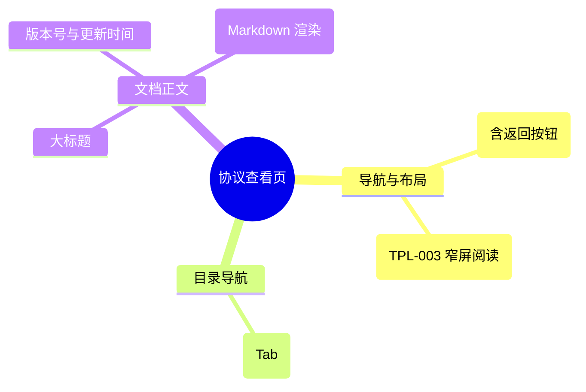

# 协议查看页

## 0. 页面文档状态

- 文档版本：Draft v2
- 生成日期：2026-05-13
- 来源文件：`product/release/product-sitemap-release.md`
- 来源主稿：`product/development/pages/200-agreements/index.md`
- 来源 Sitemap 行：
  - 生成顺序：200
  - 页面ID：U-630
  - 父页面ID：U-600
  - 层级：L2
  - Surface：用户端
  - Layout 区域：内容区
  - 页面名称：协议查看页
  - 页面类型：展示
  - Sitemap 页面级MD文件：product/development/pages/200-agreements.md
- 当前输出文件：product/development/pages/200-agreements/index-v2.md
- 页面级假设 / 待确认编号规则：
  - 页面假设：`PA-001` 起，按首次出现顺序递增。
  - 页面待确认：`PQ-001` 起，按首次出现顺序递增。

## 1. 页面目标与上下文

### 1.1 页面目标

- 页面目的：展示平台的法律条款、用户协议及隐私政策，确保平台合规性并履行对用户的告知义务。
- 用户目标：阅读或查询平台的服务规则及隐私保护承诺。
- 业务目标：满足法律监管要求，降低法律纠纷风险。
- 页面成功标准：页面加载的完整性。

### 1.2 页面入口与出口

| 类型 | 来源 / 去向 | 触发条件 | 传入 / 传出数据 | 备注 |
|---|---|---|---|---|
| 入口 | 登录注册 (U-100) | 点击协议链接 | 协议类型 |  |
| 入口 | 个人中心 (U-600) | 点击协议项 | 协议类型 |  |
| 出口 | 返回来源页 | 点击返回或面包屑 | 无 |  |

### 1.3 角色与权限

| 角色 | 是否可访问 | 权限条件 | 不满足时页面表现 | 相关 PA/PQ |
|---|---|---|---|---|
| 访客 / 客户用户 | 是 | 无 | - | 属于公共页面 |

### 1.4 全局页面属性

| 属性 | 类型 | 来源 | 默认值 | 影响元素 / 状态 | 说明 |
|---|---|---|---|---|---|
| type | enum | route | "user_agreement" | 内容加载 | 用户协议 / 隐私政策 / 法律声明 |

## 2. 页面结构思维导图



## 3. 页面布局与内容区块

| 区块ID | 区块名称 | 区块类型 | 展示条件 | 包含元素ID | 布局 / 样式定义 | 数据来源 | 相关 PA/PQ |
|---|---|---|---|---|---|---|---|
| S-001 | 协议切换导航 | header | 总是显示 | E-001 | 水平 Tab | - |  |
| S-002 | 条款正文区 | content | 总是显示 | E-002, E-003 | 800px 居中阅读模式 | API-001 |  |

## 4. 页面元素清单

| 元素ID | 元素名称 | 元素类型 | 所属区块 | 是否必需 | 展示条件 | 默认文案 / 内容 | 样式定义 | 数据绑定 | 相关 PA/PQ |
|---|---|---|---|---|---|---|---|---|---|
| E-001 | 协议类型 Tab | tab | S-001 | 是 | 总是显示 | 用户协议 / 隐私政策 | 品牌激活样式 | type |  |
| E-002 | 文档主标题 | text | S-002 | 是 | 总是显示 | {文档标题} | H1 | agreement.title |  |
| E-003 | 富文本内容区 | other | S-002 | 是 | 总是显示 | - | 规范的字间距与行高 | agreement.content |  |
| E-004 | 更新日期标签 | text | S-002 | 是 | 总是显示 | 最后更新日期：{date} | 灰色小字 | agreement.date |  |

## 5. 元素状态矩阵

| 元素ID | 状态 | 触发条件 | 状态来源 | 样式定义 | 可执行动作 | 禁止动作 | 提示文案 / 反馈 | 恢复条件 | 相关 PA/PQ |
|---|---|---|---|---|---|---|---|---|---|
| E-003 | 滚动中 | 用户操作 | - | 侧边显示阅读百分比 | - | - | - | - |  |

## 6. 交互 Action 与执行效果

| ActionID | 触发元素ID | 交互名称 | 用户动作 | 前置条件 | 校验规则 | 执行动作 | 成功结果 | 失败结果 | 页面跳转 / 状态变化 | 埋点事件ID | 埋点事件名称 | 不埋点原因 | 相关 PA/PQ |
|---|---|---|---|---|---|---|---|---|---|---|---|---|---|
| ACT-001 | E-001 | 协议类型切换 | 点击 Tab | - | - | 刷新内容 | 协议内容变更 | - | - | - | - | 基础阅读不埋点 |  |

## 7. 埋点事件统计设计

### 7.1 埋点事件总表

| 埋点事件ID | 事件名称 | 事件类型 | 关联元素ID / ActionID | 触发时机 | 统计次数口径 | 去重规则 | 上报时机 | 关键属性 | 成功 / 失败归因 | 漏斗阶段 | 相关 PA/PQ |
|---|---|---|---|---|---|---|---|---|---|---|---|
| EVT-001 | 协议页曝光 | page_view | - | 页面进入 | 每会话 1 次 | sessionId | 实时 | agreement_type | - | - |  |

## 8. 数据结构与接口定义

### 8.1 页面数据模型

| 数据对象 | 字段 | 类型 | 必填 | 来源 | 默认值 | 使用位置 | 说明 |
|---|---|---|---|---|---|---|---|
| AgreementDoc | title | string | 是 | API | - | E-002 |  |
| AgreementDoc | content | string | 是 | API | - | E-003 | HTML 或 Markdown 字符串 |
| AgreementDoc | date | string | 是 | API | - | E-004 |  |

### 8.2 接口清单

| API ID | 接口名称 | 方法 | 路径 | 触发 ActionID | 请求数据结构 | 返回数据结构 | 成功处理 | 失败处理 | 相关 PA/PQ |
|---|---|---|---|---|---|---|---|---|---|
| API-001 | 获取协议文本 | GET | /api/system/agreement | 页面加载 | {type} | {AgreementDoc} | 渲染页面 | - |  |

## 9. 边界状态与错误处理

| 场景ID | 场景类型 | 触发条件 | 页面表现 | 元素表现 | 用户可执行操作 | 系统处理 | 兜底文案 | 相关 PA/PQ |
|---|---|---|---|---|---|---|---|---|
| EDGE-001 | 内容加载失败 | 接口 500 | 显示重试按钮 | - | 点击重试 | - | 协议内容加载失败 |  |

## 10. 多媒体与资源

| 资源ID | 资源类型 | 使用位置 | 说明 |
|---|---|---|---|
| 无 | - | - | - |

## 11. 页面假设与待确认统一清单

### 11.1 页面假设清单

| 假设ID | 假设内容 | 首次出现位置 | 影响范围 | 影响元素 / Action / API / 埋点事件 | 置信度 | 用户确认状态 | Release 处理方式 |
|---|---|---|---|---|---|---|---|
| - | - | - | - | - | - | - | - |

### 11.2 页面待确认清单

| 待确认ID | 待确认问题 | 首次出现位置 | 影响范围 | 影响元素 / Action / API / 埋点事件 | 优先级 | 用户确认结果 | Release 处理方式 |
|---|---|---|---|---|---|---|---|
| - | - | - | - | - | - | - | - |

## 12. 用户补充描述

> 本章节必须保留在页面 Draft 文档末尾，供用户用自然语言补充或修改当前页面需求。`product-page-release` 生成 release 版本时必须读取、分析并应用这里的内容。
> 如果没有补充，请保留“无”。

```text
无
```
