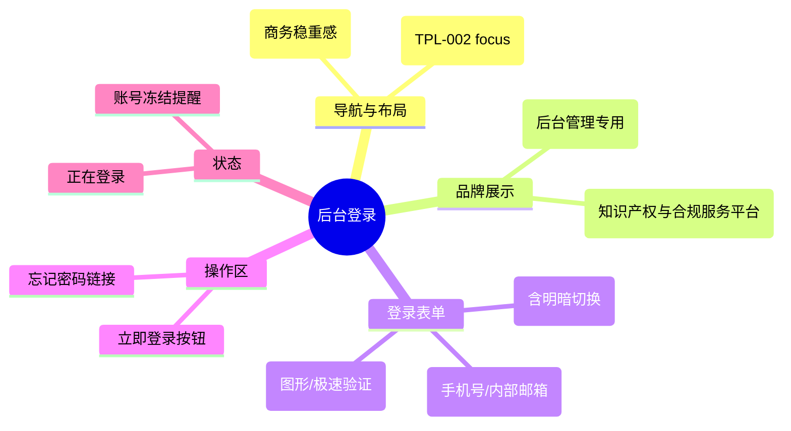

# 后台登录

## 0. 页面文档状态

- 文档版本：Draft v2
- 生成日期：2026-05-13
- 来源文件：`product/release/product-sitemap-release.md`
- 来源主稿：`product/development/pages/210-admin-login/index.md`
- 来源 Sitemap 行：
  - 生成顺序：210
  - 页面ID：M-100
  - 父页面ID：ROOT
  - 层级：L1
  - Surface：后台管理端
  - Layout 区域：独立全屏
  - 页面名称：后台登录
  - 页面类型：登录
  - Sitemap 页面级MD文件：product/development/pages/210-admin-login.md
- 当前输出文件：product/development/pages/210-admin-login/index-v2.md
- 页面级假设 / 待确认编号规则：
  - 页面假设：`PA-001` 起，按首次出现顺序递增。
  - 页面待确认：`PQ-001` 起，按首次出现顺序递增。

## 1. 页面目标与上下文

### 1.1 页面目标

- 页面目的：提供内部工作人员、管理员及服务专家进入后台管理系统的身份核验入口。
- 用户目标：通过内部账号快速登录系统进行业务审批与配置。
- 业务目标：确保后台系统的访问安全性，实现严格的账号审计。
- 页面成功标准：合法账号的首次登录成功率。

### 1.2 页面入口与出口

| 类型 | 来源 / 去向 | 触发条件 | 传入 / 传出数据 | 备注 |
|---|---|---|---|---|
| 入口 | 直接访问后台域名 | - | 无 |  |
| 出口 | 后台工作台 (M-200) | 登录并校验通过 | Token / 权限角色 |  |
| 出口 | 密码找回流程 | 点击“忘记密码” | 账号信息 |  |

### 1.3 角色与权限

| 角色 | 是否可访问 | 权限条件 | 不满足时页面表现 | 相关 PA/PQ |
|---|---|---|---|---|
| 管理员 / 专家 | 是 | 无需前置权限 | - |  |

### 1.4 全局页面属性

| 属性 | 类型 | 来源 | 默认值 | 影响元素 / 状态 | 说明 |
|---|---|---|---|---|---|
| login_type | enum | config | "password" | 表单渲染 | 账号密码 / 动态验证码 |

## 2. 页面结构思维导图



## 3. 页面布局与内容区块

| 区块ID | 区块名称 | 区块类型 | 展示条件 | 包含元素ID | 布局 / 样式定义 | 数据来源 | 相关 PA/PQ |
|---|---|---|---|---|---|---|---|
| S-001 | 品牌标题区 | header | 总是显示 | E-001 | 居中 Logo + 文字 | - |  |
| S-002 | 登录交互区 | content | 总是显示 | E-002 至 E-005 | 400px 宽度卡片 | - |  |

## 4. 页面元素清单

| 元素ID | 元素名称 | 元素类型 | 所属区块 | 是否必需 | 展示条件 | 默认文案 / 内容 | 样式定义 | 数据绑定 | 相关 PA/PQ |
|---|---|---|---|---|---|---|---|---|---|
| E-001 | 管理端 Logo | image | S-001 | 是 | 总是显示 | - | - | - |  |
| E-002 | 账号输入框 | input | S-002 | 是 | 总是显示 | 请输入内部账号/手机号 | 商务风格 | login.username |  |
| E-003 | 密码输入框 | input | S-002 | 是 | 总是显示 | 请输入密码 | 隐藏显示切换 | login.password |  |
| E-004 | 安全验证码 | other | S-002 | 是 | 总是显示 | - | 图形或拼图 | captcha |  |
| E-005 | 立即登录按钮 | button | S-002 | 是 | 总是显示 | 立即登录 | 品牌色大按钮 | - |  |

## 5. 元素状态矩阵

| 元素ID | 状态 | 触发条件 | 状态来源 | 样式定义 | 可执行动作 | 禁止动作 | 提示文案 / 反馈 | 恢复条件 | 相关 PA/PQ |
|---|---|---|---|---|---|---|---|---|---|
| E-005 | 登录中 | 点击后接口未返回 | loading | 旋转图标 | - | 重复点击 | 正在登录... | 接口返回 |  |
| E-002 | 账号锁定 | 密码错误次数超限 | error_code=403 | 红色高亮 | - | 点击登录 | 账号已锁定，请联系管理员 | 自动解锁/联系管理 |  |

## 6. 交互 Action 与执行效果

| ActionID | 触发元素ID | 交互名称 | 用户动作 | 前置条件 | 校验规则 | 执行动作 | 成功结果 | 失败结果 | 页面跳转 / 状态变化 | 埋点事件ID | 埋点事件名称 | 不埋点原因 | 相关 PA/PQ |
|---|---|---|---|---|---|---|---|---|---|---|---|---|---|
| ACT-001 | E-005 | 立即登录 | 点击 | 表单非空 | 验证码校验 | 调用登录 API (API-001) | 登录成功进入后台 | 提示错误 | 跳转 M-200 | EVT-003 | 登录成功 | - |  |

## 7. 埋点事件统计设计

### 7.1 埋点事件总表

| 埋点事件ID | 事件名称 | 事件类型 | 关联元素ID / ActionID | 触发时机 | 统计次数口径 | 去重规则 | 上报时机 | 关键属性 | 成功 / 失败归因 | 漏斗阶段 | 相关 PA/PQ |
|---|---|---|---|---|---|---|---|---|---|---|---|
| EVT-001 | 后台登录曝光 | page_view | - | 页面进入 | 每会话 1 次 | sessionId | 实时 | - | - | - |  |
| EVT-002 | 登录提交 | action | ACT-001 | 点击登录 | 每次触发 1 次 | - | 接口返回 | result, username | 失败代码 | 转化 |  |
| EVT-003 | 登录成功 | action | ACT-001 | 进入工作台 | 每次触发 1 次 | - | 实时 | user_role | - | 转化结束 |  |

## 8. 数据结构与接口定义

### 8.1 页面数据模型

| 数据对象 | 字段 | 类型 | 必填 | 来源 | 默认值 | 使用位置 | 说明 |
|---|---|---|---|---|---|---|---|
| LoginResponse | token | string | 是 | API | - | - | 登录成功后下发 |
| LoginResponse | user_info | object | 是 | API | - | - | 包含角色与权限 |

### 8.2 接口清单

| API ID | 接口名称 | 方法 | 路径 | 触发 ActionID | 请求数据结构 | 返回数据结构 | 成功处理 | 失败处理 | 相关 PA/PQ |
|---|---|---|---|---|---|---|---|---|---|
| API-001 | 管理员登录 | POST | /api/admin/auth/login | ACT-001 | {username, password, captcha} | {token, user_info} | 写入 Token 并跳转 | 提示错误 |  |

## 9. 边界状态与错误处理

| 场景ID | 场景类型 | 触发条件 | 页面表现 | 元素表现 | 用户可执行操作 | 系统处理 | 兜底文案 | 相关 PA/PQ |
|---|---|---|---|---|---|---|---|---|
| EDGE-001 | 初次登录强制改密 | 密码为初始密码 | 弹窗提示 | - | 跳转改密页 | - | 为了您的账号安全，请先修改密码 |  |

## 10. 多媒体与资源

| 资源ID | 资源类型 | 使用位置 | 说明 |
|---|---|---|---|
| M-001 | image | 背景 | 商务背景大图 |

## 11. 页面假设与待确认统一清单

### 11.1 页面假设清单

| 假设ID | 假设内容 | 首次出现位置 | 影响范围 | 影响元素 / Action / API / 埋点事件 | 置信度 | 用户确认状态 | Release 处理方式 |
|---|---|---|---|---|---|---|---|
| PA-001 | 后台不提供自助注册功能，所有账号由超级管理员在系统中手动创建 | 1.1 页面目标 | 功能范围 | - | 高 | 确认 | 更新到正式 |

### 11.2 页面待确认清单

| 待确认ID | 待确认问题 | 首次出现位置 | 影响范围 | 影响元素 / Action / API / 埋点事件 | 优先级 | 用户确认结果 | Release 处理方式 |
|---|---|---|---|---|---|---|---|
| - | - | - | - | - | - | - | - |

## 12. 用户补充描述

> 本章节必须保留在页面 Draft 文档末尾，供用户用自然语言补充或修改当前页面需求。`product-page-release` 生成 release 版本时必须读取、分析并应用这里的内容。
> 如果没有补充，请保留“无”。

```text
无
```
