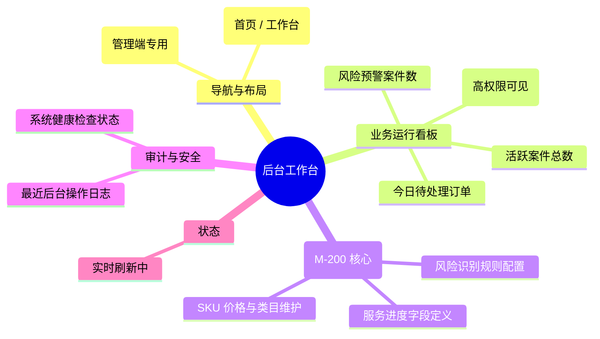

# 后台工作台与规则配置

## 0. 页面文档状态

- 文档版本：Draft
- 生成日期：2026-05-13
- 来源文件：`product/release/product-sitemap-release.md`
- 来源 Sitemap 行：
  - 生成顺序：220
  - 页面ID：M-200
  - 父页面ID：ROOT
  - 层级：L1
  - Surface：后台管理端
  - Layout 区域：侧边导航
  - 页面名称：后台工作台与规则配置
  - 页面类型：首页
  - Sitemap 页面级MD文件：product/development/pages/220-admin-dashboard.md
- 当前输出文件：product/development/pages/220-admin-dashboard/index.md

## 1. 页面目标与上下文

### 1.1 页面目标

- 页面目的：为后台运营人员及系统管理员提供全局业务运行状况的数字化看板，并作为核心规则配置的统一入口。
- 用户目标：快速了解当日待办压力、异常案件规模及系统配置状态。
- 业务目标：通过看板驱动运营动作，确保系统各项规则（风险、进度、财务）配置得当。
- 页面成功标准：运营看板的实时性及配置模块的访问深度。

### 1.2 页面入口与出口

| 类型 | 来源 / 去向 | 触发条件 | 传入 / 传出数据 | 备注 |
|---|---|---|---|---|
| 入口 | 后台登录 (M-100) | 登录成功 | 用户角色 |  |
| 出口 | 待办/风险规则配置 (M-210) | 点击配置入口 | 无 |  |
| 出口 | 进度字段配置 (M-220) | 点击配置入口 | 无 |  |
| 出口 | 服务类目与 SKU 配置 (M-230) | 点击配置入口 | 无 |  |

### 1.3 角色 with 权限

| 角色 | 是否可访问 | 权限条件 | 不满足时页面表现 | 相关 PA/PQ |
|---|---|---|---|---|
| 超级管理员 | 是 | 全局权限 | - |  |
| 运营主管 | 是 | 看板权限 | 仅可见统计区块 |  |

### 1.4 全局页面属性

| 属性 | 类型 | 来源 | 默认值 | 影响元素 / 状态 | 说明 |
|---|---|---|---|---|---|
| admin_role | string | store | - | 配置可见性 |  |

## 2. 页面结构思维导图



## 3. 页面布局与内容区块

| 区块ID | 区块名称 | 区块类型 | 展示条件 | 包含元素ID | 布局 / 样式定义 | 数据来源 | 相关 PA/PQ |
|---|---|---|---|---|---|---|---|
| S-001 | 运营数据看板 | header | 总是显示 | E-001 | 4 列数据卡片 | API-001 |  |
| S-002 | 系统配置矩阵 | content | 总是显示 | E-002 | 宫格化快捷入口 | - |  |
| S-003 | 操作动态流 | footer | 总是显示 | E-003 | 列表样式 | API-002 |  |

## 4. 页面元素清单

| 元素ID | 元素名称 | 元素类型 | 所属区块 | 是否必需 | 展示条件 | 默认文案 / 内容 | 样式定义 | 数据绑定 | 相关 PA/PQ |
|---|---|---|---|---|---|---|---|---|---|
| E-001 | 业务统计卡片组 | list | S-001 | 是 | 总是显示 | 待审订单: {n} ... | 商务蓝色 | stats |  |
| E-002 | 配置项入口卡片 | card | S-002 | 是 | 总是显示 | 风险规则配置 | 带图标、说明 | - |  |
| E-003 | 最近操作记录 | table | S-003 | 是 | 总是显示 | - | 紧凑型表格 | logs |  |
| E-004 | 时间筛选器 | select | S-001 | 否 | 总是显示 | 今日 / 本周 / 本月 | - | filter_range |  |

## 5. 元素状态矩阵

| 元素ID | 状态 | 触发条件 | 状态来源 | 样式定义 | 可执行动作 | 禁止动作 | 提示文案 / 反馈 | 恢复条件 | 相关 PA/PQ |
|---|---|---|---|---|---|---|---|---|---|
| E-001 | 预警状态 | 风险值超标 | stats.risk > 100 | 红色数值 | 点击下钻 | - | 风险案件激增 | 数值下降 |  |

## 6. 交互 Action 与执行效果

| ActionID | 触发元素ID | 交互名称 | 用户动作 | 前置条件 | 校验规则 | 执行动作 | 成功结果 | 失败结果 | 页面跳转 / 状态变化 | 埋点事件ID | 埋点事件名称 | 不埋点原因 | 相关 PA/PQ |
|---|---|---|---|---|---|---|---|---|---|---|---|---|---|
| ACT-001 | E-001 | 数据下钻 | 点击统计卡片 | - | - | 导航 | - | - | 跳转对应列表页 | EVT-002 | 看板卡片点击 | - |  |
| ACT-002 | E-002 | 进入配置模块 | 点击配置卡片 | - | 权限校验 | 导航 | - | 提示无权 | 跳转 M-210/220等 | EVT-003 | 配置项点击 | - |  |

## 7. 埋点事件统计设计

### 7.1 埋点事件总表

| 埋点事件ID | 事件名称 | 事件类型 | 关联元素ID / ActionID | 触发时机 | 统计次数口径 | 去重规则 | 上报时机 | 关键属性 | 成功 / 失败归因 | 漏斗阶段 | 相关 PA/PQ |
|---|---|---|---|---|---|---|---|---|---|---|---|
| EVT-001 | 后台工作台曝光 | page_view | - | 页面进入 | 每会话 1 次 | sessionId | 实时 | role | - | - |  |
| EVT-002 | 核心指标点击 | click | E-001 | 点击 | 每次触发 1 次 | - | 实时 | metric_name | - | 管理决策 |  |
| EVT-003 | 配置模块转化 | click | E-002 | 点击 | 每次触发 1 次 | - | 实时 | module_name | - | 系统维护 |  |

## 8. 数据结构与接口定义

### 8.1 页面数据模型

| 数据对象 | 字段 | 类型 | 必填 | 来源 | 默认值 | 使用位置 | 说明 |
|---|---|---|---|---|---|---|---|
| DashboardStats | pending_orders | number | 是 | API | 0 | E-001 |  |
| DashboardStats | active_cases | number | 是 | API | 0 | E-001 |  |
| DashboardStats | risk_cases | number | 是 | API | 0 | E-001 |  |
| DashboardStats | total_revenue | number | 否 | API | - | E-001 | 高权限可见 |

### 8.2 接口清单

| API ID | 接口名称 | 方法 | 路径 | 触发 ActionID | 请求数据结构 | 返回数据结构 | 成功处理 | 失败处理 | 相关 PA/PQ |
|---|---|---|---|---|---|---|---|---|---|
| API-001 | 获取工作台看板数据 | GET | /api/admin/dashboard/stats | 页面加载 | {range} | {DashboardStats} | 渲染看板 | - |  |
| API-002 | 获取最近操作日志 | GET | /api/admin/dashboard/logs | 页面加载 | {limit} | {LogItem[]} | 渲染列表 | - |  |

## 9. 边界状态与错误处理

| 场景ID | 场景类型 | 触发条件 | 页面表现 | 元素表现 | 用户可执行操作 | 系统处理 | 兜底文案 | 相关 PA/PQ |
|---|---|---|---|---|---|---|---|---|
| EDGE-001 | 权限不足 | 访问未授权配置 | 弹窗阻断 | - | 返回工作台 | - | 您没有权限访问该配置模块 |  |

## 10. 多媒体与资源

| 资源ID | 资源类型 | 使用位置 | 说明 |
|---|---|---|---|
| M-001 | icon | S-002 | 各配置模块对应的功能图标 |

## 11. 页面假设与待确认统一清单

### 11.1 页面假设清单

| 假设ID | 假设内容 | 首次出现位置 | 影响范围 | 影响元素 / Action / API / 埋点事件 | 置信度 | 用户确认状态 | Release 处理方式 |
|---|---|---|---|---|---|---|---|
| PA-001 | 营收数据看板仅对“财务”及“超级管理员”角色展示，其他角色显示占位图或隐藏 | 1.3 角色 | 权限控制 | E-001 | 高 | 确认 | 完全开放，不需要控制 |

### 11.2 页面待确认清单

| 待确认ID | 待确认问题 | 首次出现位置 | 影响范围 | 影响元素 / Action / API / 埋点事件 | 优先级 | 用户确认结果 | Release 处理方式 |
|---|---|---|---|---|---|---|---|
| PQ-001 | 是否需要集成“系统消息推送”管理入口？当前假设在 M-400 统一管理。 | 2. 页面结构 | 功能范围 | - | 低 | 确认 | 不需要 |

## 12. 用户补充描述

```text
无
```
