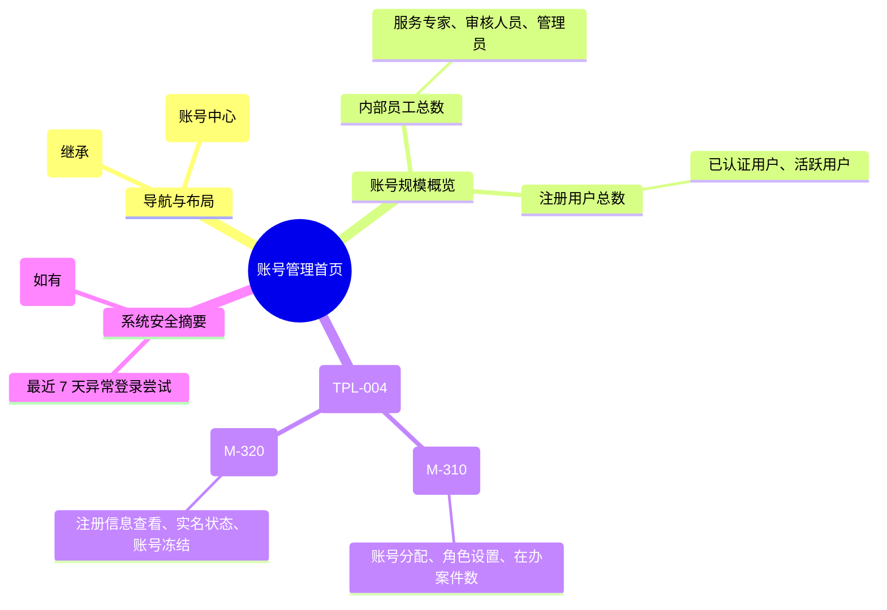

# 账号管理

## 0. 页面文档状态

- 文档版本：Draft v2
- 生成日期：2026-05-13
- 来源文件：`product/release/product-sitemap-release.md`
- 来源主稿：`product/development/pages/250-admin-account-center/index.md`
- 来源 Sitemap 行：
  - 生成顺序：250
  - 页面ID：M-300
  - 父页面ID：ROOT
  - 层级：L1
  - Surface：后台管理端
  - Layout 区域：侧边导航
  - 页面名称：账号管理
  - 页面类型：首页
  - Sitemap 页面级MD文件：product/development/pages/250-admin-account-center.md
- 当前输出文件：product/development/pages/250-admin-account-center/index-v2.md
- 页面级假设 / 待确认编号规则：
  - 页面假设：`PA-001` 起，按首次出现顺序递增。
  - 页面待确认：`PQ-001` 起，按首次出现顺序递增。

## 1. 页面目标与上下文

### 1.1 页面目标

- 页面目的：作为系统所有用户（内部工作人员及外部客户）账号管理的控制台，展示账号规模与安全态势。
- 用户目标：快速概览系统用户分布，并导航至具体的子管理模块。
- 业务目标：实现账号体系的统一监控，确保服务专家与客户的账号合规。
- 页面成功标准：导航至子管理模块的转化率。

### 1.2 页面入口与出口

| 类型 | 来源 / 去向 | 触发条件 | 传入 / 传出数据 | 备注 |
|---|---|---|---|---|
| 入口 | 侧边导航 | 点击“账号管理” | 无 |  |
| 出口 | 服务人员账号分配 (M-310) | 点击“内部账号管理” | 无 |  |
| 出口 | 用户账号管理 (M-320) | 点击“客户账号管理” | 无 |  |

### 1.3 角色与权限

| 角色 | 是否可访问 | 权限条件 | 不满足时页面表现 | 相关 PA/PQ |
|---|---|---|---|---|
| 管理员 | 是 | 账号管理权限 | 提示无权限 |  |

### 1.4 全局页面属性

| 属性 | 类型 | 来源 | 默认值 | 影响元素 / 状态 | 说明 |
|---|---|---|---|---|---|
| stats_data | object | API | - | 展示统计数字 |  |

## 2. 页面结构思维导图



## 3. 页面布局与内容区块

| 区块ID | 区块名称 | 区块类型 | 展示条件 | 包含元素ID | 布局 / 样式定义 | 数据来源 | 相关 PA/PQ |
|---|---|---|---|---|---|---|---|
| S-001 | 账号数据汇总 | header | 总是显示 | E-001 | 4 列统计卡片 | API-001 |  |
| S-002 | 管理模块导航 | content | 总是显示 | E-002, E-003 | 两列大卡片布局 | - |  |
| S-003 | 安全动态 | footer | 总是显示 | E-004 | 列表展示 | API-002 |  |

## 4. 页面元素清单

| 元素ID | 元素名称 | 元素类型 | 所属区块 | 是否必需 | 展示条件 | 默认文案 / 内容 | 样式定义 | 数据绑定 | 相关 PA/PQ |
|---|---|---|---|---|---|---|---|---|---|
| E-001 | 核心统计指标 | list | S-001 | 是 | 总是显示 | 专家人数: {n} ... | 蓝色系卡片 | stats |  |
| E-002 | 内部人员管理入口 | card | S-002 | 是 | 总是显示 | 内部人员管理 | 含图标及简要描述 | - |  |
| E-003 | 外部客户管理入口 | card | S-002 | 是 | 总是显示 | 外部客户管理 | 含图标及简要描述 | - |  |
| E-004 | 异常登录提醒 | alert | S-003 | 否 | 有异常数据 | 发现 {n} 次异常登录 | 橙色警告 | security_log |  |

## 5. 元素状态矩阵

| 元素ID | 状态 | 触发条件 | 状态来源 | 样式定义 | 可执行动作 | 禁止动作 | 提示文案 / 反馈 | 恢复条件 | 相关 PA/PQ |
|---|---|---|---|---|---|---|---|---|---|
| E-002 | 悬浮高亮 | 鼠标移入 | - | 阴影加深 | 点击跳转 | - | - | 移出 |  |

## 6. 交互 Action 与执行效果

| ActionID | 触发元素ID | 交互名称 | 用户动作 | 前置条件 | 校验规则 | 执行动作 | 成功结果 | 失败结果 | 页面跳转 / 状态变化 | 埋点事件ID | 埋点事件名称 | 不埋点原因 | 相关 PA/PQ |
|---|---|---|---|---|---|---|---|---|---|---|---|---|---|
| ACT-001 | E-002 | 进入内部管理 | 点击 | - | - | 导航 | - | - | 跳转 M-310 | - | - | 基础跳转 |  |
| ACT-002 | E-003 | 进入外部管理 | 点击 | - | - | 导航 | - | - | 跳转 M-320 | - | - | 基础跳转 |  |

## 7. 埋点事件统计设计

### 7.1 埋点事件总表

| 埋点事件ID | 事件名称 | 事件类型 | 关联元素ID / ActionID | 触发时机 | 统计次数口径 | 去重规则 | 上报时机 | 关键属性 | 成功 / 失败归因 | 漏斗阶段 | 相关 PA/PQ |
|---|---|---|---|---|---|---|---|---|---|---|---|
| EVT-001 | 账号管理中心曝光 | page_view | - | 页面进入 | 每会话 1 次 | sessionId | 实时 | total_staff, total_user | - | - |  |

## 8. 数据结构与接口 definition

### 8.1 页面数据模型

| 数据对象 | 字段 | 类型 | 必填 | 来源 | 默认值 | 使用位置 | 说明 |
|---|---|---|---|---|---|---|---|
| AccountStats | staff_total | number | 是 | API | 0 | E-001 |  |
| AccountStats | user_total | number | 是 | API | 0 | E-001 |  |
| AccountStats | pending_mfa | number | 否 | API | 0 | E-001 |  |

### 8.2 接口清单

| API ID | 接口名称 | 方法 | 路径 | 触发 ActionID | 请求数据结构 | 返回数据结构 | 成功处理 | 失败处理 | 相关 PA/PQ |
|---|---|---|---|---|---|---|---|---|---|
| API-001 | 获取账号规模统计 | GET | /api/admin/accounts/stats | 页面加载 | - | {AccountStats} | 渲染看板 | - |  |

## 9. 边界状态与错误处理

| 场景ID | 场景类型 | 触发条件 | 页面表现 | 元素表现 | 用户可执行操作 | 系统处理 | 兜底文案 | 相关 PA/PQ |
|---|---|---|---|---|---|---|---|---|
| EDGE-001 | 统计数据为空 | 刚部署系统 | 显示 0 | - | - | - | - |  |

## 10. 多媒体与资源

| 资源ID | 资源类型 | 使用位置 | 说明 |
|---|---|---|---|
| M-001 | icon | S-002 | 人员、客户管理图标 |

## 11. 页面假设与待确认统一清单

### 11.1 页面假设清单

| 假设ID | 假设内容 | 首次出现位置 | 影响范围 | 影响元素 / Action / API / 埋点事件 | 置信度 | 用户确认状态 | Release 处理方式 |
|---|---|---|---|---|---|---|---|
| - | - | - | - | - | - | - | - |

### 11.2 页面待确认清单

| 待确认ID | 待确认问题 | 首次出现位置 | 影响范围 | 影响元素 / Action / API / 埋点事件 | 优先级 | 用户确认结果 | Release 处理方式 |
|---|---|---|---|---|---|---|---|
| - | - | - | - | - | - | - | - |

## 12. 用户补充描述

> 本章节必须保留在页面 Draft 文档末尾，供用户用自然语言补充或修改当前页面需求。`product-page-release` 生成 release 版本时必须读取、分析并应用这里的内容。
> 如果没有补充，请保留“无”。

```text
无
```
