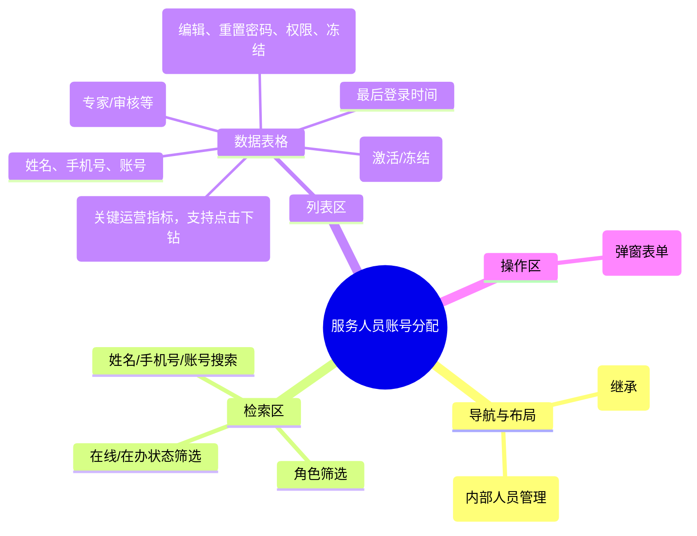

# 服务人员账号分配

## 0. 页面文档状态

- 文档版本：Draft v2
- 生成日期：2026-05-13
- 来源文件：`product/release/product-sitemap-release.md`
- 来源主稿：`product/development/pages/260-staff-account-admin/index.md`
- 来源 Sitemap 行：
  - 生成顺序：260
  - 页面ID：M-310
  - 父页面ID：M-300
  - 层级：L2
  - Surface：后台管理端
  - Layout 区域：内容区
  - 页面名称：服务人员账号分配
  - 页面类型：列表
  - Sitemap 页面级MD文件：product/development/pages/260-staff-account-admin.md
- 当前输出文件：product/development/pages/260-staff-account-admin/index-v2.md
- 页面级假设 / 待确认编号规则：
  - 页面假设：`PA-001` 起，按首次出现顺序递增。
  - 页面待确认：`PQ-001` 起，按首次出现顺序递增。

## 1. 页面目标与上下文

### 1.1 页面目标

- 页面目的：管理平台内部服务人员（专家、审核员、客服等）的账号生命周期，包括创建、权限分配及在办案件负载监控。
- 用户目标：为新入职专家分配系统账号，并确保离职人员账号被及时冻结。
- 业务目标：建立可审计的内部人员账号体系，通过“在办案件数”支持后续的智能派单决策。
- 页面成功标准：账号创建及角色分配的准确性。

### 1.2 页面入口与出口

| 类型 | 来源 / 去向 | 触发条件 | 传入 / 传出数据 | 备注 |
|---|---|---|---|---|
| 入口 | 账号管理首页 (M-300) | 点击“内部人员管理” | 无 |  |
| 出口 | 角色管理弹窗 | 点击“分配角色” | 账号 ID |  |
| 出口 | 专家在办列表 | 点击在办案件数 | 专家 ID | 跳转至案件管理页并自动筛选 |

### 1.3 角色与权限

| 角色 | 是否可访问 | 权限条件 | 不满足时页面表现 | 相关 PA/PQ |
|---|---|---|---|---|
| 超级管理员 | 是 | 系统最高权限 | - |  |

### 1.4 全局页面属性

| 属性 | 类型 | 来源 | 默认值 | 影响元素 / 状态 | 说明 |
|---|---|---|---|---|---|
| filter_role | enum | select | "all" | 列表数据 |  |

## 2. 页面结构思维导图



## 3. 页面布局与内容区块

| 区块ID | 区块名称 | 区块类型 | 展示条件 | 包含元素ID | 布局 / 样式定义 | 数据来源 | 相关 PA/PQ |
|---|---|---|---|---|---|---|---|
| S-001 | 组合检索栏 | header | 总是显示 | E-001, E-002 | 水平排列 | - |  |
| S-002 | 人员数据表格 | content | 总是显示 | E-003, E-004 | 标准中台表格 | API-001 |  |
| S-003 | 新增/编辑表单 | modal | 点击时显示 | E-005 | 中央弹出模态 | API-002 |  |

## 4. 页面元素清单

| 元素ID | 元素名称 | 元素类型 | 所属区块 | 是否必需 | 展示条件 | 默认文案 / 内容 | 样式定义 | 数据绑定 | 相关 PA/PQ |
|---|---|---|---|---|---|---|---|---|---|
| E-001 | 搜索输入框 | input | S-001 | 是 | 总是显示 | 姓名/手机号/账号 | - | search_key |  |
| E-002 | 新增人员按钮 | button | S-001 | 是 | 总是显示 | + 新增人员 | 品牌色 | - |  |
| E-003 | 人员列表表格 | table | S-002 | 是 | 总是显示 | - | - | staff_list |  |
| E-004 | 在办案件数链接 | button | S-002 | 是 | 总是显示 | {count} | 蓝色链接，支持点击下钻至案件管理 | item.case_count |  |
| E-005 | 账号状态切换 | switch | S-002 | 是 | 总是显示 | - | - | item.status |  |

## 5. 元素状态矩阵

| 元素ID | 状态 | 触发条件 | 状态来源 | 样式定义 | 可执行动作 | 禁止动作 | 提示文案 / 反馈 | 恢复条件 | 相关 PA/PQ |
|---|---|---|---|---|---|---|---|---|---|
| E-005 | 冻结中 | 点击开关 | - | loading | - | 重复点击 | 正在处理... | 接口成功 |  |
| E-004 | 高负载提醒 | 在办数 > 阈值 | count > 50 | 红色文字 | - | - | 负载过高 | 案件结案 |  |

## 6. 交互 Action 与执行效果

| ActionID | 触发元素ID | 交互名称 | 用户动作 | 前置条件 | 校验规则 | 执行动作 | 成功结果 | 失败结果 | 页面跳转 / 状态变化 | 埋点事件ID | 埋点事件名称 | 不埋点原因 | 相关 PA/PQ |
|---|---|---|---|---|---|---|---|---|---|---|---|---|---|
| ACT-001 | E-002 | 创建账号 | 提交表单 | 信息完整 | 手机号唯一性 | 调用创建 API | 列表刷新 | 错误提示 | - | EVT-002 | 内部账号创建 | - |  |
| ACT-002 | E-005 | 状态管理 | 点击开关 | - | - | 调用更新 API | 状态变更并提示 | - | - | EVT-003 | 账号状态变更 | - |  |
| ACT-003 | E-004 | 负载下钻 | 点击数值 | - | - | 导航 | - | - | 跳转案件管理并筛选专家 | - | - | 内部跳转 |  |

## 7. 埋点事件统计设计

### 7.1 埋点事件总表

| 埋点事件ID | 事件名称 | 事件类型 | 关联元素ID / ActionID | 触发时机 | 统计次数口径 | 去重规则 | 上报时机 | 关键属性 | 成功 / 失败归因 | 漏斗阶段 | 相关 PA/PQ |
|---|---|---|---|---|---|---|---|---|---|---|---|
| EVT-001 | 人员管理曝光 | page_view | - | 页面进入 | 每会话 1 次 | sessionId | 实时 | total_count | - | - |  |
| EVT-002 | 账号创建 | action | ACT-001 | 接口成功 | 每次触发 1 次 | - | 实时 | role | - | 系统录入 |  |
| EVT-003 | 状态切换 | action | ACT-002 | 变更成功 | 每次触发 1 次 | - | 实时 | status | - | 安全管控 |  |

## 8. 数据结构与接口定义

### 8.1 页面数据模型

| 数据对象 | 字段 | 类型 | 必填 | 来源 | 默认值 | 使用位置 | 说明 |
|---|---|---|---|---|---|---|---|
| StaffItem | id | string | 是 | API | - | - |  |
| StaffItem | name | string | 是 | API | - | E-003 |  |
| StaffItem | role_name | string | 是 | API | - | E-003 |  |
| StaffItem | case_count | number | 是 | API | 0 | E-004 | 当前在办案件数量 |
| StaffItem | status | boolean | 是 | API | true | E-005 |  |

### 8.2 接口清单

| API ID | 接口名称 | 方法 | 路径 | 触发 ActionID | 请求数据结构 | 返回数据结构 | 成功处理 | 失败处理 | 相关 PA/PQ |
|---|---|---|---|---|---|---|---|---|---|
| API-001 | 获取人员列表 | GET | /api/admin/staff/list | 页面加载 | {page, limit, role, search} | {list, total} | 渲染表格 | - |  |
| API-002 | 创建人员账号 | POST | /api/admin/staff/create | ACT-001 | {name, mobile, role_id} | {success} | 刷新并关闭 | 错误提示 |  |

## 9. 边界状态与错误处理

| 场景ID | 场景类型 | 触发条件 | 页面表现 | 元素表现 | 用户可执行操作 | 系统处理 | 兜底文案 | 相关 PA/PQ |
|---|---|---|---|---|---|---|---|---|
| EDGE-001 | 权限冲突 | 同一手机号已被分配为客户 | 弹窗报错 | - | 请使用其他手机号 | - | 该手机号已作为客户账号注册，不可作为内部员工 |  |

## 10. 多媒体与资源

| 资源ID | 资源类型 | 使用位置 | 说明 |
|---|---|---|---|
| 无 | - | - | - |

## 11. 页面假设与待确认统一清单

### 11.1 页面假设清单

| 假设ID | 假设内容 | 首次出现位置 | 影响范围 | 影响元素 / Action / API / 埋点事件 | 置信度 | 用户确认状态 | Release 处理方式 |
|---|---|---|---|---|---|---|---|
| - | - | - | - | - | - | - | - |

### 11.2 页面待确认清单

| 待确认ID | 待确认问题 | 首次出现位置 | 影响范围 | 影响元素 / Action / API / 埋点事件 | 优先级 | 用户确认结果 | Release 处理方式 |
|---|---|---|---|---|---|---|---|
| - | - | - | - | - | - | - | - |

## 12. 用户补充描述

> 本章节必须保留在页面 Draft 文档末尾，供用户用自然语言补充或修改当前页面需求。`product-page-release` 生成 release 版本时必须读取、分析并应用这里的内容。
> 如果没有补充，请保留“无”。

```text
无
```
