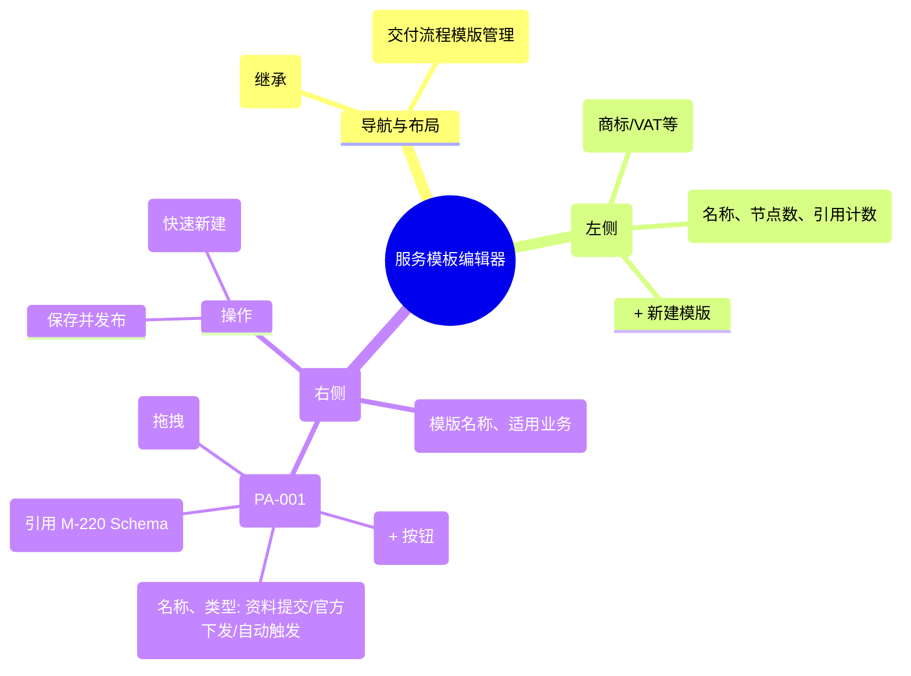

# 服务模板编辑器

## 0. 页面文档状态

- 文档版本：Draft
- 生成日期：2026-05-13
- 来源文件：`product/release/product-sitemap-release.md`
- 来源 Sitemap 行：
  - 生成顺序：300
  - 页面ID：M-420
  - 父页面ID：M-400
  - 层级：L2
  - Surface：后台管理端
  - Layout 区域：内容区
  - 页面名称：服务模板编辑器
  - 页面类型：流程编排与编辑
  - Sitemap 页面级MD文件：product/development/pages/300-service-template-editor.md
- 当前输出文件：product/development/pages/300-service-template-editor/index.md

## 1. 页面目标与上下文

### 1.1 页面目标

- 页面目的：定义合规服务的标准化交付流程（即由哪些节点组成、节点顺序及每个节点关联的资料要求），实现“一次配置，多处复用”。
- 用户目标：通过可视化界面编排案件的生命周期节点，配置各阶段的交付物要求。
- 业务目标：规范化不同业务线的交付流程，确保服务质量的一致性。
- 页面成功标准：模版创建的成功率及节点配置的逻辑正确性。

### 1.2 页面入口与出口

| 类型 | 来源 / 去向 | 触发条件 | 传入 / 传出数据 | 备注 |
|---|---|---|---|---|
| 入口 | 服务与商品中心 (M-400) | 点击“模板管理” | 无 |  |
| 出口 | 进度字段配置 (M-220) | 点击“配置表单” | 节点 ID | 跳转去定义具体表单 |

### 1.3 角色与权限

| 角色 | 是否可访问 | 权限条件 | 不满足时页面表现 | 相关 PA/PQ |
|---|---|---|---|---|
| 运营/交付经理 | 是 | 流程模版管理权限 | 提示无权限 |  |

### 1.4 全局页面属性

| 属性 | 类型 | 来源 | 默认值 | 影响元素 / 状态 | 说明 |
|---|---|---|---|---|---|
| current_tpl_id | string | list-click | - | 编辑器内容加载 |  |

## 2. 页面结构思维导图



## 3. 页面布局与内容区块

| 区块ID | 区块名称 | 区块类型 | 展示条件 | 包含元素ID | 布局 / 样式定义 | 数据来源 | 相关 PA/PQ |
|---|---|---|---|---|---|---|---|
| S-001 | 模版管理面板 | side-panel | 总是显示 | E-001, E-002 | 宽度 300px，列表展示 | API-001 |  |
| S-002 | 流程可视化编辑器 | content | 选中模版时 | E-003, E-004 | 线性时间轴或流程图 | API-002 | PA-001 |

## 4. 页面元素清单

| 元素ID | 元素名称 | 元素类型 | 所属区块 | 是否必需 | 展示条件 | 默认文案 / 内容 | 样式定义 | 数据绑定 | 相关 PA/PQ |
|---|---|---|---|---|---|---|---|---|---|
| E-001 | 模版列表项 | list | S-001 | 是 | 总是显示 | - | - | tpl_list |  |
| E-002 | 新建模版按钮 | button | S-001 | 是 | 总是显示 | + 新建模版 | 虚线框或品牌色 | - |  |
| E-003 | 流程节点列表 | list | S-002 | 是 | 总是显示 | - | 线性排列，支持排序 | tpl.nodes | PA-001 |
| E-004 | 节点类型选择 | select | S-002 | 是 | 编辑节点时 | 资料提交/审核/下发 | - | node.type |  |
| E-005 | 表单 Schema 引用 | select | S-002 | 否 | 提交类型节点 | 选择已定义表单 | - | node.schema_id |  |
| E-006 | 保存模版按钮 | button | S-002 | 是 | 总是显示 | 发布模版 | 品牌色实色 | - |  |

## 5. 元素状态矩阵

| 元素ID | 状态 | 触发条件 | 状态来源 | 样式定义 | 可执行动作 | 禁止动作 | 提示文案 / 反馈 | 恢复条件 | 相关 PA/PQ |
|---|---|---|---|---|---|---|---|---|---|
| E-003 | 激活节点 | 点击节点卡片 | - | 蓝色高亮边框 | 编辑属性 | - | - | 点击空白 |  |
| E-006 | 发布中 | 点击发布 | - | loading | - | 重复点击 | 正在部署流程模版... | 接口成功 |  |

## 6. 交互 Action 与执行效果

| ActionID | 触发元素ID | 交互名称 | 用户动作 | 前置条件 | 校验规则 | 执行动作 | 成功结果 | 失败结果 | 页面跳转 / 状态变化 | 埋点事件ID | 埋点事件名称 | 不埋点原因 | 相关 PA/PQ |
|---|---|---|---|---|---|---|---|---|---|---|---|---|---|
| ACT-001 | E-002 | 创建空白模版 | 点击 | - | 名称查重 | 调用创建 API | 进入编辑态 | 报错 | - | EVT-002 | 模版创建 | - |  |
| ACT-002 | E-003 | 节点重排 | 拖拽卡片 | - | - | 更新本地顺序 | - | - | - | EVT-003 | 节点排序变更 | - | PA-001 |
| ACT-003 | E-006 | 发布模版 | 点击 | 逻辑闭环 | 至少含有一个节点 | 调用发布 API (API-003) | 提示成功 | 校验报错 | 状态标记为“已发布” | EVT-004 | 模版发布 | - |  |

## 7. 埋点事件统计设计

### 7.1 埋点事件总表

| 埋点事件ID | 事件名称 | 事件类型 | 关联元素ID / ActionID | 触发时机 | 统计次数口径 | 去重规则 | 上报时机 | 关键属性 | 成功 / 失败归因 | 漏斗阶段 | 相关 PA/PQ |
|---|---|---|---|---|---|---|---|---|---|---|---|
| EVT-001 | 模板编辑器曝光 | page_view | - | 页面进入 | 每会话 1 次 | sessionId | 实时 | total_templates | - | - |  |
| EVT-002 | 模版创建行为 | action | ACT-001 | 点击确认 | 每次触发 1 次 | - | 实时 | - | - | 系统构建 |  |
| EVT-004 | 模版正式发布 | action | ACT-003 | 接口成功 | 每次触发 1 次 | - | 实时 | node_count | - | 业务上线 |  |

## 8. 数据结构与接口定义

### 8.1 页面数据模型

| 数据对象 | 字段 | 类型 | 必填 | 来源 | 默认值 | 使用位置 | 说明 |
|---|---|---|---|---|---|---|---|
| ServiceTemplate | id | string | 是 | API | - | - |  |
| ServiceTemplate | name | string | 是 | API | - | E-001 |  |
| ServiceTemplate | nodes | array | 是 | API | [] | E-003 | 节点对象列表 |
| NodeDetail | type | enum | 是 | API | "submit" | E-004 | submit/review/delivery |

### 8.2 接口清单

| API ID | 接口名称 | 方法 | 路径 | 触发 ActionID | 请求数据结构 | 返回数据结构 | 成功处理 | 失败处理 | 相关 PA/PQ |
|---|---|---|---|---|---|---|---|---|---|
| API-001 | 获取模版简易列表 | GET | /api/admin/template/list | 页面加载 | - | {list} | 渲染左侧面板 | - |  |
| API-002 | 获取模版全量数据 | GET | /api/admin/template/detail | 切换模版 | {id} | {ServiceTemplate} | 渲染编辑器 | - |  |
| API-003 | 发布/保存模版 | POST | /api/admin/template/save | ACT-003 | {ServiceTemplate} | {success} | 提示发布成功 | 逻辑校验错误 |  |

## 9. 边界状态与错误处理

| 场景ID | 场景类型 | 触发条件 | 页面表现 | 元素表现 | 用户可执行操作 | 系统处理 | 兜底文案 | 相关 PA/PQ |
|---|---|---|---|---|---|---|---|---|
| EDGE-001 | 节点类型冲突提示 | 在资料下发节点后配置审核节点 | 逻辑校验报错 | - | 调整顺序 | - | 逻辑错误：官方下发节点必须是交付流程的终点或中间产物，不可直接后接审核。 |  |

## 10. 多媒体与资源

| 资源ID | 资源类型 | 使用位置 | 说明 |
|---|---|---|---|
| 无 | - | - | - |

## 11. 页面假设与待确认统一清单

### 11.1 页面假设清单

| 假设ID | 假设内容 | 首次出现位置 | 影响范围 | 影响元素 / Action / API / 埋点事件 | 置信度 | 用户确认状态 | Release 处理方式 |
|---|---|---|---|---|---|---|---|
| PA-001 | 流程编辑器采用“线性时间轴”交互，目前暂不支持并行分支流程或复杂的决策树判断 | 2. 页面结构 | 流程复杂度 | E-003 | 高 | 待用户确认 |  |

### 11.2 页面待确认清单

| 待确认ID | 待确认问题 | 首次出现位置 | 影响范围 | 影响元素 / Action / API / 埋点事件 | 优先级 | 用户确认结果 | Release 处理方式 |
|---|---|---|---|---|---|---|---|
| PQ-001 | 是否需要支持“模版版本管理”（如保留 V1/V2 同时生效）？当前假设为覆盖发布。 | 6. 交互 Action | 发布策略 | - | 中 | 待用户确认 |  |

## 12. 用户补充描述

```text
无
```
