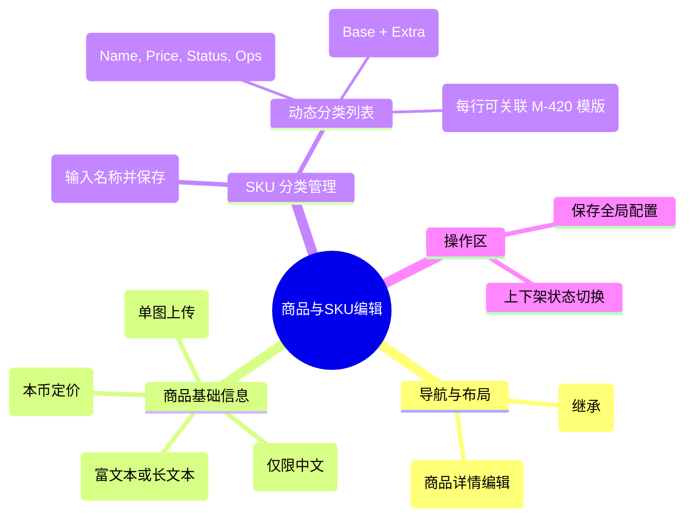

# 商品与SKU编辑

## 0. 页面文档状态

- 文档版本：Draft v2
- 生成日期：2026-05-13
- 来源文件：`product/release/product-sitemap-release.md`
- 来源主稿：`product/development/pages/310-product-sku-editor/index.md`
- 来源 Sitemap 行：
  - 生成顺序：310
  - 页面ID：M-430
  - 父页面ID：M-400
  - 层级：L2
  - Surface：后台管理端
  - Layout 区域：内容区
  - 页面名称：商品与SKU编辑
  - 页面类型：列表与表单
  - Sitemap 页面级MD文件：product/development/pages/310-product-sku-editor.md
- 当前输出文件：product/development/pages/310-product-sku-editor/index-v2.md
- 页面级假设 / 待确认编号规则：
  - 页面假设：`PA-001` 起，按首次出现顺序递增。
  - 页面待确认：`PQ-001` 起，按首次出现顺序递增。

## 1. 页面目标与上下文

### 1.1 页面目标

- 页面目的：管理平台可售卖的服务商品及其细分 SKU 规格，定义加价规则与关联流程模版。
- 用户目标：配置商品的基础价格，并根据业务需求（如不同国家、不同时效）创建 SKU 分类及具体的加价项。
- 业务目标：实现“基础服务 + 增值项”的阶梯定价模式，支撑高度灵活的商品交付。
- 页面成功标准：SKU 信息的准确性及调价操作的便捷性。

### 1.2 页面入口与出口

| 类型 | 来源 / 去向 | 触发条件 | 传入 / 传出数据 | 备注 |
|---|---|---|---|---|
| 入口 | 服务与商品中心 (M-400) | 点击“定价中心” | 无 |  |
| 出口 | SKU 编辑弹窗 | 点击“新增/编辑 SKU” | SKU ID |  |

### 1.3 角色与权限

| 角色 | 是否可访问 | 权限条件 | 不满足时页面表现 | 相关 PA/PQ |
|---|---|---|---|---|
| 运营/财务管理员 | 是 | 商品定价权限 | 提示无权限 |  |

### 1.4 全局页面属性

| 属性 | 类型 | 来源 | 默认值 | 影响元素 / 状态 | 说明 |
|---|---|---|---|---|---|
| filter_catalog | string | select | - | 列表过滤 | 按服务类目筛选 |

## 2. 页面结构思维导图



## 3. 页面布局与内容区块

| 区块ID | 区块名称 | 区块类型 | 展示条件 | 包含元素ID | 布局 / 样式定义 | 数据来源 | 相关 PA/PQ |
|---|---|---|---|---|---|---|---|
| S-001 | 商品基础属性 | content | 总是显示 | E-001 至 E-004 | 垂直表单布局 | API-002 |  |
| S-002 | SKU 分类动态区 | content | 总是显示 | E-005, E-006 | 分块卡片展示 | API-002 |  |
| S-003 | SKU 操作模态 | modal | 点击新增/编辑时 | E-007 | 中央弹出 | - |  |

## 4. 页面元素清单

| 元素ID | 元素名称 | 元素类型 | 所属区块 | 是否必需 | 展示条件 | 默认文案 / 内容 | 样式定义 | 数据绑定 | 相关 PA/PQ |
|---|---|---|---|---|---|---|---|---|---|
| E-001 | 商品主图上传 | upload | S-001 | 是 | 总是显示 | 仅限一张 | 矩形预览框 | product.main_image |  |
| E-002 | 商品名称输入 | input | S-001 | 是 | 总是显示 | 请输入商品名称 | - | product.name |  |
| E-003 | 商品描述 | textarea | S-001 | 是 | 总是显示 | 描述服务内容... | - | product.description |  |
| E-004 | 基础价格输入 | input | S-001 | 是 | 总是显示 | 0.00 | 数字带货币前缀 | product.base_price |  |
| E-005 | 分类新增组件 | other | S-002 | 是 | 总是显示 | 输入名称 + “新增” | 水平输入组 | new_category_name |  |
| E-006 | SKU 列表表格 | table | S-002 | 是 | 分类创建后 | - | 列表含加价、状态、模板 | category.skus |  |
| E-007 | 关联模版选择 | select | S-002 | 是 | 编辑 SKU 时 | 请选择交付模版 | 引用 M-420 列表 | sku.template_id |  |

## 5. 元素状态矩阵

| 元素ID | 状态 | 触发条件 | 状态来源 | 样式定义 | 可执行动作 | 禁止动作 | 提示文案 / 反馈 | 恢复条件 | 相关 PA/PQ |
|---|---|---|---|---|---|---|---|---|---|
| E-006 | 上下架状态 | 点击开关 | item.status | 颜色区分 | 切换 | - | 已上架 / 已下架 | - |  |
| E-004 | 异常提醒 | 价格 < 0 | val < 0 | 红色边框 | - | - | 价格不可为负数 | 修正数值 |  |

## 6. 交互 Action 与执行效果

| ActionID | 触发元素ID | 交互名称 | 用户动作 | 前置条件 | 校验规则 | 执行动作 | 成功结果 | 失败结果 | 页面跳转 / 状态变化 | 埋点事件ID | 埋点事件名称 | 不埋点原因 | 相关 PA/PQ |
|---|---|---|---|---|---|---|---|---|---|---|---|---|---|
| ACT-001 | E-005 | 创建 SKU 分类 | 点击“新增” | 输入框不为空 | 分类名不重复 | 动态插入新分类卡片 | 渲染空白表格 | - | - | - | - | 基础操作 |  |
| ACT-002 | E-006 | 增删改 SKU | 点击操作按钮 | - | - | 打开模态或直接行编辑 | 更新列表 | - | - | EVT-002 | SKU 明细变更 | - |  |
| ACT-003 | - | 全局发布 | 点击页面底部保存 | 信息完整 | 至少一个分类 | 调用发布 API | 提示保存成功 | 校验报错 | 同步至前台展示 | EVT-001 | 商品全量发布 | - |  |

## 7. 埋点事件统计设计

### 7.1 埋点事件总表

| 埋点事件ID | 事件名称 | 事件类型 | 关联元素ID / ActionID | 触发时机 | 统计次数口径 | 去重规则 | 上报时机 | 关键属性 | 成功 / 失败归因 | 漏斗阶段 | 相关 PA/PQ |
|---|---|---|---|---|---|---|---|---|---|---|---|
| EVT-001 | 商品配置发布 | action | ACT-003 | 接口成功 | 每次触发 1 次 | - | 实时 | product_id, base_price | - | 业务上线 |  |
| EVT-002 | SKU 修改行为 | action | ACT-002 | 变更确认 | 每次触发 1 次 | - | 实时 | sku_id, extra_price | - | 配置更新 |  |

## 8. 数据结构与接口定义

### 8.1 页面数据模型

| 数据对象 | 字段 | 类型 | 必填 | 来源 | 默认值 | 使用位置 | 说明 |
|---|---|---|---|---|---|---|---|
| ProductDetail | main_image | string | 是 | API | - | E-001 |  |
| ProductDetail | base_price | number | 是 | API | 0 | E-004 | 商品统一基价 |
| ProductDetail | categories | array | 是 | API | [] | E-006 | 嵌套分类与 SKU 列表 |
| SkuItem | extra_price | number | 是 | API | 0 | E-006 | 在基价基础上的加价额 |
| SkuItem | template_id | string | 是 | API | - | E-007 | 关联的流程模版 ID |

### 8.2 接口清单

| API ID | 接口名称 | 方法 | 路径 | 触发 ActionID | 请求数据结构 | 返回数据结构 | 成功处理 | 失败处理 | 相关 PA/PQ |
|---|---|---|---|---|---|---|---|---|---|
| API-001 | 获取商品配置详情 | GET | /api/admin/products/detail | 页面加载 | {id} | {ProductDetail} | 渲染页面 | - |  |
| API-002 | 发布商品全量配置 | POST | /api/admin/products/publish | ACT-003 | {ProductDetail} | {success} | 提示成功 | 逻辑校验错误 |  |

## 9. 边界状态与错误处理

| 场景ID | 场景类型 | 触发条件 | 页面表现 | 元素表现 | 用户可执行操作 | 系统处理 | 兜底文案 | 相关 PA/PQ |
|---|---|---|---|---|---|---|---|---|
| EDGE-001 | 模版未关联警告 | 某 SKU 状态为上架但未关联模版 | 保存时强提示 | 行变红 | 关联模版 | 阻断发布 | 请为已上架的 SKU 关联交付流程模版 |  |

## 10. 多媒体与资源

| 资源ID | 资源类型 | 使用位置 | 说明 |
|---|---|---|---|
| M-001 | image | E-001 | 商品主图缩略图 |

## 11. 页面假设与待确认统一清单

### 11.1 页面假设清单

| 假设ID | 假设内容 | 首次出现位置 | 影响范围 | 影响元素 / Action / API / 埋点事件 | 置信度 | 用户确认状态 | Release 处理方式 |
|---|---|---|---|---|---|---|---|
| - | - | - | - | - | - | - | - |

### 11.2 页面待确认清单

| 待确认ID | 待确认问题 | 首次出现位置 | 影响范围 | 影响元素 / Action / API / 埋点事件 | 优先级 | 用户确认结果 | Release 处理方式 |
|---|---|---|---|---|---|---|---|
| - | - | - | - | - | - | - | - |

## 12. 用户补充描述

> 本章节必须保留在页面 Draft 文档末尾，供用户用自然语言补充或修改当前页面需求。`product-page-release` 生成 release 版本时必须读取、分析并应用这里的内容。
> 如果没有补充，请保留“无”。

```text
无
```
